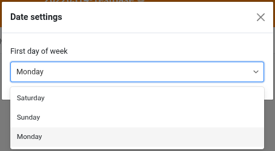

En la versión 5.3, la última actualización menor antes de la versión 6.0 prevista para el verano de 2026, el enfoque está en las mejoras de los componentes centrales. Base Editor, App Builder, formularios web, automatizaciones y plugins reciben nuevas funciones y optimizaciones. El cambio más importante: la versión 5.3 permite configurar el primer día de la semana. Como en versiones anteriores, la mayoría de las novedades se encuentran en el App Builder. Las páginas de tabla ahora permiten una altura de fila variable y la personalización de las columnas fijas. Las páginas de registro único ofrecen mejor integración para columnas de enlaces y archivos. Las páginas de formulario permiten la creación de enlaces multinivel. Las apps públicas pueden protegerse con contraseña y se puede desactivar la descarga de archivos. En los formularios web, los campos pueden prellenarse y – como novedad – ocultarse. También hay un nuevo plugin.

También se han realizado cambios importantes en el área invisible para el usuario: React se ha actualizado a la versión 18. La configuración del sistema se ha simplificado y flexibilizado. Cada componente de SeaTable ahora tiene su propio archivo de configuración y las opciones de configuración mediante variables de entorno se han ampliado. Esto aporta transparencia y permite un despliegue más sencillo y escalable.

En el [Changelog]() encontrará – como siempre – la lista completa de cambios. Desde esta mañana, SeaTable Cloud ya funciona con la nueva versión. La imagen Docker de SeaTable 5.3 está disponible para su descarga en el conocido [Docker Repository](https://hub.docker.com/r/seatable/seatable-enterprise).

Especialmente para los usuarios de SeaTable Cloud, pero también para los de SeaTable Server y SeaTable Dedicated, este cambio de versión trae modificaciones en la API. El artículo [Cambio al API Gateway de SeaTable: Qué cambia con la versión 5.3]() contiene detalles y antecedentes. Se recomienda encarecidamente su lectura a quienes utilicen la API de SeaTable mediante scripts de Python, plataformas de integración o desarrollos propios.

## Mejor localización: primer día de la semana configurable

En diferentes países, diferentes costumbres: según la región, el sábado, domingo o lunes es considerado el primer día de la semana. SeaTable ahora permite adaptarse a estas diferencias regionales. En la nueva configuración de fecha, el primer día de la semana puede ajustarse individualmente para cada base.

Siguiendo los hábitos de uso en Europa, Australia, gran parte de África y Asia, y la norma ISO 8601, SeaTable utiliza el lunes como primer día de la semana. (Antes, el domingo era siempre el primer día.) Ajustar esto en la configuración de fecha mueve el día seleccionado a la primera columna en el control de calendario. Esto aplica tanto a la base como a todas las apps que dependen de ella. En el plugin de calendario y en la página de calendario de la app, el día de la semana aún puede configurarse individualmente e independientemente de la base.

## Más flexibilidad en el App Builder

Las solicitudes de funciones para el App Builder son numerosas. Nos alegra implementar algunas de ellas en SeaTable 5.3, y otras llegarán en futuras versiones.

SeaTable 5.3 hace la función de comentarios más flexible. Antes, los comentarios en la base y en la app se almacenaban por separado y solo se mostraban en su lugar respectivo. Los comentarios hechos en la base no eran visibles en la app y viceversa. SeaTable 5.3 elimina esta separación. Ahora, todos los comentarios se muestran en la base. En la app, se puede elegir mostrar todos los comentarios o solo los realizados en la app. Por defecto, solo se muestran los comentarios de la app; la carga de todos los comentarios puede activarse en la configuración de la app. Además, se elimina otra restricción: la columna de comentarios ya no está solo en páginas de tabla, sino también en páginas de galería, kanban, calendario y cronología.

Otro cambio que afecta a todos los tipos de página es el ajuste de los permisos predeterminados. Las nuevas páginas otorgan a todos los usuarios todos los derechos disponibles. Si se desea que los usuarios tengan permisos reducidos, es necesario ajustar los permisos de la página. Este cambio armoniza la gestión de permisos en la app y la base. (Las páginas existentes no se ven afectadas por esta actualización.)

### Tipo de página Tabla

Con SeaTable 5.3, cumplimos una solicitud frecuente para este tipo de página: la altura de las filas ahora puede configurarse en cuatro niveles, como en el Base Editor. La altura simple permite una visualización compacta, mientras que otras opciones ofrecen más espacio para texto formateado e imágenes. Las columnas fijas también son más flexibles. La fijación de columnas en la app ahora es independiente de la base. (Antes, la fijación en la base aplicaba a todas las apps relacionadas.)

A simple vista, también hay cambios en la configuración de la página. Muchas opciones se han movido a una nueva sección "Más ajustes", que está colapsada por defecto. Con los permisos de página también minimizados por defecto, la configuración es más ordenada y clara.

Al observar más de cerca, también hay cambios funcionales en la configuración de la página. La "Configuración de la columna de enlace" se ha revisado para dar lugar al nuevo permiso "Editar entradas enlazadas". Si se concede, los usuarios de la app tienen permisos de escritura en las entradas de la tabla enlazada. Las columnas editables pueden configurarse en la nueva configuración de campo. Si el permiso no está activado, el usuario solo puede ver los enlaces existentes, añadir o eliminar enlaces, pero no modificar los registros enlazados.

### Tipo de página Registro único

Para las columnas de archivos y enlaces, este tipo de página estaba limitado hasta ahora. Esta nueva versión soluciona esas carencias.

Los iconos de una columna de archivos ahora no solo son visualmente atractivos, sino también funcionales. Hacer clic en un icono de archivo abre el archivo en un visor adecuado en una nueva pestaña. Los documentos de Office también pueden abrirse y editarse directamente en el navegador, siempre que haya un editor online configurado (como en SeaTable Cloud y SeaTable Dedicated).

¡Las columnas de enlaces también mejoran su funcionalidad! Las entradas enlazadas al registro mostrado pueden visualizarse claramente en una tabla. En la configuración se pueden ocultar columnas para mostrar solo la información esencial de las entradas enlazadas.

### Tipo de página Formulario

Al crear nuevos registros a través de una página de formulario, ahora es posible crear enlaces cruzados en dos pasos entre tablas. Es decir: mediante un formulario, ahora se pueden crear nuevos registros en una tabla enlazada y, al mismo tiempo, enlazarlos con registros existentes en una tercera tabla. Por ejemplo, posiciones de pedido en una tabla enlazada pueden vincularse a productos en una tercera tabla. Para utilizar esta nueva función, debe activarse el permiso "Crear y enlazar nuevas entradas" y añadir la columna de enlace relevante a las columnas visibles en la configuración del campo.

### Tipo de página Consulta

En SeaTable 5.2, los resultados en la página de consulta se hicieron editables. En SeaTable 5.3, este permiso se optimiza. Como en otros tipos de página, algunas columnas pueden excluirse de la edición mediante la función "Columnas predefinidas de solo lectura" en la configuración de datos.

### Apps públicas

Activar el acceso ilimitado convierte una app de SeaTable en una aplicación pública. Cualquiera puede acceder a la app mediante la URL (solo lectura); no se requiere inicio de sesión y no hay más protección de acceso. Al menos, hasta ahora. SeaTable 5.3 añade una protección opcional por contraseña al acceso ilimitado. Si se activa, la app solo puede usarse tras introducir la contraseña. El acceso ilimitado protegido por contraseña es una opción interesante para asociaciones o grupos de trabajo que desean compartir datos de baja sensibilidad con muchas personas, pero evitar el acceso público ilimitado.

## Nuevo plugin de diseño de informes (beta)

¿Desea crear informes en SeaTable donde las tablas, gráficos e imágenes se llenen dinámicamente con datos? ¡Deseo concedido! Presentamos: el plugin de diseño de informes. Este nuevo plugin permite crear documentos versátiles con diversas evaluaciones gráficas, cuyo contenido se genera dinámicamente durante la creación del documento.

El nuevo plugin de diseño de informes y el plugin de diseño de página existente son similares en algunos aspectos. Ambos crean documentos PDF basados en plantillas que contienen elementos estáticos y dinámicos. Sin embargo, el plugin de diseño de informes no es simplemente una versión mejorada del plugin de diseño de página. Ambos plugins tienen sus propias características y casos de uso.

Con el plugin de diseño de página, los elementos se colocan con precisión en la plantilla, se definen sus dimensiones y se asignan a una capa. Básicamente, se utiliza como un programa gráfico: el diseño de la plantilla define exactamente la apariencia del documento generado. El plugin de diseño de informes recuerda a Word o Google Docs. El texto y otros elementos se colocan de forma continua uno tras otro. El plugin se encarga del diseño de la página, incluidos los saltos de línea y de página, al crear el documento. Los elementos de longitud variable, como las tablas, se gestionan fácilmente.

El plugin de diseño de informes admite una amplia variedad de elementos dinámicos: valores individuales de un registro, registros completos, tablas y varios tipos de gráficos pueden usarse en una plantilla de documento. Para el formato de texto, dispone de opciones conocidas de los procesadores de texto, como listas con viñetas, alineación de texto y disposición en varias columnas. También hay estilos de esquema para estructurar el documento. Sin embargo, para el diseño de elementos individuales, el plugin de diseño de página ofrece más opciones. Para cada elemento, puede definir el color del texto y del fondo, los bordes y otras opciones de formato. Mediante el uso de capas, los elementos pueden superponerse y crearse efectos de solapamiento.

El plugin de diseño de informes está actualmente en fase beta. Agradecemos sus comentarios. El plugin debería lanzarse oficialmente con la versión 6.0.
