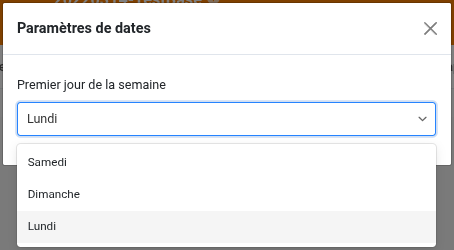
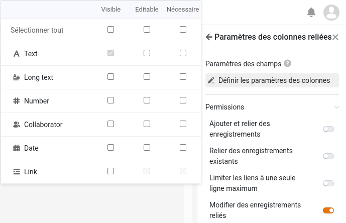
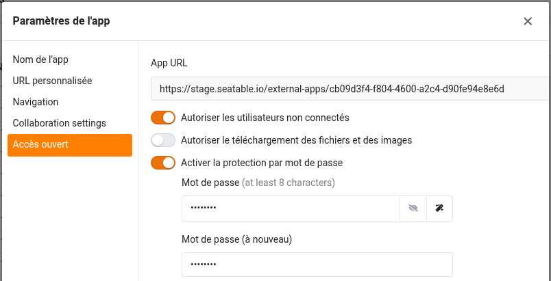
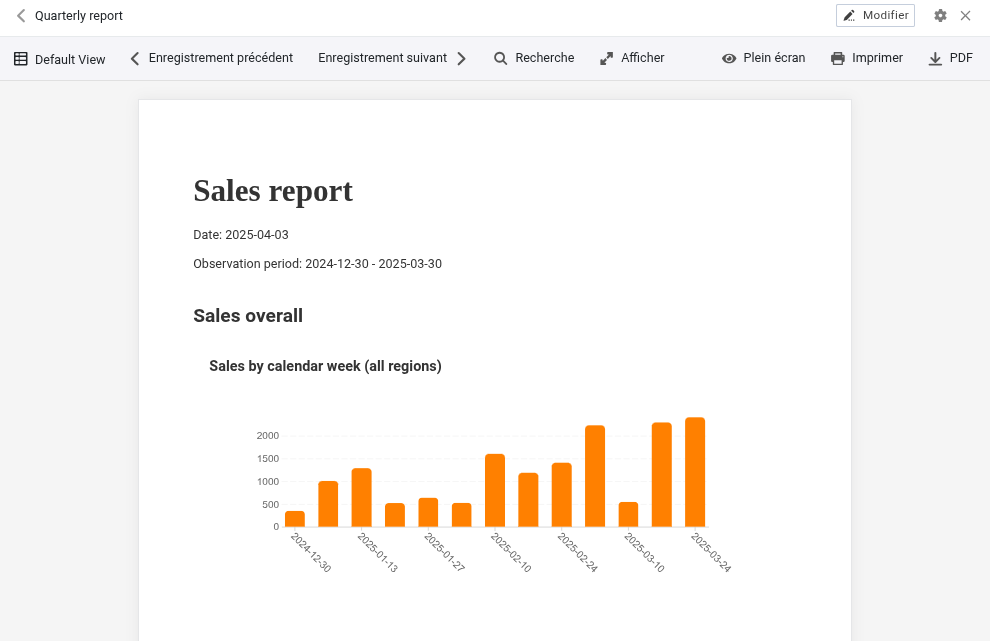

Dans la version 5.3, la dernière mise à jour mineure avant la version 6.0 prévue pour l'été 2026, l'accent est mis sur l'amélioration des composants centraux. Base Editor, App Builder, formulaires web, automatisations et plugins reçoivent de nouvelles fonctionnalités et des optimisations des fonctions existantes. Le changement le plus important : la version 5.3 permet de configurer le premier jour de la semaine. Comme pour les versions précédentes, la plupart des nouveautés se trouvent dans l’App Builder. Les pages de table autorisent désormais une hauteur de ligne variable et l’ajustement des colonnes fixes. Les pages de type enregistrement unique offrent une meilleure intégration des colonnes de liens et de fichiers. Les pages de formulaire permettent la création de liens multi-étapes. Les applications publiques peuvent être protégées par mot de passe pour empêcher tout accès non autorisé, et le téléchargement de fichiers peut être désactivé. Dans les formulaires web, les champs peuvent être pré-remplis et – c’est nouveau – masqués. Un nouveau plugin est également disponible.

Des changements importants ont également eu lieu en arrière-plan : React a été mis à jour vers la version 18. La configuration du système a été simplifiée et rendue plus flexible. Chaque composant SeaTable dispose désormais de son propre fichier de configuration, et les options de configuration via les variables d’environnement ont été étendues. Cela améliore la transparence et permet un déploiement plus simple et plus évolutif.

Dans le [Changelog](), vous trouverez – comme toujours – la liste complète des modifications. Depuis ce matin, SeaTable Cloud fonctionne avec la nouvelle version. L’image Docker de SeaTable 5.3 est disponible au téléchargement dans le [Docker Repository](https://hub.docker.com/r/seatable/seatable-enterprise) habituel.

En particulier pour les utilisateurs de SeaTable Cloud, mais aussi pour ceux de SeaTable Server et SeaTable Dedicated, ce changement de version apporte des modifications à l’API. L’article [Passage à la passerelle API SeaTable : Ce qui change avec la version 5.3]() contient des détails et des explications. Toute personne utilisant l’API SeaTable via des scripts Python, des plateformes d’intégration ou des développements personnalisés est fortement encouragée à le lire.

## Meilleure localisation : premier jour de la semaine configurable

Autres pays, autres coutumes : selon la région, le samedi, le dimanche ou le lundi est considéré comme le premier jour de la semaine. SeaTable prend désormais en compte ces différences régionales. Dans les nouveaux paramètres de date, le premier jour de la semaine peut être défini individuellement pour chaque base.

Conformément aux habitudes d’utilisation en Europe, Australie, dans une grande partie de l’Afrique et de l’Asie, et selon la norme ISO 8601, SeaTable utilise le lundi comme premier jour de la semaine. (Auparavant, le dimanche était toujours le premier jour.) En modifiant ce paramètre, le jour sélectionné apparaît dans la première colonne du contrôle de calendrier. Cela s’applique à la base et à toutes les applications qui en dépendent. Dans le plugin calendrier et la page calendrier de l’application, le jour de la semaine peut toujours être défini individuellement et indépendamment du paramètre de la base.

## Plus de flexibilité dans l’App Builder

Les demandes de fonctionnalités pour l’App Builder sont nombreuses. Nous sommes heureux d’en réaliser certaines dans SeaTable 5.3, d’autres suivront dans les prochaines versions.

SeaTable 5.3 rend la fonction de commentaire plus flexible. Jusqu’à présent, les commentaires dans la base et dans l’application étaient stockés séparément et n’étaient visibles que dans leur contexte respectif. Les commentaires faits dans la base n’étaient pas visibles dans l’application, et vice versa. SeaTable 5.3 supprime cette séparation. Désormais, tous les commentaires sont affichés dans la base. Dans l’application, vous pouvez choisir d’afficher tous les commentaires ou seulement ceux faits dans l’application. Par défaut, seuls les commentaires de l’application sont affichés ; l’affichage de tous les commentaires peut être activé dans les paramètres de l’application. De plus, une autre limitation est levée : la colonne commentaire n’est plus seulement disponible sur les pages de table, mais aussi sur les pages galerie, kanban, calendrier et chronologie.

Un autre changement concernant tous les types de pages est l’ajustement des permissions par défaut. Les nouvelles pages accordent à tous les utilisateurs tous les droits disponibles. Si les utilisateurs doivent avoir des droits réduits, il faut ajuster les permissions de la page. Ce changement harmonise la gestion des droits dans l’application et la base. (Les pages existantes ne sont pas affectées par cette mise à jour.)

### Type de page Table

Avec SeaTable 5.3, nous répondons à une demande fréquente : la hauteur des lignes peut désormais être définie en quatre niveaux, comme dans le Base Editor. La hauteur simple permet un affichage compact, tandis que d’autres options offrent plus d’espace pour le texte formaté et les images. Les colonnes fixes sont aussi plus flexibles. Le verrouillage des colonnes dans l’application est désormais indépendant de la base. (Auparavant, le verrouillage dans la base s’appliquait à toutes les applications associées.)

Des changements sont également visibles dans les paramètres de la page. De nombreux réglages ont été déplacés dans une nouvelle section « Plus de paramètres », qui est repliée par défaut. Avec les permissions de page également minimisées par défaut, les paramètres sont plus clairs et ordonnés.

En y regardant de plus près, il y a aussi des changements fonctionnels dans les paramètres de page. Les « Paramètres de la colonne de lien » ont été révisés pour faire place à la nouvelle permission « Modifier les entrées liées ». Si cette permission est accordée, les utilisateurs de l’application ont des droits d’écriture sur les entrées de la table liée. Les colonnes éditables peuvent être configurées dans les nouveaux paramètres de champ. Si la permission n’est pas activée, l’utilisateur peut seulement voir les liens existants, en ajouter ou en supprimer, mais pas modifier les enregistrements liés.

### Type de page Enregistrement unique

Pour les colonnes de fichiers et de liens, ce type de page était jusqu’à présent limité. Cette nouvelle version corrige ces lacunes.

Les icônes d’une colonne de fichiers sont désormais fonctionnelles. Un clic sur une icône ouvre le fichier dans un visualiseur adapté dans un nouvel onglet. Les documents Office peuvent également être ouverts et édités directement dans le navigateur, à condition qu’un éditeur en ligne soit configuré (comme avec SeaTable Cloud et SeaTable Dedicated).

Les colonnes de liens bénéficient aussi d’un gain de fonctionnalités ! Les entrées liées à l’enregistrement affiché peuvent être présentées clairement dans un tableau. Les colonnes peuvent être masquées dans les paramètres, de sorte que seules les informations essentielles apparaissent.

### Type de page Formulaire

Lors de la création de nouveaux enregistrements via une page de formulaire, il est désormais possible de créer des liens croisés en deux étapes entre les tables. Concrètement : via un formulaire, vous pouvez non seulement créer de nouveaux enregistrements dans une table liée, mais aussi les lier immédiatement à des enregistrements existants dans une troisième table. Par exemple, des lignes de commande dans une table liée peuvent être reliées à des produits dans une troisième table. Pour utiliser cette nouvelle fonctionnalité, il faut activer la permission « Créer et lier de nouveaux enregistrements » et ajouter la colonne de lien concernée aux colonnes visibles dans les paramètres de champ.

### Type de page Requête

Dans SeaTable 5.2, les résultats sur la page de requête sont devenus éditables. Dans SeaTable 5.3, ce droit est optimisé. Comme pour les autres types de pages, certaines colonnes peuvent être exclues de l’édition via la fonction « Colonnes en lecture seule prédéfinies » dans les paramètres de données.

### Applications publiques

L’activation de l’accès illimité fait d’une application SeaTable une application publique. Tout le monde peut accéder à l’application via l’URL (en lecture seule) ; aucune connexion utilisateur n’est requise et il n’y a pas d’autre protection d’accès. Du moins, jusqu’à aujourd’hui. SeaTable 5.3 ajoute une protection par mot de passe optionnelle à l’accès illimité. Si elle est activée, l’application ne peut être utilisée qu’après saisie du mot de passe. Cet accès illimité protégé par mot de passe est une option intéressante pour les associations ou groupes de travail qui souhaitent partager des données peu sensibles avec un grand nombre de personnes tout en évitant un accès public illimité.

## Nouveau plugin de conception de rapports (bêta)

Vous souhaitez pouvoir créer des rapports dans SeaTable où tableaux, graphiques et images sont remplis dynamiquement avec des données ? C’est désormais possible ! Voici le plugin de conception de rapports. Ce nouveau plugin permet de créer des documents variés avec différentes évaluations graphiques, dont le contenu est généré dynamiquement lors de la création du document.

Le nouveau plugin de conception de rapports et le plugin de conception de pages existant se ressemblent sur certains aspects. Les deux créent des documents PDF à partir de modèles contenant des éléments statiques et dynamiques. Cependant, le plugin de conception de rapports n’est pas simplement une version améliorée du plugin de conception de pages. Les deux plugins ont leurs propres particularités et cas d’utilisation.

Avec le plugin de conception de pages, les éléments sont positionnés au pixel près sur le modèle, leurs dimensions sont définies et attribuées à un calque. En résumé, on l’utilise comme un logiciel graphique : le design du modèle définit précisément l’apparence du document généré. Le plugin de conception de rapports rappelle Word ou Google Docs. Le texte et les autres éléments sont placés de manière continue les uns sous les autres. Le plugin gère la mise en page, y compris les sauts de ligne et de page, lors de la création du document. Les éléments de longueur variable, comme les tableaux, sont facilement pris en charge.

Le plugin de conception de rapports prend en charge un large éventail d’éléments dynamiques : valeurs individuelles d’un enregistrement, enregistrements entiers, tableaux et divers types de graphiques peuvent être utilisés dans un modèle de document. Pour la mise en forme du texte, vous disposez d’options connues des traitements de texte, telles que les listes à puces, l’alignement du texte et la disposition en colonnes multiples. Des styles de plan pour la structuration du document sont également disponibles. Cependant, pour la conception d’éléments individuels, le plugin de conception de pages offre plus d’options. Pour chaque élément, vous pouvez définir la couleur du texte et de l’arrière-plan, les bordures et d’autres options de formatage. Grâce aux calques, les éléments peuvent être superposés et des effets de recouvrement peuvent être créés.

Le plugin de conception de rapports est actuellement en version bêta. Nous attendons vos retours avec impatience. Le plugin devrait être officiellement lancé avec la version 6.0.
