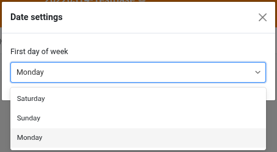
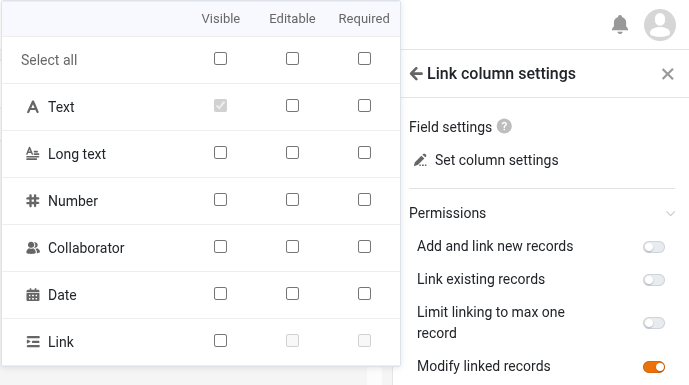
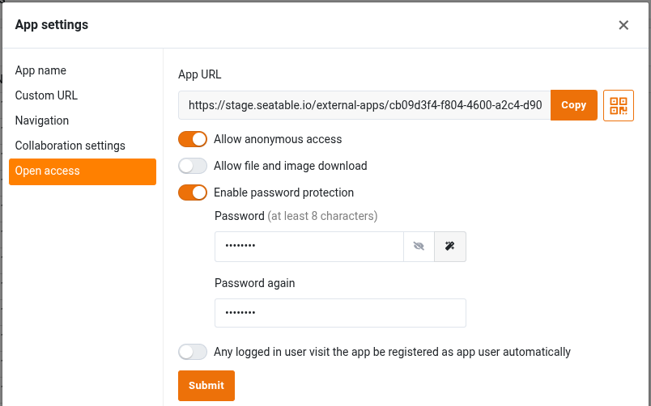
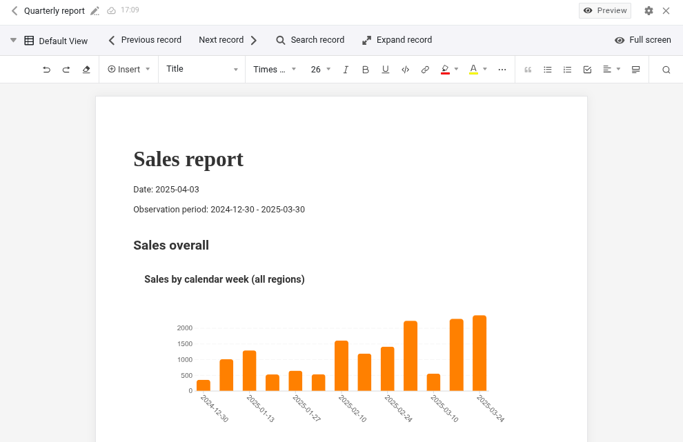

Na versão 5.3, o último lançamento menor antes da versão 6.0 planejada para o verão de 2026, o foco está nas melhorias dos componentes centrais. Base Editor, App Builder, formulários web, automações e plugins recebem novas funções e otimizações das funções existentes. A mudança mais importante: a versão 5.3 permite configurar o primeiro dia da semana. Como nas versões anteriores, a maioria das novidades está no App Builder. Páginas de tabela agora permitem altura de linha variável e ajuste das colunas fixas. Páginas do tipo registro único oferecem melhor integração para colunas de links e arquivos. Páginas de formulário permitem a criação de links em vários níveis. Apps públicas podem ser protegidas por senha para evitar acesso não autorizado, e o download de arquivos pode ser desativado. Em formulários web, campos podem ser pré-preenchidos e – novidade nesta versão – ocultados. Há também um novo plugin.

Também houve mudanças importantes nos bastidores: o React foi atualizado para a versão 18. A configuração do sistema foi simplificada e flexibilizada. Cada componente do SeaTable agora tem seu próprio arquivo de configuração, e as opções de configuração por variáveis de ambiente foram ampliadas. Isso aumenta a transparência e permite uma implantação mais simples e escalável.

No [Changelog](), você encontrará – como sempre – a lista completa de alterações. Desde esta manhã, o SeaTable Cloud já está rodando na nova versão. A imagem Docker do SeaTable 5.3 está disponível para download no conhecido [Docker Repository](https://hub.docker.com/r/seatable/seatable-enterprise).

Especialmente para usuários do SeaTable Cloud, mas também para SeaTable Server e SeaTable Dedicated, esta mudança de versão traz alterações na API. O artigo [Mudança para o SeaTable API Gateway: O que muda com a versão 5.3]() contém detalhes e informações de fundo. Quem utiliza a API do SeaTable via scripts Python, plataformas de integração ou desenvolvimentos próprios é fortemente aconselhado a ler.

## Melhor localização: primeiro dia da semana configurável

Outros países, outros costumes: dependendo da região, sábado, domingo ou segunda-feira é considerado o primeiro dia da semana. O SeaTable agora permite adaptar-se a essas diferenças regionais. Nas novas configurações de data, o primeiro dia da semana pode ser definido individualmente para cada base.

Seguindo os hábitos de uso na Europa, Austrália, grande parte da África e Ásia, e o padrão ISO 8601, o SeaTable usa a segunda-feira como primeiro dia da semana. (Antes, o domingo era sempre o primeiro dia.) Ajustar isso nas configurações de data move o dia selecionado para a primeira coluna no controle de calendário. Isso se aplica à base e a todos os apps baseados nela. No plugin de calendário e na página de calendário do app, o dia da semana ainda pode ser definido individualmente e independentemente da configuração da base.

## Mais flexibilidade no App Builder

Os pedidos de funcionalidades para o App Builder são muitos. Temos o prazer de implementar alguns deles no SeaTable 5.3, com outros a serem lançados em versões futuras.

O SeaTable 5.3 torna a função de comentários mais flexível. Antes, os comentários na base e no app eram armazenados separadamente e exibidos apenas em seus respectivos lugares. Comentários feitos na base não eram visíveis no app e vice-versa. O SeaTable 5.3 elimina essa separação. Agora, todos os comentários são exibidos na base. No app, é possível escolher exibir todos os comentários ou apenas os feitos no app. Por padrão, apenas os comentários do app são mostrados; carregar todos os comentários pode ser ativado nas configurações do app. Além disso, outra restrição foi removida: a coluna de comentários agora está disponível não apenas em páginas de tabela, mas também em páginas de galeria, kanban, calendário e linha do tempo.

Outra mudança que afeta todos os tipos de página é o ajuste das permissões padrão. Novas páginas concedem a todos os usuários todos os direitos disponíveis. Se os usuários devem ter direitos reduzidos, as permissões da página precisam ser ajustadas. Essa alteração harmoniza o gerenciamento de permissões no app e na base. (Páginas existentes não são afetadas por esta atualização.)

### Tipo de página Tabela

Com o SeaTable 5.3, atendemos a um pedido frequente para este tipo de página: a altura das linhas agora pode ser definida em quatro níveis, como já acontece no Base Editor. A altura simples permite uma visualização compacta, enquanto outras opções oferecem mais espaço para texto formatado e imagens. As colunas fixas também são mais flexíveis. O travamento de colunas no app agora é independente da base. (Antes, o travamento na base se aplicava a todos os apps relacionados.)

À primeira vista, também há mudanças nas configurações da página. Muitas configurações foram movidas para uma nova seção "Mais configurações", que está recolhida por padrão. Com as permissões de página também minimizadas por padrão, as configurações ficam mais organizadas e claras.

Olhando mais de perto, também há mudanças funcionais nas configurações da página. As "Configurações da coluna de link" foram revisadas para dar lugar à nova permissão "Editar entradas vinculadas". Se concedida, os usuários do app têm direitos de escrita nas entradas da tabela vinculada. As colunas editáveis podem ser configuradas nas novas configurações de campo. Se a permissão não estiver ativada, o usuário só pode ver os links existentes, adicionar ou remover links, mas não modificar os registros vinculados.

### Tipo de página Registro único

Para colunas de arquivos e links, este tipo de página estava limitado até agora. Esta nova versão corrige essas limitações.

Os ícones de uma coluna de arquivos agora não só são visualmente atraentes, mas também funcionais. Clicar em um ícone de arquivo abre o arquivo em um visualizador adequado em uma nova aba. Documentos do Office também podem ser abertos e editados diretamente no navegador, desde que um editor online esteja configurado (como no SeaTable Cloud e SeaTable Dedicated).

As colunas de links também ganham em funcionalidade! As entradas vinculadas ao registro exibido podem ser mostradas claramente em uma tabela. Nas configurações, é possível ocultar colunas para exibir apenas as informações essenciais das entradas vinculadas.

### Tipo de página Formulário

Ao criar novos registros por meio de uma página de formulário, agora é possível criar links cruzados em duas etapas entre tabelas. Ou seja: por meio de um formulário, é possível criar novos registros em uma tabela vinculada e, ao mesmo tempo, vinculá-los a registros existentes em uma terceira tabela. Por exemplo, itens de pedido em uma tabela vinculada podem ser associados a produtos em uma terceira tabela. Para usar essa nova função, é necessário ativar a permissão "Criar e vincular novas entradas" e adicionar a coluna de link relevante às colunas visíveis nas configurações do campo.

### Tipo de página Consulta

No SeaTable 5.2, os resultados na página de consulta se tornaram editáveis. No SeaTable 5.3, essa permissão foi otimizada. Como em outros tipos de página, algumas colunas podem ser excluídas da edição usando a função "Colunas predefinidas somente leitura" nas configurações de dados.

### Apps públicas

Ativar o acesso irrestrito transforma um app do SeaTable em um aplicativo público. Qualquer pessoa pode acessar o app via URL (somente leitura); não é necessário login de usuário e não há proteção adicional de acesso. Pelo menos, até agora. O SeaTable 5.3 adiciona proteção opcional por senha ao acesso irrestrito. Se ativada, o app só pode ser usado após inserir a senha. O acesso irrestrito protegido por senha é uma opção interessante para associações ou grupos de trabalho que desejam compartilhar dados de baixa sensibilidade com muitas pessoas, mas evitar o acesso público irrestrito.

## Novo plugin de design de relatórios (beta)

Você gostaria de criar relatórios no SeaTable onde tabelas, gráficos e imagens sejam preenchidos dinamicamente com dados? Desejo atendido! Apresentamos: o plugin de design de relatórios. Este novo plugin permite criar documentos versáteis com diversas avaliações gráficas, cujo conteúdo é gerado dinamicamente durante a criação do documento.

O novo plugin de design de relatórios e o plugin de design de página existente são semelhantes em alguns aspectos. Ambos criam documentos PDF baseados em modelos que contêm elementos estáticos e dinâmicos. No entanto, o plugin de design de relatórios não é apenas uma versão melhorada do plugin de design de página. Ambos os plugins têm suas próprias características e casos de uso.

Com o plugin de design de página, os elementos são posicionados precisamente no modelo, suas dimensões são definidas e atribuídas a uma camada. Basicamente, ele é usado como um programa gráfico: o design do modelo define exatamente a aparência do documento gerado. O plugin de design de relatórios lembra o Word ou o Google Docs. Texto e outros elementos são colocados continuamente um após o outro. O plugin cuida do layout da página, incluindo quebras de linha e de página, durante a criação do documento. Elementos de comprimento variável, como tabelas, são facilmente acomodados.

O plugin de design de relatórios suporta uma ampla variedade de elementos dinâmicos: valores individuais de um registro, registros inteiros, tabelas e vários tipos de gráficos podem ser usados em um modelo de documento. Para a formatação de texto, você tem opções conhecidas de processadores de texto, como listas com marcadores, alinhamento de texto e layouts de várias colunas. Também estão disponíveis estilos de estruturação do documento. No entanto, para o design de elementos individuais, o plugin de design de página oferece mais opções. Para cada elemento, é possível definir a cor do texto e do fundo, bordas e outras opções de formatação. Usando camadas, os elementos podem ser sobrepostos e criar efeitos de sobreposição.

O plugin de design de relatórios está atualmente em fase beta. Aguardamos seu feedback. O plugin deve ser lançado oficialmente com a versão 6.0.
