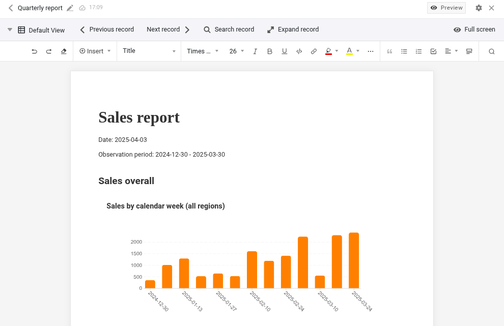

В версии 5.3, последнем минорном релизе перед запланированной на лето 2026 версией 6.0, основной акцент сделан на улучшении ключевых компонентов. Base Editor, App Builder, веб-формы, автоматизации и плагины получили новые функции и оптимизации существующих возможностей. Самое важное изменение: в версии 5.3 теперь можно настраивать первый день недели. Как и в предыдущих релизах, большинство новинок реализовано в App Builder. Табличные страницы теперь поддерживают переменную высоту строк и настройку закреплённых столбцов. Страницы с отдельной записью предлагают лучшую интеграцию для столбцов ссылок и файлов. Формы позволяют создавать многоуровневые связи. Публичные приложения можно защитить паролем, а загрузку файлов — отключить. В веб-формах поля теперь можно предварительно заполнять и — это новинка — скрывать. Также появился новый плагин.

Существенные изменения произошли и «под капотом»: React обновлён до версии 18. Системная конфигурация стала проще и гибче. Каждый компонент SeaTable теперь имеет собственный конфигурационный файл, а параметры через переменные окружения были расширены. Это повышает прозрачность и облегчает масштабируемое развертывание.

В [Changelog]() вы, как всегда, найдёте полный список изменений. С сегодняшнего утра SeaTable Cloud работает на новой версии. Docker-образ SeaTable 5.3 доступен для загрузки в знакомом [Docker Repository](https://hub.docker.com/r/seatable/seatable-enterprise).

Особенно для пользователей SeaTable Cloud, а также для SeaTable Server и SeaTable Dedicated, этот релиз приносит изменения в API. Статья [Переход на SeaTable API Gateway: что изменится с версией 5.3]() содержит детали и пояснения. Всем, кто использует API SeaTable через Python-скрипты, интеграционные платформы или собственные разработки, настоятельно рекомендуется ознакомиться с ней.

## Улучшенная локализация: настраиваемый первый день недели

В разных странах — разные традиции: в зависимости от региона, первым днём недели считается суббота, воскресенье или понедельник. Теперь SeaTable позволяет учитывать эти региональные особенности. В новых настройках даты первый день недели можно выбрать индивидуально для каждой базы.

Следуя привычкам пользователей в Европе, Австралии, большей части Африки и Азии и стандарту ISO 8601, по умолчанию SeaTable использует понедельник как первый день недели. (Ранее всегда использовалось воскресенье.) Изменение этого параметра сдвигает выбранный день в первую колонку календаря. Это распространяется на базу и все связанные с ней приложения. В плагине и на странице календаря в приложении день недели также можно настраивать независимо от настроек базы.

## Больше гибкости в App Builder

Запросов на новые функции для App Builder всегда много. Мы рады реализовать некоторые из них в SeaTable 5.3, а остальные появятся в будущих версиях.

SeaTable 5.3 делает функцию комментариев более гибкой. Ранее комментарии в базе и в приложении хранились раздельно и отображались только в соответствующем месте. Комментарии, сделанные в базе, не были видны в приложении, и наоборот. В версии 5.3 это разделение устранено: теперь в базе отображаются все комментарии. В приложении можно выбрать: показывать все комментарии или только те, что оставлены в приложении. По умолчанию показываются только комментарии приложения; загрузку всех комментариев можно включить в настройках. Кроме того, комментарии теперь доступны не только на табличных страницах, но и на страницах галереи, канбан, календаря и временной шкалы.

Ещё одно изменение, касающееся всех типов страниц — это настройка стандартных прав доступа. Новые страницы предоставляют всем пользователям все доступные права. Если требуются ограниченные права, их нужно настроить вручную. Это изменение гармонизирует управление правами в приложении и базе. (Существующие страницы не затрагиваются этим обновлением.)

### Тип страницы «Таблица»

В SeaTable 5.3 реализовано частое пожелание пользователей: теперь высоту строк можно настраивать в четырёх уровнях, как и в Base Editor. Простая высота обеспечивает компактное отображение, другие варианты дают больше места для форматированного текста и изображений. Закреплённые столбцы теперь также более гибкие: их настройка в приложении теперь независима от базы. (Ранее закрепление столбцов в базе распространялось на все связанные приложения.)

В настройках страницы также появились изменения: многие параметры перенесены в новый раздел «Дополнительные настройки», который по умолчанию свернут. С учётом того, что права доступа теперь тоже свернуты по умолчанию, настройки выглядят более аккуратно и понятно.

При внимательном рассмотрении заметны и функциональные изменения. Настройки столбца ссылок переработаны для добавления нового права «Редактировать связанные записи». Если это право предоставлено, пользователи приложения могут редактировать записи в связанной таблице. Какие именно столбцы доступны для редактирования, можно настроить в новых параметрах поля. Если право не включено, пользователь может только просматривать существующие ссылки, добавлять или удалять их, но не изменять связанные записи.

### Тип страницы «Одна запись»

Для столбцов файлов и ссылок этот тип страницы ранее был ограничен по возможностям. В новом релизе эти ограничения устранены.

Иконки в столбце файлов теперь не только красивы, но и функциональны: клик по иконке открывает файл в подходящем просмотрщике в новой вкладке. Документы Office также можно открывать и редактировать прямо в браузере, если настроен онлайн-редактор (как в SeaTable Cloud и SeaTable Dedicated).

Столбцы ссылок также получили новые возможности! Записи, связанные с текущей, теперь можно наглядно отображать в виде таблицы. В настройках можно скрывать отдельные столбцы, чтобы показывать только важную информацию о связанных записях.

### Тип страницы «Форма»

При создании новых записей через форму теперь можно создавать двухуровневые связи между таблицами. То есть, с помощью формы можно не только создавать новые записи в связанной таблице, но и сразу связывать их с существующими записями в третьей таблице. Например, позиции заказа в одной таблице можно связать с продуктами в другой. Для использования этой функции необходимо включить право «Создавать и связывать новые записи» и добавить нужный столбец ссылок в видимые поля.

### Тип страницы «Запрос»

В SeaTable 5.2 результаты на странице запроса стали редактируемыми. В версии 5.3 эта возможность оптимизирована. Как и в других типах страниц, отдельные столбцы можно сделать только для чтения через функцию «Предустановленные столбцы только для чтения» в настройках данных.

### Публичные приложения

Включение неограниченного доступа превращает приложение SeaTable в публичное. Любой может получить доступ к приложению по URL (только для чтения); вход не требуется, дополнительной защиты нет. По крайней мере, до этого момента. В SeaTable 5.3 добавлена опциональная защита паролем для публичного доступа. Если она включена, использовать приложение можно только после ввода пароля. Такой вариант интересен для клубов или рабочих групп, которые хотят делиться малочувствительными данными с большим количеством людей, но избегать полностью открытого доступа.

## Новый плагин для создания отчётов (бета)

Хотели бы вы создавать в SeaTable отчёты, где таблицы, диаграммы и изображения автоматически наполняются данными? Желание исполнено! Представляем: плагин для дизайна отчётов. Этот новый плагин позволяет создавать разнообразные документы с разными графическими представлениями, содержимое которых формируется динамически при создании документа.

Новый плагин для отчётов и существующий плагин для дизайна страниц похожи в некоторых аспектах. Оба создают PDF-документы на основе шаблонов, содержащих статические и динамические элементы. Однако плагин для отчётов — не просто улучшенная версия плагина дизайна страниц. Оба плагина имеют свои уникальные особенности и сценарии использования.

В плагине дизайна страниц элементы размещаются на шаблоне с точностью до пикселя, их размеры фиксируются и назначаются слою. По сути, его используют как графический редактор: дизайн шаблона точно определяет внешний вид создаваемого документа. Плагин для отчётов напоминает работу с Word или Google Docs: текст и другие элементы размещаются последовательно друг за другом. Плагин сам заботится о разметке страницы, включая переносы строк и страниц, при создании документа. Элементы переменной длины, такие как таблицы, легко поддерживаются.

Плагин для отчётов поддерживает широкий спектр динамических элементов: отдельные значения записи, целые записи, таблицы и различные типы диаграмм можно использовать в шаблоне документа. Для форматирования текста доступны привычные опции, такие как маркированные списки, выравнивание текста и много-колоночная верстка. Есть и стили для структуры документа. Однако для оформления отдельных элементов плагин дизайна страниц предлагает больше возможностей: для каждого элемента можно задать цвет текста и фона, рамки и другие параметры. Используя слои, можно создавать эффекты наложения.

Плагин для отчётов пока находится в стадии бета-тестирования. Мы будем рады вашим отзывам. Официальный релиз плагина ожидается в версии 6.0.
