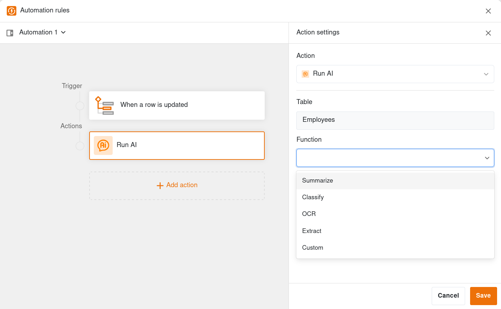
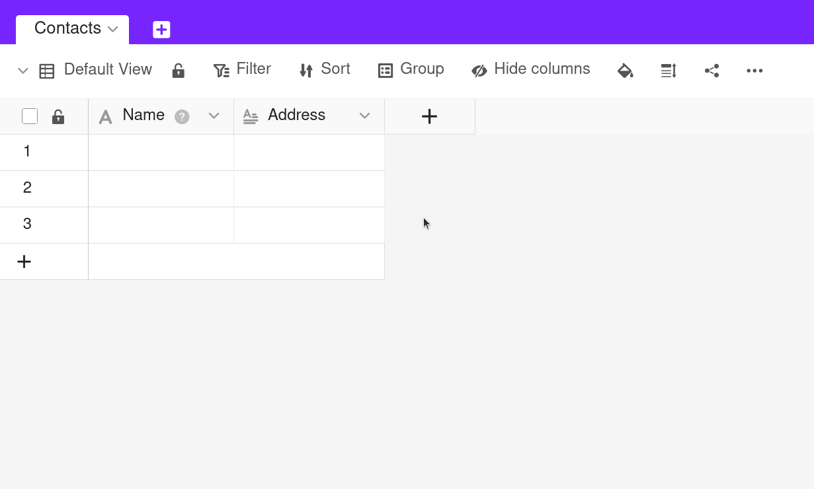

SeaTable 6.0 combines the strengths of no-code and artificial intelligence (AI). **With the new AI functions**, data records can be analyzed, modified and expanded, documents evaluated and relevant information precisely extracted – all without worrying about data protection and confidentiality. SeaTable supports a wide range of AI providers and models and, needless to say, **self-hosting of AI models** is also possible. We take this approach in the interest of protecting your data.

**The completely revised editor for automation rules** makes using the new AI functions child's play. All other automations also benefit from the workflow-oriented user interface of the rule editor and its extended functions as well.

**The new view types Calendar, Kanban, and Gallery**, which replace the plugins of the same name, also offer more clarity and functions. Like the familiar table view, the three new view types support collaboration at the highest level with functions such as view sharing, private views and collaborative data editing in real time.

Numerous improvements in the App Builder and Base Editor, such as the universal availability of complex filters and **the new Phone Number column type**, optimize existing functionalities and take customer requests into account.

We updated SeaTable Cloud to version 6.0 this morning. Self-hosters, who have been able to use a beta version since September 30th, can now download the stable release from the well-known [Docker Repository](https://hub.docker.com/r/seatable/seatable-enterprise) of SeaTable Server. As always, the complete list of changes can be found in the [changelog](https://cloud.seatable.io/dtable/view-external-links/c9124bcd934b47bc8f30/).

## AI-ready with AI automations (beta)

Analyze texts, translate manuscripts, extract information from documents, create drafts based on keywords and much more – SeaTable's new AI features bring the power of modern AI directly to SeaTable.

There are **dedicated AI functions** for standard tasks. Functions such as *Summarize*, *OCR*, *Extract* and *Classify* make the use of AI in business processes as easy as one can imagine. You simply select the function and define the input and output columns. Detailed instructions, if necessary, can be passed to the AI model via a prompt.

If no dedicated AI function fits, the **Custom function** can help. With this, the AI model operates solely on the basis of your individual prompt. You simply transfer information from the data set by referencing a column in curly brackets, e.g. "Write a story with 1000 words based on the keywords in {Keywords}."

The new AI functions are integrated into SeaTable's automations and are just as easy to create, use and manage – probably even easier thanks to the revised editor. Of course, you can also add AI functions to existing automation rules to make them even more powerful.

### AI deployment without compromising on data protection

SeaTable Cloud uses a **Gemma3** with 12 billion parameters as its AI model. This multimodal Large Language Model (LLM) from Google runs **on a German server** from Hetzner Online GmbH and is maintained by the SeaTable Cloud administrators. The data exchange between SeaTable Cloud and the language model is **encrypted**. Your data is therefore not sent to another AI provider or abroad.

All SeaTable Cloud Enterprise subscribers receive **500 AI credits per team member**. The AI credits are calculated in such a way that they enable extensive testing. Additional credits are required for productive workloads. These can be provided free of charge on request during the beta phase.

**Self-hosters of SeaTable Server** can host their LLM themselves, but do not have to. If that’s not for you, **SeaTable AI**, a new component of SeaTable Server, is based on LiteLLM and thus supports the connection of a variety of models and providers – including all LLM services with an OpenAI-compatible API. SeaTable AI is deployed using Docker or Docker Compose, just like all other SeaTable Server components. In the [Admin Manual](https://admin.seatable.com/) you will find sample configurations for numerous popular LLMs.

### Outlook for further AI development

The AI functions in SeaTable 6.0 are beta and will be dynamically improved and expanded in the coming months. Work on an **AI assistant** and an **MCP server** is in full swing. Additional AI models will soon be available for selection in SeaTable Cloud. In addition to the LLM hosted by SeaTable itself, models from the well-known providers **OpenAI, Anthropic, Meta and xAI** as well as those from the European provider **Mistral** will then also be available. SeaTable Server administrators will also be able to configure several AI models. This allows you to use the optimum model for each use case.

**Usage tracking** and **permission management** are further focal points in development. Our goal: maximum transparency and control over the use of AI credits in SeaTable.

## Automation has never been so easy

In SeaTable 6.0, **creating and managing automation rules** is even easier and more convenient. A completely redesigned editor offers more clarity and additional functions.

The editor of SeaTable 6.0 extends across the entire width of the screen and thus enables **a new layout**: All existing rules can be found on the left-hand side – analogous to the views. **Switching between two rules** is now just a matter of one click. The active automation rule is located in the central area. The **configuration of the trigger or actions** is displayed dynamically on the right-hand side. Another convenience factor is the **variable height of the editor panel**. This means that the column names and sample data remain visible while you are working on an automation rule.

The new editor also takes account of the frequently expressed wish to be able to **group and move automation rules**. In addition, actions can be duplicated in a rule.

## Three plugins become views

The three plugins [Calendar](), [Kanban]() and [Gallery]() have been an integral part of SeaTable since version 1.0. Now, after 5 years, they have a new form: The Calendar, Kanban and Gallery plugins become **Calendar, Kanban and Gallery views**. In SeaTable 6.1 the [Timeline plugin]() will follow.

The reimplementation of the plugins as views offers several advantages: Primarily, it makes them much easier to use. **There is no need to install the plugins in a base**, as the views are immediately available. SeaTable Server admins will also appreciate the integration: The separate update of the plugins will also no longer be necessary in future.

The new views are also far superior to the previous plugins in terms of functionality: The Calendar, Kanban and Gallery views can be shared individually as a [view share]() or as part of a [custom sharing permission](). The previous need to [share the entire base]() to work together on a calendar or Kanban board is no longer necessary. Views of all types also offer optional **private views** that only the creator can see. All views, with the exception of the Big Data view, also support **real-time collaborative editing**. A change made by one user is immediately displayed to other users.



## More flexibility in the App Builder

In the [App Builder]() of SeaTable 6.0 you will notice **the new orange plus button**. You can use it to add a new element to the navigation, no matter where you are in your app. Clicking on the button reveals a functional innovation: in addition to pages and folders, you can now also insert **direct links to external websites** in the navigation. This means that a link to a privacy policy or an external wiki no longer needs to be embedded in a page, but can appear prominently and directly in the navigation. Several customers had asked us for this design option.

The other improvements in the App Builder also revolve around the topic of flexibility: The page settings of the [page types]() Calendar, Kanban, Gallery, and Timeline now also allow **individual columns to be protected from changes**. All relevant page types now offer this functionality.

It has been available in the Base Editor since version 5.2 and is now also available in the App Builder: **complex filters**. Both the data settings and the settings for link columns now support filter groups. Users of a table page can now also use search patterns with logical AND and OR operators.

## More functions in the team administration

The [team administration]() of SeaTable Cloud has been extensively revised with the major release. The first thing that catches the eye is the harmonization of the design of the team administration with that of the website. However, the new functions are of greater importance for use:

- Configuration of SSO via SAML (only for Enterprise subscribers)
- Integration of a log for team activities (only for Enterprise subscribers)
- Integration of a log for team logins
- Sending invoices by e-mail
- Management of multiple payment methods

## Further improvements

Version 6.0 introduces SeaTable's 26th column type. **The new column type Phone Number** makes communication easier. A click on the phone icon in a cell transfers the phone number to your telephony application. On mobile devices, this works without any further configuration. The same applies on the desktop if a shortcut to telephony software has been set up in the browser.

The [export function]() of SeaTable 6.0 supports the **export of data archived in the Big Data storage**. If you activate the option when exporting, SeaTable first creates the export file in DTABLE format and informs you by means of a notification when the process is complete. The file is then downloaded via the Base file manager. The data from the Big Data storage is saved in a binary format in the "archive" folder in the DTABLE file. Of course, a DTABLE file with Big Data can be easily imported back into SeaTable like any other DTABLE file.

Entering data in [date columns]() has become more convenient. Previously, SeaTable required the entry of a complete date. If a part, e.g. the year or a leading zero, was omitted, this was an invalid entry. This is no longer the case. "25-11-4" is correctly interpreted as 2025-11-04. And logically, this does not only work for dates in ISO format.

Give SeaTable 6.0 a try! We are sure that you will be impressed.



Subscribe to our **Newsletter** and never miss any news about SeaTable!


