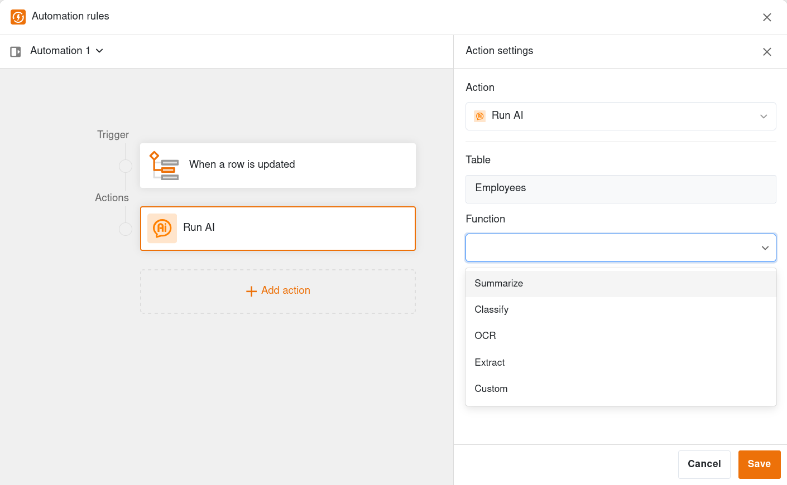
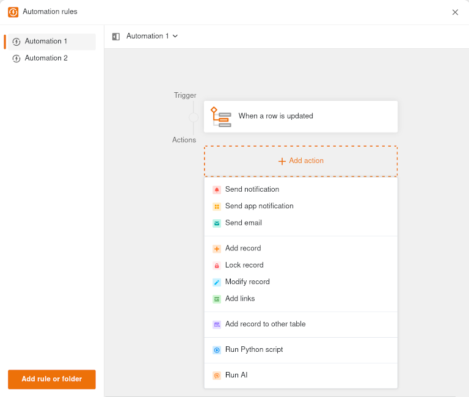
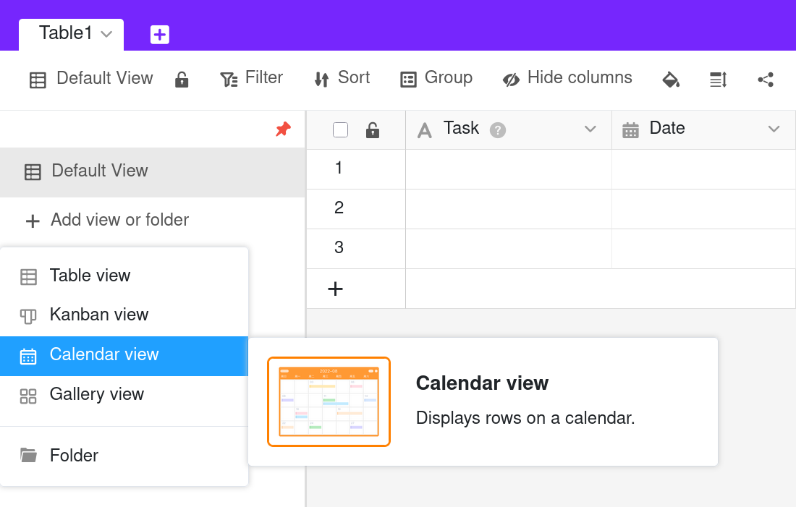
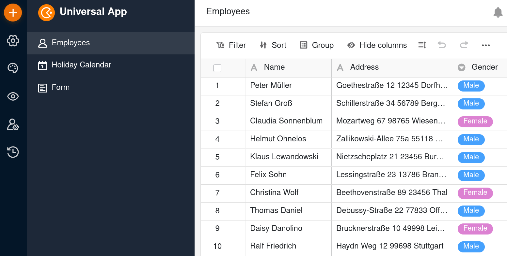

SeaTable 6.0 combina os pontos fortes do no-code e da inteligência artificial (IA). **Com as novas funções de IA**, os registos de dados podem ser analisados, modificados e expandidos, os documentos avaliados e as informações relevantes extraídas com precisão. E tudo isto sem se preocupar com a proteção de dados e a confidencialidade: SeaTable suporta uma vasta gama de fornecedores e modelos de IA. Naturalmente, o **auto-hospedagem de modelos de IA** também é possível. Adoptamos esta abordagem no interesse da proteção dos seus dados.

**O editor de regras de automatização completamente revisto** torna a utilização das novas funções de IA numa brincadeira de crianças. Mas todas as outras automatizações também beneficiam da interface de utilizador orientada para o fluxo de trabalho do editor de regras e das suas funções alargadas.

**Os novos tipos de vista Calendário, Kanban e Galeria**, que substituem os plugins com o mesmo nome, também oferecem mais clareza e funções. Tal como a familiar vista de tabela, os três novos tipos de vista suportam a colaboração ao mais alto nível com funções como a partilha de vistas, vistas privadas e edição colaborativa de dados em tempo real.

Inúmeras melhorias no App Builder e no Base Editor, como a disponibilidade universal de filtros complexos e **o novo tipo de coluna de número de telefone**, optimizam as funcionalidades existentes e satisfazem as necessidades dos clientes.

Actualizámos SeaTable Cloud para a versão 6.0 esta manhã. Os auto-hospedadores que puderam utilizar uma versão beta desde 30 de setembro podem agora descarregar a versão estável a partir do conhecido [Docker Repository](https://hub.docker.com/r/seatable/seatable-enterprise) do SeaTable Server. Como sempre, a lista completa de alterações pode ser encontrada no [changelog]().

## AI-ready com automações de IA (beta)

Analise textos, traduza manuscritos, extraia informações de documentos, crie rascunhos com base em palavras-chave e muito mais – as novas funções de IA do SeaTable trazem o poder da IA moderna diretamente para SeaTable.

Existem **funções de IA dedicadas** para tarefas padrão. Funções como *Summarize*, *OCR*, *Extract* e *Classify* tornam a utilização da IA nos processos empresariais tão fácil quanto se possa imaginar. Basta selecionar a função e definir as colunas de entrada e saída. Se necessário, pode transmitir instruções pormenorizadas ao modelo de IA através de uma mensagem.

Se nenhuma função IA dedicada for adequada, pode utilizar a **Função personalizada**. Com isto, o modelo de IA funciona apenas com base no seu comando individual. Basta transferir informação do conjunto de dados referenciando uma coluna entre parênteses rectos, por exemplo, "Escreva uma história com 1000 palavras com base nas palavras-chave em {Palavras-chave}."

As novas funções de IA estão integradas nas automatizações do SeaTable e são igualmente fáceis de criar, utilizar e gerir – provavelmente ainda mais fáceis graças ao editor revisto. Naturalmente, também pode adicionar funções de IA às regras de automatização existentes para as tornar ainda mais poderosas.

### Implementação de IA sem comprometer a proteção de dados

SeaTable Cloud utiliza um **Gemma3** com 12 mil milhões de parâmetros como modelo de IA. Este Large Language Model (LLM) multimodal da Google funciona **num servidor alemão** da Hetzner Online GmbH e é gerido pelos administradores do SeaTable Cloud. A troca de dados entre SeaTable Cloud e o modelo de linguagem é **encriptada**. Os seus dados não são, portanto, enviados para outro fornecedor de IA ou para o estrangeiro.

Todos os subscritores do SeaTable Cloud Enterprise recebem **10 créditos de IA por membro da equipa**. Os créditos de IA são calculados de forma a permitir testes exaustivos. São necessários créditos adicionais para cargas de trabalho produtivas. Estes podem ser fornecidos gratuitamente mediante pedido durante a fase beta.

**Os auto-hospedadores do SeaTable Server** também podem alojar o seu LLM, mas não são obrigados a fazê-lo. **SeaTable AI**, um novo componente do SeaTable Server, é baseado no LiteLLM e, portanto, suporta a conexão de uma variedade de modelos e provedores – incluindo todos os serviços LLM com uma API compatível com OpenAI. SeaTable AI é implantado usando o Docker ou o Docker Compose, como é o caso de todos os outros componentes do SeaTable Server. No [Manual do administrador](https://admin.seatable.com/) encontrará configurações de amostra para vários LLMs populares.

### Perspectivas para desenvolvimento adicional de IA

As funções de IA no SeaTable 6.0 são beta e serão dinamicamente melhoradas e expandidas nos próximos meses. O trabalho num **assistente de IA** e num **servidor MCP** está em pleno andamento. Outros modelos de IA estarão em breve disponíveis para seleção no SeaTable Cloud. Para além do LLM alojado pelo próprio SeaTable, estarão também disponíveis modelos dos conhecidos fornecedores **OpenAI, Anthropic, Meta e xAI**, bem como os do fornecedor europeu **Mistral**. Os administradores do SeaTable Server também poderão configurar vários modelos de IA. Isto permite-lhe utilizar o modelo ideal para cada caso de utilização.

**O controlo da utilização** e **a gestão de autorizações** são outros pontos fulcrais do desenvolvimento. O nosso objetivo: máxima transparência e controlo sobre a utilização de créditos de IA no SeaTable.

## Automatização tão fácil como nunca antes

No SeaTable 6.0, **criar e gerir regras de automatização** é ainda mais fácil e cómodo. Um editor completamente revisto oferece-lhe mais clareza e funções adicionais.

O editor do SeaTable 6.0 estende-se por toda a largura do ecrã, permitindo assim **um novo layout**: Todas as regras existentes podem ser encontradas no lado esquerdo - análogo às vistas. **Alternar entre duas regras** é agora apenas uma questão de um clique. A regra de automatização ativa está localizada na área central. A **configuração do acionador ou das acções** é apresentada dinamicamente no lado direito. Outro fator de conveniência é a **altura variável do painel do editor**. Isto significa que os nomes das colunas e os dados de amostra permanecem visíveis enquanto está a trabalhar numa regra de automatização.

O novo editor também satisfaz o desejo frequentemente expresso de poder agrupar e mover **regras de automatização**. Além disso, as acções podem ser duplicadas numa regra.

## Três plugins tornam-se vistas

Os três plugins [Calendário](), [Galeria]() e [Kanban]() são parte integrante do SeaTable desde a versão 1.0. Agora, passados 5 anos, têm uma nova forma: Os plugins de Calendário, Kanban e Galeria tornaram-se **Vistas de Calendário, Kanban e Galeria**. No SeaTable 6.1, seguir-se-á o [plugin Timeline]().

A reimplementação dos plugins como vistas oferece várias vantagens: Por um lado, torna-os muito mais fáceis de usar. **Não há necessidade de instalar os plugins numa base**, uma vez que as vistas estão imediatamente disponíveis. Os administradores do SeaTable Server também irão apreciar a integração: A atualização separada dos plugins também deixará de ser necessária no futuro.

As novas vistas também são muito superiores aos plugins anteriores em termos de funcionalidade: As vistas de calendário, Kanban e galeria podem ser partilhadas individualmente como parte de uma [partilha de vista]() ou de uma [permissão de partilha personalizada](). A necessidade anterior de [partilhar toda a base]() para trabalhar em conjunto num calendário ou num quadro Kanban já não é necessária. As vistas de todos os tipos também oferecem vistas **privadas** opcionais que só o criador pode ver. Todas as vistas, com exceção da vista Grandes volumes de dados, também suportam **edição colaborativa em tempo real**. Uma alteração efectuada por um utilizador é imediatamente apresentada aos outros utilizadores.

{{< warning headline="Tenha em atenção" text="Com SeaTable 6.0, os três plugins já não podem ser instalados nas bases. Nas bases onde os plugins já estão a ser utilizados, estes permanecerão disponíveis até novo aviso e podem ser utilizados sem restrições. No entanto, a nossa recomendação é diferente: Tire partido das novas vistas! A mudança não poderia ser mais fácil. Todos os três plug-ins oferecem **migração com um clique**. Isto converte um separador de um plugin numa vista do mesmo tipo sem qualquer esforço adicional." />}}

## Mais flexibilidade no App Builder

No [App Builder]() do SeaTable 6.0 irá reparar no **novo botão laranja de mais**. Pode utilizá-lo para adicionar um novo elemento à navegação, independentemente do local onde se encontra na sua aplicação. Clicar no botão revela uma inovação funcional: para além de páginas e pastas, pode agora também inserir **ligações diretas para sítios Web externos** na navegação. Isto significa que uma ligação a uma política de privacidade ou a um wiki externo já não precisa de ser incorporada numa página, mas pode aparecer de forma proeminente diretamente na navegação. Vários clientes pediram-nos esta opção de design.

As outras melhorias no App Builder também giram em torno da flexibilidade: As definições de página dos [tipos de página]() Calendário, Kanban, Galeria e Linha de tempo permitem agora que **colunas individuais sejam protegidas contra alterações**. Todos os tipos de página relevantes oferecem agora esta funcionalidade.

Está disponível na Base desde a versão 5.2 e agora também está disponível no App Builder: **filtros complexos**. Tanto as definições de dados como as definições para colunas de ligação suportam agora grupos de filtros. Os utilizadores de uma página de tabela podem agora também utilizar padrões de pesquisa com operadores lógicos AND e OR.

## Mais funções na administração da equipa

A [administração da equipa]() do SeaTable Cloud foi alvo de uma extensa revisão com a versão principal. A primeira coisa que chama a atenção é a harmonização do design da administração da equipa com o do sítio Web. No entanto, as novas funções são de maior importância para a sua utilização:

- Configuração do SSO via SAML (apenas para assinantes Enterprise)
- Integração de um registo das actividades da equipa (apenas para os assinantes Enterprise)
- Integração de um registo para os logins da equipa
- Envio de facturas por correio eletrónico
- Gestão de vários métodos de pagamento

## Outras melhorias

A versão 6.0 introduz o tipo de coluna 26 do SeaTable. **O novo tipo de coluna número de telefone** torna a comunicação ainda mais fácil. Um clique no ícone do telefone numa célula transfere o número de telefone para a sua aplicação de telefonia. Nos telemóveis, isto funciona sem qualquer outra configuração. O mesmo se aplica no ambiente de trabalho se tiver sido criado um atalho para o software de telefonia no browser.

A [função de exportação]() suporta a **exportação de dados arquivados no armazenamento de Big Data** com SeaTable 6.0. Se ativar a opção ao exportar, SeaTable cria primeiro o ficheiro de exportação no formato DTABLE e informa-o através de uma notificação quando o processo estiver concluído. O ficheiro é então descarregado através do gestor de ficheiros Base. Os dados do armazenamento de big data são guardados em formato binário na pasta "archive" do ficheiro DTABLE. Naturalmente, um ficheiro DTABLE com Big Data pode ser facilmente importado de volta para SeaTable como qualquer outro ficheiro DTABLE.

A introdução de dados em [colunas de data]() torna-se mais conveniente. Anteriormente, SeaTable exigia a introdução de uma data completa. Se uma parte, por exemplo, o ano ou um zero inicial, fosse omitida, a entrada era inválida. Agora já não é assim. "25-11-4" é corretamente interpretado como 2025-11-04. E, logicamente, isto não funciona apenas para datas no formato ISO.

Experimente SeaTable 6.0! Temos a certeza de que também ficará encantado.



Subscreva a nossa **newsletter** e nunca mais perca nenhuma notícia sobre SeaTable!


