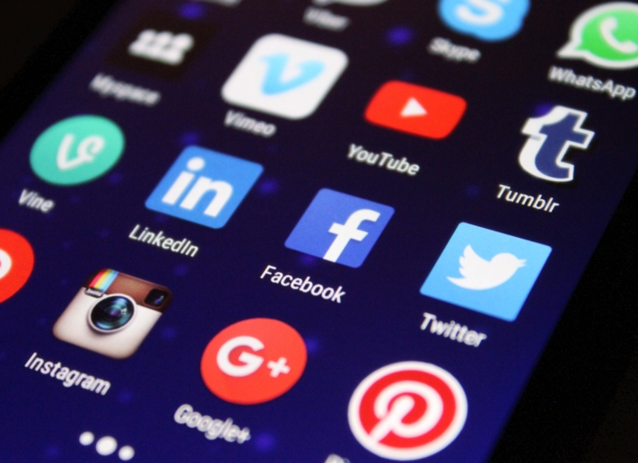

**Soziale Medien** haben einen bedeutenden Platz in unserem Alltag eingenommen. Auf Plattformen wie **Instagram, TikTok, Facebook oder LinkedIn** können Sie viele **potenzielle Zielgruppen erreichen**. Ob organischer Content oder bezahlte Anzeigen: Inmitten der Feeds und Storys verschwimmt die Grenze zwischen Unterhaltung, Information und Werbung. Durch Social-Media-Management können Sie unterschwellig für sich werben, mit Ihren Followern interagieren und eine stärkere emotionale Bindung zwischen Ihren Kunden und Ihrer Marke schaffen.

Doch wie genau funktioniert das Social-Media-Management? Mit dem Lesen des folgenden Artikels verschaffen Sie sich in wenigen Minuten einen grundlegenden Überblick. Profitieren Sie dabei von zahlreichen Beispielen und unserer kostenlosen Vorlage.

## Was Social-Media-Management bedeutet

Der Begriff Social-Media-Management **beschreibt ein gezieltes Kommunikations- und Werbemanagement** auf unterschiedlichen Social-Media-Plattformen wie Facebook, Instagram, YouTube & Co. Es umfasst eine breite Palette von Aufgaben, zum Beispiel das **direkte Kommunizieren mit Ihren Zielgruppen, das Veröffentlichen von Content sowie das Entwickeln Ihrer eigenen Social-Media-Strategie**.

Das Angebot an Social-Media-Plattformen ist groß.

## Was Sie vom Social-Media-Management haben

Effizientes Social-Media-Management bietet Ihnen zahlreiche Vorteile. Es **steigert Ihre Markenbekanntheit** durch gezielte Inhalte, **erweitert Ihre Reichweite** und ermöglicht eine **emotionale Bindung der Zielgruppe** an Ihre Marke. Bei gelungener Umsetzung werden Sie mit einer **positiven Reputation** und einem **starken Brand Image** belohnt. Insgesamt schafft Social-Media-Management dynamische Plattformen, um den positiven Einfluss auf die Marke zu maximieren.

## Social-Media-Strategien, die Sie kennen sollten

Um als Unternehmen auf Social Media langfristig erfolgreich zu sein, sollten Sie sich eine Social-Media-Strategie überlegen. Was möchten Sie mit Ihrem digitalen Auftritt erreichen? Welche Ziele verfolgen Sie? Mögliche Strategien im Social-Media-Management sind:

- **Markenbekanntheit**: Sie haben zum Ziel, Ihre Marke bekannter zu machen? Aber wie erreichen Sie, dass mehr Leute über Ihre Marke sprechen? Der Marke d**urch geschicktes Storytelling** eine Identität zu verleihen, kann die Lösung sein. Aufmerksamkeitsstarker Content bringt Ihnen außerdem mehr Reichweite als langweilige Posts.
- **Kundenbeziehung**: Sie benötigen Daten, was Ihre Kunden über Ihre Marke denken und was Sie sich wünschen? Ist es ein noch besserer Kundensupport? Sollen mehr Events stattfinden oder sind hilfreiche How-to-Videos gefragt? Treten Sie mit Ihrer Zielgruppe in direkten Kontakt und richten Sie Ihr Marketing und Ihren Social-Media-Content danach aus.
- **Leadgewinnung und Verkäufe**: Wie müssen Sie Ihre Beiträge formulieren, damit eine Person auf den Link in Ihrer Bio klickt? Wie viele Posts muss ein User sehen, bevor er zum Kauf eines Produkts bereit ist? Eine gute [Vorlage für den Social-Media-Plan](https://seatable.io/social-media-management/#Social-Media-Plan_von_SeaTable) hilft Ihnen bei der Verbesserung Ihrer Marketingstrategie.
- **Interaktionen und Empfehlungen**: Sie möchten, dass Ihre Kunden zu Botschaftern Ihrer Marke werden? In diesem Fall ist Engagement unter Ihren Social-Media-Posts gefragt. Ihre Beiträge sollten Ihre Follower dazu anregen, den Post zu liken, zu teilen oder andere User in den Kommentaren zu verlinken. Eine aktive Handlung macht den Unterschied zwischen einem verwaisten Kanal und hilfreichem, unterhaltsamem Content, der gerne weiterempfohlen wird.

## Die wichtigste Social-Media-Plattform für Sie

Im Jahr 2023 ergab eine [Online-Umfrage](https://de.statista.com/statistik/daten/studie/463928/umfrage/wichtigste-social-media-plattformen-fuer-marketingverantwortliche/), welche **Plattform** für Verantwortliche im Social-Media-Management am wichtigsten ist. In Führung liegt demnach Facebook, mit einigem Abstand folgen Instagram und LinkedIn.

Facebook liegt im Vergleich zu anderen Plattformen weit vorne.

Welche Plattformen allerdings für Sie wichtig sind, kommt darauf an, wer Ihre **Zielgruppe** ist. Möchten Sie mit Ihren Inhalten vermehrt die junge Generation erreichen? Dann sind **Instagram** und **TikTok** Ihre Plattformen der Wahl. Vermarkten Sie ein Produkt, das vor allem Kreative, DIY-Enthusiasten und Lifestyle-Interessierte anspricht? Dann sollten Sie über ein Profil auf **Pinterest** nachdenken. Wenn Ihr Unternehmen sich auf B2B-Marketing konzentriert und eine professionelle Zielgruppe anspricht, ist hingegen **LinkedIn** eine effektive Plattform.

In sämtlichen sozialen Medien können Nutzer Inhalte gestalten, teilen und bewerten. Dennoch variieren die Plattformen in ihren Merkmalen. Ob **Microblogging**, **Videos** oder **Bilder** – die Auswahl der geeigneten Plattform spielt eine entscheidende Rolle für Ihren **Content**. Berücksichtigen Sie beim Social-Media-Management auch die spezifischen Nutzungsgewohnheiten und Interaktionsmöglichkeiten, um das volle Potenzial jeder Plattform bestmöglich zu nutzen.

## Social-Media-Profile erstellen und optimieren

Auch beim Erstellen Ihrer Social-Media-Profile gibt es allerhand Dinge zu beachten, um mit einem optimalen Profil zu glänzen. Formulieren Sie zunächst ein **Leitbild**, das Sie mit Ihrem Kanal anstreben. Ist es Ihr Ziel unterhaltsame, inspirierende oder informative Inhalte zu produzieren? Möchten Sie respektvoll mit Ihren Followern in den Dialog gehen oder eher nahbar und persönlich? Welche Botschaft möchten Sie vermitteln?

Für jede Plattform gibt es optimale **Bildgrößen** für Profil- und Titelbilder (im Übrigen auch für Posts, Storys und Videos). Auf Instagram fahren Sie beispielsweise mit 180×180 Pixel für ein Profilbild am besten. Recherchieren Sie die für Sie notwendigen Formate und nutzen Sie diese. Beim Erstellen Ihrer Bio achten Sie unbedingt darauf, dass Sie **alle Felder ausfüllen** und entsprechende **Keywords** nutzen.

Versuchen Sie auch auf Ihren Profilen eine einheitliche **Corporate Identity** einzuhalten. Verwenden Sie zum Beispiel auf all Ihren Kanälen dieselben Farben und dasselbe Profilbild, um einen höheren **Wiedererkennungswert** für Ihre Follower zu schaffen. Vergessen Sie nicht, Ihre anderen Social-Media-Kanäle oder Ihre Website zu **verlinken**, um den Traffic auf allen Kanälen zu erhöhen.

Auf TikTok und Instagram haben Sie zudem die Möglichkeit, relevante Beiträge oben in Ihrem Profil **anzupinnen**. Bekommen Sie beispielsweise von Ihrer Community oft die gleiche Frage gestellt? Pinnen Sie einfach einen Beitrag an, der die Frage klärt, und verweisen Sie in Zukunft auf diesen.

Ästhetik spielt bei Social Media eine bedeutende Rolle.

## Kriterien für guten Content

Eine der wichtigsten Regeln im Social-Media-Management ist, dass **Qualität vor Quantität** kommt. Das gilt sowohl für Ihre Kanäle als auch für Ihren Content. Bespielen Sie lieber zwei Kanäle besonders gut, als viele Kanäle zu vernachlässigen und keiner Plattform wirklich gerecht zu werden. Posten Sie lieber seltener, aber dafür **hochwertigen und relevanten Content**. So begeistern Sie die Nutzer und gewinnen wertvolle Follower dazu.

Auch in Sachen Content ist eine Corporate Identity ein muss. **Design**, **Sprache** und **Verhalten** sollen sich wie ein roter Faden durch Ihr Profil ziehen. Durch ein **einheitliches, gut durchdachtes Konzept** prägen Sie Ihre Wirkung nach innen und außen. Manche gehen sogar so weit, dass sie ihren Feed weit **im Voraus planen**, um die Farben aller Beiträge aufeinander abstimmen zu können.

Die Grundlage für guten Content bildet allerdings der Content selbst. Überraschen Sie Ihre Follower mit kreativen und **abwechslungsreichen Beiträgen**. Heben Sie sich von der Masse ab und überlegen Sie sich eigene **Rubriken**. Wenn Ihnen die Ideen ausgehen, scheuen Sie sich nicht, direkt bei Ihrer **Community** nachzufragen, welche Art von Inhalten sie sich wünscht. So können Sie nicht nur die Vorlieben Ihrer Zielgruppe besser verstehen, sondern auch eine engere Bindung schaffen.



## Praktische Tipps für Ihr Social-Media-Management

Im Social-Media-Management stehen Sie vor vielfältigen Herausforderungen. Eine gezielte und strategische Herangehensweise kann helfen, diesen erfolgreich zu begegnen und die Potenziale der Plattformen erfolgreich zu nutzen. Häufige Probleme und mögliche Lösungen sind:

- **Geringe Aufmerksamkeit**: Steigern Sie die Aufmerksamkeit, indem Sie auffällige visuelle Elemente verwenden. Dabei können kreativer und ansprechender Content sowie die Nutzung von Trendthemen Ihre Reichweite erhöhen.
- **Regelmäßig posten**: Ein stets gefüllter Content-Kalender hilft Ihnen dabei, einen gleichmäßigen Veröffentlichungsrhythmus einzuhalten. Dabei können Sie Automatisierungstools verwenden, um auch an Feiertagen, Sonntagen und während der Betriebsferien posten zu können.
- **Individueller Content**: Langweilen Sie Ihre Follower nicht, indem Sie den gleichen Content auf allen Plattformen wiederkäuen. Passen Sie stattdessen Ihre Inhalte an die jeweiligen Zielgruppen der Plattformen an und erstellen Sie maßgeschneiderte Posts.
- **Fehlende Interaktion**: Sie posten bereits regelmäßig interessanten Content, aber die Likes und Kommentare bleiben aus? Nutzen Sie neben gezielten Fragen auch Umfragen und binden Sie Ihre Community aktiv in Entscheidungsprozesse ein. Ebenso ist eine zeitnahe Reaktion auf Kommentare und Feedback essenziell, um das Engagement zu fördern.
- **Handhabung von Krisen**: Generell empfiehlt sich im Falle von Krisen, wie zum Beispiel bei einem Shitstorm, bereits im Vorfeld einen Krisenplan mit klaren Kommunikationsrichtlinien zu entwickeln. Reagieren Sie transparent, einfühlsam und schnell auf Kritik, um Ihren Ruf zu schützen und das Vertrauen Ihrer Community zurückzugewinnen.

## Analyse Ihrer Social-Media-Kanäle

Wenn Sie eine erfolgreiche digitale Präsenz aufbauen möchten, spielt die **Analyse** Ihrer Social-Media-Kanäle eine zentrale Rolle. Dadurch erhalten Sie wertvolle Einblicke, mit denen Sie Ihre Social-Media-Strategie gezielt verbessern können.

Falls Sie sich bisher noch nicht intensiv mit diesem Thema im Social-Media-Management auseinandergesetzt haben, ist es ratsam, mit einem **Social-Media-Audit** zu starten. Diese umfassende Überprüfung Ihrer Social-Media-Präsenz beinhaltet die Analyse bisheriger Aktivitäten, Inhalte, Interaktionen sowie der **Performance** Ihrer Kanäle. Legen Sie dabei besonderen Wert auf **wichtige Kennzahlen (KPIs)**.

Zusätzlich haben Sie die Möglichkeit, eine **Benchmark-Analyse** Ihrer Konkurrenz durchzuführen. Durch den direkten Vergleich der branchenspezifischen Zahlen können Sie besser einschätzen, wie gut Ihre Performance im Vergleich zum Wettbewerb abschneidet. Neben der Identifikation Ihrer eigenen Stärken und Schwächen können Sie so auch **Best Practices** aus der Branche ableiten.

Vergessen Sie neben der Analyse der Zahlen nicht das **Feedback** Ihrer Follower. Likes, Kommentare und andere Formen der Interaktion dienen als direkte Rückmeldung Ihrer Zielgruppe. Diese Analyse ermöglicht Ihnen, die Bedürfnisse und Wünsche zu verstehen und Ihre Inhalte dementsprechend anzupassen.



## Nützliche Tools im Social-Media-Management

Social-Media-Tools automatisieren viele Aufgaben, die täglich im Social-Media-Management anfallen. Dadurch sparen Sie Zeit und können sich auf kreative und strategische Aspekte konzentrieren. Es gibt drei wichtige Arten von Social-Media-Tools:

- **Analytics Tools**: Diese Tools dienen dazu, Daten rund um die Performance von Social-Media-Aktivitäten zu sammeln, zu verarbeiten und zu analysieren. Dadurch erhalten Sie einen umfassenden Einblick in verschiedene Metriken, die den Erfolg Ihrer Social-Media-Strategie messen.
- **Listening Tools**: Mithilfe dieser Anwendungen können Sie die digitale Welt nach Erwähnungen, Kommentaren, Bewertungen und anderen Informationen zu einem bestimmten Thema durchsuchen. Verfolgen Sie, was Menschen online über Ihre Marke sagen.
- **Management Tools**: Das sind spezielle Programme, die Sie dabei unterstützen, Ihre nächsten Schritte effizient zu planen und durchzuführen. Darunter fallen beispielsweise die Verwaltung und Veröffentlichung Ihrer Beiträge.

## Social-Media-Plan von SeaTable

Wenn Sie viele Social-Media-Kanäle bespielen, kann es herausfordernd sein, den Überblick über alle Posts und Interaktionen zu behalten. Durch eine strukturierte Herangehensweise in Form eines Social-Media-Plans können Sie diese Komplexität besser bewältigen. Die [kostenlose Vorlage]() von SeaTable ermöglicht Ihnen die individuelle Erfassung Ihrer Beiträge und erleichtert Ihr Social-Media-Management.

Halten Sie Ihre **Ideen** fest, ordnen Sie Beiträge mit wenigen Klicks bestimmten **Rubriken** zu und haken Sie in der **To-do-Liste** erledigte Aufgaben ab. Speichern Sie Bilder, Texte, Aufgaben und KPIs an einem **zentralen Ort**, auf den alle im Team jederzeit zugreifen können. Die kollaborativen Funktionen von SeaTable machen die **Zusammenarbeit** zum Kinderspiel!

Dank des eingebauten **Kalenders** behalten Sie den Überblick darüber, wann Ihre Beiträge erscheinen sollen, und können leicht Ihren Veröffentlichungsrhythmus einhalten. Durch unterschiedliche Tabellen für jede Plattform wird es Ihnen leichter fallen, Ihren Content individuell auf alle sozialen Medien anzupassen.

[Registrieren Sie sich kostenlos]() auf SeaTable, passen Sie den Social-Media-Plan an Ihre Bedürfnisse an und genießen Sie den geringeren Arbeitsaufwand!
