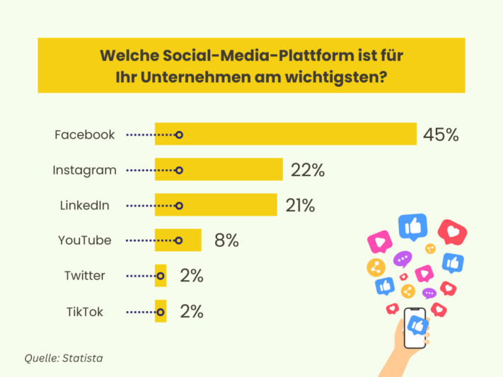

**Las redes sociales** se han convertido en una parte importante de nuestra vida cotidiana. En plataformas como **Instagram, TikTok, Facebook o LinkedIn** se puede **llegar a** muchos **grupos objetivo potenciales**. Ya sean contenidos orgánicos o anuncios de pago: En medio de los feeds y las historias, la línea entre entretenimiento, información y publicidad se difumina. La gestión de las redes sociales le permite promocionarse de forma subliminal, interactuar con sus seguidores y crear un vínculo emocional más fuerte entre sus clientes y su marca.

Pero, ¿cómo funciona exactamente la gestión de las redes sociales? Leyendo el siguiente artículo, obtendrá una visión general básica en sólo unos minutos. Benefíciese de numerosos ejemplos y de nuestra plantilla gratuita.

## Qué significa gestión de redes sociales

El término gestión de redes sociales **describe la comunicación dirigida y la gestión publicitaria** en diversas plataformas de redes sociales como Facebook, Instagram, YouTube y similares. Abarca una amplia gama de tareas, como la **comunicación directa con sus grupos objetivo, la publicación de contenidos y el desarrollo de su propia estrategia en las redes sociales**.

Existe una amplia gama de plataformas de medios sociales.

## Qué se obtiene con la gestión de las redes sociales

Una gestión eficaz de las redes sociales le ofrece numerosas ventajas. **Aumenta la notoriedad de su marca** a través de contenidos específicos, **amplía su alcance** y crea un **vínculo emocional entre el grupo objetivo** y su marca. Si se aplica con éxito, se verá recompensado con una **reputación positiva** y una **sólida imagen de marca**. En general, la gestión de redes sociales crea plataformas dinámicas para maximizar el impacto positivo en la marca.

## Estrategias de redes sociales que debe conocer

Para tener éxito como empresa en los medios sociales a largo plazo, debe plantearse una estrategia de medios sociales. ¿Qué quiere conseguir con su presencia digital? ¿Qué objetivos persigue? Las posibles estrategias en la gestión de los medios sociales son

- **Notoriedad de marca**: ¿Quiere dar a conocer mejor su marca? Pero, ¿cómo conseguir que más gente hable de su marca? Darle una identidad a tu marca**a través de una hábil narración** puede ser la solución. Además, los contenidos que llaman la atención tienen más alcance que las publicaciones aburridas.
- **Relación con el cliente**: ¿Necesita datos sobre lo que piensan sus clientes de su marca y lo que quiere? ¿Necesita una mejor atención al cliente? ¿Necesita organizar más eventos o vídeos prácticos? Póngase en contacto directo con su público objetivo y adapte sus contenidos de marketing y redes sociales en consecuencia.
- **Generación de leads y ventas**: ¿Cómo tienes que formular tus posts para que una persona haga clic en el enlace de tu biografía? ¿Cuántas publicaciones necesita ver un usuario antes de estar dispuesto a comprar un producto? Una buena [plantilla de plan de redes sociales](https://seatable.io/es/social-media-management/#Social-Media-Plan_von_SeaTable) te ayudará a mejorar tu estrategia de marketing.
- **Interacciones y recomendaciones**: ¿Quiere que sus clientes se conviertan en embajadores de su marca? En este caso, sus publicaciones en las redes sociales deben ser interactivas. Tus publicaciones deben animar a tus seguidores a que les guste la publicación, la compartan o enlacen a otros usuarios en los comentarios. Una acción activa marca la diferencia entre un canal huérfano y un contenido útil y entretenido que la gente esté encantada de recomendar.

## La plataforma de medios sociales más importante para usted

En 2023, una [encuesta en](https://de.statista.com/statistik/daten/studie/463928/umfrage/wichtigste-social-media-plattformen-fuer-marketingverantwortliche/) línea reveló qué **plataforma** es la más importante para los responsables de la gestión de las redes sociales. Según la encuesta, Facebook está a la cabeza, seguida a cierta distancia por Instagram y LinkedIn.

Facebook está muy por delante de otras plataformas.

Sin embargo, qué plataformas son importantes para usted depende de quién sea su **grupo objetivo**. ¿Quieres llegar con tus contenidos a la generación más joven? Entonces **Instagram** y **TikTok** son sus plataformas preferidas. ¿Estás comercializando un producto que atrae principalmente a creativos, aficionados al bricolaje y personas interesadas en el estilo de vida? Entonces debería considerar la posibilidad de crear un perfil en **Pinterest**. Si su empresa se centra en el marketing B2B y se dirige a un grupo objetivo profesional, **LinkedIn** es una plataforma eficaz.

Los usuarios pueden crear, compartir y valorar contenidos en todas las redes sociales. Sin embargo, las plataformas varían en sus características. Ya se trate de **microblogging**, **vídeos** o **imágenes**, la elección de la plataforma adecuada desempeña un papel decisivo para sus **contenidos**. A la hora de gestionar las redes sociales, también hay que tener en cuenta los hábitos de uso específicos y las opciones de interacción para maximizar todo el potencial de cada plataforma.

## Crear y optimizar perfiles en las redes sociales

A la hora de crear tus perfiles en las redes sociales, también hay que tener en cuenta todo tipo de cosas para brillar con un perfil optimizado. En primer lugar, formula una **declaración de objetivos** para tu canal. ¿Tu objetivo es producir contenidos entretenidos, inspiradores o informativos? ¿Quiere entablar un diálogo respetuoso con sus seguidores o prefiere ser cercano y personal? ¿Qué mensaje quiere transmitir?

Existen **tamaños de imagen** óptimos para las imágenes de perfil y de portada de cada plataforma (y también para las publicaciones, las historias y los vídeos). En Instagram, por ejemplo, lo mejor es una imagen de perfil de 180×180 píxeles. Investiga los formatos que necesitas y utilízalos. Cuando crees tu biografía, asegúrate de rellenar **todos los campos** y de utilizar las **palabras clave** adecuadas.

Intenta mantener una **identidad corporativa** coherente también en tus perfiles. Por ejemplo, utiliza los mismos colores y la misma foto de perfil en todos tus canales para crear un mayor **valor de reconocimiento** para tus seguidores. No olvides **enlazar** tus otros canales de redes sociales o tu sitio web para aumentar el tráfico en todos los canales.

En TikTok e Instagram, también tienes la opción de **fijar** publicaciones relevantes en la parte superior de tu perfil. Por ejemplo, ¿recibes a menudo la misma pregunta de tu comunidad? Fija una publicación que responda a la pregunta y consúltala en el futuro.

La estética desempeña un papel importante en las redes sociales.

## Criterios para un buen contenido

Una de las reglas más importantes en la gestión de las redes sociales es que **la calidad** está **por encima de la cantidad**. Esto se aplica tanto a los canales como al contenido. Es mejor utilizar dos canales especialmente bien que descuidar muchos y no hacer justicia a ninguna de las plataformas. Es mejor publicar con menos frecuencia, pero **con contenido relevante y de alta calidad**. Esto inspirará a los usuarios y ganará valiosos seguidores.

Una identidad corporativa también es imprescindible cuando se trata de contenidos. El **diseño**, el **lenguaje** y el **comportamiento** deben correr como un hilo rojo a través de su perfil. Con un **concepto uniforme y bien** pensado, puedes caracterizar tu impacto interno y externo. Algunos llegan incluso a planificar su feed con mucha **antelación** para coordinar los colores de todas las publicaciones.

Sin embargo, la base de un buen contenido es el propio contenido. Sorprende a tus seguidores con **posts** creativos y **variados**. Destaca entre la multitud y crea tus propias **categorías**. Si se te acaban las ideas, no tengas miedo de preguntar directamente a tu **comunidad** qué tipo de contenido les gustaría. Esto no sólo te ayudará a conocer mejor las preferencias de tu público objetivo, sino también a crear un vínculo más estrecho.



## Consejos prácticos para la gestión de las redes sociales

La gestión de las redes sociales plantea numerosos retos. Un enfoque específico y estratégico puede ayudarle a superarlos con éxito y aprovechar el potencial de las plataformas. Algunos de los problemas más comunes y sus posibles soluciones son

- **Poca atención**: Aumente la atención utilizando elementos visuales llamativos. Los contenidos creativos y atractivos y el uso de trending topics pueden aumentar tu alcance.
- **Publica con regularidad**: un calendario de contenidos siempre lleno te ayuda a mantener un ritmo de publicación coherente. Puedes utilizar herramientas de automatización para publicar en festivos, domingos y durante las vacaciones de empresa.
- **Contenido personalizado**: No aburras a tus seguidores repitiendo el mismo contenido en todas las plataformas. En lugar de eso, adapta tu contenido a los respectivos grupos objetivo de las plataformas y crea publicaciones personalizadas.
- **Falta de interacción**: ¿publica regularmente contenidos interesantes, pero los "me gusta" y los comentarios no se materializan? Además de preguntas específicas, utilice encuestas e implique activamente a su comunidad en los procesos de toma de decisiones. Una respuesta rápida a los comentarios y opiniones también es esencial para fomentar el compromiso.
- **Manejar** las crisis: En general, en caso de crisis, como una tormenta de mierda, es aconsejable elaborar de antemano un plan de crisis con directrices claras de comunicación. Responde con transparencia, sensibilidad y rapidez a las críticas para proteger tu reputación y recuperar la confianza de tu comunidad.

## Analice sus canales en las redes sociales

Si quiere tener una presencia digital de éxito, el **análisis de** sus canales en las redes sociales desempeña un papel fundamental. Así obtendrá información valiosa que podrá utilizar para mejorar su estrategia en las redes sociales de forma selectiva.

Si aún no ha tratado intensamente este tema en la gestión de redes sociales, es aconsejable empezar con una **auditoría** de redes sociales. Esta revisión exhaustiva de su presencia en los medios sociales incluye el análisis de las actividades anteriores, los contenidos, las interacciones y el **rendimiento** de sus canales. Haz especial hincapié en los **indicadores clave de rendimiento (KPI**).

También tiene la opción de realizar un **análisis comparativo** de sus competidores. Al comparar directamente cifras específicas del sector, puede evaluar mejor su rendimiento en comparación con la competencia. Además de identificar sus propios puntos fuertes y débiles, también puede extraer **las mejores prácticas** del sector.

Además de analizar las cifras, no olvides el **feedback** de tus seguidores. Los "me gusta", los comentarios y otras formas de interacción sirven como feedback directo de tu público objetivo. Este análisis te permite comprender sus necesidades y deseos y adaptar tus contenidos en consecuencia.



## Herramientas útiles en la gestión de redes sociales

Las herramientas para redes sociales automatizan muchas de las tareas diarias que conlleva la gestión de las redes sociales. Esto le ahorra tiempo y le permite concentrarse en aspectos creativos y estratégicos. Hay tres tipos principales de herramientas para redes sociales:

- Herramientas de **análisis**: Estas herramientas se utilizan para recopilar, procesar y analizar datos relativos al rendimiento de las actividades en los medios sociales. De este modo, se obtiene una visión completa de las distintas métricas que miden el éxito de la estrategia en las redes sociales.
- **Herramientas de escucha**: Estas aplicaciones permiten buscar en el mundo digital menciones, comentarios, reseñas y otra información sobre un tema concreto. Rastrea lo que la gente dice de tu marca en Internet.
- **Herramientas de gestión**: Se trata de programas especiales que te ayudan a planificar y ejecutar tus próximos pasos de forma eficaz. Esto incluye, por ejemplo, la gestión y publicación de tus contribuciones.

## Plan de medios sociales de SeaTable

Si tienes muchos canales en las redes sociales, puede ser difícil hacer un seguimiento de todas las publicaciones e interacciones. Un enfoque estructurado en forma de plan de redes sociales puede ayudarte a gestionar esta complejidad. La [plantilla gratuita](https://seatable.io/es/vorlage/lmmjwghgtye322iwdxvj7a/) de SeaTable permite personalizar las publicaciones y facilita la gestión de las redes sociales.

Registre sus **ideas**, asigne entradas a **categorías** específicas con sólo unos clics y marque las tareas completadas en la **lista de tareas pendientes**. Guarda imágenes, textos, tareas y KPI en una **ubicación central** a la que todos los miembros del equipo puedan acceder en cualquier momento. Las funciones de colaboración de SeaTable facilitan el **trabajo** en equipo.

Gracias al **calendario** incorporado, puedes controlar cuándo deben aparecer tus publicaciones y respetar fácilmente tu calendario de publicación. Las diferentes tablas para cada plataforma te facilitarán la personalización de tus contenidos para todas las redes sociales.

[Regístrese gratis]() en SeaTable, personalice el plan de redes sociales según sus necesidades y disfrute de la reducción de la carga de trabajo.
