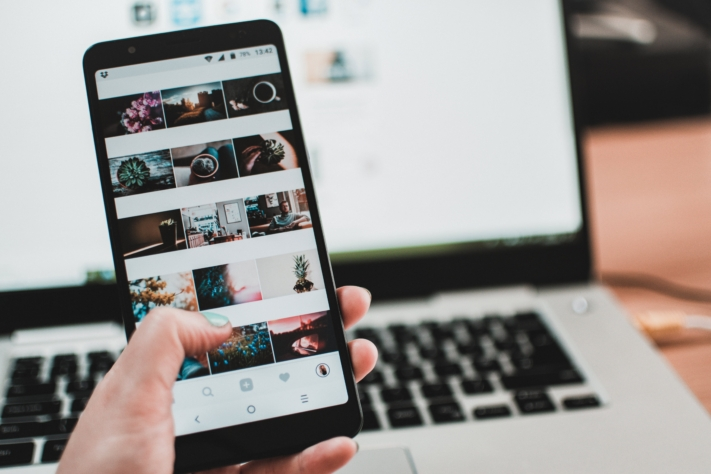

**Les médias sociaux** ont pris une place importante dans notre quotidien. Sur des plateformes comme **Instagram, TikTok, Facebook ou LinkedIn**, vous pouvez **atteindre** de nombreux **groupes cibles potentiels**. Qu'il s'agisse de contenu organique ou d'annonces payantes : Au milieu des flux et des histoires, la frontière entre divertissement, information et publicité s'estompe. Grâce à la gestion des médias sociaux, vous pouvez faire votre promotion de manière subliminale, interagir avec vos followers et créer un lien émotionnel plus fort entre vos clients et votre marque.

Mais comment fonctionne exactement la gestion des médias sociaux ? En lisant l'article suivant, vous obtiendrez en quelques minutes un aperçu de base. Profitez de nombreux exemples et de notre modèle gratuit.

## Ce que signifie la gestion des médias sociaux

Le terme de gestion des médias sociaux **décrit une gestion ciblée de la communication et de la publicité** sur différentes plateformes de médias sociaux comme Facebook, Instagram, YouTube & Co. Elle englobe un large éventail de tâches, par exemple la **communication directe avec vos groupes cibles, la publication de contenus et le développement de votre propre stratégie de médias sociaux**.

L'offre de plates-formes de médias sociaux est vaste.

## Ce que la gestion des médias sociaux vous apporte

Une gestion efficace des médias sociaux vous offre de nombreux avantages. Elle **augmente la notoriété de votre marque** grâce à des contenus ciblés, **élargit votre portée** et permet un **lien émotionnel** entre **le groupe cible** et votre marque. Si la mise en œuvre est réussie, vous serez récompensé par une **réputation positive** et une **image de marque forte**. Dans l'ensemble, la gestion des médias sociaux crée des plateformes dynamiques afin de maximiser l'impact positif sur la marque.

## Stratégies de médias sociaux à connaître

Pour réussir à long terme en tant qu'entreprise sur les médias sociaux, vous devez réfléchir à une stratégie de médias sociaux. Que souhaitez-vous atteindre avec votre présence numérique ? Quels sont vos objectifs ? Voici quelques stratégies possibles dans la gestion des médias sociaux :

- **Notoriété de la marque**: vous avez pour objectif de faire connaître votre marque ? Mais comment faire en sorte que davantage de personnes parlent de votre marque ? Donner une identité à la marque**grâce à un storytelling habile** peut être la solution. Un contenu qui attire l'attention vous apporte en outre plus de portée que des posts ennuyeux.
- **Relation client**: vous avez besoin de données sur ce que vos clients pensent de votre marque et sur ce qu'ils souhaitent ? Est-ce que c'est un support client encore meilleur ? Faut-il organiser plus d'événements ou des vidéos "how-to" utiles sont-elles demandées ? Entrez en contact direct avec votre groupe cible et adaptez votre marketing et votre contenu de médias sociaux en conséquence.
- **Acquisition de leads et ventes**: comment faut-il formuler vos posts pour qu'une personne clique sur le lien dans votre bio ? Combien de posts un utilisateur doit-il voir avant d'être prêt à acheter un produit ? Un bon [modèle de plan pour les médias sociaux]()#Social-Media-Plan_von_SeaTable) vous aidera à améliorer votre stratégie marketing.
- **Interactions et recommandations**: Vous souhaitez que vos clients deviennent des ambassadeurs de votre marque ? Dans ce cas, l'engagement est de mise sous vos posts de médias sociaux. Vos publications doivent inciter vos followers à aimer le post, à le partager ou à mettre un lien vers d'autres utilisateurs dans les commentaires. Une action active fait la différence entre un canal orphelin et un contenu utile et divertissant qui sera volontiers recommandé à d'autres.

## La plate-forme de médias sociaux la plus importante pour vous

En 2023, un [sondage en ligne](https://de.statista.com/statistik/daten/studie/463928/umfrage/wichtigste-social-media-plattformen-fuer-marketingverantwortliche/) a révélé quelle était la **plate-forme** la plus importante pour les responsables de la gestion des médias sociaux. Facebook arrive en tête, suivi de loin par Instagram et LinkedIn.

Facebook est largement en tête par rapport aux autres plateformes.

Les plates-formes importantes pour vous dépendent toutefois de votre **groupe cible**. Souhaitez-vous atteindre davantage la jeune génération avec vos contenus ? **Instagram** et **TikTok** sont alors vos plates-formes de choix. Vous commercialisez un produit qui s'adresse avant tout aux créatifs, aux passionnés de bricolage et aux personnes intéressées par le style de vie ? Dans ce cas, vous devriez envisager de créer un profil sur **Pinterest**. En revanche, si votre entreprise se concentre sur le marketing B2B et s'adresse à un groupe cible professionnel, **LinkedIn** est une plateforme efficace.

Tous les médias sociaux permettent aux utilisateurs de créer, de partager et d'évaluer des contenus. Cependant, les caractéristiques des plateformes varient. Qu'il s'agisse de **microblogging**, de **vidéos** ou **d'images**, le choix de la plate-forme appropriée joue un rôle décisif pour votre **contenu**. Lors de la gestion des médias sociaux, tenez également compte des habitudes d'utilisation et des possibilités d'interaction spécifiques afin d'exploiter au mieux le potentiel de chaque plateforme.

## Créer et optimiser des profils de médias sociaux

Il y a également toutes sortes de choses à prendre en compte lors de la création de votre profil sur les médias sociaux afin de briller avec un profil optimal. Formulez tout d'abord un **modèle** que vous visez avec votre canal. Votre objectif est-il de produire des contenus divertissants, inspirants ou informatifs ? Souhaitez-vous dialoguer avec vos followers de manière respectueuse ou plutôt proche et personnelle ? Quel message souhaitez-vous transmettre ?

Pour chaque plateforme, il existe des **tailles d'image** optimales pour les photos de profil et de couverture (ainsi que pour les posts, les histoires et les vidéos). Sur Instagram, par exemple, une photo de profil de 180×180 pixels est la meilleure solution. Faites des recherches sur les formats dont vous avez besoin et utilisez-les. Lors de la création de votre bio, veillez absolument à **remplir tous les champs** et à utiliser **les mots-clés** correspondants.

Essayez également de respecter une identité **d'entreprise** uniforme sur vos profils. Utilisez par exemple les mêmes couleurs et la même photo de profil sur tous vos canaux afin de créer une plus grande **valeur de reconnaissance** pour vos followers. N'oubliez pas de **créer des liens vers** vos autres canaux de médias sociaux ou votre site web afin d'augmenter le trafic sur tous les canaux.

Sur TikTok et Instagram, vous avez également la possibilité d'**épingler** des messages pertinents en haut de votre profil. Votre communauté vous pose-t-elle souvent la même question ? Il vous suffit d'épingler une publication qui répond à cette question et d'y faire référence à l'avenir.

L'esthétique joue un rôle important dans les médias sociaux.

## Critères pour un bon contenu

L'une des règles les plus importantes dans la gestion des médias sociaux est que **la qualité prime sur la quantité**. Cela vaut aussi bien pour vos canaux que pour votre contenu. Il est préférable d'exploiter deux canaux de manière optimale plutôt que de négliger de nombreux canaux et de ne satisfaire aucune plate-forme. Publiez plutôt des **contenus** moins fréquents, mais **de qualité et pertinents**. Vous enthousiasmerez ainsi les utilisateurs et gagnerez de précieux followers.

En matière de contenu, une identité d'entreprise est également indispensable. Le **design**, **la langue** et le **comportement** doivent être le fil conducteur de votre profil. Grâce à un **concept homogène et bien pensé**, vous façonnez votre impact en interne et en externe. Certains vont même jusqu'à **planifier** leur flux longtemps **à l'avance** afin de pouvoir harmoniser les couleurs de toutes les contributions.

La base d'un bon contenu est toutefois le contenu lui-même. Surprenez vos followers avec des **contributions** créatives et **variées**. Démarquez-vous de la masse et pensez à vos propres **rubriques**. Si vous êtes à court d'idées, n'hésitez pas à demander directement à votre **communauté** le type de contenu qu'elle souhaite. Cela vous permettra non seulement de mieux comprendre les préférences de votre groupe cible, mais aussi de créer un lien plus étroit.



## Conseils pratiques pour votre gestion des médias sociaux

Dans la gestion des médias sociaux, vous êtes confronté à de nombreux défis. Une approche ciblée et stratégique peut vous aider à les relever avec succès et à exploiter les potentiels des plateformes avec succès. Les problèmes fréquents et les solutions possibles sont

- **Faible attention**: augmentez l'attention en utilisant des éléments visuels accrocheurs. Dans ce contexte, un contenu créatif et attrayant ainsi que l'utilisation de thèmes tendance peuvent augmenter votre portée.
- **Publier régulièrement**: un calendrier de contenu toujours rempli vous aide à maintenir un rythme de publication régulier. Vous pouvez utiliser des outils d'automatisation pour publier également les jours fériés, les dimanches et pendant les vacances.
- **Contenu personnalisé**: n'ennuyez pas vos followers en ruminant le même contenu sur toutes les plates-formes. Adaptez plutôt votre contenu aux groupes cibles respectifs des plateformes et créez des posts sur mesure.
- **Manque d'interaction**: vous publiez déjà régulièrement un contenu intéressant, mais les likes et les commentaires ne suivent pas ? Outre des questions ciblées, utilisez des sondages et impliquez activement votre communauté dans les processus de décision. De même, il est essentiel de réagir rapidement aux commentaires et aux réactions pour encourager l'engagement.
- **Gérer les crises**: En règle générale, en cas de crise, comme par exemple un shitstorm, il est recommandé de développer en amont un plan de crise avec des directives de communication claires. Réagissez de manière transparente, empathique et rapide aux critiques afin de protéger votre réputation et de regagner la confiance de votre communauté.

## Analyse de vos canaux de médias sociaux

Si vous souhaitez développer une présence numérique efficace, l'**analyse** de vos canaux de médias sociaux joue un rôle central. Vous obtiendrez ainsi des informations précieuses qui vous permettront d'améliorer votre stratégie de médias sociaux de manière ciblée.

Si vous n'avez pas encore abordé ce sujet de manière intensive dans la gestion des médias sociaux, il est conseillé de commencer par un **audit des médias sociaux**. Cet examen complet de votre présence sur les médias sociaux comprend l'analyse des activités, des contenus, des interactions et de la **performance** de vos canaux. Accordez une importance particulière aux **indicateurs clés de performance (KPI)**.

Vous avez en outre la possibilité d'effectuer une **analyse comparative** de vos concurrents. En comparant directement les chiffres spécifiques à votre secteur, vous pouvez mieux évaluer la performance de votre entreprise par rapport à celle de vos concurrents. Outre l'identification de vos propres forces et faiblesses, vous pouvez ainsi également en déduire les **meilleures pratiques** de votre secteur.

Outre l'analyse des chiffres, n'oubliez pas le **feed-back** de vos followers. Les likes, commentaires et autres formes d'interaction servent de feed-back direct à votre groupe cible. Cette analyse vous permet de comprendre leurs besoins et leurs souhaits et d'adapter vos contenus en conséquence.



## Outils utiles dans la gestion des médias sociaux

Les outils de médias sociaux automatisent de nombreuses tâches qui sont effectuées quotidiennement dans la gestion des médias sociaux. Vous gagnez ainsi du temps et pouvez vous concentrer sur les aspects créatifs et stratégiques. Il existe trois grands types d'outils de médias sociaux :

- **Outils d'analyse**: Ces outils permettent de collecter, de traiter et d'analyser les données relatives à la performance des activités sur les médias sociaux. Vous obtenez ainsi un aperçu complet de différentes métriques qui mesurent le succès de votre stratégie de médias sociaux.
- **Outils d'écoute**: Ces applications vous permettent de rechercher dans le monde numérique des mentions, des commentaires, des évaluations et d'autres informations sur un sujet donné. Suivez ce que les gens disent de votre marque en ligne.
- **Les outils de gestion**: Ce sont des programmes spéciaux qui vous aident à planifier et à réaliser efficacement vos prochaines étapes. Ils comprennent par exemple la gestion et la publication de vos contributions.

## Plan de médias sociaux de SeaTable

Si vous utilisez de nombreux canaux de médias sociaux, il peut être difficile de garder une trace de toutes les publications et interactions. Une approche structurée sous la forme d'un plan pour les médias sociaux vous permet de mieux gérer cette complexité. Le [modèle gratuit]() de SeaTable vous permet de saisir individuellement vos contributions et facilite votre gestion des médias sociaux.

Consignez vos **idées**, classez les contributions dans des **rubriques** spécifiques en quelques clics et cochez les tâches accomplies dans la **liste des choses à faire**. Enregistrez les images, les textes, les tâches et les indicateurs clés de performance à un **endroit central** auquel tous les membres de l'équipe peuvent accéder à tout moment. Les fonctions collaboratives de SeaTable font de la **collaboration** un jeu d'enfant !

Grâce au **calendrier** intégré, vous gardez une vue d'ensemble sur la date de publication de vos contributions et pouvez facilement respecter votre rythme de publication. Grâce à des tableaux différents pour chaque plateforme, il vous sera plus facile de personnaliser votre contenu pour tous les médias sociaux.

[Inscrivez-vous gratuitement]() sur SeaTable, adaptez le plan des médias sociaux à vos besoins et profitez d'une charge de travail réduite !
