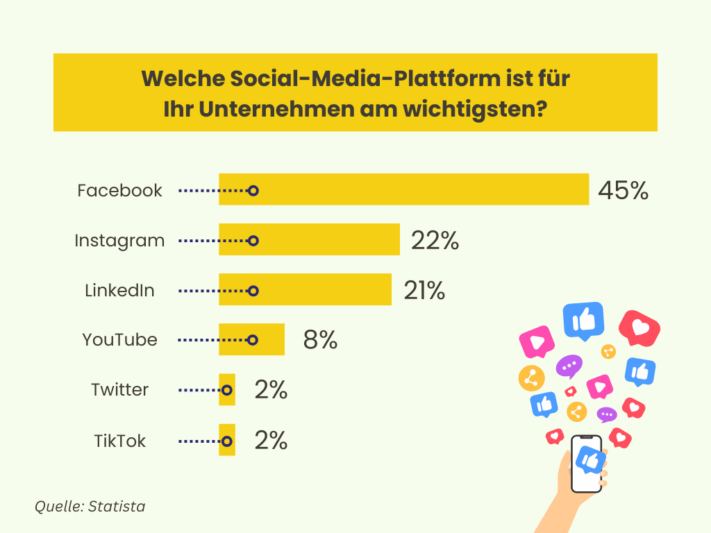
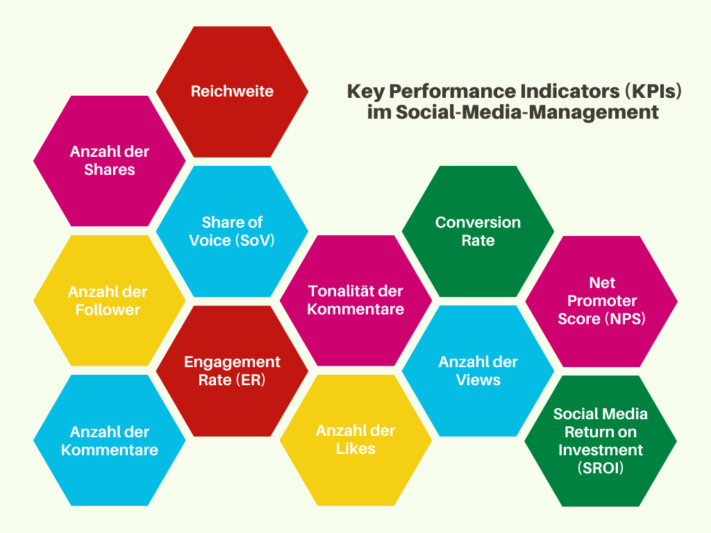

**As redes sociais** tornaram-se uma parte importante da nossa vida quotidiana. É possível **chegar a** muitos **grupos-alvo potenciais** em plataformas como o **Instagram, o TikTok, o Facebook ou o LinkedIn**. Quer se trate de conteúdos orgânicos ou de anúncios pagos: No meio dos feeds e das histórias, a linha entre entretenimento, informação e publicidade torna-se ténue. A gestão das redes sociais permite-lhe promover-se de forma subliminar, interagir com os seus seguidores e criar uma ligação emocional mais forte entre os seus clientes e a sua marca.

Mas como funciona exatamente a gestão das redes sociais? Ao ler o seguinte artigo, obterá uma visão geral básica em apenas alguns minutos. Beneficie de inúmeros exemplos e do nosso modelo gratuito.

## O que significa a gestão das redes sociais

O termo gestão de redes sociais **descreve a comunicação direcionada e a gestão da publicidade** em várias plataformas de redes sociais, como o Facebook, Instagram, YouTube & Co. Abrange uma vasta gama de tarefas, como a **comunicação direta com os seus grupos-alvo, a publicação de conteúdos e o desenvolvimento da sua própria estratégia de redes sociais**.

Existe uma grande variedade de plataformas de redes sociais.

## O que obtém da gestão das redes sociais

Uma gestão eficiente das redes sociais oferece-lhe inúmeras vantagens. **Aumenta a notoriedade da sua marca** através de conteúdos direcionados, **expande o seu alcance** e cria uma **ligação emocional** entre **o grupo-alvo** e a sua marca. Se for implementada com êxito, será recompensado com uma **reputação positiva** e uma **imagem de marca forte**. Em geral, a gestão das redes sociais cria plataformas dinâmicas para maximizar o impacto positivo na marca.

## Estratégias de redes sociais que deve conhecer

Para que uma empresa seja bem sucedida nas redes sociais a longo prazo, deve considerar uma estratégia para as redes sociais. O que pretende alcançar com a sua presença digital? Quais são os seus objectivos? As estratégias possíveis na gestão das redes sociais são

- **Conhecimento da marca**: Quer tornar a sua marca mais conhecida? Mas como é que consegue que mais pessoas falem da sua marca? Dar uma identidade à sua marca**através de uma narrativa hábil** pode ser a solução. Um conteúdo que chame a atenção também lhe dá mais alcance do que publicações aborrecidas.
- **Relação com o cliente**: Precisa de dados sobre o que os seus clientes pensam da sua marca e o que pretendem? Será que precisa de um melhor apoio ao cliente? Precisa de organizar mais eventos ou vídeos de instruções úteis? Entre em contacto direto com o seu grupo-alvo e alinhe o seu marketing e o conteúdo das redes sociais em conformidade.
- **Geração de leads e vendas**: Como é que deve formular as suas mensagens para que uma pessoa clique na hiperligação da sua biografia? Quantas mensagens é que um utilizador precisa de ver antes de estar pronto para comprar um produto? Um bom [modelo de plano para as redes sociais](https://seatable.io/pt/social-media-management/#Social-Media-Plan_von_SeaTable) ajudá-lo-á a melhorar a sua estratégia de marketing.
- **Interacções e recomendações**: Quer que os seus clientes se tornem embaixadores da sua marca? Neste caso, é necessário um envolvimento nas suas publicações nas redes sociais. As suas publicações devem encorajar os seus seguidores a gostar da publicação, a partilhá-la ou a ligar a outros utilizadores nos comentários. Uma ação ativa faz a diferença entre um canal órfão e um conteúdo útil e divertido que as pessoas gostam de recomendar.

## A plataforma de redes sociais mais importante para si

Em 2023, um [inquérito online](https://de.statista.com/statistik/daten/studie/463928/umfrage/wichtigste-social-media-plattformen-fuer-marketingverantwortliche/) revelou qual a **plataforma** mais importante para os responsáveis pela gestão das redes sociais. De acordo com o inquérito, o Facebook está na liderança, seguido a alguma distância pelo Instagram e pelo LinkedIn.

O Facebook está muito à frente em comparação com outras plataformas.

No entanto, as plataformas que são importantes para si dependem do seu **grupo-alvo**. Quer chegar mais à geração mais jovem com o seu conteúdo? Então, **o Instagram** e o **TikTok** são as suas plataformas de eleição. Está a comercializar um produto que apela principalmente a criativos, entusiastas da bricolage e pessoas interessadas no estilo de vida? Então, deve considerar um perfil no **Pinterest**. Se a sua empresa se centra no marketing B2B e apela a um grupo-alvo profissional, **o LinkedIn** é uma plataforma eficaz.

Os utilizadores podem criar, partilhar e classificar conteúdos em todas as redes sociais. No entanto, as plataformas variam nas suas características. Quer se trate de **microblogging**, **vídeos** ou **imagens** - a escolha da plataforma correcta desempenha um papel decisivo para o seu **conteúdo**. Ao gerir as redes sociais, tenha também em conta os hábitos de utilização específicos e as opções de interação, de modo a maximizar todo o potencial de cada plataforma.

## Criar e otimizar perfis nas redes sociais

Ao criar os seus perfis nas redes sociais, há também todo o tipo de coisas a considerar para brilhar com um perfil optimizado. Em primeiro lugar, formule uma **declaração de missão** que pretende atingir com o seu canal. O seu objetivo é produzir conteúdos divertidos, inspiradores ou informativos? Quer estabelecer um diálogo respeitoso com os seus seguidores ou prefere ser acessível e pessoal? Que mensagem pretende transmitir?

Existem **tamanhos de imagem** ideais para imagens de perfil e de capa para cada plataforma (e também para publicações, histórias e vídeos). No Instagram, por exemplo, é melhor usar 180×180 pixéis para uma imagem de perfil. Pesquise os formatos de que necessita e utilize-os. Ao criar a sua biografia, certifique-se de que preenche **todos os campos** e utiliza as **palavras-chave** adequadas.

Tente também manter uma **identidade empresarial** coerente nos seus perfis. Por exemplo, utilize as mesmas cores e a mesma imagem de perfil em todos os seus canais para criar um maior **valor de reconhecimento** para os seus seguidores. Não se esqueça de **ligar** os seus outros canais de redes sociais ou o seu sítio Web para aumentar o tráfego em todos os canais.

No TikTok e no Instagram, também tem a opção de **fixar** publicações relevantes na parte superior do seu perfil. Por exemplo, recebe frequentemente a mesma pergunta da sua comunidade? Basta afixar uma publicação que responda à pergunta e referir-se a ela no futuro.

A estética desempenha um papel importante nas redes sociais.

## Critérios para um bom conteúdo

Uma das regras mais importantes na gestão das redes sociais é que **a qualidade** vem **antes da quantidade**. Isto aplica-se tanto aos seus canais como ao seu conteúdo. É melhor utilizar dois canais particularmente bem do que negligenciar muitos canais e não fazer justiça a nenhuma plataforma. Em vez disso, publique com menos frequência, mas publique **conteúdo relevante e de alta qualidade**. Isto irá inspirar os utilizadores e ganhar seguidores valiosos.

Uma identidade corporativa é também uma obrigação no que diz respeito ao conteúdo. **O design**, **a linguagem** e o **comportamento** devem ser como um fio vermelho no seu perfil. Com um **conceito uniforme e bem pensado**, pode caraterizar o seu impacto tanto a nível interno como externo. Alguns chegam mesmo a planear o seu feed com bastante **antecedência**, de modo a coordenar as cores de todas as publicações.

No entanto, a base de um bom conteúdo é o próprio conteúdo. Surpreenda os seus seguidores com **publicações** criativas e **variadas**. Destaque-se da multidão e crie as suas próprias **categorias**. Se ficar sem ideias, não tenha medo de perguntar diretamente à sua **comunidade** que tipo de conteúdo gostariam de ter. Isto não só o ajudará a compreender melhor as preferências do seu grupo-alvo, como também criará uma ligação mais estreita.



## Conselhos práticos para a gestão das redes sociais

A gestão das redes sociais coloca vários desafios. Uma abordagem estratégica e direccionada pode ajudá-lo a ultrapassá-los com êxito e a utilizar o potencial das plataformas. Os problemas mais comuns e as possíveis soluções incluem

- **Pouca atenção**: Aumente a atenção utilizando elementos visuais apelativos. Conteúdos criativos e apelativos e a utilização de tópicos em voga podem aumentar o seu alcance.
- **Publicar regularmente**: um calendário de conteúdos sempre preenchido ajuda-o a manter um ritmo de publicação consistente. Pode utilizar ferramentas de automatização para publicar em feriados, domingos e durante as férias da empresa.
- **Conteúdo personalizado**: não aborreça os seus seguidores repetindo o mesmo conteúdo em todas as plataformas. Em vez disso, adapte o seu conteúdo aos respectivos grupos-alvo das plataformas e crie publicações personalizadas.
- **Falta de interação**: Já publica regularmente conteúdos interessantes, mas os gostos e os comentários não se concretizam? Para além de perguntas específicas, utilize inquéritos e envolva ativamente a sua comunidade nos processos de tomada de decisão. Uma resposta rápida aos comentários e feedback também é essencial para incentivar a participação.
- **Gestão de crises**: Em geral, em caso de crise, como uma tempestade de merda, é aconselhável desenvolver antecipadamente um plano de crise com directrizes de comunicação claras. Responda de forma transparente, sensível e rápida às críticas, a fim de proteger a sua reputação e recuperar a confiança da sua comunidade.

## Analisar os seus canais de redes sociais

Se pretende construir uma presença digital de sucesso, **a análise dos** seus canais de redes sociais desempenha um papel fundamental. Isto dá-lhe informações valiosas que pode utilizar para melhorar a sua estratégia de redes sociais de uma forma direccionada.

Se ainda não se debruçou intensamente sobre este tópico da gestão das redes sociais, é aconselhável começar por uma **auditoria das redes sociais**. Esta revisão exaustiva da sua presença nas redes sociais inclui a análise de actividades anteriores, conteúdos, interacções e o **desempenho** dos seus canais. Dê especial ênfase aos **indicadores-chave de desempenho (KPI)**.

Tem também a opção de efetuar uma **análise compara** tiva dos seus concorrentes. Ao comparar diretamente os valores específicos do sector, pode avaliar melhor o seu desempenho em relação à concorrência. Para além de identificar os seus próprios pontos fortes e fracos, pode também retirar **as melhores práticas** do sector.

Para além de analisar os números, não se esqueça do **feedback** dos seus seguidores. Os gostos, comentários e outras formas de interação servem de feedback direto do seu grupo-alvo. Esta análise permite-lhe compreender as suas necessidades e desejos e adaptar o seu conteúdo em conformidade.



## Ferramentas úteis para a gestão das redes sociais

As ferramentas para as redes sociais automatizam muitas das tarefas diárias envolvidas na gestão das redes sociais. Isto poupa-lhe tempo e permite-lhe concentrar-se nos aspectos criativos e estratégicos. Existem três tipos principais de ferramentas para as redes sociais:

- **Ferramentas de análise**: Estas ferramentas são utilizadas para recolher, processar e analisar dados relacionados com o desempenho das actividades nas redes sociais. Isto dá-lhe uma visão abrangente de várias métricas que medem o sucesso da sua estratégia de redes sociais.
- **Ferramentas de escuta**: Estas aplicações permitem-lhe procurar no mundo digital menções, comentários, críticas e outras informações sobre um tópico específico. Acompanhe o que as pessoas estão a dizer sobre a sua marca em linha.
- **Ferramentas de gestão**: Trata-se de programas especiais que o ajudam a planear e a implementar eficazmente as suas próximas etapas. Isto inclui, por exemplo, a gestão e publicação das suas contribuições.

## Plano de redes sociais do SeaTable

Se tiver muitos canais nas redes sociais, pode ser difícil acompanhar todas as publicações e interacções. Uma abordagem estruturada sob a forma de um plano para as redes sociais pode ajudá-lo a gerir esta complexidade. O [modelo gratuito]() do SeaTable permite-lhe personalizar as suas publicações e facilita a gestão das redes sociais.

Registe as suas **ideias**, atribua mensagens a **categorias** específicas com apenas alguns cliques e assinale as tarefas concluídas na **lista de tarefas**. Guarde imagens, textos, tarefas e KPIs numa **localização central** a que todos os membros da equipa podem aceder em qualquer altura. As funcionalidades de colaboração do SeaTable tornam **o trabalho em equipa** muito fácil!

Graças ao **calendário** incorporado, pode acompanhar quando as suas mensagens devem aparecer e cumprir facilmente o seu calendário de publicação. Tabelas diferentes para cada plataforma facilitarão a personalização do seu conteúdo para todas as redes sociais.

[Registe-se gratuitamente]() no SeaTable, personalize o plano de redes sociais de acordo com as suas necessidades e desfrute da redução do volume de trabalho!
