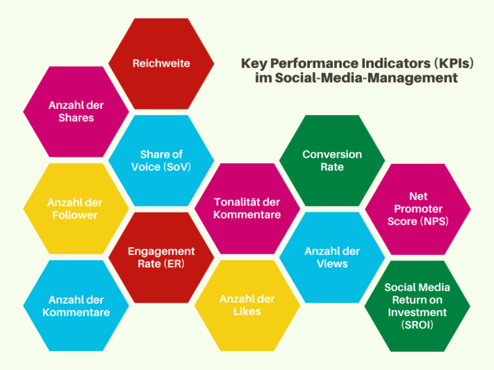

**Социальные сети** стали важной частью нашей повседневной жизни. На таких платформах, как **Instagram, TikTok, Facebook или LinkedIn**, можно охватить множество **потенциальных целевых групп**. Будь то органический контент или платная реклама: Среди лент и историй грань между развлечениями, информацией и рекламой становится размытой. Управление социальными сетями позволяет вам продвигать себя подсознательно, взаимодействовать со своими подписчиками и создавать более сильную эмоциональную связь между вашими клиентами и вашим брендом.

Но как именно работает управление социальными сетями? Прочитав следующую статью, вы получите базовый обзор всего за несколько минут. Воспользуйтесь многочисленными примерами и нашим бесплатным шаблоном.

## Что означает управление социальными сетями

Термин "управление социальными медиа" **описывает целевую коммуникацию и управление рекламой** на различных социальных медиаплатформах, таких как Facebook, Instagram, YouTube и др. Он охватывает широкий спектр задач, таких как **непосредственное общение с целевыми группами, публикация контента и разработка собственной стратегии социальных медиа**.

Существует широкий спектр платформ социальных сетей.

## Что вы получаете от управления социальными сетями

Эффективное управление социальными сетями дает вам множество преимуществ. Оно **повышает узнаваемость бренда** благодаря целевому контенту, **расширяет охват аудитории** и создает **эмоциональную связь** между **целевой группой** и вашим брендом. При успешном внедрении вы будете вознаграждены **положительной репутацией** и **сильным имиджем бренда**. В целом, управление социальными сетями создает динамичные платформы для максимизации положительного влияния на бренд.

## Стратегии социальных сетей, о которых вы должны знать

Чтобы добиться успеха в социальных сетях в долгосрочной перспективе, вам следует продумать стратегию социальных сетей. Чего вы хотите добиться своим цифровым присутствием? Какие цели вы преследуете? Возможные стратегии в управлении социальными медиа следующие

- **Узнаваемость бренда**: Вы хотите, чтобы ваш бренд стал более известным? Но как сделать так, чтобы о вашем бренде заговорило больше людей? Решением может стать придание вашему бренду индивидуальности**с помощью искусного повествования**. Привлекающий внимание контент также дает больший охват аудитории, чем скучные посты.
- **Взаимоотношения с клиентами**: нужны ли вам данные о том, что ваши клиенты думают о вашем бренде и чего хотят? Нужно ли вам улучшить поддержку клиентов? Нужно ли вам организовывать больше мероприятий или полезных видеороликов? Установите прямой контакт с вашей целевой группой и соответствующим образом выстраивайте свой маркетинг и контент в социальных сетях.
- **Лидогенерация и продажи**: как нужно сформулировать свои посты, чтобы человек перешел по ссылке в вашем био? Сколько постов должен увидеть пользователь, прежде чем он будет готов купить продукт? Хороший [шаблон плана социальных сетей](https://seatable.io/ru/social-media-management/#Social-Media-Plan_von_SeaTable) поможет вам улучшить маркетинговую стратегию.
- **Взаимодействие и рекомендации**: Хотите, чтобы ваши клиенты стали послами вашего бренда? В этом случае необходимо обеспечить взаимодействие в ваших постах в социальных сетях. Ваши посты должны побуждать подписчиков ставить лайки, делиться ими или ссылаться на других пользователей в комментариях. Активные действия делают разницу между бесхозным каналом и полезным, развлекательным контентом, который люди с удовольствием рекомендуют.

## Самая важная для вас платформа социальных сетей

В 2023 году в ходе [онлайн-опроса](https://de.statista.com/statistik/daten/studie/463928/umfrage/wichtigste-social-media-plattformen-fuer-marketingverantwortliche/) выяснилось, какая **платформа** является наиболее важной для тех, кто отвечает за управление социальными сетями. Согласно результатам опроса, лидирует Facebook, за ним с некоторым отрывом следуют Instagram и LinkedIn.

Facebook значительно опережает другие платформы.

Однако то, какие платформы важны для вас, зависит от того, какова ваша **целевая аудитория**. Хотите охватить своим контентом более молодое поколение? Тогда вам подойдут **Instagram** и **TikTok**. Вы продвигаете продукт, который в первую очередь привлекает креативщиков, любителей DIY и людей, интересующихся стилем жизни? Тогда вам стоит подумать о профиле на **Pinterest**. Если ваша компания специализируется на B2B-маркетинге и обращается к профессиональной целевой группе, **LinkedIn** - эффективная платформа.

Пользователи могут создавать, делиться и оценивать контент во всех социальных сетях. Тем не менее, платформы различаются по своим характеристикам. Будь то **микроблоги**, **видео** или **изображения** - выбор правильной платформы играет решающую роль для вашего **контента**. При управлении социальными сетями также учитывайте специфические привычки пользователей и возможности взаимодействия, чтобы максимально использовать потенциал каждой платформы.

## Создание и оптимизация профилей в социальных сетях

При создании профилей в социальных сетях необходимо учитывать множество моментов, которые позволят вам блеснуть оптимизированным профилем. Во-первых, сформулируйте **миссию**, к которой вы стремитесь на своем канале. Ваша цель - создавать развлекательный, вдохновляющий или информативный контент? Хотите ли вы вести уважительный диалог со своими подписчиками или предпочитаете быть доступным и личным? Какое послание вы хотите донести до людей?

Для каждой платформы (а также для постов, историй и видео) существуют оптимальные **размеры изображений** для профиля и обложки. Например, в Instagram для изображения профиля лучше всего использовать размер 180×180 пикселей. Изучите необходимые форматы и используйте их. При создании биографии обязательно заполните **все поля** и используйте подходящие **ключевые слова**.

Старайтесь поддерживать единый **фирменный стиль** и в своих профилях. Например, используйте одни и те же цвета и одну и ту же фотографию профиля на всех ваших каналах, чтобы создать более высокую **узнаваемость** для ваших подписчиков. Не забывайте ставить **ссылки на** другие каналы социальных сетей или свой сайт, чтобы увеличить посещаемость всех каналов.

В TikTok и Instagram у вас также есть возможность **прикрепить** соответствующие посты к верхней части своего профиля. Например, вы часто получаете один и тот же вопрос от своего сообщества? Просто закрепите пост с ответом на этот вопрос и в дальнейшем ссылайтесь на него.

Эстетика играет важную роль в социальных сетях.

## Критерии хорошего контента

Одно из самых важных правил управления социальными сетями - **качество превыше количества**. Это относится как к вашим каналам, так и к вашему контенту. Лучше использовать два канала особенно хорошо, чем пренебрегать многими каналами и не справляться ни с одной платформой. Лучше постить реже, но размещать **качественный и актуальный кон**тент. Это вдохновит пользователей и позволит получить ценных подписчиков.

Корпоративный стиль также является обязательным условием, когда речь идет о контенте. **Дизайн**, **язык** и **поведение** должны проходить красной нитью через ваш профиль. **Единая, хорошо продуманная концепция** позволит вам охарактеризовать свое внутреннее и внешнее влияние. Некоторые даже планируют свою ленту **заранее**, чтобы скоординировать цвета всех постов.

Однако основа хорошего контента - это сам контент. Удивите своих подписчиков креативными и **разнообразными постами**. Выделяйтесь из толпы и придумывайте свои собственные **категории**. Если у вас закончились идеи, не бойтесь напрямую спросить у своего **сообщества**, какого рода контент они хотели бы получить. Это не только поможет вам лучше понять предпочтения вашей целевой группы, но и создаст более тесную связь.



## Практические советы по управлению социальными сетями

При управлении социальными сетями вы сталкиваетесь с множеством проблем. Целенаправленный и стратегический подход поможет вам успешно преодолеть их и использовать потенциал платформ. Общие проблемы и возможные решения включают

- **Низкое внимание**: Повысьте внимание, используя привлекательные визуальные элементы. Креативный и привлекательный контент и использование трендовых тем могут увеличить охват аудитории.
- **Регулярные публикации**: постоянно заполненный календарь контента поможет вам поддерживать постоянный ритм публикаций. Вы можете использовать инструменты автоматизации для публикации в праздничные дни, по воскресеньям и во время корпоративных праздников.
- **Индивидуальный контент**: не надоедайте своим подписчикам, повторяя один и тот же контент на всех платформах. Вместо этого адаптируйте свой контент к соответствующим целевым группам платформ и создавайте индивидуальные посты.
- **Отсутствие взаимодействия**: вы уже регулярно публикуете интересный контент, но лайки и комментарии не приходят? Помимо целенаправленных вопросов, используйте опросы и активно вовлекайте сообщество в процесс принятия решений. Быстрое реагирование на комментарии и отзывы также необходимо для поощрения вовлеченности.
- **Работа с кризисами**: Как правило, в случае кризиса, например, "шторма", рекомендуется заранее разработать кризисный план с четкими рекомендациями по коммуникации. Реагируйте на критику прозрачно, деликатно и быстро, чтобы защитить свою репутацию и вернуть доверие сообщества.

## Проанализируйте свои каналы социальных сетей

Если вы хотите создать успешное цифровое присутствие, **анализ** ваших каналов социальных сетей играет ключевую роль. Это позволит вам получить ценные сведения, которые вы сможете использовать для целенаправленного совершенствования своей стратегии в социальных сетях.

Если вы еще не занимались вплотную этой темой в управлении социальными сетями, рекомендуется начать с **аудита социальных сетей**. Этот комплексный обзор вашего присутствия в социальных сетях включает в себя анализ предыдущей деятельности, контента, взаимодействий и **эффективности** ваших каналов. Особое внимание уделите **ключевым показателям эффективности (KPI)**.

У вас также есть возможность провести **сравнительный анализ** с конкурентами. Непосредственное сравнение отраслевых показателей позволит вам лучше оценить, насколько хорошо ваши показатели сопоставимы с конкурентами. Помимо выявления собственных сильных и слабых сторон, вы также можете почерпнуть **передовой опыт** из отрасли.

Помимо анализа цифр, не забывайте об **обратной связи** с вашими подписчиками. Лайки, комментарии и другие формы взаимодействия служат прямой обратной связью с вашей целевой группой. Такой анализ позволяет понять их потребности и пожелания и соответствующим образом адаптировать свой контент.



## Полезные инструменты для управления социальными сетями

Инструменты для социальных сетей автоматизируют многие повседневные задачи, связанные с управлением социальными сетями. Это экономит ваше время и позволяет сосредоточиться на творческих и стратегических аспектах. Существует три основных типа инструментов для социальных сетей:

- **Инструменты аналитики**: Эти инструменты используются для сбора, обработки и анализа данных, касающихся эффективности деятельности в социальных сетях. Это дает вам полное представление о различных показателях, которые измеряют успех вашей стратегии социальных медиа.
- **Инструменты для прослушивания**: Эти приложения позволяют искать в цифровом мире упоминания, комментарии, отзывы и другую информацию по определенной теме. Отслеживайте, что люди говорят о вашем бренде в Интернете.
- **Инструменты управления**: Это специальные программы, которые помогут вам эффективно планировать и реализовывать ваши дальнейшие шаги. К ним относятся, например, управление и публикация ваших материалов.

## План социальных сетей от SeaTable

Если у вас много каналов в социальных сетях, может быть сложно отслеживать все посты и взаимодействия. Структурированный подход в виде плана социальных сетей поможет вам справиться с этой сложной задачей. [Бесплатный шаблон](https://seatable.io/ru/vorlage/lmmjwghgtye322iwdxvj7a/) SeaTable позволяет вам настраивать свои посты и упрощает управление социальными сетями.

Записывайте свои **идеи**, относите посты к определенным **категориям** всего несколькими щелчками мыши и отмечайте выполненные задачи в **списке дел**. Сохраняйте изображения, тексты, задачи и KPI в **центральном месте**, к которому каждый член команды может получить доступ в любое время. Функции совместной работы в SeaTable делают **совместную работу** легким делом!

Благодаря встроенному **календарю** вы сможете отслеживать, когда должны появиться ваши посты, и легко придерживаться графика публикаций. Различные таблицы для каждой платформы облегчат вам настройку контента для всех социальных сетей.

[Зарегистрируйтесь бесплатно]() на SeaTable, настройте план социальных сетей в соответствии с вашими потребностями и наслаждайтесь снижением нагрузки!
