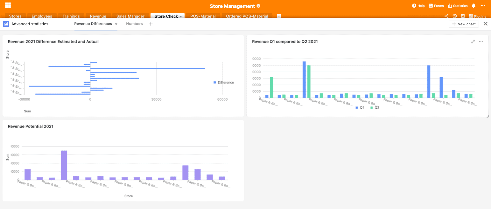
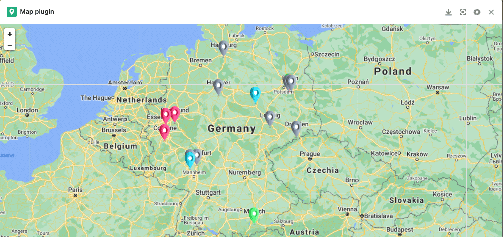
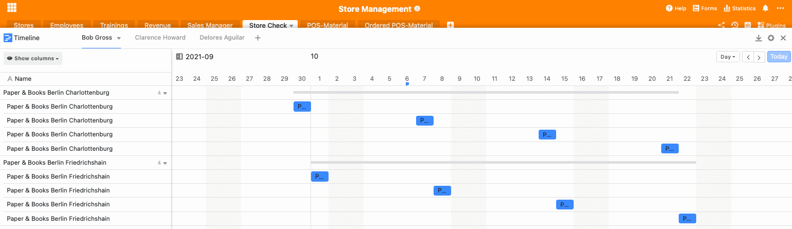
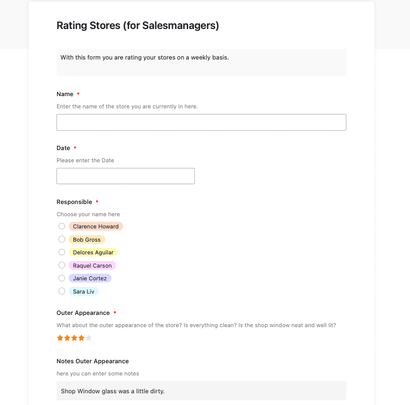
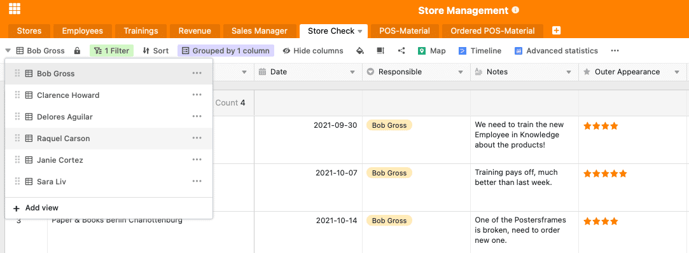

With the opening of new locations, not only the turnover grows, but also the organisational effort. Now it is important to keep an overview. Our Store Management Template helps you with the following questions: Where are your highest-turnover branches? Which shops need more attention because they have not reached the projected turnover? Where are new staff needed and what is the quality of your recruited staff? Which employees could use which training?

In addition, your sales team is also confronted with new challenges: There are more branches that need to be audited at regular intervals. This means more appointments and growing demand. You need to work in a structured way and simplify processes with the help of our [store management solution]().

## SeaTable as an organisational tool for your store management

There are a lot of things to consider in store management. Our software solution helps you to keep track of employees and training. It shows you the sales in different sales clusters and with our statistics plugin it also provides the basis for various sales analyses. For your sales managers, SeaTable offers a simple web form that can be used to make store checks more organized.

The timeline plug-in also displays all upcoming appointments. Last but not least, our Store Management Template also helps you to order and keep track of all POS materials in all branches. In the following, we will explain how exactly the template is structured and how you can use it.

[Click here to go directly to our template]()

## Maintain an overview of all branch locations and their employees

Your first table "Stores" gives you an overview of all stores. Here you can see the exact address, all employees per store and the sales manager responsible for the corresponding store. The column that shows your employees is linked to the second table "Employees". Here you can see a complete list of your employees per branch. Besides a picture, the respective position of the employee is also displayed here.

The entire row is highlighted in red if the corresponding employee is a Store Manager. This way you can see directly who is mainly responsible for the store location. Marking individual rows you can easily set with the small color bucket above your table. Here you can define rules that will color the row accordingly. In addition, this base also contains the contact details of the individual employees.

An additional column for documents allows you to store employment contracts or resumes, so you have all important documents in one place. Another linked column is the "Trainings" column, here you can organize trainings for your employees in the next table.

## Organise further training for your employees

Since employees are one of the most important resources for companies, it is in the interest of companies to promote these resources and thereby make them even more valuable. Accordingly, further training can be seen as a sustainable investment in the company. Because the new knowledge that your employees acquire not only benefits them, [but also the entire company](https://www.kofa.de/mitarbeiter-finden-und-binden/mitarbeiter-weiterbilden/betriebliche-weiterbildung#c8096).

Our third base "Trainings" provides you with an overview of the various needs of your employees and the associated training opportunities. You can enter all available trainings in the first column. Then enter the date on which the further training will take place. Another column shows the available places for this further training.

Next, all employees who are to participate in the training are entered through a linked column. If a training is fully booked, you can place a tick in the next column. Afterwards, the row will change colour from green to red, so you can see directly which trainings are still available and which are already fully booked for this date. Last but not least, you can tick the box if all employees are registered for the respective training.

If your human resource management is becoming more complex and the number of trainings is growing, we can recommend [this template](). Here, everything revolves around further training and internal workshops.

## Keep an overview of your sales

In store management, it is crucial to keep an eye on the turnover of your individual branches. This is not only crucial for an as-is analysis, but also for future strategic location planning. In your Revenue Base you can view and analyse turnover figures.

We have grouped the entire base by quarter. In your grouping rules you can easily set by which column the entire base should be sorted. If you prefer to sort by year or by branch, you can of course easily make this adjustment by [changing the grouping rules](https://seatable.io/en/docs/handbuch/datenmanagement/gruppierung-sortierung-filter/).

With a column for your turnover potential and the actual turnover, deficits and potentials can be easily identified. In addition, we have added a turnover cluster to categorise your branches according to turnover and colour the row again accordingly. Our chosen cluster can of course be easily adapted to your needs. Simply change the single-select options in the last column to your preferred cluster.

### Analyse your turnover with the Advanced Statistics Plugin

With our Advanced Statistic Plugin you can easily carry out analyses of your sales. We have already created three useful [statistics](https://seatable.io/en/docs/handbuch/seatable-nutzen/statistiken/) for our example template. Clicking on the plug-in above your table takes you directly to the statistics area. Here you can use the + sign to create new dashboards in which you can then insert several statistics.

In our example here, the first statistic shows you the differences between turnover potential and actual turnover. The second statistic shows you the turnover potential per store. This way you can see directly which shops can expect a particularly high turnover in this quarter and focus on them. The last statistic compares the Q1 turnover with the Q2 turnover, so you can identify strong differences and possible sources of error.

To add more statistics, simply click "+new chart" in the plug-in menu. In the statistics module you can then make all the settings you want and create the statistics useful for your analyses.

### Our Map plug-in is suitable for geographical turnover analyses

To get a geographical overview of your sales, perhaps to see in which regions your product or service is particularly well received, there is the Map plug-in. With a click on Map, all branches are displayed in the colour of the corresponding turnover cluster. In this way, regions with high and low turnover can be recognised immediately. This provides you with important decision-making criteria when it comes to strategic location planning.

Card plug-in with turnover of the individual branches

## See the responsibilities of your sales team

In order to keep an overview of the responsibilities of your sales team, we have created a contact data table in which you can find the e-mail addresses, telephone numbers and store responsibilities of your sales managers.

## How our store management solution supports your sales team

As the number of shops increases, your sales managers also have more to do. Depending on the type of company, your sales managers have the following tasks in the store management process, for example:

1. Regular visits to the branches
2. Review of POS materials used
3. Review of the general external and internal appearance
4. Verification that all standards are met
5. Conduct staff appraisals and check the quality of work

Our Store Management Template offers a solution for all these tasks.

### All appointments at a glance - with the timeline plug-in

The Timeline plug-in allows your sales staff to see when the next appointments for a personal visit to the stores assigned to them are scheduled. As we have created a separate view for each employee in this base, which we will explain again below, there is also a separate timeline for each individual employee in the timeline plug-in. If you want to add new timelines for new employees here, you must also create a new view in the timeline plug-in after the new view has been created in the base. In the settings, you can then specify the corresponding view as the basis for the data source.

Timeline plug-in

### Carry out store checks easily via web forms

During each personal store visit, your sales staff have the task of checking various aspects for accuracy, depending on the type of company. For this purpose, we have set up a [web form](https://seatable.io/en/docs/handbuch/seatable-nutzen/webformulare/) that can be easily filled out by your sales staff during or after their visit to the store. You can find the web forms in the upper right corner under "Forms". If your sales manager clicks on the web form, he can start filling it out directly.

Web form for the Store Check

The underlying table remains the "Store Check" table. Each entry via a web form appears in the rows and columns of this table.

### Personalised views for your sales staff

Each sales employee has a [personalized view](https://seatable.io/en/docs/handbuch/datenmanagement/ansichten/) in this template so that they only see the stores they are responsible for. The view was created with the filter rule using the "Responsible" column with the respective name. If your sales employees then select their name in the web form, the store checks will also appear in the corresponding base.

To make filling out the web form less error prone, we have set each field to be filled out to "required". This makes it impossible to submit without filling in the field. These and many other settings, such as help texts for filling out the web form or different formatting options, can be easily set by clicking on the small pencil next to the web form.

## Easy ordering of POS materials

There are countless materials for promoting your sales at the point of sale. To help you keep track of the POS materials available and to make ordering them very easy, there are two tables "POS materials" and "Ordered POS materials".

The POS Materials table is an inventory list of the materials currently available in each store. We have grouped this table by store so that it is easier for store staff to find their way around. If you wish, you can also create individual views for each store using the filter rules.

In the "Item" column, you can use a single select to enter all available POS materials. The status shows whether the material is available in the store, whether new material needs to be ordered, or whether the order has already been placed. The stock can then be adjusted accordingly by the employees on site.

Ordering the goods is again very simple via a web form. The materials ordered via the "Order your POS material" web form appear in the "Ordered POS material" table. The quantities also appear here. Once the material has been shipped, the person responsible can place a check mark and thus complete the task.

You can use the Notification Rules to define settings for notifications at certain trigger points. For example, you could set here that the store managers receive a notification about the POS materials sent by mail. You can set notification rules via the 3 small dots next to the bell at the top right of your table.

## Store management made easy with SeaTable

Take your workflow to the next level. You can find our store management template [here](). Register now and get started with your new template for free!
