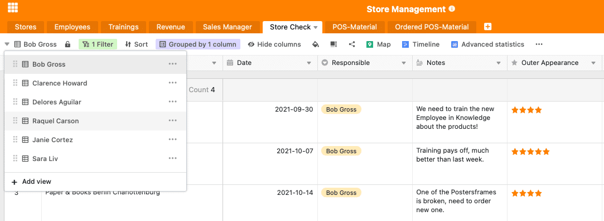

Avec l'ouverture de nouveaux sites, non seulement le chiffre d'affaires augmente, mais aussi l'effort d'organisation. Il est maintenant important de garder une vue d'ensemble. Notre modèle de gestion de magasin vous aide à répondre aux questions suivantes : Où se trouvent vos succursales à forte rotation ? Quels sont les magasins qui nécessitent plus d'attention parce qu'ils n'ont pas atteint le chiffre d'affaires prévu ? Où avez-vous besoin de nouveau personnel et quelle est la qualité de votre personnel recruté ? Quels employés pourraient utiliser quelle formation ?

En outre, votre équipe de vente est également confrontée à de nouveaux défis : Il y a plus de branches qui doivent être auditées à intervalles réguliers. Cela signifie plus de rendez-vous et une demande croissante. Vous devez travailler de manière structurée et simplifier les processus à l'aide de notre [solution de gestion des magasins]().

## SeaTable comme outil d'organisation pour la gestion de votre magasin

Il y a beaucoup de choses à prendre en compte dans la gestion des magasins. Notre solution logicielle vous aide à garder une vue d'ensemble sur les collaborateurs et les formations continues. Elle vous montre le chiffre d'affaires dans différents clusters de chiffre d'affaires et offre également, grâce à notre plug-in de statistiques, une base pour différentes analyses de chiffre d'affaires. Pour vos responsables des ventes, SeaTable propose un formulaire web simple qui permet de mieux organiser les contrôles en magasin.

Le plug-in de la ligne de temps affiche également tous les rendez-vous à venir. Enfin, notre modèle de gestion de magasin vous aide également à commander et à suivre tout le matériel de PLV dans toutes les succursales. Dans les lignes qui suivent, nous allons vous expliquer comment le modèle est structuré et comment vous pouvez l'utiliser.

[Cliquez ici pour accéder directement à notre modèle]()

## Maintenir une vue d'ensemble de toutes les succursales et de leurs employés.

Votre premier tableau "Stores" vous donne un aperçu de toutes les filiales. Vous y voyez l'adresse exacte, tous les collaborateurs par filiale et le Sales Manager responsable de la filiale en question. La colonne qui affiche vos collaborateurs est liée au deuxième tableau "Employees". Vous voyez ici une liste complète de vos collaborateurs par filiale. Outre une image, la position respective de l'employé est également affichée ici.

La ligne entière est marquée en rouge si l'employé concerné est un store manager. Vous voyez ainsi directement qui est le principal responsable de l'emplacement du magasin. Vous pouvez facilement mettre en évidence des lignes individuelles à l'aide du petit pot de peinture situé au-dessus de votre tableau. Vous pouvez définir ici des règles qui colorent la ligne en conséquence. De plus, les données de contact des différents collaborateurs trouvent également leur place dans cette base.

Une colonne supplémentaire pour les documents vous permet de classer les contrats de travail ou les CV, vous avez ainsi tous les documents importants au même endroit. Une autre colonne liée est la colonne "Formations", ici vous pouvez organiser des formations continues pour vos collaborateurs dans le tableau suivant.

## Organiser des formations continues pour vos employés

Les employés étant l'une des ressources les plus importantes des entreprises, il est dans l'intérêt de ces dernières de promouvoir ces ressources et de les rendre ainsi encore plus précieuses. Par conséquent, la formation continue peut être considérée comme un investissement durable dans l'entreprise. Car les nouvelles connaissances acquises par vos employés ne profitent pas seulement à eux, [mais aussi à toute l'entreprise](https://www.kofa.de/mitarbeiter-finden-und-binden/mitarbeiter-weiterbilden/betriebliche-weiterbildung#c8096).

Notre troisième base "Formations" vous donne un aperçu des différents besoins de vos collaborateurs et des possibilités de formation continue qui y sont liées. Vous pouvez inscrire toutes les formations continues disponibles dans la première colonne. Ensuite, vous inscrivez la date à laquelle la formation continue a lieu. Une autre colonne indique les places disponibles pour cette formation.

Ensuite, tous les employés qui doivent participer à la formation sont saisis dans une colonne liée. Si une formation est complète, vous pouvez cocher la colonne suivante. Ensuite, la ligne passera du vert au rouge, ce qui vous permettra de voir directement quelles formations sont encore disponibles et lesquelles sont déjà complètes pour cette date. Enfin, vous pouvez cocher la case si tous les employés sont inscrits à la formation correspondante.

Si votre gestion des ressources humaines devient plus complexe et que le nombre de formations augmente, nous vous recommandons [ce modèle](). Ici, tout tourne autour de la formation continue et des ateliers internes.

## Gardez une vue d'ensemble de vos ventes

Dans la gestion des magasins, il est crucial de garder un œil sur le chiffre d'affaires de vos différentes succursales. Cela est non seulement crucial pour une analyse en l'état, mais aussi pour la planification stratégique future de l'emplacement. Dans votre base de revenus, vous pouvez consulter et analyser les chiffres d'affaires.

Nous avons regroupé l'ensemble de la base par trimestre. Dans vos règles de regroupement, vous pouvez facilement définir par quelle colonne la base entière doit être triée. Si vous préférez trier par année ou par branche, vous pouvez bien sûr facilement procéder à cet ajustement en [modifiant les règles de regroupement]().

Avec une colonne pour votre potentiel de chiffre d'affaires et le chiffre d'affaires réel, les déficits et les potentiels peuvent être facilement identifiés. En outre, nous avons ajouté un cluster de chiffre d'affaires pour classer vos branches en fonction de leur chiffre d'affaires et colorer à nouveau la ligne en conséquence. Le cluster que nous avons choisi peut bien sûr être facilement adapté à vos besoins. Pour ce faire, il suffit de modifier les options de sélection unique de la dernière colonne en fonction du groupe que vous préférez.

### Analysez votre chiffre d'affaires avec le plugin Statistiques avancées

Notre plugin Advanced Statistic permet de réaliser très facilement des analyses sur vos ventes. Nous avons déjà créé trois [statistiques]() utiles pour notre modèle d'exemple. En cliquant sur le plug-in au-dessus de votre tableau, vous accédez directement à la zone des statistiques. Ici, vous pouvez créer de nouveaux tableaux de bord à l'aide du signe +, dans lesquels vous pouvez ensuite insérer plusieurs statistiques.

Dans notre exemple ici, la première statistique vous montre les différences entre le chiffre d'affaires potentiel et le chiffre d'affaires réel. La deuxième statistique vous indique le potentiel de chiffre d'affaires par magasin. De cette façon, vous pouvez voir directement quels magasins peuvent s'attendre à un chiffre d'affaires particulièrement élevé au cours de ce trimestre et vous concentrer sur eux. La dernière statistique compare le chiffre d'affaires du T1 avec celui du T2, ce qui vous permet d'identifier les fortes différences et les éventuelles sources d'erreur.

Pour ajouter d'autres statistiques, il suffit de cliquer sur "+new chart" dans le menu du plug-in. Dans le module de statistiques, vous pouvez ensuite effectuer tous les réglages souhaités et créer les statistiques utiles pour vos analyses.

### Notre plug-in Carte est adapté aux analyses du chiffre d'affaires géographique

Pour obtenir un aperçu géographique de vos ventes, peut-être pour voir dans quelles régions votre produit ou service est particulièrement bien accueilli, il existe le plug-in Carte. En cliquant sur la carte, toutes les branches sont affichées dans la couleur de la grappe de chiffre d'affaires correspondante. De cette façon, les régions à forte et faible rotation peuvent être reconnues immédiatement. Vous disposez ainsi de critères de décision importants pour la planification stratégique d'un emplacement.

Plug-in de cartes avec les chiffres d'affaires des différents points de vente

## Voir les responsabilités de votre équipe de vente

Afin de garder une vue d'ensemble des responsabilités de votre équipe de vente, nous avons créé un tableau de données de contact dans lequel vous pouvez trouver les adresses e-mail, les numéros de téléphone et les responsabilités en magasin de vos responsables des ventes.

## Comment notre solution de gestion des magasins soutient votre équipe de vente

À mesure que le nombre de magasins augmente, vos directeurs des ventes ont également plus de travail. Selon le type d'entreprise, vos responsables des ventes ont les tâches suivantes dans le processus de gestion des magasins, par exemple :

1. Des visites régulières dans les agences
2. Examen des matériels de PLV utilisés
3. Examen de l'aspect général extérieur et intérieur
4. Vérification que toutes les normes sont respectées
5. Procéder à l'évaluation du personnel et vérifier la qualité du travail.

Notre modèle de gestion de magasin offre une solution pour toutes ces tâches.

### Tous les rendez-vous d'un seul coup d'œil - avec le plug-in ligne de temps

Le plug-in Timeline permet à vos vendeurs de voir quand sont prévus les prochains rendez-vous pour une visite personnelle dans les magasins qui leur sont assignés. Comme nous avons créé une vue séparée pour chaque employé dans cette base, ce que nous expliquerons à nouveau ci-dessous, il y a également une ligne de temps séparée pour chaque employé individuel dans le plug-in de ligne de temps. Si vous voulez ajouter de nouvelles lignes de temps pour les nouveaux employés ici, vous devez également créer une nouvelle vue dans le plug-in ligne de temps après que la nouvelle vue ait été créée dans la base. Dans les paramètres, vous pouvez alors spécifier la vue correspondante comme base de la source de données.

Plug-in ligne de temps

### Effectuer facilement des contrôles en magasin via des formulaires web

Lors de chaque visite personnelle dans un magasin, vos collaborateurs de vente ont pour mission de vérifier l'exactitude de différents aspects selon le type d'entreprise. Pour cela, nous avons mis en place un [formulaire web]() qui peut être rempli très facilement par vos collaborateurs de vente pendant ou après leur visite dans le magasin. Vous trouverez les formulaires web en haut à droite sous "Forms". Si votre manager des ventes clique sur le formulaire web, il peut directement commencer à le remplir.

Formulaire web pour le contrôle du magasin

Le tableau sous-jacent reste le tableau "Store Check". Chaque entrée via un formulaire web apparaît dans les lignes et les colonnes de ce tableau.

### Des vues personnalisées pour votre personnel de vente

Chaque collaborateur de vente a une [vue personnalisée]() dans ce modèle, afin qu'il ne voie que les filiales dont il est responsable. La vue a été créée à l'aide de la règle de filtrage via la colonne "Responsible" avec le nom correspondant. Si vos collaborateurs de vente sélectionnent ensuite leur nom dans le formulaire web, les store checks apparaissent également dans la base correspondante.

Afin de réduire les risques d'erreur lors du remplissage du formulaire web, nous avons défini chaque champ à remplir comme "required". Ainsi, il n'est pas possible d'envoyer le formulaire sans avoir rempli le champ. Ces réglages et bien d'autres, comme par exemple des textes d'aide pour remplir le formulaire web ou différentes possibilités de formatage, peuvent être effectués très facilement en cliquant sur le petit crayon à côté du formulaire web.

## Commande facile de matériel de PLV

Il existe d'innombrables matériaux pour la promotion de vos ventes au point de vente. Pour que vous puissiez garder une vue d'ensemble du matériel POS disponible et que vous puissiez le commander très facilement, il existe deux tableaux "Matériel POS" et "Matériel POS commandé".

La table des matériaux POS est une liste d'inventaire des matériaux actuellement disponibles dans chaque magasin. Nous avons regroupé ce tableau par magasin afin que le personnel des magasins puisse s'y retrouver plus facilement. Si vous le souhaitez, vous pouvez également créer des vues individuelles pour chaque magasin en utilisant les règles de filtrage.

Dans la colonne "Item", vous pouvez saisir tous les matériaux POS disponibles à l'aide d'un single-select. Le statut indique si le matériel est disponible dans le magasin, s'il faut en commander un nouveau ou si la commande est déjà passée. Le stock peut alors être adapté en conséquence par le personnel sur place.

La commande des marchandises se fait à nouveau très simplement via un formulaire web. Les articles commandés via le formulaire web "Order your POS-Material" apparaissent dans le tableau "Ordered POS-Material". Les quantités apparaissent également ici. Une fois le matériel expédié, la personne responsable peut cocher la case et clôturer ainsi la tâche.

Vous pouvez utiliser les règles de notification pour définir les paramètres des notifications à certains points de déclenchement. Par exemple, vous pouvez paramétrer ici que les directeurs de magasin reçoivent une notification concernant les matériels de point de vente envoyés par courrier. Vous pouvez définir des règles de notification à l'aide des trois petits points situés à côté de la cloche en haut à droite de votre table.

## La gestion des magasins facilitée par SeaTable

Faites passer votre flux de travail au niveau supérieur. Vous pouvez trouver notre modèle de gestion de magasin [ici](). Inscrivez-vous maintenant et commencez à utiliser votre nouveau modèle gratuitement !
