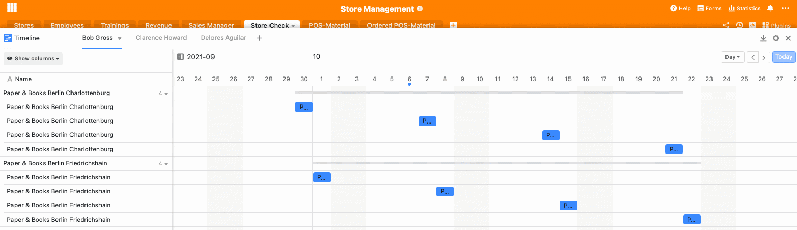

Com a abertura de novos locais, não só cresce o volume de negócios, mas também o esforço organizacional. Agora é importante manter uma visão geral. O nosso Modelo de Gestão de Loja ajuda-o com as seguintes perguntas: Onde estão os seus ramos com maior rotatividade? Que lojas precisam de mais atenção porque ainda não atingiram o volume de negócios previsto? Onde é necessário pessoal novo e qual é a qualidade do seu pessoal recrutado? Que empregados poderiam utilizar que formação?

Além disso, a sua equipa de vendas é também confrontada com novos desafios: Há mais ramos que precisam de ser auditados a intervalos regulares. Isto significa mais nomeações e uma procura crescente. É necessário trabalhar de forma estruturada e simplificar os processos com a ajuda da nossa [solução de gestão de lojas]().

## SeaTable como uma ferramenta organizacional para a gestão da sua loja

Há muitas coisas a considerar na gestão de lojas. A nossa solução de software ajuda-o a manter um registo dos empregados e da formação. Mostra-lhe o volume de negócios em diferentes grupos de volume de negócios e, com o nosso plugin estatístico, fornece também a base para várias análises de volume de negócios. Para os seus gestores de vendas, a SeaTable oferece um simples formulário web que pode ser utilizado para organizar cheques de loja.

O plug-in da linha do tempo também mostra todos os compromissos que se aproximam. Por último, mas não menos importante, o nosso Modelo de Gestão de Loja também o ajuda a encomendar e a acompanhar todos os materiais POS em todos os ramos. A seguir, explicaremos como o modelo está exactamente estruturado e como o pode utilizar.

[Clique aqui para ir directamente para o nosso modelo]()

## Manter uma visão geral de todas as filiais e dos seus empregados

O primeiro quadro "Lojas" dá-lhe uma visão geral de todas as sucursais. Aqui pode ver o endereço exato, todos os empregados por loja e o gestor de vendas responsável pela respectiva loja. A coluna que mostra os seus empregados está ligada à segunda tabela "Empregados". Aqui pode ver uma lista completa dos seus empregados por filial. Para além de uma fotografia, é também apresentada a respectiva posição do empregado.

A linha inteira é destacada a vermelho se o empregado correspondente for um Gerente de Loja. Desta forma é possível ver directamente quem é o principal responsável pela localização da loja. Pode facilmente definir a marcação de filas individuais com o pequeno balde de cor por cima da sua mesa. Aqui pode definir regras que coloram a fila em conformidade. Além disso, esta base contém também os dados de contacto dos empregados individuais.

Uma coluna adicional para documentos permite-lhe armazenar contratos de trabalho ou CVs, para que tenha todos os documentos importantes num só local. Outra coluna ligada é a coluna "Formações", onde pode organizar a formação contínua dos seus empregados no quadro seguinte.

## Organize formação complementar para os seus empregados

Uma vez que os empregados são um dos recursos mais importantes para as empresas, é do interesse das empresas promover estes recursos e, assim, torná-los ainda mais valiosos. Consequentemente, a formação contínua pode ser vista como um investimento sustentável na empresa. Porque os novos conhecimentos que os seus empregados adquirem não só os beneficia, [mas também a toda a empresa](https://www.kofa.de/mitarbeiter-finden-und-binden/mitarbeiter-weiterbilden/betriebliche-weiterbildung#c8096).

A nossa terceira base "Formações" dá-lhe uma visão geral das várias necessidades dos seus empregados e das oportunidades de formação contínua associadas. Pode introduzir todos os cursos de formação disponíveis na primeira coluna. Em seguida, introduza a data em que a formação contínua terá lugar. Outra coluna mostra os lugares disponíveis para esta formação complementar.

A seguir, todos os empregados que devem participar na formação são introduzidos através de uma coluna ligada. Se uma formação estiver totalmente reservada, pode colocar um tique na coluna seguinte. Depois, a fila mudará de cor de verde para vermelho, para que se possa ver directamente quais as formações que ainda estão disponíveis e quais as que já estão totalmente reservadas para esta data. Por último, mas não menos importante, pode assinalar a caixa se todos os empregados estiverem registados para a respectiva formação.

Se a sua gestão de recursos humanos estiver a tornar-se mais complexa e o número de formações estiver a crescer, podemos recomendar [este modelo](). Aqui, tudo gira em torno de mais formação e workshops internos.

## Mantenha uma visão geral das suas vendas

Na gestão de lojas, é crucial estar atento ao volume de negócios das suas sucursais individuais. Isto é crucial não só para uma análise tal como está, mas também para um futuro planeamento estratégico da localização. Na sua Base de Receitas pode visualizar e analisar os números do volume de negócios.

Agrupámos a base inteira por trimestre. Nas suas regras de agrupamento pode facilmente definir por qual coluna toda a base deve ser classificada. Se preferir ordenar por ano ou por ramo, pode naturalmente fazer este ajustamento facilmente, [alterando as regras de agrupamento]().

Com uma coluna para o seu potencial de rotatividade e a rotatividade real, os défices e potenciais podem ser facilmente identificados. Além disso, adicionámos um grupo de volume de negócios para classificar os seus ramos de acordo com o volume de negócios e colorir a fila em conformidade novamente. O nosso grupo escolhido pode, evidentemente, ser facilmente adaptado às suas necessidades. Para o fazer, basta alterar as opções de selecção única na última coluna para o agrupamento que preferir.

### Analise o seu volume de negócios com o Plugin de Estatísticas Avançadas

Com o nosso Plugin Estatístico Avançado pode facilmente realizar análises das suas vendas. Já criámos três [estatísticas]() úteis para o nosso modelo de exemplo. Clicando no plug-in acima da sua mesa leva-o directamente para a área de estatísticas. Aqui pode usar o sinal + para criar novos painéis de bordo nos quais pode então inserir várias estatísticas.

No nosso exemplo aqui, a primeira estatística mostra-lhe as diferenças entre o volume de negócios potencial e o volume de negócios real. A segunda estatística mostra-lhe o potencial de rotação por loja. Desta forma, pode ver directamente quais as lojas que podem esperar uma rotação particularmente elevada neste trimestre e concentrar-se nelas. A última estatística compara o volume de negócios Q1 com o volume de negócios Q2, para que se possa identificar fortes diferenças e possíveis fontes de erro.

Para adicionar mais estatísticas, basta clicar em "+novo gráfico" no menu do plug-in. No módulo de estatísticas, pode então efetuar todas as definições desejadas e criar as estatísticas úteis para as suas análises.

### O nosso plug-in de mapa é adequado para análises de rotatividade geográfica

Para obter uma visão geográfica do seu volume de negócios, talvez para ver em que regiões o seu produto ou serviço é particularmente bem recebido, existe o plug-in do Mapa. Com um clique no Mapa, todos os ramos são exibidos na cor do grupo de volume de negócios correspondente. Desta forma, as regiões com alta e baixa rotação podem ser reconhecidas imediatamente. Isto proporciona-lhe critérios importantes para a tomada de decisões quando se trata de planeamento estratégico de localização.

Plug-in de cartão com vendas das filiais individuais

## Veja as responsabilidades da sua equipa de vendas

A fim de manter uma visão geral das responsabilidades da sua equipa de vendas, criámos uma tabela de dados de contacto na qual pode encontrar os endereços de correio electrónico, números de telefone e responsabilidades de loja dos seus gestores de vendas.

## Como a nossa solução de gestão de loja apoia a sua equipa de vendas

À medida que o número de lojas aumenta, os seus gestores de vendas também têm mais a fazer. Dependendo do tipo de empresa, os seus gestores de vendas têm as seguintes tarefas no processo de gestão da loja, por exemplo:

1. Visitas regulares aos balcões
2. Revisão dos materiais de POS utilizados
3. Revisão da aparência geral externa e interna
4. Verificação de que todas as normas são cumpridas
5. Conduzir avaliações do pessoal e verificar a qualidade do trabalho

O nosso Modelo de Gestão de Loja oferece uma solução para todas estas tarefas.

### Todos os compromissos num relance - com o plug-in da linha do tempo

O plug-in da Linha do Tempo permite que o seu pessoal de vendas veja quando estão agendados os próximos compromissos para uma visita pessoal às lojas a eles atribuídas. Como criámos uma visão separada para cada empregado nesta base, que explicaremos novamente abaixo, existe também uma linha temporal separada para cada empregado individual no plug-in da linha temporal. Se quiser acrescentar aqui novas linhas de tempo para novos empregados, deve também criar uma nova vista no plug-in da linha de tempo depois de a nova vista ter sido criada na base. Nas definições, pode então especificar a visão correspondente como base para a fonte de dados.

Plug-in na linha do tempo

### Efectuar verificações de loja facilmente através de formulários web

Durante cada visita pessoal à loja, o seu pessoal de vendas tem a tarefa de verificar a exatidão de vários aspectos, consoante o tipo de empresa. Para esse efeito, criámos um [formulário Web]() que pode ser facilmente preenchido pelo seu pessoal de vendas durante ou após a visita à loja. Encontrará os formulários Web no canto superior direito, em "Formulários". Quando o seu gestor de vendas clica no formulário Web, pode começar a preenchê-lo imediatamente.

Formulário Web para a verificação da loja

A tabela subjacente continua a ser a tabela "Store Check". Cada entrada através de um formulário Web aparece nas linhas e colunas desta tabela.

### Vistas personalizadas para o seu pessoal de vendas

Cada vendedor tem uma [vista personalizada]() neste modelo, de modo a ver apenas os balcões pelos quais é responsável. A vista foi criada com a regra de filtragem através da coluna "Responsável" com o respetivo nome. Se os vendedores seleccionarem o seu nome no formulário Web, os controlos de loja também aparecem na base correspondente.

Para tornar o preenchimento do formulário Web menos propenso a erros, definimos cada campo a ser preenchido como "obrigatório". Desta forma, é impossível submeter o formulário sem preencher o campo. Estas e muitas outras definições, tais como textos de ajuda para preencher o formulário Web ou várias opções de formatação, podem ser facilmente efectuadas clicando no pequeno lápis junto ao formulário Web.

## Encomenda fácil de materiais POS

Existem inúmeros materiais para promover as suas vendas no ponto de venda. Para o ajudar a manter um registo dos materiais POS disponíveis e para facilitar a sua encomenda, existem duas tabelas: "Materiais POS" e "Materiais POS encomendados".

A tabela de Materiais POS é uma lista do inventário dos materiais actualmente disponíveis em cada loja. Agrupámos esta tabela por loja para que seja mais fácil para o pessoal da loja encontrar o seu caminho. Se desejar, pode também criar vistas individuais para cada loja utilizando as regras de filtragem.

Na coluna "Item", é possível utilizar uma única seleção para entrar todos os materiais POS disponíveis. O status mostra se o material está disponível na loja, se um novo material precisa ser pedido ou se o pedido já foi feito. O stock pode então ser ajustado em conformidade pelo pessoal no local.

A encomenda de mercadorias é novamente muito simples através de um formulário Web. Os materiais encomendados através do formulário Web "Encomendar o seu material POS" aparecem na tabela "Material POS encomendado". As quantidades também aparecem aqui. Depois de o material ter sido enviado, a pessoa responsável pode assinalar a caixa e concluir a tarefa.

Pode utilizar as Regras de Notificação para definir definições para notificações em determinados pontos de activação. Por exemplo, poderia definir aqui que os gerentes da loja recebessem uma notificação sobre os materiais de PDV enviados por correio. Pode definir regras de notificação através dos 3 pequenos pontos junto ao sino no canto superior direito da sua mesa.

## Gestão de loja facilitada com SeaTable

Leve o seu fluxo de trabalho para o nível seguinte. Pode encontrar o nosso modelo de gestão de loja [aqui](). Registe-se agora e comece já a utilizar o seu novo modelo gratuitamente!
