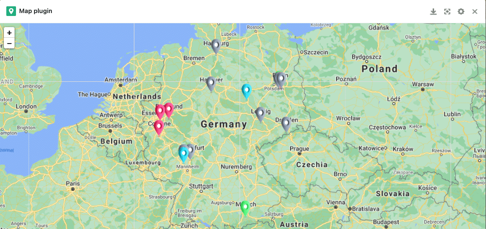
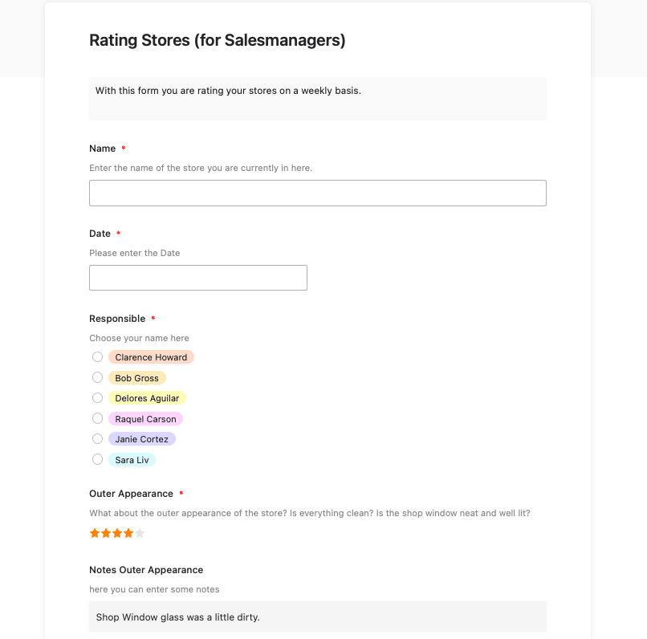

С открытием новых точек растет не только оборот, но и организационные усилия. Теперь важно вести обзор. Наш шаблон управления магазином поможет вам ответить на следующие вопросы: где находятся ваши филиалы с наибольшим оборотом? Какие магазины требуют большего внимания, потому что они не достигли прогнозируемого оборота? Где требуется новый персонал и каково качество набранного вами персонала? Какие сотрудники могли бы пройти обучение?

Кроме того, ваш отдел продаж также сталкивается с новыми проблемами: Существует большее количество филиалов, которые необходимо регулярно проверять. Это означает большее количество приемов и растущий спрос. Вам необходимо работать структурированно и упростить процессы с помощью нашего [решения для управления магазинами]().

## SeaTable как организационный инструмент для управления вашим магазином

В управлении магазином необходимо учитывать множество моментов. Наше программное решение поможет вам отслеживать сотрудников и их обучение. Он показывает оборот в различных кластерах оборота и, с помощью нашего плагина статистики, также обеспечивает основу для различных анализов оборота. Для ваших менеджеров по продажам SeaTable предлагает простую веб-форму, которую можно использовать для организации проверок магазинов.

Плагин временной шкалы также отображает все предстоящие встречи. И последнее, но не менее важное: наш шаблон управления магазином также поможет вам заказывать и отслеживать все POS-материалы во всех филиалах. Далее мы объясним, как именно устроен шаблон и как его можно использовать.

[Нажмите здесь, чтобы перейти непосредственно к нашему шаблону]()

## Вести обзор всех филиалов и их сотрудников

Первая таблица "Магазины" дает представление обо всех филиалах. Здесь можно увидеть точный адрес, всех сотрудников каждого магазина и менеджера по продажам, отвечающего за соответствующий магазин. Колонка, показывающая сотрудников, связана со второй таблицей "Сотрудники". Здесь представлен полный список сотрудников по каждому филиалу. Наряду с фотографией здесь также отображается соответствующая должность сотрудника.

Вся строка выделяется красным цветом, если соответствующий сотрудник является менеджером магазина. Таким образом, вы сможете непосредственно увидеть, кто несет основную ответственность за местоположение магазина. Вы можете легко установить маркировку отдельных строк с помощью небольшого цветного ковша над таблицей. Здесь вы можете определить правила, которые будут окрашивать строку соответствующим образом. Кроме того, в этой базе содержатся контактные данные отдельных сотрудников.

Дополнительный столбец "Документы" позволяет хранить трудовые договоры или резюме, чтобы все важные документы были в одном месте. Еще один связанный столбец - столбец "Обучение", в котором можно организовать повышение квалификации сотрудников в следующей таблице.

## Организуйте дополнительное обучение для своих сотрудников

Поскольку сотрудники являются одним из самых важных ресурсов для компаний, в интересах компаний продвигать эти ресурсы и тем самым делать их еще более ценными. Соответственно, дальнейшее обучение можно рассматривать как устойчивую инвестицию в компанию. Ведь новые знания, которые приобретают ваши сотрудники, приносят пользу не только им, [но и всей компании](https://www.kofa.de/mitarbeiter-finden-und-binden/mitarbeiter-weiterbilden/betriebliche-weiterbildung#c8096).

Наша третья база "Обучение" позволяет получить представление о различных потребностях Ваших сотрудников и связанных с ними возможностях повышения квалификации. В первую колонку можно занести все имеющиеся курсы обучения. Затем укажите дату, когда будет проводиться обучение. В другом столбце отображаются доступные места для этого обучения.

Далее через связанный столбец вводятся все сотрудники, которые должны участвовать в тренинге. Если тренинг полностью забронирован, вы можете поставить галочку в следующей колонке. После этого строка изменит цвет с зеленого на красный, и вы сможете сразу увидеть, какие тренинги еще доступны, а какие уже полностью забронированы на эту дату. И последнее, но не менее важное: вы можете поставить галочку, если все сотрудники зарегистрированы для прохождения соответствующего обучения.

Если управление человеческими ресурсами становится все более сложным, а количество тренингов растет, мы можем порекомендовать [этот шаблон](). Здесь все крутится вокруг повышения квалификации и внутренних семинаров.

## Следите за своими продажами

При управлении магазином очень важно следить за оборотом в отдельных филиалах. Это важно не только для анализа "как есть", но и для будущего стратегического планирования местоположения. В своей базе доходов вы можете просматривать и анализировать показатели оборота.

Мы сгруппировали всю базу по кварталам. В правилах группировки вы можете легко задать, по какому столбцу должна быть отсортирована вся база. Если вы предпочитаете сортировать по годам или по отраслям, вы, конечно, можете легко сделать эту настройку, [изменив правила группировки](https://seatable.io/ru/docs/handbuch/datenmanagement/gruppierung-sortierung-filter/).

С помощью колонки для потенциального оборота и фактического оборота можно легко определить дефицит и потенциал. Кроме того, мы добавили кластер оборота, чтобы распределить ваши филиалы по категориям в зависимости от оборота и окрасить строки соответствующим образом. Выбранный нами кластер, конечно же, может быть легко адаптирован к вашим потребностям. Просто измените параметры одиночного выбора в последнем столбце на предпочитаемый кластер.

### Анализируйте свой оборот с помощью плагина расширенной статистики

С помощью нашего плагина Advanced Statistic Plugin вы можете легко проводить анализ ваших продаж. Мы уже создали три полезные [статистики](https://seatable.io/ru/docs/handbuch/seatable-nutzen/statistiken/) для нашего примера шаблона. Щелкнув по плагину над таблицей, вы попадете непосредственно в область статистики. Здесь вы можете использовать знак + для создания новых приборных панелей, в которые затем можно вставить несколько статистических данных.

В нашем примере первая статистика показывает разницу между потенциальным и фактическим оборотом. Вторая статистика показывает потенциал оборота на один магазин. Таким образом, вы сможете непосредственно увидеть, какие магазины могут ожидать особенно высокого оборота в этом квартале, и сосредоточиться на них. Последняя статистика сравнивает оборот первого квартала с оборотом второго квартала, чтобы вы могли определить сильные различия и возможные источники ошибок.

Для добавления дополнительной статистики достаточно нажать кнопку "+новый график" в меню плагина. В модуле статистики можно произвести все необходимые настройки и создать статистику, необходимую для анализа.

### Наш плагин Map подходит для анализа географического оборота

Чтобы получить географический обзор ваших продаж, возможно, увидеть, в каких регионах ваш продукт или услуга пользуются особым успехом, существует плагин Map. При нажатии на Map все ветви отображаются цветом соответствующего кластера оборота. Таким образом, можно сразу определить регионы с высокой и низкой текучестью кадров. Это дает вам важные критерии принятия решений, когда речь идет о стратегическом планировании местоположения.

Карточный плагин с оборотом отдельных филиалов

## Ознакомьтесь с обязанностями вашего отдела продаж

Для того чтобы иметь представление об обязанностях вашего отдела продаж, мы создали таблицу контактных данных, в которой вы можете найти адреса электронной почты, номера телефонов и обязанности менеджеров по продажам в магазинах.

## Как наше решение для управления магазином поддерживает ваш отдел продаж

По мере увеличения количества магазинов у ваших менеджеров по продажам становится больше работы. В зависимости от типа компании, ваши менеджеры по продажам выполняют, например, следующие задачи в процессе управления магазином:

1. Регулярные посещения филиалов
2. Обзор используемых POS-материалов
3. Обзор общего внешнего и внутреннего вида
4. Проверка соблюдения всех стандартов
5. Проводить аттестацию персонала и проверять качество работы

Наш шаблон управления магазином предлагает решение для всех этих задач.

### Все встречи в одно мгновение - с помощью плагина временной шкалы

Плагин Timeline позволяет вашему торговому персоналу видеть, когда запланированы следующие встречи для личного посещения закрепленных за ними магазинов. Поскольку в этой базе мы создали отдельное представление для каждого сотрудника, о чем мы еще расскажем ниже, в плагине временной шкалы для каждого сотрудника также существует отдельная временная шкала. Если вы хотите добавить новые временные шкалы для новых сотрудников здесь, вы также должны создать новое представление в плагине временной шкалы после того, как новое представление было создано в базе. Затем в настройках можно указать соответствующее представление в качестве основы для источника данных.

Подключаемый модуль Timeline

### Проводить проверки магазинов легко с помощью веб-форм

Во время каждого личного посещения магазина перед вашим торговым персоналом стоит задача проверки различных аспектов на точность, в зависимости от типа компании. Для этого мы разработали [веб-форму](https://seatable.io/ru/docs/handbuch/seatable-nutzen/webformulare/), которая может быть легко заполнена торговым персоналом во время или после посещения магазина. Веб-формы находятся в правом верхнем углу в разделе "Формы". Когда Ваш менеджер по продажам нажимает на веб-форму, он может сразу же приступить к ее заполнению.

Веб-форма для проверки магазина

В качестве базовой таблицы остается таблица "Проверка магазина". Каждый ввод через веб-форму отображается в строках и столбцах этой таблицы.

### Индивидуальные представления для вашего торгового персонала

Для каждого сотрудника отдела продаж в этом шаблоне создано [персональное представление](https://seatable.io/ru/docs/handbuch/datenmanagement/ansichten/), чтобы он видел только те филиалы, за которые он отвечает. Представление было создано с помощью правила фильтрации через колонку "Ответственный" с соответствующим именем. Если торговый персонал затем выбирает свое имя в веб-форме, то чеки магазинов также появляются в соответствующей базе.

Чтобы сделать заполнение веб-формы менее ошибочным, мы установили для каждого поля, подлежащего заполнению, значение "обязательно". Это делает невозможным отправку формы без заполнения поля. Эти и многие другие настройки, например, тексты подсказок для заполнения веб-формы или различные варианты форматирования, можно легко выполнить, нажав на маленький карандаш рядом с веб-формой.

## Простой заказ POS-материалов

Существует бесчисленное множество материалов для продвижения продаж в торговых точках. Чтобы помочь вам следить за имеющимися POS-материалами и облегчить их заказ, существуют две таблицы: "POS-материалы" и "Заказанные POS-материалы".

Таблица POS Materials представляет собой инвентарный список материалов, имеющихся в настоящее время в каждом магазине. Мы сгруппировали эту таблицу по магазинам, чтобы сотрудникам магазинов было легче ориентироваться в ней. При желании вы также можете создать отдельные представления для каждого магазина, используя правила фильтрации.

В столбце "Артикул" с помощью одного выбора можно ввести все имеющиеся POS-материалы. Статус показывает, есть ли материал в наличии в магазине, нужно ли заказывать новый материал или заказ уже сделан. После этого сотрудники магазина могут соответствующим образом скорректировать запасы.

Заказ товаров опять же осуществляется очень просто через веб-форму. Материалы, заказанные через веб-форму "Заказ POS-материалов", появляются в таблице "Заказанные POS-материалы". Здесь же указывается и количество. После того как материал отправлен, ответственное лицо может поставить галочку и завершить выполнение задания.

Вы можете использовать правила уведомлений, чтобы определить настройки для уведомлений в определенных точках срабатывания. Например, вы можете установить здесь, что менеджеры магазина получают уведомление о POS-материалах, отправленных по почте. Вы можете установить правила уведомления с помощью 3 маленьких точек рядом с колокольчиком в правом верхнем углу стола.

## Управление магазином упрощается с помощью SeaTable

Поднимите свой рабочий процесс на новый уровень. Вы можете найти наш шаблон управления магазином [здесь](). Зарегистрируйтесь сейчас и начните работу с новым шаблоном бесплатно!
