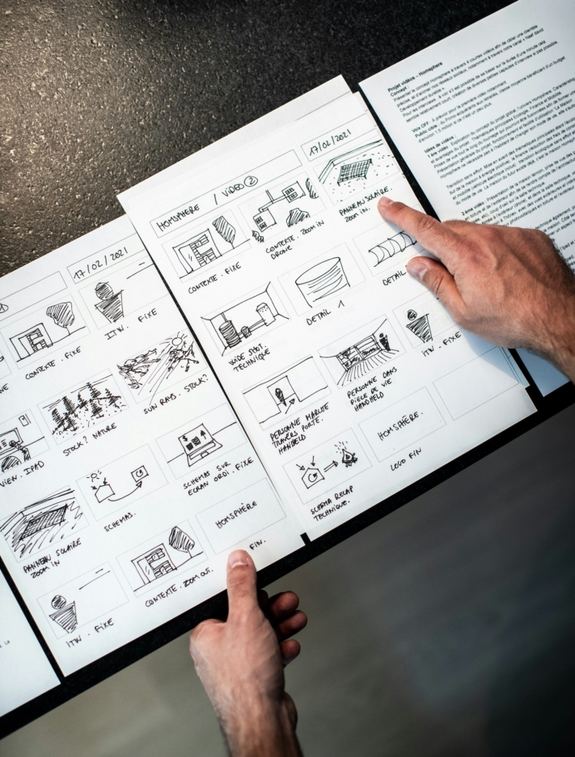
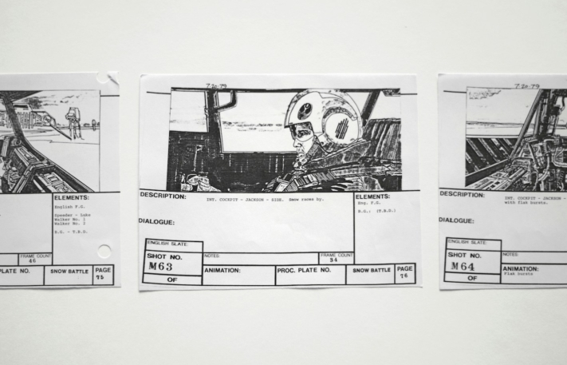
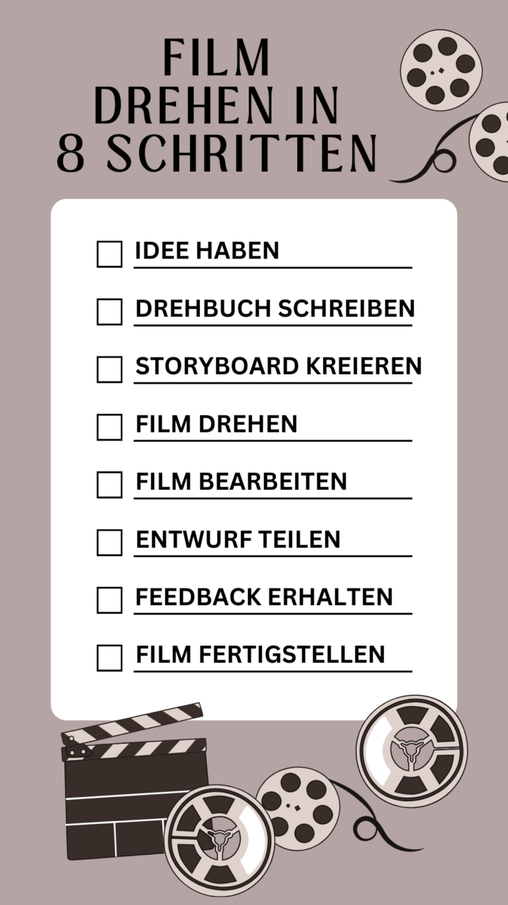
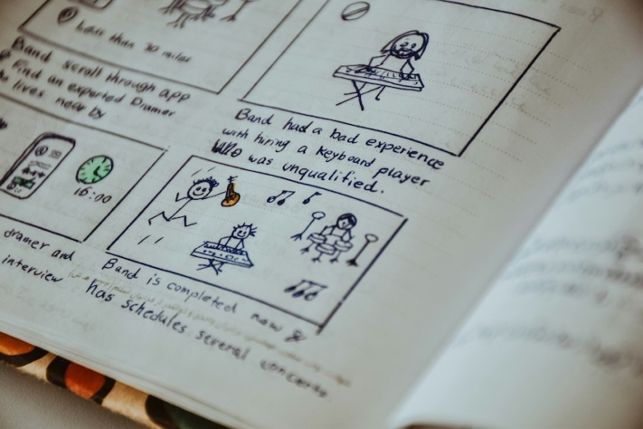

Tanto si estás creando un vídeo de imagen para tu empresa, un cortometraje para un festival de cine o la próxima superproducción de Hollywood, la creación de un guión **gráfico** puede marcar la diferencia. Un guión gráfico no es sólo una herramienta para estructurar tus **ideas creativas**, sino también para garantizar un **proceso de producción fluido**. En este artículo se explican la importancia y las ventajas de los guiones gráficos para proyectos cinematográficos de todo tipo y se presenta una plantilla de guión gráfico gratuita que le ayudará a dar vida a su visión.

Antes de rodar una película, hay que planificarla bien.

## ¿Qué es un guión gráfico?

Un storyboard es la **representación gráfica** o **boceto** de una historia. Se puede utilizar en **películas**, **animaciones**, **vídeos publicitarios** u otros **medios visuales**. Con la ayuda de una serie de imágenes o dibujos que muestren escenas clave o elementos de la trama, puedes planificar una narración a nivel visual antes de iniciar la producción propiamente dicha.

Los estilos de dibujo pueden variar considerablemente. Algunos dibujantes de storyboards crean ilustraciones extremadamente elaboradas, mientras que otros prefieren limitarse a simples dibujos de figuras de palo.

Ejemplo de representación visual de un guión gráfico

## Para qué sirve un guión gráfico

El guión gráfico da al equipo de producción una idea clara del aspecto que tendrá el vídeo al final. Sirve de guía a lo largo de todo el proceso y abarca diversas tareas:

- **Visualización:** el storyboard ofrece una representación visual de la trama, los personajes y las localizaciones para ilustrar la imagen global de la película.
- **Colaboración:** Con un guión gráfico, el director puede dejar claro a todos los presentes en el plató cómo concibe la escena. Así, todos saben qué hay que hacer y cuándo.
- **Ajustes de cámara:** El guión gráfico define los planos de cámara previstos, incluidos los ángulos, movimientos y cortes, para permitir una realización visual eficaz.
- **Planificación de recursos:** basándose en el guión gráfico, puede planificar y utilizar eficazmente recursos como actores, localizaciones, atrezzo y efectos para optimizar la producción.

## Las ventajas de un guión gráfico

Un guión gráfico tiene la importante ventaja de que visualiza **secuencias de acción complejas** y, por tanto, facilita su comprensión. Esto permite a tu equipo de producción entender tus ideas y realizarlas con mayor precisión. Deje fluir su creatividad y añada a sus bocetos elementos que quizá no había considerado antes. Siempre puedes **cambiar** y **adaptar** tu plantilla de guión gráfico durante el proceso creativo si se te ocurre algo espontáneamente.

Mientras perfeccionas tu historia y añades más detalles durante el proceso de planificación, puedes utilizar el guión gráfico para **reconocer errores en una** fase temprana. Esto te ahorrará mucho esfuerzo durante el **rodaje** y la **edición del vídeo**. Determina de antemano tantos detalles como sea posible, como el ritmo de la historia, para tener la cabeza despejada para lo esencial durante los agotadores días de rodaje.

## El proceso de rodaje

Para producir una película o un vídeo, primero hay que tener una **idea**. Piensa ante todo en el contenido, pero también en el objetivo y en el efecto que quieres causar en tus espectadores.

Si tu idea ya está completamente desarrollada, deberías escribirla en un **guión**. Así no olvidarás nada y podrás comprobar más fácilmente el sentido de tu historia.

Después viene el **storyboard**, en el que trasladas la trama de tu guión en forma de bocetos visuales. Presta atención a detalles como los ángulos de cámara, la atmósfera, el sonido y la música para dar profundidad a tu historia.



Sólo se debe empezar a **rodar** una vez que se hayan ultimado el guión y el guión gráfico. Porque en una película que no está completamente planificada y organizada, el rodaje suele ser caótico e implica mucho más esfuerzo del realmente necesario.

Una vez finalizada la filmación, el siguiente paso es la transición a la **edición de vídeo**. Una vez visionado, seleccionado y editado el material, puedes obtener una primera **reacción** de tu entorno. De este modo, podrá comprobar si su película es comprensible y tangible para los de fuera. A partir de ahí, puedes utilizar los comentarios para **finalizar** la película.

El guión gráfico forma parte de la fase de planificación; el rodaje sólo tiene lugar después.

## Qué debe incluir su guión gráfico

Como ya se ha dicho, un guión gráfico contiene **imágenes** o **dibujos** para visualizar las distintas escenas. Puede dibujarlos a mano o, si tiene poco talento artístico, crear un guión gráfico digital. Describa las escenas, pero no con demasiado detalle. Resuma brevemente los elementos importantes, como **el contenido**, la **escenografía** y los **diálogos**.

Al crear tu guión gráfico, asegúrate también de **numerar** las **secciones** para que ni tú ni tu equipo os confundáis en el orden. Una buena forma de hacerlo es dividirlo en **secuencias** y **escenas**. Piensa de antemano qué [ajustes de cámara](https://filmpuls.info/einstellungen-einstellungsgroesse-bildausschnitt/) quieres utilizar en cada escena y anótalos también.

Esto cubre los puntos más importantes. Sin embargo, también puede añadir otra información que considere necesaria, como **las funciones** implicadas, el **atrezzo** o las **instrucciones de** edición.

No hace falta ser un gran artista para crear un buen guión gráfico.

## Consejos para un guión gráfico perfecto

Para que tu storyboard realmente te permita realizar tu proyecto de forma óptima, además de los consejos básicos, deberías aplicar los siguientes:

- **Bocetos:** Las imágenes y los dibujos deben ser sencillos y directos. No necesita obras de arte detalladas para visualizar su visión. No obstante, preste atención a la profundidad espacial y distinga entre el fondo y el primer plano.
- **Enfoque:** No se pierda en los pequeños detalles, pero tenga siempre en mente el panorama general. Es la única forma de trazar un hilo rojo claro a través de tu película y garantizar la continuidad de tu historia.
- **Texto:** Evite los textos demasiado detallados y largos. Un guión gráfico debe servir sobre todo para ofrecer una primera visión de conjunto de todo el proyecto cinematográfico. Los diálogos largos, en cambio, pertenecen al guión.
- **Tamaño de la imagen:** lo ideal es crear los bocetos directamente en el formato en el que luego se rodará la película. Así te asegurarás de que todo encaje en el encuadre durante el rodaje y no tengas que cambiar nada con poca antelación.
- Cámara**:** Un guión gráfico puede tener diferentes aspectos. Puedes resumir una secuencia o crear un boceto independiente para cada movimiento de cámara. Si optas por esta última opción, tiene sentido dibujar los movimientos en tus representaciones visuales.

## Utilice la plantilla gratuita de SeaTable

Con la [plantilla gratuita](https://seatable.io/es/vorlage/k6o24najsho8oipbkwmo8g/) de SeaTable, no sólo podrás crear fácilmente tu guión gráfico, sino también **compartirlo** con otras personas y **editarlo conjuntamente** de forma eficaz.

La plantilla de guión gráfico te permite planificar claramente la **trama**, el **escenario**, los **diálogos** y **los ángulos de cámara**. También puedes añadir fácilmente **personajes**, **accesorios** y **direcciones de** escena para pensar y grabar tu historia hasta el más mínimo detalle.

Si desea utilizar [esta plantilla](https://seatable.io/es/vorlage/k6o24najsho8oipbkwmo8g/) de SeaTable para su proyecto cinematográfico, sólo tiene que [registrarse]() gratuitamente con su dirección de correo electrónico. A continuación, puede empezar a crear su guión gráfico individual en un abrir y cerrar de ojos e impulsar eficazmente sus proyectos cinematográficos.
