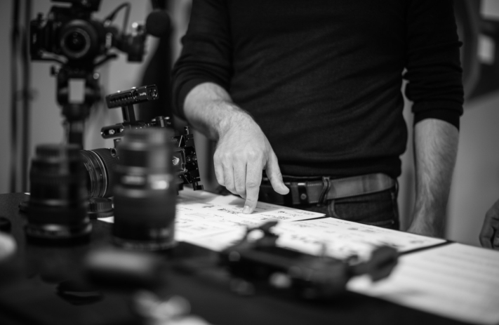
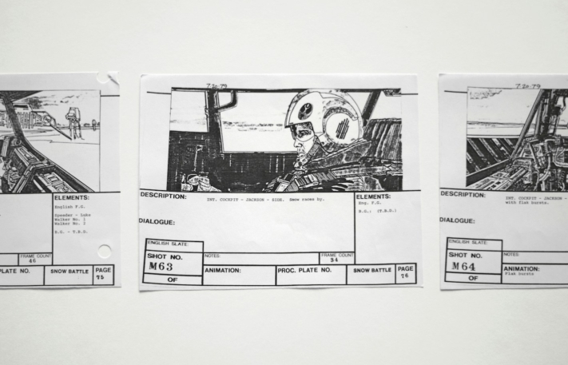
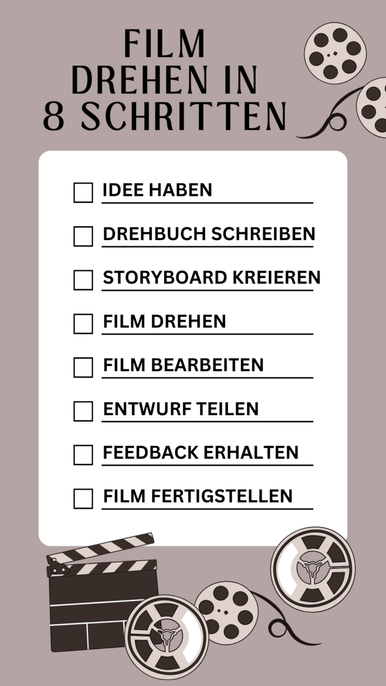
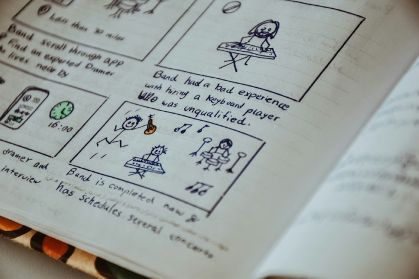

Que vous soyez en train de concevoir une vidéo d'entreprise, un court-métrage pour un festival de cinéma ou la prochaine superproduction hollywoodienne, la création d'un **storyboard** peut faire toute la différence. Un storyboard n'est pas seulement un outil pour structurer vos **idées créatives**, mais aussi pour garantir le **bon déroulement de la production**. Cet article explique l'importance et l'utilité des storyboards pour les projets de films en tout genre et présente un modèle de storyboard gratuit qui vous permettra de donner vie à vos visions.

Avant de tourner un film, il faut d'abord bien le planifier.

## Qu'est-ce qu'un storyboard ?

Le storyboard est la **représentation graphique** ou l'**esquisse** d'une histoire. Vous pouvez l'utiliser partout où **des films**, **des animations**, **des vidéos publicitaires** ou d'autres **médias visuels** entrent en jeu. Grâce à une série d'images ou de dessins représentant des scènes ou des éléments clés de l'intrigue, vous pouvez planifier une narration sur le plan visuel avant de commencer la production proprement dite.

Les styles de dessin peuvent varier considérablement. Certains artistes de story-board créent des illustrations extrêmement élaborées, tandis que d'autres préfèrent se limiter à de simples dessins de bonshommes au trait.

Un exemple de représentation visuelle d'un story-board

## A quoi sert un storyboard ?

Le storyboard permet à votre équipe de production de se faire une idée claire de l'aspect final de la vidéo. Il sert de guide tout au long du processus et couvre différentes tâches :

- **Visualisation :** le storyboard offre une représentation visuelle de l'intrigue, des personnages et des lieux afin d'illustrer l'image globale du film.
- **Collaboration :** avec un storyboard, le réalisateur peut montrer à tous sur le plateau comment il imagine la scène. Ainsi, tout le monde sait ce qu'il faut faire et à quel moment.
- **Réglages de la caméra :** Le storyboard détermine les plans de caméra prévus, y compris les angles de vue, les mouvements et les coupes, afin de permettre une réalisation visuelle efficace.
- **Planification des ressources :** sur la base du storyboard, vous pouvez planifier et utiliser efficacement les ressources telles que les acteurs, les lieux, les accessoires et les effets afin d'optimiser la production.

## Les avantages d'un storyboard

Un storyboard présente l'avantage important de visualiser **des séquences d'action complexes** et de les rendre ainsi plus compréhensibles. Votre équipe de production peut ainsi comprendre les idées que vous avez et les mettre en œuvre avec plus de précision. Laissez votre créativité s'exprimer et ajoutez à vos croquis des éléments auxquels vous n'aviez peut-être pas pensé auparavant. Vous pouvez toujours **modifier** et **adapter** votre modèle de storyboard au cours du processus de création, si quelque chose vous vient spontanément à l'esprit.

Pendant que vous affinez votre histoire et ajoutez des détails au cours du processus de planification, le storyboard vous permet de **détecter les erreurs à un stade précoce**. Vous économiserez ainsi beaucoup d'efforts pendant le **tournage** et le **montage vidéo**. Déterminez à l'avance le plus de détails possible, comme le rythme de la narration, afin d'avoir l'esprit libre pour l'essentiel pendant les journées de tournage éprouvantes.

## Le processus de réalisation d'un film

Pour produire un film ou une vidéo, vous devez d'abord avoir une **idée**. Pensez en premier lieu au contenu, mais aussi à l'objectif et à l'effet que vous souhaitez produire sur vos spectateurs.

Si votre idée est déjà mûre, vous devriez la consigner par écrit dans un **scénario**. Ainsi, vous n'oublierez rien et pourrez plus facilement vérifier la pertinence de votre histoire.

Ce n'est qu'ensuite qu'intervient le **storyboard**, dans lequel vous reportez l'action de votre scénario sous forme d'esquisses visuelles. Veillez à ce que les détails tels que les réglages de la caméra, l'atmosphère, le son et la musique soient pris en compte afin de donner de la profondeur à votre histoire.



Ce n'est que lorsque le scénario et le storyboard sont finalisés que le **tournage** peut commencer. En effet, si le film n'est pas entièrement planifié et organisé, le tournage se déroule souvent de manière chaotique et demande beaucoup plus d'efforts que nécessaire.

Une fois le tournage terminé, l'étape suivante consiste à passer au **montage vidéo**. Après avoir visionné, sélectionné et édité le matériel, vous pouvez demander un premier **feedback** à votre entourage. Vérifiez ainsi si votre film est compréhensible et tangible pour les personnes extérieures. Vous pourrez ensuite **finaliser** votre **film** grâce aux commentaires reçus.

Le storyboard fait partie de la phase de planification - ce n'est qu'ensuite que le tournage a lieu.

## Ce que doit contenir votre story-board

Comme mentionné précédemment, un storyboard contient **des images** ou **des dessins** pour représenter visuellement les différentes scènes. Vous pouvez les dessiner à la main ou, si vous n'avez qu'un talent artistique modéré, créer un storyboard numérique. Vous devez décrire les différentes scènes, mais pas de manière trop détaillée. Résumez brièvement les éléments importants tels que **le contenu**, le **décor** et **les dialogues**.

Lors de la création de votre story-board, veillez également à **numéroter** les **sections** afin que vous ou votre équipe ne vous trompiez pas dans l'ordre. Pour ce faire, il est judicieux de les diviser en **séquences** et en **scènes**. Réfléchissez à l'avance aux [plans de caméra](https://filmpuls.info/einstellungen-einstellungsgroesse-bildausschnitt/) que vous souhaitez utiliser dans les différentes scènes et notez-les également.

Les points les plus importants sont ainsi couverts. Selon les besoins, vous pouvez toutefois ajouter d'autres informations, comme par exemple **les rôles** impliqués, **les accessoires** ou **les instructions** pour le montage.

Vous n'avez pas besoin d'être un grand artiste pour créer un bon story-board.

## Conseils pour un storyboard parfait

Pour que votre storyboard apporte vraiment à votre projet un déroulement plus fluide et que vous puissiez réaliser votre projet de manière optimale, vous devriez appliquer les conseils suivants en plus des principes de base :

- **Les croquis :** Gardez vos images et vos dessins simples et faciles à réaliser. Pour illustrer vos visions, vous n'avez pas besoin d'œuvres d'art détaillées. Veillez toutefois à la profondeur de l'espace et à distinguer l'arrière-plan de l'avant-plan.
- **Focalisation :** ne vous perdez pas dans les détails, mais gardez toujours une vue d'ensemble. Ce n'est qu'ainsi que vous pourrez tirer un fil rouge clair à travers votre film et assurer la continuité de votre histoire.
- **Le texte :** Évitez les textes trop détaillés et trop longs. Un storyboard doit en premier lieu aider à donner un premier aperçu de l'ensemble du projet de film. Les longs dialogues, en revanche, ont leur place dans le scénario.
- **Taille de l'image :** dans le meilleur des cas, créez vos esquisses directement dans le format dans lequel vous allez ensuite tourner le film. Vous vous assurez ainsi que tout rentre dans le cadre pendant le tournage et que vous ne devez rien changer à la dernière minute.
- **Caméra :** un storyboard peut prendre différentes formes. Vous pouvez représenter une séquence de manière groupée ou faire un croquis pour chaque mouvement de caméra. Si vous optez pour cette dernière solution, il est judicieux de dessiner les mouvements dans vos représentations visuelles.

## Utilisez le modèle gratuit de SeaTable

Le [modèle gratuit]() de SeaTable vous permet non seulement de créer facilement votre storyboard, mais aussi de le **partager** et de le **collaborer** efficacement.

Le modèle de storyboard vous permet de planifier clairement **l'intrigue**, le **décor**, les **dialogues** et **les plans de caméra**. En outre, vous pouvez facilement ajouter **des personnages**, **des accessoires** et **des instructions de mise en scène** pour penser et fixer votre histoire dans les moindres détails.

Si vous souhaitez utiliser [ce modèle]() de SeaTable pour votre projet de film, il vous suffit de [vous inscrire]() gratuitement avec votre adresse e-mail. Vous pourrez ainsi commencer à créer votre storyboard personnalisé en un rien de temps et faire avancer efficacement vos projets de film.
