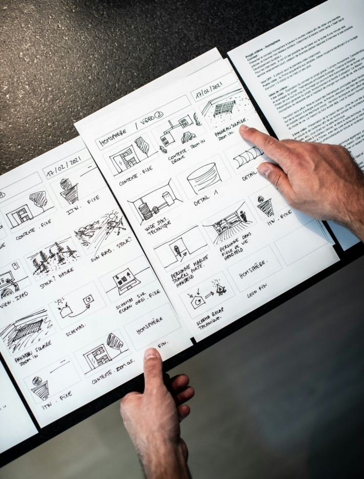

Создаете ли вы имиджевое видео для своей компании, короткометражный фильм для кинофестиваля или следующий голливудский блокбастер, создание **раскадровки** может иметь огромное значение. Раскадровка - это не только инструмент для структурирования ваших **творческих идей**, но и для обеспечения **бесперебойного производственного процесса**. В этой статье рассказывается о важности и преимуществах раскадровок для кинопроектов всех видов, а также представлен бесплатный шаблон раскадровки, который поможет вам воплотить свое видение в жизнь.

Прежде чем снимать фильм, его необходимо хорошо спланировать.

## Что такое раскадровка?

Раскадровка - это **графическое изображение** или **эскиз** истории. Ее можно использовать в **фильмах**, **анимации**, **рекламных роликах** и других **визуальных медиа**. С помощью серии изображений или рисунков, показывающих ключевые сцены или элементы сюжета, вы можете спланировать повествование на визуальном уровне еще до начала производства.

Стили рисования могут быть самыми разными. Некоторые раскадровщики создают чрезвычайно сложные иллюстрации, в то время как другие предпочитают ограничиваться простыми рисунками.

Пример визуального представления раскадровки

## Для чего используется раскадровка

Раскадровка дает вашей съемочной группе четкое представление о том, как будет выглядеть видео в итоге. Она служит руководством на протяжении всего процесса и охватывает различные задачи:

- **Визуализация:** раскадровка обеспечивает визуальное представление сюжета, персонажей и мест действия, иллюстрируя общую картину фильма.
- **Совместная работа:** С помощью раскадровки режиссер может дать понять всем участникам съемок, как он представляет себе сцену. Таким образом, все знают, что и когда нужно делать.
- **Настройки камеры:** Раскадровка определяет планируемые съемки камеры, включая ракурсы, движения и разрезы, чтобы обеспечить эффективную визуальную реализацию.
- **Планирование ресурсов:** на основе раскадровки вы можете эффективно планировать и использовать такие ресурсы, как актеры, локации, реквизит и эффекты, чтобы оптимизировать производство.

## Преимущества раскадровки

Раскадровка имеет то существенное преимущество, что она визуализирует **сложные последовательности действий** и тем самым облегчает их понимание. Это позволит вашей съемочной группе понять ваши идеи и реализовать их более точно. Дайте волю своему творчеству и добавьте в свои эскизы элементы, о которых вы, возможно, раньше не задумывались. Вы всегда можете **изменить** и **адаптировать** шаблон раскадровки во время творческого процесса, если вам что-то спонтанно придет в голову.

По мере уточнения сюжета и добавления деталей в процессе планирования вы можете использовать раскадровку, чтобы **распознать ошибки на ранней стадии**. Это сэкономит вам массу усилий во время **съемок** и **монтажа**. Заранее определите как можно больше деталей, например, темп повествования, чтобы во время напряженных съемочных дней у вас была ясная голова в отношении самого необходимого.

## Процесс создания фильма

Чтобы создать фильм или видеоролик, сначала нужно придумать **идею**. В первую очередь подумайте о содержании, а также о цели и о том, какой эффект вы хотите произвести на зрителей.

Если ваша идея уже полностью проработана, запишите ее в виде **сценария**. Так вы ничего не забудете и сможете легче проверить осмысленность вашей истории.

Затем следует **раскадровка**, в которой вы переносите сюжет своего сценария в виде визуальных эскизов. Уделите внимание таким деталям, как ракурсы камеры, атмосфера, звук и музыка, чтобы придать вашей истории глубину.



Приступать к **съемкам** следует только после завершения работы над сценарием и раскадровкой. Ведь если фильм не полностью спланирован и организован, съемки часто проходят хаотично и требуют гораздо больше усилий, чем необходимо.

После завершения съемок следующим шагом будет переход к **редактированию видео**. После того как материал будет просмотрен, отобран и отредактирован, вы сможете получить первые **отзывы** от окружения. Проверьте, понятен ли ваш фильм и осязаем ли он для посторонних. Затем вы можете использовать полученные отзывы для **окончательной доработки фильма**.

Раскадровка является частью фазы планирования - съемки проводятся только после этого.

## Что должна включать в себя раскадровка

Как уже говорилось, раскадровка содержит **фотографии** или **рисунки** для визуализации различных сцен. Вы можете нарисовать их от руки или - если вы обладаете лишь умеренным художественным талантом - создать цифровую раскадровку. Вам следует описать соответствующие сцены, но не слишком подробно. Кратко опишите важные элементы, такие как **содержание**, **декорации** и **диалоги**.

При создании раскадровки обязательно **пронумеруйте разделы**, чтобы вы или ваша команда не запутались в порядке следования. Хорошим способом сделать это является разделение на **последовательности** и **сцены**. Заранее продумайте, какие [настройки камеры](https://filmpuls.info/einstellungen-einstellungsgroesse-bildausschnitt/) вы хотели бы использовать в соответствующих сценах, и запишите их.

Это охватывает самые важные моменты. Однако при необходимости вы можете добавить и другую информацию, например, о задействованных **ролях**, **реквизите** или **инструкциях по** редактированию.

Чтобы создать хорошую раскадровку, не обязательно быть великим художником.

## Советы по созданию идеальной раскадровки

Чтобы раскадровка действительно способствовала более плавному ходу проекта и оптимальной его реализации, в дополнение к основным принципам следует применять следующие советы:

- **Наброски:** Сохраняйте простоту и понятность своих фотографий и рисунков. Вам не нужны детальные произведения искусства для визуализации вашего видения. Однако обратите внимание на пространственную глубину и разграничьте задний и передний план.
- **Фокус:** не теряйтесь в мелочах, но всегда держите в голове общую картину. Только так можно провести четкую красную нить через весь фильм и обеспечить непрерывность истории.
- **Текст:** Избегайте слишком подробных и длинных текстов. Раскадровка должна в первую очередь помочь дать первоначальное представление обо всем кинопроекте. Длинным диалогам, напротив, место в сценарии.
- **Размер изображения:** В идеале создавайте эскизы непосредственно в том формате, в котором впоследствии будете снимать фильм. Таким образом, все поместится в кадр во время съемок, и вам не придется ничего менять по первому требованию.
- **Камера:** Раскадровка может выглядеть по-разному. Вы можете обобщить последовательность или создать отдельный эскиз для каждого движения камеры. Если вы выберете последний вариант, имеет смысл нарисовать движения в визуальном представлении.

## Используйте бесплатный шаблон от SeaTable

С помощью [бесплатного шаблона]() от SeaTable вы сможете не только легко создать свою раскадровку, но и **поделиться** ею с другими и эффективно **работать над ней вместе**.

Шаблон раскадровки позволяет четко спланировать **сюжет**, **декорации**, **диалоги** и **ракурсы камеры**. Вы также можете легко добавить **персонажей**, **реквизит** и **режиссерские указания**, чтобы продумать и записать свою историю до мельчайших деталей.

Если вы хотите использовать [этот шаблон]() от SeaTable для своего кинопроекта, просто [зарегистрируйтесь]() бесплатно, указав свой адрес электронной почты. После этого вы сможете в кратчайшие сроки приступить к созданию своей индивидуальной раскадровки и эффективно продвигать свои кинопроекты.
