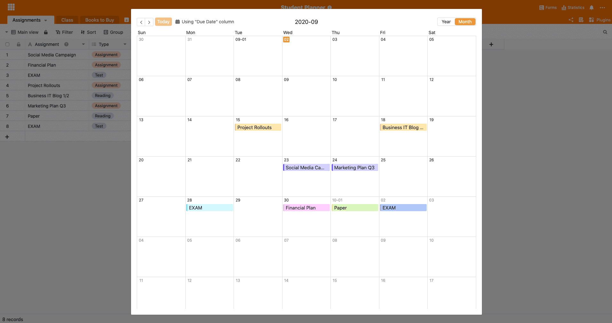

The 2020 winter semester is just around the corner and you want to really get started this time? SeaTable offers you the perfect solution. You can now keep track of all your exams, submissions and other to-dos. always in view. Your individual student planner is customised to your needs in no time at all. Let's take a closer look at the ready-made SeaTable template in more detail:

## Structure of the Student Planner

Our student planner has a very simple structure. It consists of three different tables. The calendar view and the different views fulfil the full potential of your semester planner, so you are guaranteed to master your upcoming semester:

### Assignments table

In the table "Assignments" you can enter all your exams, submissions and other achievements. The type of assignment can be selected directly in the second column of the table. Then you add the corresponding course for which the assignment has to be done and enter the due date. If you format the "Done" column as a checkbox column, you can check off completed tasks immediately. SeaTable also offers the possibility to upload files to the tables. This way you have everything you need in one place and you can also share your results and work with your fellow students.

### Class" table

In the table "Class" you can enter all your courses that you are taking in the respective semester. Here you can also add contact information of the respective professor and save yourself the trouble of googling in case you need to contact them. The column "Assignments" in this table is linked to the first table, so you can see immediately which exams have to be taken in which subject.

### Books to buy" table

In the table "Books to buy" you can mark the literature you need. Textbooks are expensive, so in the "Notes" or "URL" column you can save links of used books or the free online variants of the book. Of course you can also add other needed materials to this table. Just change the name of the table or create an additional column with different categories of needed materials (e.g. books, subscriptions, writing materials, etc.), which you can then easily group by the Category column.

Did you know that there are now many platforms for second-hand textbooks? Take a look at [Rebuy](https://www.rebuy.de/kaufen/buecher-wissen-und-bildung-schule-und-lernen-berufs-und-fachschulbuecher) or [Studibuch](https://shop.studibuch.de), maybe you'll find your textbook there at a good price.

### Use the calendar view

To use the full power of your student planner, you can use the [calendar view](). To do this, simply add the calendar plugin and you will then see all your deadlines clearly arranged in your personal calendar.

### Different views

SeaTable provides a targeted view of needed information through different views. You can add as many views as you want in your student planner to always see exactly what is relevant. Change the top left view from "Main view" to "To-do" to see which tasks still need to be done. To do this, we simply filtered this view by the "Done" column without checkmarks. We have created another view for you. In the "Class View" all your to-dos are grouped by course. So you can quickly see in which subject you still have to do your work.

## Ready for the new semester

With your new [semester planner](), nothing stands in the way of a successful semester. You can design your student planner individually at SeaTable and adapt it to your needs. Register now for [free]() and get a productive start to the 2020 winter semester!
