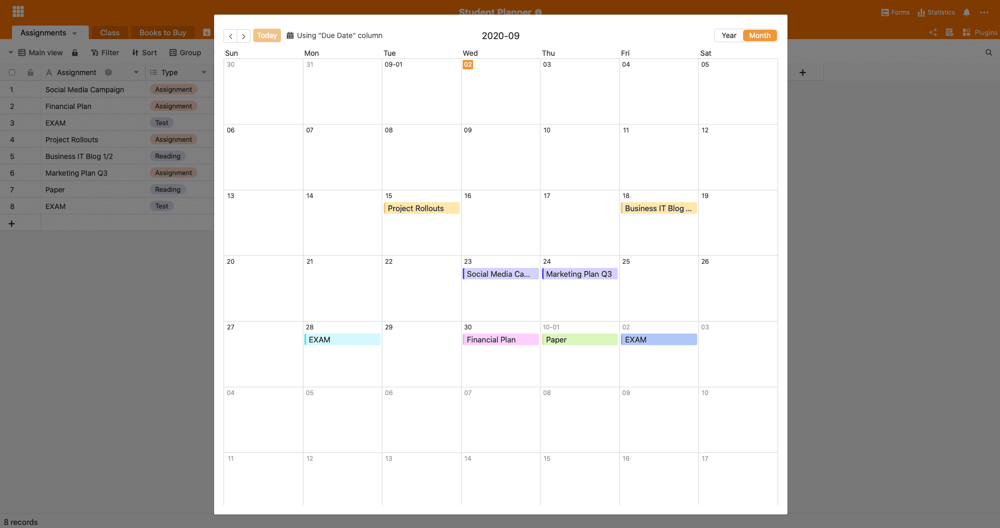

Зимний семестр 2020 года уже не за горами, и вы хотите по-настоящему начать учебу в этот раз? SeaTable предлагает вам идеальное решение. Теперь вы можете отслеживать все свои экзамены, сданные работы и другие дела. всегда на виду. Ваш индивидуальный планировщик для студентов будет создан в соответствии с вашими потребностями в кратчайшие сроки. Давайте подробнее рассмотрим готовую таблицу SeaTable шаблон более подробно:

## Структура студенческого планировщика

Наш студенческий планировщик имеет очень простую структуру. Он состоит из трех различных столов. Вид календаря и различные виды реализуют весь потенциал вашего планировщика семестра, так что вы гарантированно справитесь с предстоящим семестром:

### Таблица "Назначения

В таблицу "Задания" можно заносить все экзамены, представления и другие работы. Тип задания можно выбрать непосредственно во втором столбце таблицы. Затем добавьте соответствующий курс, по которому должно быть выполнено задание, и укажите срок выполнения. Если оформить колонку "Выполнено" как колонку с флажками, то можно сразу же отмечать выполненные задания. SeaTable также предлагает возможность загрузки файлов в таблицы. Таким образом, вы будете иметь все необходимое в одном месте, а также сможете поделиться своими результатами и работой с коллегами по учебе.

### Таблица "Класс

В таблицу "Класс" можно занести все курсы, которые вы изучаете в данном семестре. Здесь же можно добавить контактную информацию соответствующего преподавателя и избавить себя от необходимости "гуглить" в случае необходимости связаться с ним. Колонка "Задания" в этой таблице связана с первой таблицей, поэтому можно сразу увидеть, какие экзамены по какому предмету необходимо сдать.

### Таблица "Книги для покупки

В таблице "Книги для покупки" можно сделать пометку о необходимой литературе. Учебники стоят дорого, поэтому в столбце "Примечания" или "URL" можно сохранить ссылки на книги, бывшие в употреблении, или, если это применимо, на бесплатные онлайновые версии книги. Разумеется, в эту таблицу можно добавить и другие необходимые материалы. Для этого достаточно изменить название таблицы или создать дополнительный столбец с различными категориями необходимых материалов (например, книги, подписки, письменные принадлежности и т.д.), которые затем можно просто сгруппировать в соответствии с колонкой "Категория".

Знаете ли вы, что сейчас существует множество платформ для продажи подержанных учебников? Посмотрите на [Rebuy](https://www.rebuy.de/kaufen/buecher-wissen-und-bildung-schule-und-lernen-berufs-und-fachschulbuecher) или [Studibuch](https://shop.studibuch.de), возможно, вы найдете там свой учебник по хорошей цене.

### Использование представления календаря

Чтобы использовать все возможности своего студенческого планировщика, вы можете использовать [вид календаря](https://seatable.io/ru/docs/handbuch/seatable-nutzen/ansichten/). Для этого просто добавьте плагин календаря, и вы увидите, что все ваши сроки четко распределены в вашем личном календаре.

### Разные взгляды

SeaTable позволяет целенаправленно просматривать необходимую информацию с помощью различных представлений. Вы можете добавить сколько угодно представлений в свой студенческий планировщик, чтобы всегда видеть именно то, что актуально. Измените представление в левом верхнем углу с "Основного вида" на "Дела", чтобы увидеть, какие задачи еще необходимо выполнить. Для этого мы просто отфильтровали это представление по столбцу "Выполнено" без галочек. Мы создали для вас еще одно представление. В представлении "Класс" все ваши дела сгруппированы по курсам. Таким образом, вы можете быстро увидеть, по какому предмету вам еще предстоит выполнить работу.

## Готовность к новому семестру

С вашим новым [планировщиком семестра]() ничто не помешает успешному семестру. В SeaTable вы можете индивидуально разработать свой студенческий планировщик и адаптировать его к своим потребностям. Зарегистрируйтесь [бесплатно]() и продуктивно начните зимний семестр 2020 года!
