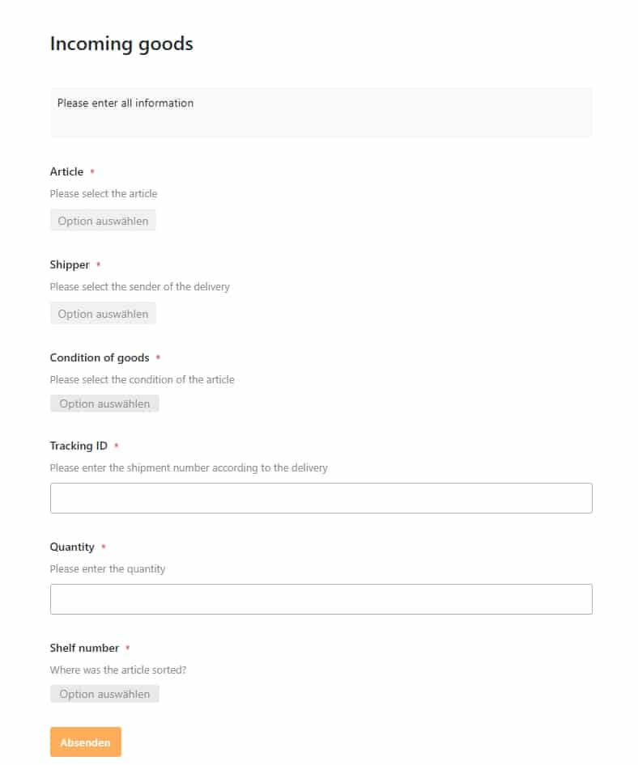

The interlocking of several processes along the value chain of a product is very complex: from procurement to storage to the end customer. Processes and procedures must always be efficiently planned, adhered to and optimised so that the end customer also receives the desired product at the right time, namely when he wants it. SeaTable gives you the opportunity to optimally map your supply chain management and always remain in control of the entire value chain.

## **What is supply chain management anyway?**

Generally speaking, supply chain management (SCM) is all about planning, controlling and integrating various activities along the value chain of one or more products. This usually starts with the raw material supplier and ends with your customer. A supply chain manager is therefore responsible for the integrated process-oriented planning and control of all flows of goods, information and money. The actual goals of supply chain management are the optimisation and cost reduction of logistics chains.

These include, among other things, the rapid reduction of inventories, the reduction of storage costs, the safeguarding or securing of timely delivery (just-in-time supply), the shortening of cash-to-cash cycles, the increase in delivery reliability, as well as the shortening of throughput times. To achieve this, it is important that the exchange of information functions perfectly, both internally and externally. Optimal interfaces must be created where information can flow from A to B in fractions of a second and reach the responsible persons immediately.

## **3 important steps of supply chain management**

SCM can be divided into three important steps. The aim of all steps should be to eliminate the negative effects or at least reduce them to a minimum so that the entire value chain can also function optimally.

1. **Material flow**: The material flow deals with the actual transport of the goods and includes the route from the raw material supplier via the central warehouse to the end customer, as well as the return of the goods.
2. **Information flow**: All relevant information about orders and their deliveries is transferred here. This means that all information, whether from external (partners) or internal (departments), is centrally bundled in one place. This makes it possible to make faster and more efficient decisions in the event of delivery problems, for example.
3. **Financial flow**: The financial flow includes credit terms, payment schedules, as well as goods shipments and ownership.

## **Levels in supply chain management**

In supply chain management, a distinction is made between three different levels when it comes to the actual strategy. These differ in their temporal orientation.

1. **Operational supply chain management**: All decisions can be implemented at short notice or within days or a few weeks. Normally, this concerns processes that can be implemented quickly, such as scheduling, loading or order processing. Furthermore, relationships between orders and stocks are also analysed. The goal here is to achieve the highest possible customer satisfaction, as customer relations are the primary focus.
2. **Tactical supply chain:** All decisions can be implemented in the medium term or between a quarter and a year. These include decisions regarding production quantities, production resources, inventories, shipping strategies and transports.
3. **Strategic supply chain management**: Here decisions are made with long-term success in mind. These include, for example, the choice of location for one's own warehouse, production and storage capacities, investments, supplier selection, make-or-buy decisions and distribution strategies.

## **The individual stages of the supply chain in SCM**

Supply chain management covers all processes and steps along the value chain and includes many areas of a company. This primarily involves product development, procurement, production and [distribution](https://seatable.io/en/vertrieb/).

1. **Product development**: The actual suppliers take up a large part here. It is important to identify suitable suppliers and to design a flexible and, above all, fast procurement process. The focus is on the company's own policy when selecting suppliers. The products and suppliers should match the company's own quality requirements and values.
2. **Procurement area**: The goal is to ensure an optimal supply of one's own company. Of course, this should always be done economically and the procurement and warehousing costs should be kept as low as possible. An efficient and permanent supply of materials and an optimal storage concept are the top priorities.
3. **Production area**: In this area, all production processes are analysed in detail and optimised. The focus here is on the resources of materials, production equipment and tools. Packaging concepts and staff qualification are also part of this area.
4. **Distribution area**: Here everything revolves around the transport area, such as the means of transport, their capacity and utilisation. Furthermore, there is a constant effort to optimise transport routes in order to reduce overall costs.

## **How to optimise your supply chain management in SeaTable**

SeaTable creates a place where all information can converge. This allows you to efficiently map your supply chain management in just a few steps and clicks. Record all necessary information, such as your suppliers, branches, incoming and outgoing orders, your product portfolio and keep an eye on your entire warehouse. SeaTable offers many possibilities to flexibly adapt your supply chain processes to your needs.

[Click here to go directly to our template "Supply Chain Management](https://seatable.io/en/vorlage/lrtcit5zqratbf0rpidxlw/)

### **Enter your suppliers and branches in just a few steps**

In SeaTable you can enter and track your suppliers in just a few steps. A supplier ID is automatically generated when creating a new row . You only need to enter the name of the supplier, the address, the email address, the website, the shipping service provider and the category of the goods. The spreadsheet is linked to the other spreadsheets "Article Master" and "Incoming Goods". This enables you to permanently exchange information or synchronise between the individual spreadsheets so that you are always up-to-date.

Your suppliers in SeaTable

In the "Stores" spreadsheet, you have the option of entering all your different shops with the most important information, such as the name of the individual shop, the address, the store manager and the email address. The data also goes directly into the map plug-in. This means that you always have an overview of all your branches.

Keep an eye on all branches

### **Goods receipts and goods issues via web form**

Record your flow of goods easily via a web form, to which you give access to your responsible employees.

Recording the goods receipt in SeaTable

In the "Incoming Goods" spreadsheet, everything revolves around the goods receipt of your ordered goods from the supplier. Via the web form, your warehouse employee enters all relevant information, such as the item name, the shipping service provider with which the goods arrived, the condition of the goods, the tracking ID, as well as the delivered quantity and the storage location. In addition, the customer has the option of entering notes about the condition of damaged goods. The recorded data then goes directly into your SeaTable table. The internal delivery ID and the person who entered the order are automatically generated in SeaTable. Information such as the internal article ID or the EAN number is taken directly from the 'Article Master' and 'Suppliers' spreadsheets via a [link column](https://seatable.io/en/docs/handbuch/seatable-nutzen/feld-typen/) and formula, thus reducing the manual process enormously.

Your goods receipt in SeaTable

By the way: You can see the condition of the goods directly with just one look at the spreadsheet. If rows is marked green, the goods are in good condition; if rows is marked red, the goods are in damaged condition and must be returned if necessary.

When your branches place orders or order outgoing goods, they can also conveniently order the required products via a web form. To do this, the individual branches only have to select their own store, the desired article and the quantity to be delivered. The worksheet "Outgoing goods" is linked to the worksheets "Stores" and "Article Master", so that information such as the email address of the shop and other article information is automatically added.

Order conveniently via web form

You now have the option of scheduling the shipment and informing the respective store at the touch of a button that the order is on its way. To do this, you simply have to enter the shipping date, the shipping service provider and the shipment number. By clicking on the "Send!" button in the "Shipping info to store" column, the predefined message will go out. Please note that you have to enter your email account for this.

Your outgoing goods in SeaTable

You can customise the content of the message according to your wishes and within a few clicks. To make it even easier for you to keep track of all items that have already been sent and those that are still open, they are grouped according to whether they have been sent or not. This grouping refers to the "Sent?" checkbox column. So that you can also see directly which shipping service provider was commissioned with the actual order, you will find a corresponding colour marking of rows in your spreadsheet.

By the way, with the help of the Kanban plug-in, you can easily classify the orders according to the respective shipping service provider or view the condition of the respective delivered goods. This helps you to make meaningful decisions even faster.

Kanban view in SeaTable

### **All your supply chain information in one place**

The heart of this template is the "Article Master" spreadsheet. This is where all the information from all the spreadsheets comes together. This gives the supply chain manager the possibility to create and maintain products, to provide them with a continuous automatic article ID, EAN numbers and product images, and at the same time to process, analyse and optimise his entire warehousing process.

All information about your goods at a glance

Important information on delivery times, quantities, ABC evaluation of the individual goods, as well as the option to place an order with the supplier with just one click, give the entire template the final touch and offer you as a supply chain manager real added value. With the help of formulas and a defined safety quantity in the warehouse, SeaTable automatically calculates the required quantity to be ordered.

With just one click on the "Reorder" button, you inform your supplier directly about the missing quantity or product. Here, too, you can customise the content of the message according to your wishes. Please note that you must first set up your email account in order to be able to use the function to its full extent.

With just one glance at row , you can see directly from the coloured markings whether your product is still available in sufficient quantities or whether it needs to be reordered. You also have the option of switching to the "Out of Stock" view. Here you will only see products that you need to reorder from your supplier.

### **Your 360° Dashboard in SeaTable**

To ensure that you also keep an eye on all the relevant figures and can quickly make meaningful decisions, it is important to create a place that prepares these figures for you in a structured manner and at the same time displays them graphically.

Your SCM Dashboard in SeaTable

With SeaTable's dashboard, which you can customise to your liking, you can find information on the states of goods at the monthly level, the distribution of your shops' individual orders by shipping provider, an overview of your warehouse (total quantity and safety quantity), a percentage distribution of your products by ABC rating, your warehouse by supplier, as well as the percentage distribution of quantities currently sourced by your suppliers.

## SeaTable takes your supply chain management to the next level

It doesn't always have to end with complex solutions, such as [Demand Works](http://demandworks.com/), for which you even end up spending a lot of money. With SeaTable, we create a way for you to capture your data quickly and efficiently.

This article should have shown you how flexibly SeaTable can be used. You can map your supply chain processes easily and in no time at all with SeaTable. Optimise your costs and your entire supply chain management. SeaTable adapts completely to your wishes.

What are you still waiting for? Your new supply chain management is already in the starting blocks.

[To the template "Supply Chain Management](https://seatable.io/en/vorlage/lrtcit5zqratbf0rpidxlw/)  
[Try SeaTable in the cloud for free now]()  
[Or prefer to run SeaTable Enterprise in your own data centre]()
