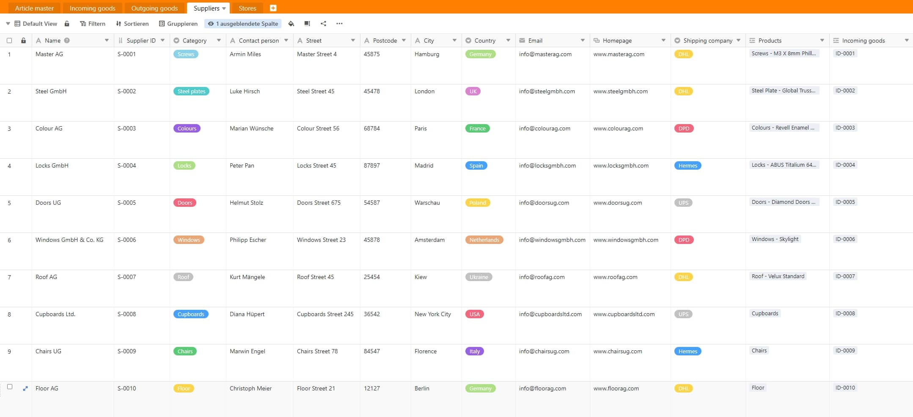
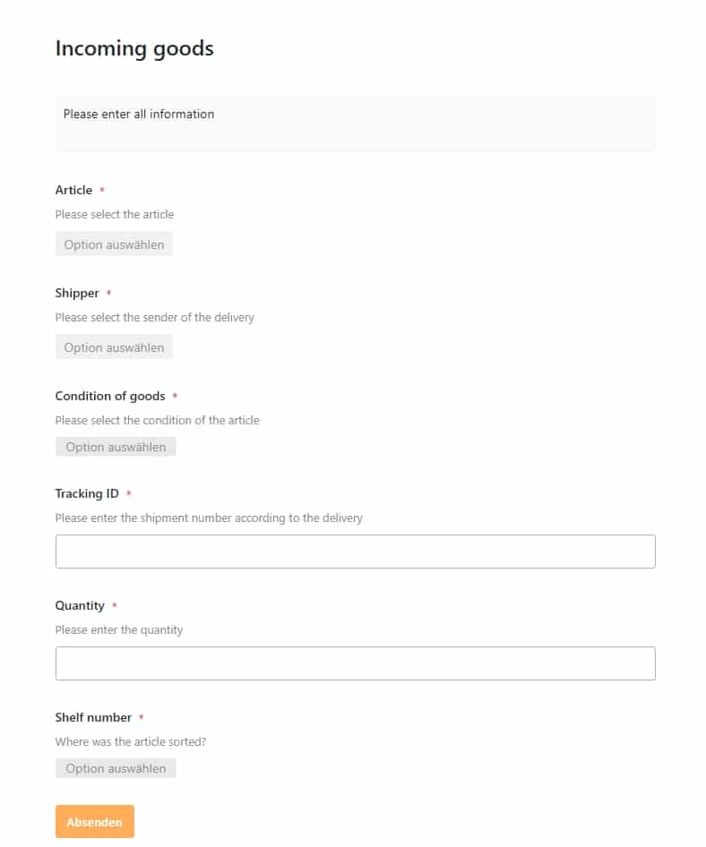
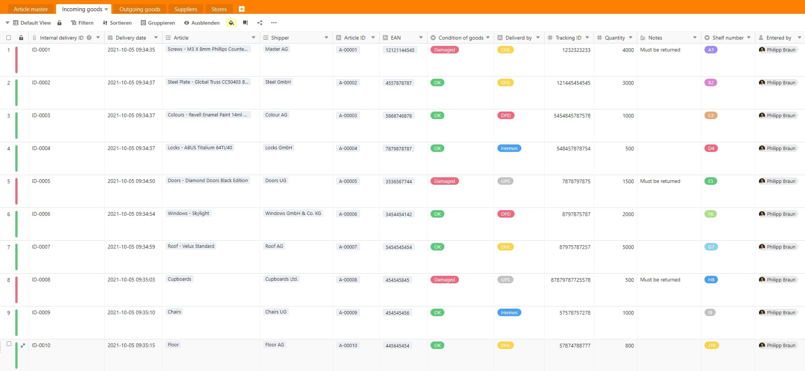
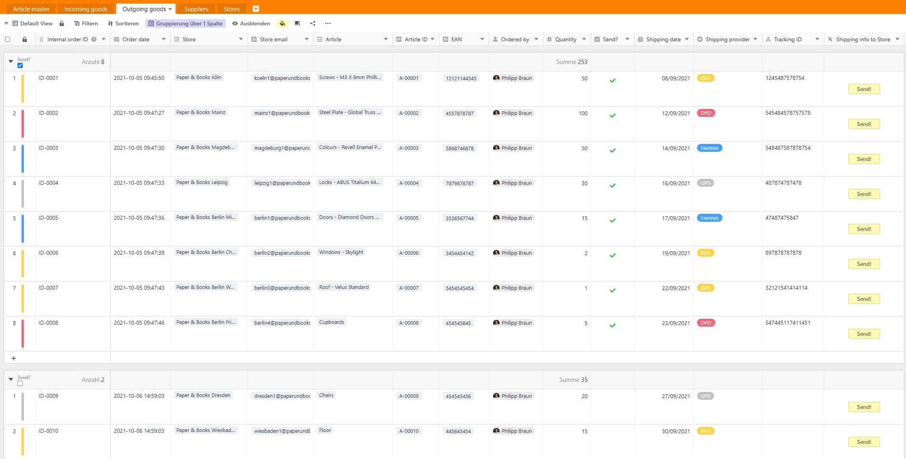
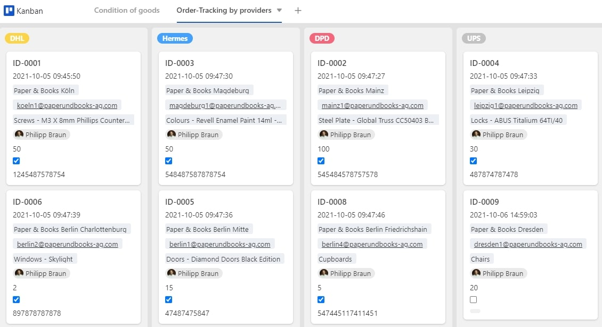
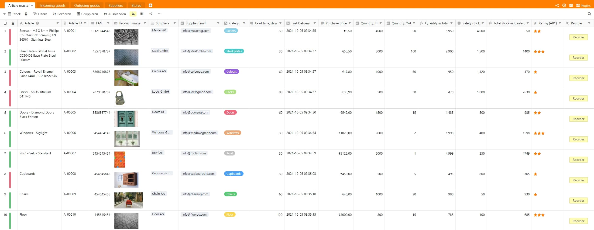
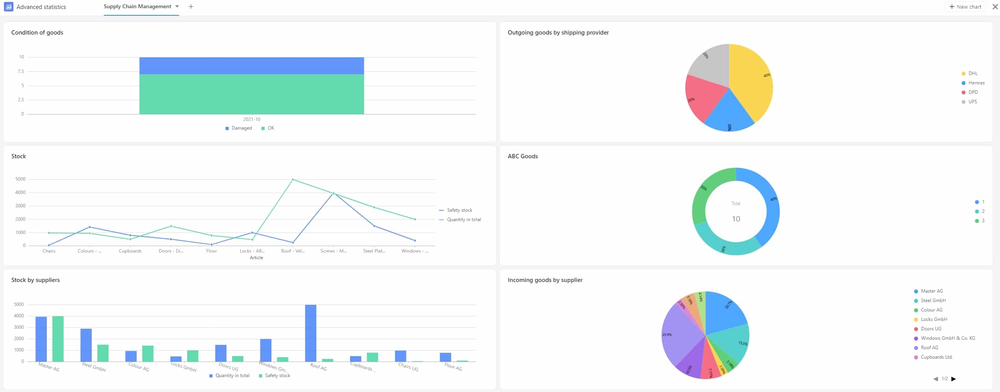

O encadeamento de vários processos ao longo da cadeia de valor de um produto é muito complexo: desde a aquisição, passando pelo armazenamento, até ao cliente final. Os processos e procedimentos devem ser sempre eficazmente planeados, cumpridos e optimizados para que o cliente final também receba o produto desejado na altura certa, nomeadamente quando o desejar. O SeaTable dá-lhe a oportunidade de mapear de forma óptima a gestão da sua cadeia de abastecimento e de permanecer sempre no controlo de toda a cadeia de valor.

## **O que é afinal a gestão da cadeia de abastecimento?**

Em termos gerais, a gestão da cadeia de abastecimento (SCM) tem tudo a ver com o planeamento, controlo e integração de várias actividades ao longo da cadeia de valor de um ou mais produtos. Isto normalmente começa com o fornecedor da matéria-prima e termina com o seu cliente. Um gestor da cadeia de abastecimento é, portanto, responsável pelo planeamento e controlo integrados de todos os fluxos de mercadorias, informação e dinheiro. Os objectivos reais da gestão da cadeia de abastecimento são a optimização e a redução de custos das cadeias logísticas.

Estes incluem, entre outras coisas, a rápida redução dos inventários, a redução dos custos de armazenamento, a salvaguarda ou garantia de entrega atempada (fornecimento just-in-time), o encurtamento dos ciclos cash-to-cash, o aumento da fiabilidade da entrega, bem como o encurtamento dos tempos de produção. Para o conseguir, é importante que a troca de informação funcione perfeitamente, tanto interna como externamente. Devem ser criadas interfaces ideais onde a informação possa fluir de A para B em fracções de segundo e chegar imediatamente às pessoas responsáveis.

## **3 etapas importantes da gestão da cadeia de abastecimento**

O SCM pode ser dividido em três etapas importantes. O objectivo de todos os passos deve ser eliminar os efeitos negativos ou pelo menos reduzi-los ao mínimo para que toda a cadeia de valor possa também funcionar de forma óptima.

1. **Fluxo de materiais**: O fluxo de materiais trata do transporte efectivo das mercadorias e inclui o percurso desde o fornecedor de matérias-primas através do armazém central até ao cliente final, bem como a devolução das mercadorias.
2. **Fluxo de informação**: Toda a informação relevante sobre encomendas e suas entregas é transferida aqui. Isto significa que toda a informação, quer seja externa (parceiros) ou interna (departamentos), é centralmente agrupada num único local. Isto torna possível tomar decisões mais rápidas e mais eficientes em caso de problemas de entrega, por exemplo.
3. **Fluxo financeiro**: O fluxo financeiro inclui condições de crédito, calendários de pagamento, bem como o envio de mercadorias e propriedade.

## **Níveis na gestão da cadeia de abastecimento**

Na gestão da cadeia de abastecimento, é feita uma distinção entre três níveis diferentes quando se trata da estratégia real. Estes diferem na sua orientação temporal.

1. **Gestão operacional da cadeia de abastecimento**: Todas as decisões podem ser implementadas a curto prazo ou dentro de dias ou algumas semanas. Normalmente, isto diz respeito a processos que podem ser implementados rapidamente, tais como a programação, o carregamento ou o processamento de encomendas. Além disso, são também analisadas as relações entre encomendas e stocks. O objectivo aqui é alcançar a maior satisfação possível do cliente, uma vez que as relações com o cliente são o foco principal.
2. **Cadeia de abastecimento táctica:** Todas as decisões podem ser implementadas a médio prazo ou entre um trimestre e um ano. Estas incluem decisões relativas a quantidades de produção, recursos de produção, inventários, estratégias de transporte e transportes.
3. **Gestão estratégica da cadeia de abastecimento**: Aqui as decisões são tomadas tendo em mente o sucesso a longo prazo. Estes incluem, por exemplo, a escolha da localização do próprio armazém, capacidades de produção e armazenamento, investimentos, selecção de fornecedores, decisões de compra ou de tomada de decisão e estratégias de distribuição.

## **As etapas individuais da cadeia de abastecimento em SCM**

A gestão da cadeia de fornecimento cobre todos os processos e passos ao longo da cadeia de valor e inclui muitas áreas de uma empresa. Isto envolve principalmente o desenvolvimento, aquisição, produção e [distribuição](https://seatable.io/pt/vertrieb/) de produtos.

1. **Desenvolvimento do produto**: Os fornecedores efectivos ocupam aqui uma grande parte. É importante identificar fornecedores adequados e conceber um processo de aquisição flexível e, acima de tudo, rápido. O foco é a política da própria empresa na selecção de fornecedores. Os produtos ou fornecedores devem corresponder aos requisitos e valores de qualidade da própria empresa.
2. **Área de compras**: O objectivo é assegurar um abastecimento óptimo da própria empresa. Evidentemente, isto deve ser sempre feito de forma económica e os custos de aquisição e armazenamento devem ser mantidos ao nível mais baixo possível. Um fornecimento eficiente e permanente de materiais e um conceito de armazenamento óptimo são as principais prioridades.
3. **Área de produção**: Nesta área, todos os processos de produção são analisados em pormenor e optimizados. O foco aqui é nos recursos de materiais, equipamento de produção e ferramentas. Os conceitos de embalagem e a qualificação do pessoal também fazem parte desta área.
4. **Área de distribuição**: Aqui tudo gira em torno da área de transporte, tais como os meios de transporte, a sua capacidade e utilização. Além disso, há um esforço constante para optimizar as rotas de transporte, a fim de reduzir os custos globais.

## **Como optimizar a sua gestão da cadeia de abastecimento em SeaTable**

O SeaTable cria um lugar onde toda a informação pode convergir. Isto permite-lhe mapear eficazmente a sua gestão da cadeia de abastecimento em apenas alguns passos e cliques. Registar todas as informações necessárias, tais como os seus fornecedores, sucursais, encomendas de entrada e saída, a sua carteira de produtos e manter um olho em todo o seu armazém. SeaTable oferece muitas possibilidades para adaptar flexivelmente os seus processos de cadeia de abastecimento às suas necessidades.

[Clique aqui para ir diretamente para o nosso modelo de "Gestão da cadeia de abastecimento]()

### **Introduza os seus fornecedores e filiais em apenas alguns passos**

Em SeaTable pode entrar e localizar os seus fornecedores em apenas alguns passos. Um ID de fornecedor é automaticamente criado quando se cria uma nova fila. Basta introduzir o nome do fornecedor, o endereço, o endereço electrónico, o website, o fornecedor do serviço de transporte e a categoria das mercadorias. A folha de cálculo está ligada às outras folhas de cálculo "Artigo Mestre" e "Mercadorias em Entrada". Isto permite-lhe trocar informações permanentemente ou sincronizar entre as folhas de cálculo individuais para que esteja sempre actualizado.

Os seus fornecedores em SeaTable

Na folha de cálculo "Lojas", tem a opção de entrar em todas as suas diferentes lojas com as informações mais importantes, tais como o nome da loja individual, o endereço, o gestor da loja e o endereço de correio electrónico. Os dados também vão directamente para o plug-in do mapa. Isto significa que tem sempre uma visão geral de todos os seus ramos.

Fique de olho em todos os ramos

### **Entrada e saída de mercadorias através do formulário web**

Registe facilmente o seu fluxo de mercadorias através de um formulário web ao qual dá acesso aos seus funcionários responsáveis.

Registo da recepção da mercadoria em SeaTable

Na folha de cálculo "Bens recebidos", tudo gira em torno da recepção dos bens encomendados do fornecedor. Através do formulário web, o seu empregado do armazém introduz todas as informações relevantes, tais como o nome do artigo, o fornecedor do serviço de transporte com o qual as mercadorias chegaram, o estado das mercadorias, o ID de localização, bem como a quantidade entregue e o local de armazenamento. Além disso, o cliente tem a opção de introduzir notas sobre o estado dos bens danificados. Os dados registados vão então directamente para a sua mesa SeaTable. O ID de entrega interno e a pessoa que introduziu a encomenda são gerados automaticamente no SeaTable. Informações como a identificação interna do artigo ou o número EAN são retiradas directamente das folhas de cálculo 'Artigo Mestre' e 'Fornecedores' através de uma [coluna](https://seatable.io/pt/docs/handbuch/seatable-nutzen/feld-typen/) e fórmula de [ligação](https://seatable.io/pt/docs/handbuch/seatable-nutzen/feld-typen/), reduzindo assim enormemente o processo manual.

A sua entrada de mercadorias em SeaTable

A propósito: Pode ver o estado dos bens directamente com apenas uma olhadela na folha de cálculo. Se as filas estiverem marcadas a verde, a mercadoria está em bom estado; se as filas estiverem marcadas a vermelho, a mercadoria está danificada e deve ser devolvida se necessário.

Quando as suas sucursais fazem encomendas ou encomendam mercadorias de saída, podem também encomendar convenientemente os produtos necessários através de um formulário web. Para tal, os ramos individuais apenas têm de seleccionar a sua própria loja, o artigo desejado e a quantidade a ser entregue. A ficha de trabalho "Saída de mercadorias" está ligada às fichas de trabalho "Lojas" e "Artigo Master", de modo a que informações como o endereço electrónico da loja e outras informações sobre o artigo sejam automaticamente adicionadas.

Encomendar convenientemente através do formulário web

Tem agora a opção de agendar o envio e informar a respectiva loja ao toque de um botão que a encomenda está a caminho. Para o fazer, basta introduzir a data de envio, o fornecedor do serviço de transporte e o número do envio. Ao clicar no botão "Enviar!" na coluna "Informação de envio a armazenar", a mensagem pré-definida sairá. Por favor, note que para isso tem de introduzir a sua conta de correio electrónico.

A sua mercadoria de saída em SeaTable

Pode personalizar o conteúdo da mensagem de acordo com os seus desejos e em poucos cliques. Para facilitar ainda mais o acompanhamento de todos os artigos que já foram enviados e os que ainda estão abertos, estes são agrupados de acordo com o facto de terem ou não sido enviados. Este agrupamento refere-se à coluna da caixa de verificação "Enviado? Para que também possa ver directamente qual o fornecedor de serviços de expedição que foi encomendado com a encomenda real, encontrará na sua folha de cálculo uma marcação a cores correspondente das filas.

A propósito, com a ajuda do plug-in Kanban, pode facilmente classificar as encomendas de acordo com o respectivo fornecedor de serviços de transporte ou ver o estado das respectivas mercadorias entregues. Isto ajuda-o a tomar decisões significativas ainda mais rapidamente.

Vista Kanban em SeaTable

### **Toda a sua informação sobre a cadeia de abastecimento num só local**

O coração deste modelo é a folha de cálculo "Artigo Mestre". É aqui que se reúnem todas as informações de todas as folhas de cálculo. Isto dá ao gestor da cadeia de abastecimento a possibilidade de criar e manter produtos, de lhes fornecer uma identificação automática contínua do artigo, números EAN e imagens do produto, e ao mesmo tempo processar, analisar e optimizar todo o seu processo de armazenamento.

Toda a informação sobre os seus bens num relance

Informações importantes sobre prazos de entrega, quantidades, avaliação ABC dos bens individuais, bem como a opção de fazer uma encomenda ao fornecedor com apenas um clique, dar o toque final ao modelo completo e oferecer-lhe, como gestor da cadeia de fornecimento, um verdadeiro valor acrescentado. Com a ajuda de fórmulas e de uma quantidade de segurança definida no armazém, a SeaTable calcula automaticamente a quantidade necessária a ser encomendada.

Com apenas um clique no botão "Reordenar", informa directamente o seu fornecedor sobre a quantidade ou produto em falta. Aqui, também, pode personalizar o conteúdo da mensagem de acordo com os seus desejos. Note que deve primeiro criar a sua conta de correio electrónico para poder utilizar a função em toda a sua extensão.

Com apenas um olhar para a linha, pode ver directamente das marcas coloridas se o seu produto ainda está disponível em quantidades suficientes ou se precisa de ser reordenado. Também tem a opção de mudar para a visualização "Out of Stock". Aqui apenas verá produtos que necessita de encomendar novamente ao seu fornecedor.

### **O seu Painel de 360° em SeaTable**

Para garantir que também vigia todas as figuras relevantes e pode rapidamente tomar decisões significativas, é importante criar um lugar que prepare estas figuras para si de uma forma estruturada e que ao mesmo tempo as apresente graficamente.

O seu SCM Dashboard em SeaTable

Com o painel de bordo do SeaTable, que pode personalizar ao seu gosto, pode encontrar informações sobre os estados das mercadorias a nível mensal, a distribuição das encomendas individuais das suas lojas por fornecedor de expedição, uma visão geral do seu armazém (quantidade total e quantidade de segurança), uma distribuição percentual dos seus produtos por classificação ABC, o seu armazém por fornecedor, bem como a distribuição percentual das quantidades actualmente fornecidas pelos seus fornecedores.

## SeaTable leva a sua gestão da cadeia de abastecimento para o próximo nível

Nem sempre tem de terminar com soluções complexas, tais como o [Demand Works](http://demandworks.com/), para o qual se acaba mesmo por gastar muito dinheiro. Com SeaTable, criamos uma forma de capturar os seus dados de forma rápida e eficiente.

Este artigo deveria ter-lhe mostrado como o SeaTable pode ser utilizado de forma flexível. Pode mapear os processos da sua cadeia de abastecimento facilmente e em pouco tempo com o SeaTable. Optimize os seus custos e toda a sua gestão da cadeia de abastecimento. SeaTable adapta-se completamente aos seus desejos.

De que é que ainda estás à espera? A sua nova gestão da cadeia de abastecimento já se encontra nos blocos de partida.

[Para o modelo "Supply Chain Management]()  
[Experimente agora o SeaTable na nuvem de graça]()  
[Ou prefere gerir o SeaTable Enterprise no seu próprio centro de dados]()
