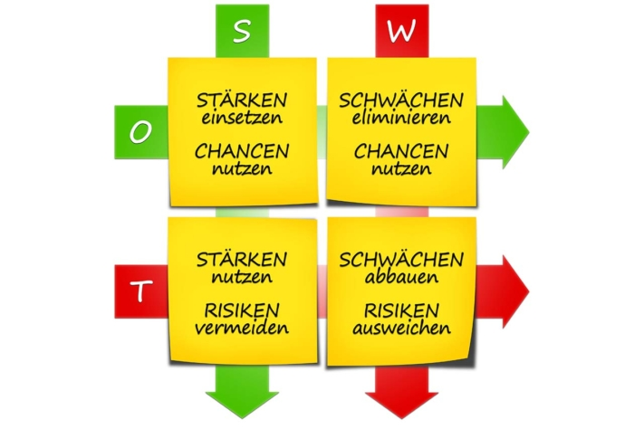

The **SWOT analysis** is a crucial **tool for strategic corporate planning**, as it takes both internal and external factors into account. This article uses a SWOT analysis example to explain the best way to proceed and how a SWOT analysis template can help you to implement it.

## SWOT analysis explained simply

### What does SWOT stand for?

Let's start with a definition. SWOT stands for

- Strengths - Strengths
- Weaknesses - Weaknesses
- Opportunities - chances
- Threats - Risks

SWOT analysis © everythingpossible / Adobe Stock

The SWOT analysis is an example of how you can analyze your company (internal) and relevant environmental influences (external).

### What is a SWOT analysis?

In the SWOT analysis, you **take stock of your company or team in the form of a matrix**. First, **you look at the internal strengths and weaknesses**: For example, do you have innovative products or do you lack expertise or manpower in one department?

**You** then **analyze the environment of your company or team**. Now it's time to look at **the external opportunities and risks**. How are your markets developing? For example, are you struggling with rising material costs or new competitors? Or are you benefiting from social trends?

In the second step, you derive **strategic recommendations for action** from the inventory. What do you need to do when opportunities meet weaknesses or risks meet strengths?

SWOT analysis example © r0b\_ / Adobe Stock

As both the environment and internal company factors are considered, the SWOT analysis is regarded as an example and **important tool for strategic corporate planning**.

### To carry out a SWOT analysis

The best way to do this is to [plan](https://seatable.io/en/workshop-planen/) a [workshop](https://seatable.io/en/workshop-planen/) in which your teams brainstorm together on the four categories. **You should collect** all the **ideas in a matrix**. A mind map on a whiteboard or a SWOT analysis template in Excel or Word that explains the SWOT analysis simply can help at the beginning.

But what belongs in the four categories?

### SWOT analysis: Example of the categories

In the four categories, analyse the current state of your company and the business environment. Proceed as follows:

1. **Strengths**Strengths of your company are all the features that make your company stand out from the competition. The SWOT analysis then includes, for example:
    - Innovative products
    - Outstanding customer service
    - Technological know-how
2. **Weaknesses**Weaknesses : Weaknesses represent the disadvantages of your company in general competition. In the SWOT analysis, these can be, for example:
    - Dependence on suppliers
    - Lack of expertise in product development
    - Lack of investment in future technologies
3. **Opportunities**Opportunities are factors in the business environment that represent advantages for the company. For example, the following are relevant for the SWOT analysis:
    - Trends in society
    - Legal regulations
    - Technological developments
4. **Risks (Threats)**Risks, on the other hand, are factors in the corporate environment that represent disadvantages or even dangers for the company. For example:
    - Changes in exchange rates
    - New competitors
    - Technological developments that will make the product redundant in the future

Also pay attention to the following tips when carrying out your analysis.

### Tips for carrying out the SWOT analysis

When looking at the external factors in a SWOT analysis example, you should bear in mind that a SWOT analysis is simply about solving two problems. How **can you keep pace with market trends** and **how can you predict and help shape them**? After all, you don't just want to keep up, you want to inspire your customers.

You should also choose a [SWOT analysis template](https://seatable.io/en/vorlage/mldpcbsqsr2yifjof71qkg/) to make your work easier. The analysis starts with choosing the right tool, and you should also think about putting together the right team.

[Taking stock](https://seatable.io/en/inventarliste-vorlagen/) requires a lot of time. Who can you release for the meetings and workshops? You also need expertise from different departments. **Which colleagues have an insight into the strengths, weaknesses, opportunities and risks of your company and business environment?** Ideally, you should put together a team of ten employees.

A team talks about a SWOT analysis example © weedezign / Adobe Stock

**Another tip:** be creative. Set up the brainstorming workshops in such a way that you bring (new) ideas to light in a playful way.

### What strategies can you derive from the analysis?

The [SWOT analysis](https://de.wikipedia.org/wiki/SWOT-Analyse) results in four different directions. To do this, you compare the strengths and weaknesses of your company with the opportunities and risks in the business environment:

1. **Expand** (strength-opportunity combination): Strengths increase the feasibility of your opportunities. Take a look at which opportunities you can successfully exploit with which of your company's strengths. Does it make sense to further expand certain business fields or product areas?
2. **Catching up** (weakness-opportunity combination): Is there an opportunity that you can only realize if you make up for an internal weakness? Your management must make a decision here: should you invest in making up for the weaknesses? You can then exploit the opportunity.
3. **Hedging** (strength-risk combination): When assessing risks, you should ask yourself which risks your company can counter with which strengths. Can a strength possibly turn a risk into an opportunity if you react early?
4. **Avoid** (weakness-risk combination): Where do weaknesses meet risks? You should be particularly careful here. Think about how you could protect yourself from dangers. Which activities should you avoid? Should you withdraw completely from a business area?

Now that you know what can be mapped with the SWOT analysis, for example, it's time for practical implementation.

## Is there a good SWOT analysis template?

The answer is yes. There is no lack of a template for the SWOT analysis. You can find a SWOT analysis example for Excel, Word and similar programs via Google search. The templates are arranged either as a list or in a matrix.

Here you can see a nice **SWOT analysis example for companies**:

## How SeaTable's SWOT analysis template works

Would you like to use the SeaTable template to carry out your analysis? Then [register](https://seatable.io/en/registrierung/) on our website in no time at all. In the library you will find the **free template**, in which the SWOT analysis is simply explained and filled out with sample data. Click on Use template and start your analysis.

In the first table, you will find sample entries organized according to the four SWOT categories. In the first column, enter the factor before determining its origin (internal or external) and assigning it to the individual categories.

Once you have entered all the information, you can view your completed matrix and record possible measures in an action plan. Thanks to the cloud solution, you can access your data from anywhere and at any time and share it with other users.

## Conclusion

With a SWOT analysis, you can determine where your company stands and **derive scenarios for the future**. You use the four categories of strengths, weaknesses, opportunities and threats and consider both internal and external factors.

Register for free at SeaTable to **get started with your SWOT analysis example**. A free template that simply explains the SWOT analysis will help you to carry it out.
