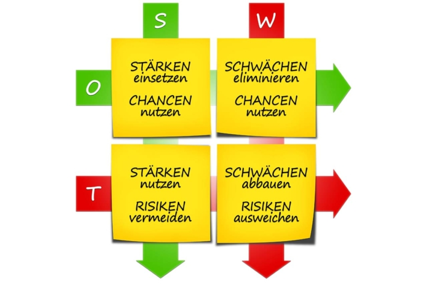

El **análisis DAFO** es una **herramienta** crucial **para la planificación estratégica empresarial**, ya que tiene en cuenta factores tanto internos como externos. Este artículo utiliza un ejemplo de análisis DAFO para explicar la mejor forma de proceder y cómo una plantilla de análisis DAFO puede ayudarle a aplicarlo.

## El análisis DAFO explicado de forma sencilla

### ¿Qué significa SWOT?

Empecemos con una definición. DAFO significa

- Puntos fuertes
- Debilidades
- Oportunidades
- Amenazas - Riesgos

Análisis DAFO © everythingpossible / Adobe Stock

El análisis DAFO es un ejemplo de cómo puede analizar su empresa (interno) y las influencias relevantes del entorno (externo).

### ¿Qué es un análisis DAFO?

En un análisis DAFO, se **hace balance de la empresa o el equipo en forma de matriz**. En primer lugar, se **examinan los puntos fuertes y débiles internos**: Por ejemplo, ¿tiene productos innovadores o le falta experiencia o mano de obra en algún departamento?

A continuación, **analiza el entorno de tu empresa o equipo**. Ahora toca analizar **las oportunidades y los riesgos externos**. ¿Cómo evolucionan sus mercados? Por ejemplo, ¿está luchando contra el aumento de los costes de los materiales o los nuevos competidores? ¿O se está beneficiando de las tendencias sociales?

En el segundo paso, se derivan **recomendaciones estratégicas para la acción** a partir del inventario. ¿Qué hay que hacer cuando las oportunidades se encuentran con las debilidades o los riesgos con las fortalezas?

Ejemplo de análisis DAFO © r0b\_ / Adobe Stock

Dado que se tienen en cuenta tanto el entorno como los factores internos de la empresa, el análisis DAFO es un ejemplo y una **herramienta importante para la planificación estratégica empresarial**.

### Realizar un análisis DAFO

La mejor manera de hacerlo es [planificar]() un [taller]() en el que sus equipos hagan una lluvia de ideas juntos sobre las cuatro categorías. **Deberá recopilar** todas las **ideas en una matriz**. Un mapa mental en una pizarra o una plantilla de análisis DAFO en Excel o Word que explique el análisis DAFO de forma sencilla pueden ayudar al principio.

Pero, ¿qué pertenece a las cuatro categorías?

### Análisis DAFO: Ejemplo de las categorías

En las cuatro categorías, analice el estado actual de su empresa y el entorno empresarial. Proceda de la siguiente manera:

1. **Puntos fuertes**Los puntos fuertes de su empresa son todas las características que la distinguen de la competencia. El análisis DAFO incluye, por ejemplo
    - Productos innovadores
    - Excelente servicio al cliente
    - Conocimientos tecnológicos
2. **Puntos débiles**Debilidades : Las debilidades representan las desventajas de su empresa frente a la competencia en general. En el análisis DAFO, pueden ser, por ejemplo:
    - Dependencia de los proveedores
    - Falta de experiencia en el desarrollo de productos
    - Falta de inversión en tecnologías futuras
3. **Oportunidades**Las oportunidades son factores del entorno empresarial que representan ventajas para la empresa. Por ejemplo, las siguientes son relevantes para el análisis DAFO:
    - Tendencias de la sociedad
    - Normativa legal
    - Desarrollos tecnológicos
4. **Riesgos (amenazas)**Los riesgos, por su parte, son factores del entorno empresarial que representan desventajas o incluso peligros para la empresa. Por ejemplo:
    - Variaciones de los tipos de cambio
    - Nuevos competidores
    - Desarrollos tecnológicos que harán que el producto sea superfluo en el futuro

Preste también atención a los siguientes consejos a la hora de realizar su análisis.

### Consejos para realizar el análisis DAFO

Al examinar los factores externos en un ejemplo de análisis DAFO, debe tener en cuenta que un análisis DAFO consiste simplemente en resolver dos problemas. ¿Cómo **puede seguir el ritmo de las tendencias del mercado** y **cómo puede predecirlas y ayudar a darles forma**? Al fin y al cabo, no sólo quiere seguir el ritmo, sino inspirar a sus clientes.

También debería elegir una [plantilla de análisis DAFO]() para facilitarle el trabajo. El análisis comienza con la elección de la herramienta adecuada, y también debes pensar en reunir al equipo adecuado.

El proceso de [inventario]() requiere mucho tiempo. ¿A quién puede liberar para las reuniones y talleres? También se necesitan expertos de varios departamentos. **¿Qué colegas tienen una visión de los puntos fuertes, los puntos débiles, las oportunidades y los riesgos de su empresa y su entorno empresarial?** Lo ideal sería formar un equipo de diez empleados.

Un equipo habla sobre un ejemplo de análisis DAFO © weedezign / Adobe Stock

**Otro consejo:** sea creativo. Organiza los talleres de brainstorming de tal manera que saques a la luz (nuevas) ideas de forma lúdica.

### ¿Qué estrategias puede extraer del análisis?

El [análisis DAFO](https://de.wikipedia.org/wiki/SWOT-Analyse) da como resultado cuatro direcciones diferentes. Para ello, se comparan los puntos fuertes y débiles de la empresa con las oportunidades y riesgos del entorno empresarial:

1. **Expandir** (combinación de fortaleza-oportunidad): Las fortalezas aumentan la viabilidad de tus posibilidades. Echa un vistazo a qué oportunidades puedes explotar con éxito con qué fortalezas de tu empresa. ¿Tiene sentido ampliar aún más ciertas áreas de negocio o áreas de productos?
2. Ponerse **al día** (combinación debilidad-oportunidad): ¿Existe una oportunidad que sólo puede aprovechar si compensa una debilidad interna? La dirección debe tomar una decisión al respecto: ¿debe invertir en compensar las debilidades? Entonces podrá aprovechar la oportunidad.
3. **Cobertura** (combinación de puntos fuertes y riesgos): Al evaluar los riesgos, debe preguntarse qué riesgos puede contrarrestar su empresa con qué puntos fuertes. Es posible que un punto fuerte convierta un riesgo en una oportunidad si se reacciona a tiempo?
4. **Evitar** (combinación debilidad-riesgo): ¿Dónde se juntan las debilidades con los riesgos? Aquí debes tener especial cuidado. Piensa cómo podrías protegerte de los peligros. ¿Qué actividades debe evitar? ¿Debería retirarse por completo de un área de negocio?

Ahora que sabe lo que se puede mapear con el análisis DAFO, por ejemplo, es el momento de la aplicación práctica.

## ¿Existe un buen modelo de análisis DAFO?

La respuesta es sí. No falta una plantilla para el análisis DAFO. Puede encontrar un ejemplo de análisis DAFO para Excel, Word y programas similares a través de la búsqueda en Google. Las plantillas están dispuestas en forma de lista o de matriz.

Aquí puede ver un buen **ejemplo de análisis DAFO para empresas**:

## Cómo funciona la plantilla de análisis DAFO de SeaTable

¿Desea utilizar la plantilla SeaTable para realizar sus análisis? Entonces [regístrese]() en nuestra página web en un abrir y cerrar de ojos. En la biblioteca encontrará la **plantilla gratuita**, en la que el análisis DAFO se explica de forma sencilla y se rellena con datos de ejemplo. Haga clic en Utilizar plantilla y comience su análisis.

En la primera tabla encontrará ejemplos de entradas organizadas según las cuatro categorías DAFO correspondientes. Introduzca el factor en la primera columna antes de determinar su origen (interno o externo) y categorizarlo.

Una vez introducida toda la información, puedes ver tu matriz completa y registrar las posibles medidas en un plan de acción. Gracias a la solución en la nube, puedes acceder a tus datos desde cualquier lugar y en cualquier momento, y compartirlos con otros usuarios.

## Conclusión:

Con un análisis DAFO, puede determinar en qué situación se encuentra su empresa y **derivar escenarios para el futuro**. Se utilizan las cuatro categorías de puntos fuertes, puntos débiles, oportunidades y amenazas, y se tienen en cuenta tanto los factores internos como los externos.

Regístrese gratuitamente en SeaTable para **empezar con su ejemplo de análisis DAFO**. Una plantilla gratuita que explica de forma sencilla el análisis DAFO le ayudará a llevarlo a cabo.
