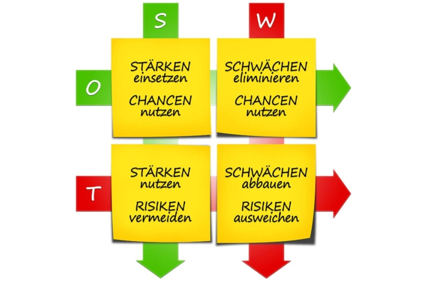

L'**analyse SWOT** est un **outil** essentiel **de la planification stratégique d'entreprise**, car elle prend en compte les facteurs internes et externes. Cet article explique, à l'aide d'un exemple d'analyse SWOT, comment procéder au mieux et comment un modèle d'analyse SWOT peut vous aider à la mettre en œuvre.

## L'analyse SWOT expliquée simplement

### Que signifie SWOT ?

Commençons par une définition. SWOT signifie

- Strengths - Points forts
- Weaknesses - Faiblesses
- Opportunities - Opportunités
- Threats - Risques

Analyse SWOT © everythingpossible / Adobe Stock

L'analyse SWOT est un exemple de la manière dont vous pouvez analyser votre entreprise (interne) et les influences environnementales pertinentes (externes).

### Qu'est-ce qu'une analyse SWOT ?

Lors de l'analyse SWOT, vous faites un **état des lieux de votre entreprise ou de votre équipe sous la forme d'une matrice**. **Vous** commencez par **examiner les forces et les faiblesses internes**: Existe-t-il par exemple des produits innovants ou vous manque-t-il du savoir-faire ou de la main-d'œuvre dans un département ?

Ensuite **, vous analysez l'environnement de votre entreprise ou de votre équipe**. Il s'agit maintenant d'examiner **les opportunités et les risques externes**. Comment vos marchés évoluent-ils ? Devez-vous par exemple faire face à une hausse des coûts des matériaux ou à de nouveaux concurrents ? Ou bien les tendances sociales vous sont-elles favorables ?

Dans un deuxième temps, vous déduisez de l'état des lieux **des recommandations d'actions stratégiques**. Que devez-vous faire lorsque des opportunités rencontrent des faiblesses ou des risques rencontrent des forces ?

Exemple d'analyse SWOT © r0b\_ / Adobe Stock

Comme l'environnement et les facteurs internes à l'entreprise sont pris en compte, l'analyse SWOT est considérée comme un exemple et **un outil important de la planification stratégique d'entreprise**.

### Comment réaliser une analyse SWOT

Il est préférable de [planifier]() un atelier au cours duquel vos équipes se réunissent pour réfléchir aux quatre catégories. Toutes les **idées doivent être rassemblées dans une matrice**. Pour commencer, vous pouvez utiliser une carte mentale sur un tableau blanc ou un modèle d'analyse SWOT dans Excel ou Word, qui explique simplement l'analyse SWOT.

Mais que faut-il mettre dans les quatre catégories ?

### Analyse SWOT : exemple de catégories

Dans les quatre catégories, vous analysez la situation actuelle de votre entreprise et de son environnement. Procédez comme suit :

1. **Forces (Strengths)**Les points forts de votre entreprise sont toutes les caractéristiques qui la distinguent particulièrement de la concurrence. Dans l'analyse SWOT, on trouve par exemple
    - Produits innovants
    - Un service client exceptionnel
    - Savoir-faire technologique
2. **Faiblesses (Weaknesses)**Les faiblesses représentent les désavantages de votre entreprise par rapport à la concurrence générale. Dans l'analyse SWOT, il peut s'agir par exemple de
    - Dépendance vis-à-vis des fournisseurs
    - Manque de savoir-faire dans le développement de produits
    - Manque d'investissement dans les technologies d'avenir
3. **Opportunités (Opportunities)**Opportunités : Les opportunités sont des facteurs de l'environnement de l'entreprise qui représentent des avantages pour l'entreprise. Les opportunités sont par exemple pertinentes pour l'analyse SWOT :
    - Tendances dans la société
    - Réglementation légale
    - Développements technologiques
4. **Risques (Threats)**En revanche, les risques sont des facteurs de l'environnement de l'entreprise qui représentent des inconvénients, voire des dangers pour l'entreprise. Par exemple
    - Variations des taux de change
    - De nouveaux concurrents
    - Développements technologiques qui rendront le produit superflu à l'avenir

Veillez en outre à suivre les conseils suivants lorsque vous effectuez votre analyse.

### Conseils pour la réalisation de l'analyse SWOT

Lorsque vous examinez les facteurs externes dans un exemple d'analyse SWOT, vous devez garder à l'esprit que l'analyse SWOT consiste simplement à résoudre deux problèmes. Comment **pouvez-vous suivre les tendances du marché** et **comment pouvez-vous les prévoir et les influencer**? Après tout, vous ne voulez pas seulement suivre le mouvement, mais aussi enthousiasmer vos clients.

Choisissez également un [modèle d'analyse SWOT]() pour vous faciliter la tâche. L'analyse commence par le choix du bon outil, et vous devez en outre réfléchir à la composition de l'équipe adéquate.

L'[inventaire]() s'accompagne d'un investissement en temps important. Qui pouvez-vous libérer pour les réunions et les ateliers ? En outre, des compétences de différents départements sont nécessaires. **Quels sont les collègues qui ont un aperçu des forces, des faiblesses, des opportunités et des risques de votre entreprise et de son environnement ?** Dans l'idéal, vous devriez constituer une équipe de dix personnes.

Une équipe discute d'un exemple d'analyse SWOT © weedezign / Adobe Stock

**Un autre conseil :** soyez créatif. Mettez en place des ateliers de brainstorming de manière à faire émerger des idées (nouvelles) de manière ludique.

### Quelles stratégies pouvez-vous déduire de l'analyse ?

L'[analyse SWOT](https://de.wikipedia.org/wiki/SWOT-Analyse) permet de dégager quatre orientations différentes. Pour cela, vous mettez en relation les forces et les faiblesses de votre entreprise avec les opportunités et les risques liés à son environnement :

1. **Développer** (combinaison force-opportunité) : Les forces augmentent la viabilité de vos chances. Jetez un coup d’œil aux opportunités que vous pouvez exploiter avec succès avec quels points forts de votre entreprise. Est-il judicieux d’élargir encore certains domaines d’activité ou de produits ?
2. **Rattrapage** (combinaison faiblesse-opportunité) : Y a-t-il une opportunité que vous ne pouvez réaliser que si vous compensez une faiblesse interne ? Ici, votre management doit prendre une décision : faut-il investir dans le rattrapage des faiblesses ? Ainsi, vous pourrez ensuite saisir l'opportunité.
3. **Se couvrir** (combinaison force-risque) : Lors de l'évaluation des risques, vous devriez vous demander à quels risques votre entreprise peut faire face et avec quels points forts. Une force peut-elle éventuellement transformer un risque en opportunité si vous réagissez à temps ?
4. **Éviter** (combinaison faiblesse-risque) : Où les faiblesses rencontrent-elles les risques ? Ici, vous devriez être particulièrement prudent. Réfléchissez à la manière dont vous pourriez vous protéger des risques. Quelles activités devriez-vous éviter le cas échéant ? Devriez-vous vous retirer complètement d'un secteur d'activité ?

Maintenant que vous savez ce qui peut être représenté par l'analyse SWOT, par exemple, il est temps de passer à la mise en œuvre pratique.

## Existe-t-il un bon modèle d'analyse SWOT ?

La réponse est oui. Ce ne sont pas les modèles d'analyse SWOT qui manquent. Vous pouvez trouver un exemple d'analyse SWOT pour Excel, Word et autres programmes similaires en effectuant une recherche sur Google. Les modèles sont organisés soit sous forme de liste, soit sous forme de matrice.

Voici un bel **exemple d'analyse SWOT pour les entreprises**:

## Voici comment fonctionne le modèle d'analyse SWOT de SeaTable

Vous souhaitez utiliser le modèle de SeaTable pour effectuer votre analyse ? Alors [inscrivez-vous]() en un clin d'œil sur notre site. Dans la bibliothèque, vous trouverez le **modèle gratuit** dans lequel l'analyse SWOT est expliquée simplement et remplie avec des exemples de données. Cliquez sur Utiliser le modèle et commencez votre analyse.

Dans le premier tableau, vous trouverez des exemples d'entrées classées selon les quatre catégories SWOT correspondantes. Dans la première colonne, vous inscrivez le facteur avant de déterminer son origine (interne ou externe) et de le classer dans les différentes catégories.

Une fois que vous avez saisi toutes les informations, vous pouvez visualiser votre matrice finale et consigner les mesures possibles dans un plan d'action. Grâce à la solution cloud, vous avez la possibilité d'accéder à vos données de partout et à tout moment et de les partager avec d'autres utilisateurs.

## Conclusion

L'analyse SWOT vous permet de déterminer où se situe votre entreprise et d **'en déduire des scénarios pour l'avenir**. Vous utilisez les quatre catégories forces, faiblesses, opportunités et menaces et considérez aussi bien les facteurs internes qu'externes.

Inscrivez-vous gratuitement sur SeaTable pour **commencer votre exemple d'analyse SWOT**. Un modèle gratuit expliquant simplement l'analyse SWOT vous aidera à la réaliser.
