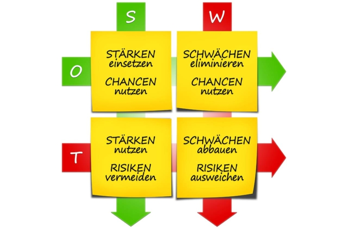

## SWOT-анализ — простое объяснение

### Что означает SWOT?

Давайте начнем с определения. SWOT означает

- Strengths — сильные стороны
- Weaknesses — слабые стороны
- Opportunities — возможности
- Threats — угрозы

SWOT-анализ © everythingpossible / Adobe Stock

SWOT-анализ — это пример того, как вы можете проанализировать свою компанию (внутренние факторы) и значимые факторы внешней среды (внешние).

## Что такое SWOT-анализ?

В ходе SWOT-анализа вы **оцениваете состояние своей компании или команды в виде матрицы**. Сначала вы рассматриваете **внутренние сильные и слабые стороны**: например, есть ли у вас инновационные продукты или вам не хватает ноу-хау или кадров в одном из отделов?

Затем **вы анализируете окружение своей компании или команды**. Теперь речь идет о **внешних возможностях и угрозах**. Как развиваются ваши рынки? Например, приходится ли вам бороться с ростом стоимости материалов или с новыми [конкурентами]()? Или общественные тенденции играют вам на руку?

На втором этапе вы выводите из этой оценки **стратегические рекомендации к действию**. Что нужно делать, когда возможности встречаются со слабыми сторонами, а угрозы — с сильными?

Пример SWOT-анализа © r0b\_ / Adobe Stock

Поскольку учитываются как внешнее окружение, так и внутренние факторы компании, SWOT-анализ считается примером и **важным инструментом стратегического корпоративного планирования**.

## Как провести SWOT-анализ

Лучше всего [запланировать семинар](), на котором ваши команды проведут совместный мозговой штурм по четырем категориям. Все **идеи вам следует собрать в матрицу**. На начальном этапе может помочь интеллект-карта на доске или шаблон SWOT-анализа в Excel или Word, который просто объясняет SWOT-анализ.

Но что относится к этим четырем категориям?

## SWOT-анализ: пример категорий

В четырех категориях вы анализируете текущее состояние своей компании и бизнес-среды. Действуйте следующим образом:

1. **Сильные стороны (Strengths)**: сильные стороны вашей компании — это все те черты, которые особенно выделяют ее на фоне конкурентов. В SWOT-анализе это, например:
    - Инновационные продукты
    - Выдающееся обслуживание клиентов
    - Технологическое ноу-хау
2. **Слабые стороны (Weaknesses)**: слабые стороны представляют собой недостатки вашей компании в общей конкурентной борьбе. В SWOT-анализе это могут быть, например:
    - Зависимость от поставщиков
    - Отсутствие ноу-хау в разработке продуктов
    - Отсутствие инвестиций в технологии будущего
3. **Возможности (Opportunities)**: возможности — это факторы бизнес-среды, которые дают компании преимущества. Для SWOT-анализа актуальны, например:
    - Тенденции в обществе
    - Правовые нормы
    - Технологические разработки
4. **Угрозы (Threats)**: угрозы, напротив, — это факторы бизнес-среды, которые означают недостатки или даже опасности для компании. Например:
    - Изменения обменных курсов
    - Новые конкуренты
    - Технологические разработки, которые сделают продукт ненужным в будущем

Кроме того, при проведении анализа обратите внимание на следующие советы.

## Советы по проведению SWOT-анализа

Рассматривая внешние факторы в примере SWOT-анализа, вы должны помнить, что SWOT-анализ сводится к решению двух задач. Как **вы можете идти в ногу с рыночными тенденциями** и **как вы можете предсказывать их и влиять на них**? В конце концов, вы хотите не просто плыть по течению, а вдохновлять своих клиентов.

Кроме того, выберите [шаблон SWOT-анализа](), чтобы облегчить себе работу. Анализ начинается с выбора правильного инструмента, и вам также следует подумать о том, чтобы собрать подходящую команду.

[Инвентаризация]() отнимает много времени. Кого вы можете освободить для встреч и семинаров? Кроме того, необходимы компетенции из разных отделов. **Кто из коллег имеет представление о сильных и слабых сторонах, возможностях и угрозах вашей компании и вашей бизнес-среды?** В идеале вы соберете команду из десяти сотрудников.

Команда обсуждает пример SWOT-анализа © weedezign / Adobe Stock

**Еще один совет:** будьте креативны. Организуйте мозговой штурм так, чтобы в игровой форме выявлять (новые) идеи.

## Какие стратегии вы можете вывести из анализа?

Из SWOT-анализа вытекают **четыре различных направления действий**. Для этого вы соотносите сильные и слабые стороны своей компании с возможностями и угрозами бизнес-среды:

1. **Расширение** (комбинация «сильная сторона — возможность»): сильные стороны повышают осуществимость ваших возможностей. Посмотрите, какие возможности и с помощью каких сильных сторон вашей компании вы можете успешно использовать. Есть ли смысл в дальнейшем расширении тех или иных бизнес-направлений или продуктовых линеек?
2. **Наверстывание упущенного** (комбинация «слабая сторона — возможность»): существует ли возможность, которую вы сможете реализовать, только если компенсируете внутреннюю слабую сторону? Здесь ваше руководство должно принять решение: стоит ли вкладывать средства в устранение слабых сторон? Тогда вы сможете воспользоваться этой возможностью.
3. **Защита** (комбинация «сильная сторона — угроза»): оценивая угрозы, вы должны спросить себя, каким угрозам и с помощью каких сильных сторон может противостоять ваша компания. Может ли сильная сторона даже превратить угрозу в возможность, если вы вовремя среагируете?
4. **Избегание** (комбинация «слабая сторона — угроза»): где слабые стороны встречаются с угрозами? Здесь вам следует быть особенно осторожными. Подумайте, как вы могли бы защитить себя от опасностей. Каких видов деятельности вам следует при необходимости избегать? Стоит ли вам полностью уйти из какой-либо сферы деятельности?

Теперь, когда вы знаете, что можно отобразить, например, с помощью SWOT-анализа, пришло время для практической реализации.

## Существует ли хороший шаблон SWOT-анализа?

Ответ: да. В шаблонах для SWOT-анализа нет недостатка. Вы можете найти пример SWOT-анализа для Excel, Word и других подобных программ через поиск в Google. Шаблоны оформлены либо в виде списка, либо в виде матрицы.

Здесь вы можете увидеть хороший **пример SWOT-анализа для компаний**:



## Как работает шаблон SWOT-анализа SeaTable

Хотите использовать шаблон SeaTable для проведения своего анализа? Тогда [зарегистрируйтесь]() на нашем сайте в два счета. В библиотеке вы найдете **бесплатный шаблон**, в котором SWOT-анализ просто объясняется и заполнен примерами данных. Нажмите «Использовать шаблон» и начните свой анализ.

В первой таблице вы найдете образцы записей, которые упорядочены по соответствующим четырем категориям SWOT. В первый столбец вы вводите фактор, прежде чем определить его происхождение (внутреннее или внешнее) и распределить его по отдельным категориям.

После ввода всей информации вы можете просмотреть заполненную матрицу и записать возможные меры в план действий. Благодаря облачному решению вы можете получить доступ к своим данным из любого места и в любое время и поделиться ими с другими пользователями.

## Заключение: проводим SWOT-анализ с помощью шаблона

С помощью SWOT-анализа вы определяете, в каком положении находится ваша компания, и можете **разработать сценарии на будущее**. Вы используете четыре категории — сильные стороны, слабые стороны, возможности и угрозы — и учитываете как внутренние, так и внешние факторы.

Зарегистрируйтесь бесплатно в SeaTable, чтобы **начать работу над своим примером SWOT-анализа**. Бесплатный шаблон, который просто объясняет SWOT-анализ, поможет вам в его проведении.
