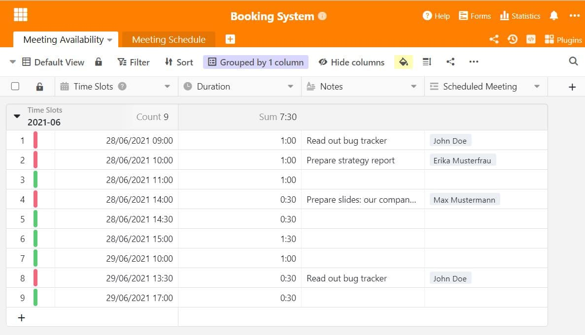
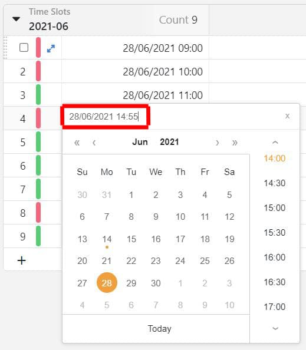
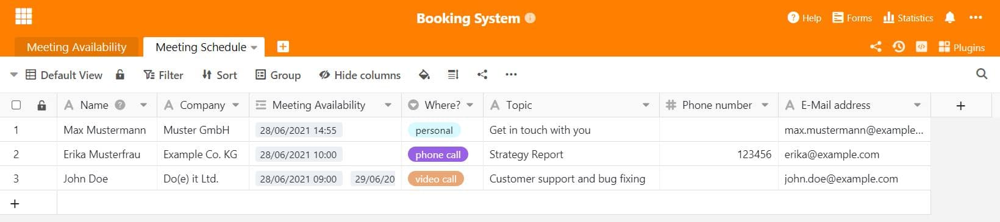
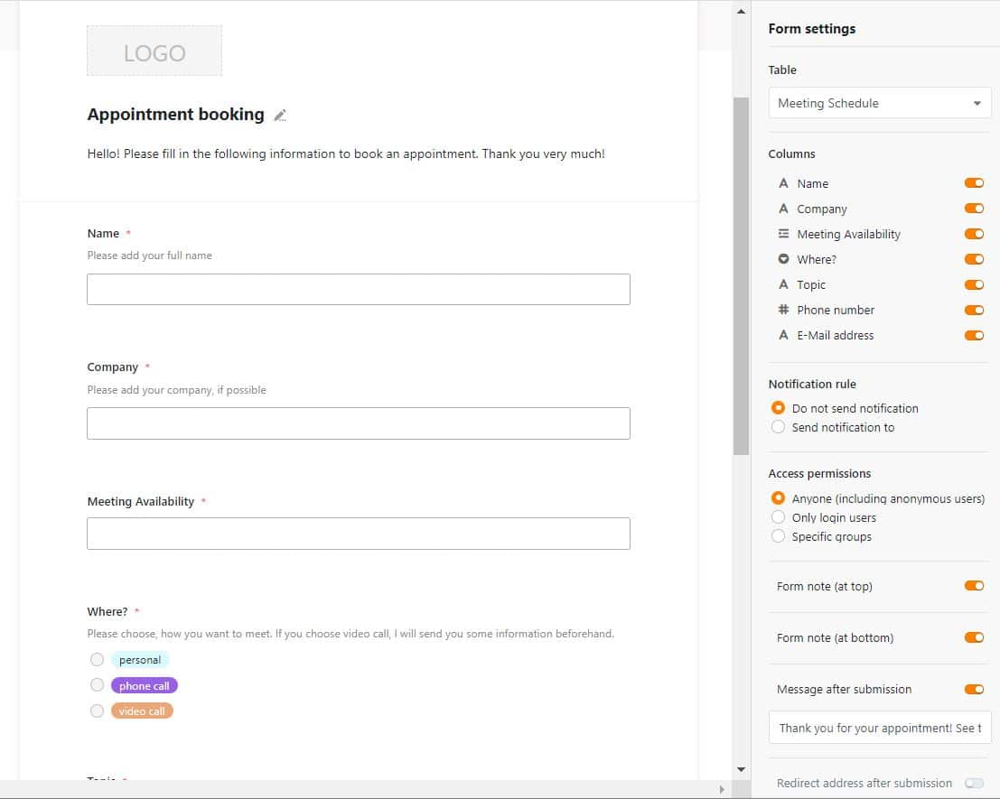
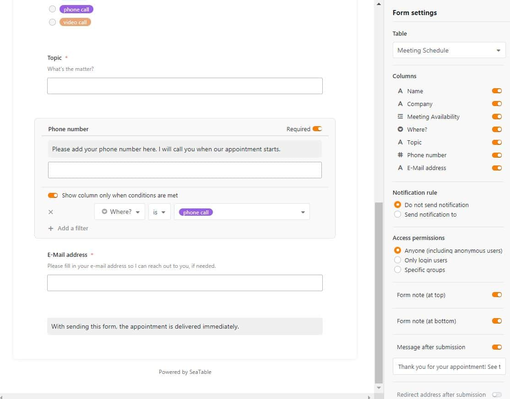
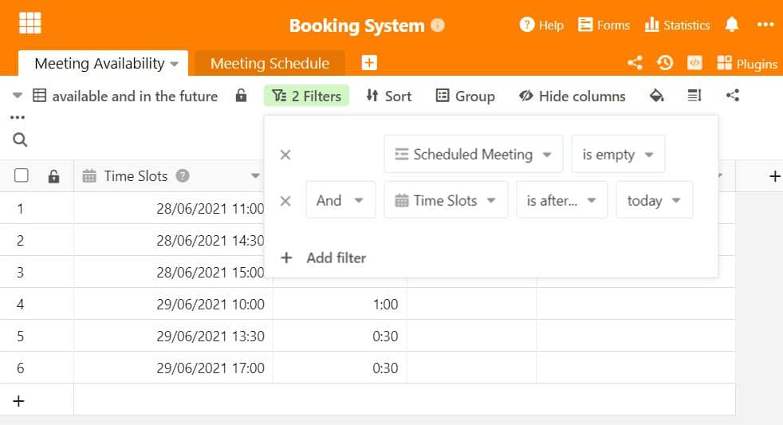
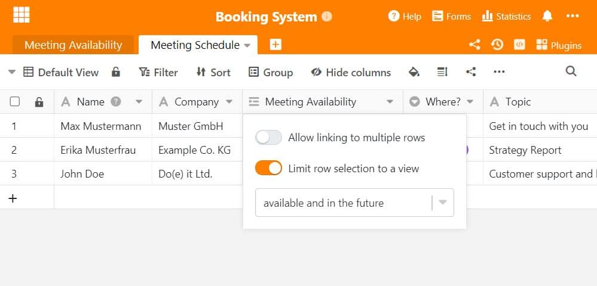

How much time do you spend making appointments with customers and business partners? Either the phone is constantly ringing, pulling you out of your workflow again and again, or you write countless emails to finally come to a common denominator when it comes to finding appointments. The constant back-and-forth of scheduling and rescheduling appointments can also be annoying for your customers. The solution: an online appointment booking system.

## Digital appointment booking system

Nowadays, nothing makes dealing with data easier than the possibilities offered by digitization. A digital appointment booking system not only saves paper, but also time. If you normally make appointments by phone or email, it costs you and your counterpart time and nerves. Sorting it all out online offers transparency and reduces the amount of work on your side.

### Make booking appointments easier for you and your customers!

SeaTable offers a simple and powerful solution here. With our web forms, which you may have used for [customer surveys](https://seatable.io/en/vorlage/ku9n1tyosmmho-8trn7rdg/) so far, you can also easily create online appointment booking systems. The set appointments then appear fully automatically in your table and you can see at a glance which appointments are due and when.

The creation of this appointment booking system is guaranteed to be done in under 30 minutes without any prior knowledge! In the following, we will explain the creation of a digital appointment booking system in SeaTable step by step. This means you no longer need appointment booking software, such as [Calendly](https://calendly.com/de/).

SeaTable can offer an intelligent and adequate replacement here and also has the advantage that the appointment booking system itself can be hosted. Calendly can be connected to SeaTable through Zapier in just a few steps - creating an appointment booking system also works with this. However, if you want to save yourself the detour via Zapier, then take a closer look at the appointment booking system with SeaTable here.

## With the form function to the appointment booking system

To create an appointment booking system in SeaTable, we will use the [form feature](https://seatable.io/en/docs/handbuch/datenmanagement/webformulare/). This way you can collect information from anyone through a simple link and automatically store it in your SeaTable Base.

## Creating your two required tables

For your online appointment booking system you need two bases. You can insert these two tables into an already existing SeaTable base or you can create a new base. Of course, you can also [copy our ready-made templates **here**](https://seatable.io/en/vorlage/m1su2sncqwmgwfxs1x_jza/) and adapt them to your needs if necessary.

In the **first base** (Meeting Availability), all appointments are entered on which you are freely available. The **second base** (Meeting Schedule) contains all meetings or appointments that have already been booked by your customers via the forms. They appear automatically in the table after the form has been submitted.

### First table: Set your time slots

The first table "Meeting Availability" consists of **4 columns**. In the **first column** you enter all available meetings that you can offer. Select the date format with time (move the slider to "accurate to minute"). You can also set manual times that are not displayed in the date window; to do this, enter the time yourself in the bar at the top.

The **second column** contains the respective duration of the appointment slot you have made available. For this purpose, select the column type "Duration" and set a duration according to your needs. So with the manual setting of the time also 5 or 10 minute slots are feasible.

The **third column** offers space for your personal notes, such as what the meeting is about, what needs to be prepared for it or what customer information is relevant for the conversation.

The **fourth column** is linked to the second table. This is easily done with the "Link to other records" column. It contains information about the customer who has booked exactly this appointment and you can directly display all booked participants in your own base.

By the way, with the colour function you can use automated rules to colour rows red if an appointment has already been booked and green if these appointments are still free.

### Second table: All booked dates at a glance

The second table is the basis for your appointment booking system with web form. You can see in the following picture different columns that contain the information of the participants. Each column you create here can be used later in the web form. You can use the column types to directly influence the input of data in the form. For example, if you want to have a free text field, select Columns with text function. If you want to have a kind of dropdown menu, the single or multiple selection is suitable for this. You will see the linked column "Meeting Availability" - so the link will be displayed in both tables with the corresponding information from the 1st column.

With these columns formed, we now move on to the web form. To do this, select "Forms" at the top, and then create a new web form with the "Traditional Form" setting. Here, the participants cannot access the table and the data themselves. A form mask opens, where you can now label all the columns to be displayed.

Select the table in which you have created the columns for the information query (here: "Meeting Schedule"). You can choose which columns should be displayed in the form. Here it makes sense to include all columns in the form. You can now declare each input field as a mandatory field or add a description text, as well as insert your personal **company logo as a header**. This way you get your very own personal appointment booking system.

You can label your form entirely according to your wishes. Information in the form of **form notes** gives participants helpful hints about what to look out for in your appointment booking system.

You can also attach conditions to choices. In our example, there are three ways to hold the appointment: In person, by video call or by phone. In case of a phone call, the number of the participant is mandatory, therefore the Phone Number column was conditioned to appear only when the Phone call option was selected.

## Limit appointments - so no more booking goes wrong

Assigned appointments should of course no longer be offered to other participants, nor should appointments that are in the past. This can be done by linking Calendly and SeaTable if you already use this system.

With SeaTable, on the other hand, only a few small steps are necessary to set up your appointment booking system for this. First of all, it is important to create a second view for the appointments in table 1 and to provide it with two filters. On the one hand, assigned appointments should no longer be offered as a selection option; instead, a filter is set that only displays empty rows from the "Scheduled Meetings" column: Thus, the command is "Scheduled Meeting is empty".

So that only appointments in the future are displayed, and not those from last week, a second filter must be set: With the condition "And" and the filter "Time slots after today" only appointments from the current day will be displayed. This way you will only have free and bookable time slots in this view.

To ensure that this is also adopted in the appointment booking system, the column in the "Meeting Schedule" table must also be adjusted. To do this, simply open the column settings and restrict the rows to one view. To do this, the view just created with the two filters is selected and at the same time the function that allows participants to select multiple dates is deactivated. This means: Only one appointment can be booked at a time and only the free and future dates from the 2nd view are accessed.

You can set up an automated notification mechanism for yourself under the notification settings (three dots at the top right), which reminds you of upcoming appointments, for example, or informs you that an appointment has just been booked via the appointment booking system.

## Enormous time savings thanks to SeaTable's highly flexible appointment booking system

You can adjust your form at any time if you notice that important information is missing. After a participant submits their information, it immediately appears in the Meeting Schedule table. So in just a few steps, you've created a simple and straightforward appointment booking system that automatically collects all the relevant information in one place. Scheduling appointments becomes a breeze! [Our template](https://seatable.io/en/vorlage/m1su2sncqwmgwfxs1x_jza/) can help you bring structure to your appointment booking system.

[In our YouTube tutorial](https://www.youtube.com/watch?v=7Kgzeld0kDM) we explained once again in detail how to create a web form with SeaTable. This can be easily transferred to an appointment booking system - [try it out today]()!
