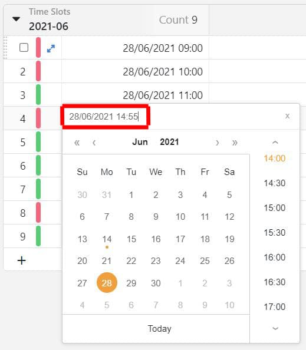
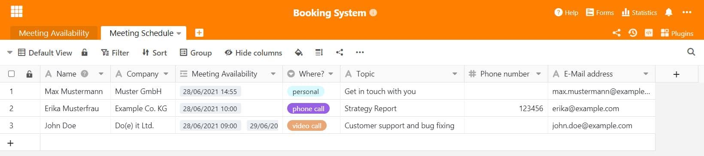
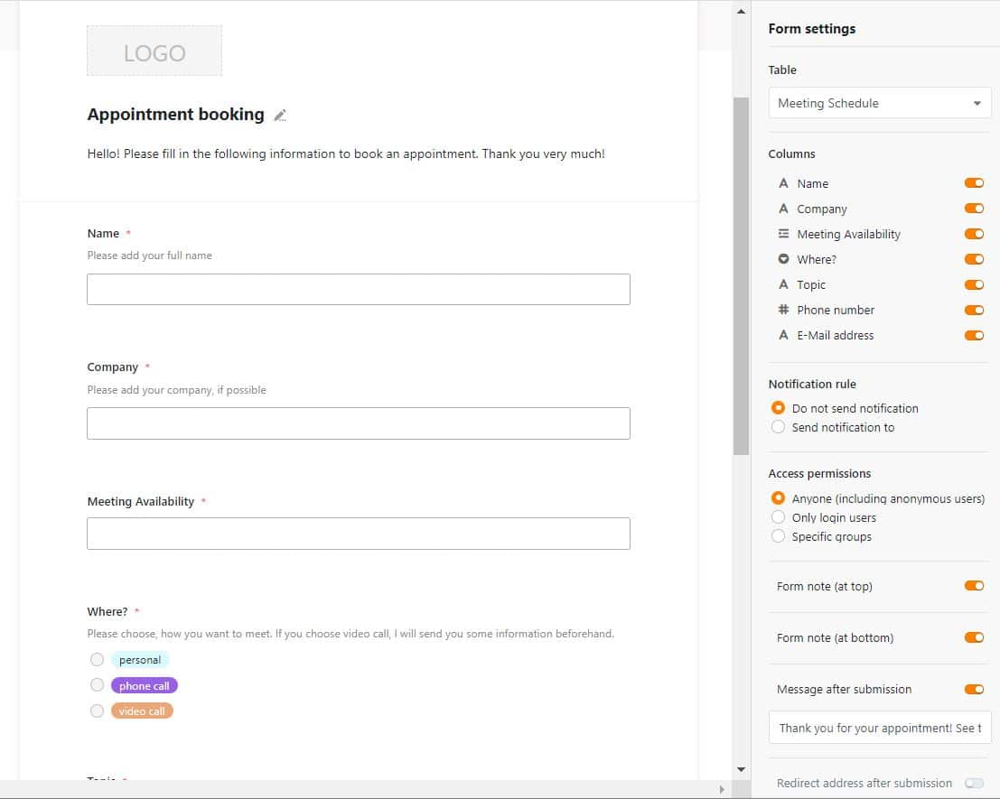
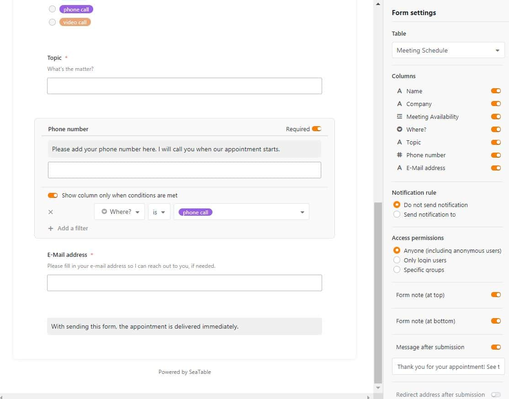
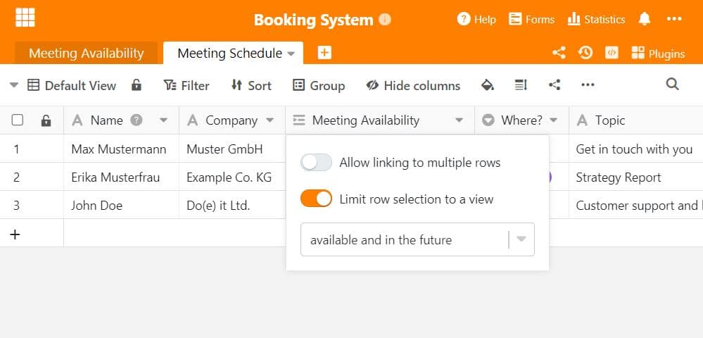

Combien de temps passez-vous à fixer des rendez-vous avec des clients et des partenaires commerciaux ? Soit le téléphone n'arrête pas de sonner et vous sort sans cesse de votre flux de travail, soit vous écrivez d'innombrables e-mails pour trouver enfin un dénominateur commun dans la fixation des rendez-vous. Pour vos clients aussi, les allers et retours incessants lors de la planification et du report des rendez-vous peuvent être agaçants. La solution : un système de prise de rendez-vous en ligne.

## Système numérique de prise de rendez-vous

De nos jours, rien ne facilite davantage le traitement des données que les possibilités offertes par la numérisation. Un système de prise de rendez-vous numérique permet non seulement d'économiser du papier, mais aussi du temps. Si vous prenez habituellement vos rendez-vous par téléphone ou par e-mail, cela vous coûte, à vous et à votre interlocuteur, du temps et des nerfs. Régler tout cela en ligne offre de la transparence et réduit la charge de travail de votre côté.

### Facilitez la réservation de rendez-vous pour vous et vos clients !

SeaTable offre ici une solution simple et puissante. Nos formulaires web, que vous avez peut-être utilisés jusqu'à présent pour [des enquêtes auprès de vos clients](), permettent également de créer très facilement des systèmes de prise de rendez-vous en ligne. Les rendez-vous fixés apparaissent alors de manière entièrement automatique dans votre tableau et vous voyez d'un coup d'œil quels rendez-vous sont prévus.

La création de ce système de réservation de rendez-vous est garantie en moins de 30 minutes sans connaissances préalables ! Nous vous expliquons ci-dessous comment créer un système de prise de rendez-vous numérique dans SeaTable, étape par étape. Vous n'aurez ainsi plus besoin d'un logiciel de prise de rendez-vous comme [Calendly](https://calendly.com/de/).

SeaTable peut offrir ici un remplacement intelligent et adéquat et a en outre l'avantage de pouvoir héberger lui-même le système de réservation de rendez-vous. Calendly peut être connecté à SeaTable en quelques étapes grâce à Zapier - la création d'un système de réservation de rendez-vous fonctionne également ainsi. Si vous ne souhaitez pas passer par Zapier, vous pouvez découvrir le système de prise de rendez-vous avec SeaTable ici.

## Avec la fonction formulaire vers le système de réservation de rendez-vous

Pour créer un système de réservation de rendez-vous dans SeaTable, nous allons utiliser la [fonction formulaire](). Vous pourrez ainsi collecter des informations auprès de n'importe qui via un simple lien et les enregistrer automatiquement dans votre base SeaTable.

## Création des deux tableaux dont vous avez besoin

Pour votre système de prise de rendez-vous en ligne, vous avez besoin de deux bases. Vous pouvez insérer ces deux tableaux dans une base SeaTable déjà existante ou créer une nouvelle base. Vous pouvez bien sûr aussi [copier **ici** notre modèle prêt à **l'** emploi]() et l'adapter éventuellement à vos besoins.

Dans la **première base** (Meeting Availability) sont saisies toutes les dates auxquelles vous êtes librement disponible. La **deuxième base** (Meeting Schedule) contient toutes les réunions ou rendez-vous qui ont déjà été réservés par vos clients via les formulaires. Ils apparaissent automatiquement dans le tableau après l'envoi du formulaire.

### Premier tableau : définissez vos créneaux horaires

Le premier tableau "Meeting Availability" se compose de **4 colonnes**. Dans la **première colonne**, vous inscrivez tous les rendez-vous disponibles que vous pouvez proposer. Pour ce faire, choisissez le format de date avec l'heure (pour ce faire, déplacez le curseur sur "accurate to minute"). Vous pouvez également définir des heures manuelles qui ne sont pas affichées dans la fenêtre de date ; pour cela, saisissez vous-même l'heure dans la barre en haut.

La **deuxième colonne** contient la durée du créneau de rendez-vous que vous avez mis à disposition. Choisissez pour cela le type de colonne "Duration" et réglez une durée en fonction de vos besoins. En réglant l'heure manuellement, il est donc possible de créer des créneaux de 5 ou 10 minutes.

La **troisième colonne** offre de la place pour vos notes personnelles, par exemple le sujet de la réunion, ce qui doit être préparé à cet effet ou les informations sur le client qui sont pertinentes pour l'entretien.

La **quatrième colonne** est liée au deuxième tableau. Cela se fait très facilement avec la colonne "Link to other records" / "Lien vers d'autres enregistrements". Elle contient des informations sur le client qui a précisément réservé ce rendez-vous et vous pouvez afficher directement dans votre propre base tous les participants inscrits.

La fonction de couleur permet d'ailleurs, grâce à des règles automatisées, de colorer en rouge les lignes sur lesquelles un rendez-vous a déjà été réservé et en vert celles où ces rendez-vous sont encore disponibles.

### Deuxième tableau : toutes les dates réservées en un coup d'œil

Le deuxième tableau constitue la base de votre système de réservation de rendez-vous avec formulaire web. Vous voyez dans l'image suivante différentes colonnes qui contiennent les informations des participants. Chaque colonne que vous créez ici peut être utilisée par la suite dans le formulaire web. Les types de colonnes vous permettent d'influencer directement la saisie des données dans le formulaire. Si vous souhaitez par exemple un champ de texte libre, sélectionnez les colonnes avec fonction de texte. Si vous souhaitez une sorte de menu déroulant, vous pouvez utiliser la sélection simple ou multiple. Vous voyez la colonne liée "Meeting Availability" - le lien est donc affiché dans les deux tableaux avec les informations correspondantes de la première colonne.

Une fois ces colonnes formées, il faut maintenant passer au formulaire web. Pour cela, sélectionnez en haut "Forms", puis créez un nouveau formulaire web avec le paramètre "Traditional Form". Ici, les participants ne peuvent pas accéder eux-mêmes au tableau et aux données. Un masque de formulaire s'ouvre, dans lequel vous pouvez maintenant étiqueter toutes les colonnes à afficher.

Sélectionnez le tableau dans lequel vous avez créé les colonnes pour la demande d'informations (ici : "Meeting Schedule"). Vous pouvez choisir vous-même quelles colonnes doivent être affichées dans le formulaire. Il est ici judicieux d'inclure toutes les colonnes dans le formulaire. Vous pouvez maintenant déclarer chaque champ de saisie comme obligatoire ou ajouter un texte de description, ainsi que votre **logo d'entreprise** personnel **comme en-tête**. Vous obtenez ainsi votre système de réservation de rendez-vous tout à fait personnel.

Vous pouvez étiqueter votre formulaire comme vous le souhaitez. Des informations sous forme de **notes de forme** donnent aux participants des indications utiles sur ce qu'il faut prendre en compte dans votre système de réservation de rendez-vous.

Vous pouvez également lier les choix à des conditions. Dans notre exemple, il y a trois possibilités pour le rendez-vous : En personne, par appel vidéo ou par téléphone. Dans le cas d'un appel téléphonique, le numéro du participant est obligatoire, c'est pourquoi la colonne "Phone Number" a été liée à la condition de n'apparaître que lorsque l'option "Phone call" a été sélectionnée.

## Limiter les rendez-vous - pour qu'aucune réservation ne se passe mal

Les rendez-vous attribués ne devraient évidemment plus être proposés aux autres participants, de même que les rendez-vous qui se situent dans le passé. Cela peut se faire d'une part en reliant Calendly et SeaTable, si vous utilisez déjà ce système.

Mais d'autre part, avec SeaTable, il suffit de quelques petites manipulations pour configurer votre système de réservation de rendez-vous. Tout d'abord, il est important de créer une deuxième vue pour les rendez-vous dans le Tableau 1 et de la doter de deux filtres. D'une part, les rendez-vous attribués ne doivent plus être proposés comme possibilité de sélection, pour cela il faut définir un filtre qui n'affiche que les lignes vides de la colonne "Scheduled Meetings" : ainsi la commande est donc "Scheduled Meeting is empty".

Pour que seuls les rendez-vous à venir soient affichés, et non ceux de la semaine dernière, un deuxième filtre doit être défini : Avec la condition "And" et le filtre "Time Slots after today", seuls les rendez-vous à partir du jour actuel sont affichés. De cette manière, vous n'avez plus que des créneaux horaires libres et réservables dans cet affichage.

Pour que cela soit également repris dans le système de réservation de rendez-vous, la colonne dans le tableau "Meeting Schedule" doit également être adaptée. Pour cela, il suffit d'ouvrir les paramètres de la colonne et de limiter les lignes à une seule vue. Pour cela, il faut sélectionner la vue que l'on vient de créer avec les deux filtres et désactiver en même temps la fonction qui permet aux participants de sélectionner plusieurs dates. Cela signifie qu'il n'est possible de réserver qu'une seule date à la fois et que seules les dates libres et futures de la deuxième vue sont accessibles.

Vous pouvez installer vous-même un mécanisme de notification automatisé dans les paramètres de notification (trois points en haut à droite), qui vous rappelle par exemple les rendez-vous à venir ou vous informe qu'un rendez-vous vient d'être réservé via le système de réservation de rendez-vous.

## Gain de temps considérable grâce au système de réservation de rendez-vous hautement flexible de SeaTable

Vous pouvez à tout moment adapter votre formulaire si vous constatez qu'il manque des informations importantes. Une fois qu'un participant a envoyé ses informations, celles-ci apparaissent immédiatement dans le tableau "Meeting Schedule". Vous avez ainsi créé en quelques étapes un système de réservation de rendez-vous simple et facile qui rassemble automatiquement toutes les informations pertinentes en un seul endroit. La planification des rendez-vous devient ainsi un jeu d'enfant ! [Notre modèle]() peut vous aider à structurer votre système de réservation de rendez-vous.

[Dans notre tutoriel YouTube](https://www.youtube.com/watch?v=7Kgzeld0kDM), nous avons expliqué en détail comment créer un formulaire web avec SeaTable. Il est très facile de l'appliquer à un système de réservation de rendez-vous - [essayez-le dès aujourd'hui]()!
