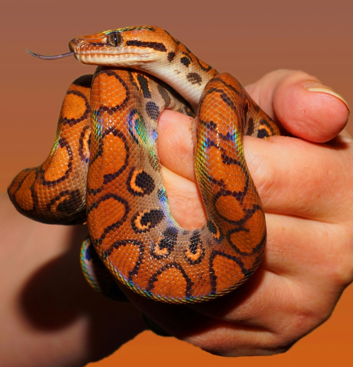

The dog is man's best friend - this is often said when it comes to the relationship between master and **pet**. The cat is the most popular pet in Germany, ahead of the dog, followed by rodents, fish and reptiles. A pet brings you joy, is a soulmate or is simply beautiful to look at. But **keeping** a pet also involves work, because you are committing yourself for a long time and have to take the needs of your pets into account.

Here you can find out how to organize species-appropriate pet ownership and what conditions you and your household should meet in order to be able to offer an animal a good home.

## Does a pet fit into your life?

The first question is whether there is room for an animal in your everyday life. You have to take **responsibility** for a pet for an indefinite period of time. You should ask yourself whether you can meet the individual requirements that your pet places on you.

You should pay attention to this before you get a pet.

### When is an animal considered a pet?

In animal husbandry, a distinction is made between farm animals, pets and wild animals. To be considered a pet, an animal must be kept by humans and live with them. **Wild and farm animals** can also become pets under certain circumstances. Depending on the legal regulations in your country, you can keep almost any animal as a pet.

In Germany, the term **pet** is mainly characterized by typical representatives such as dogs, cats and rodents. However, exotic animals are also increasingly being kept as pets.

### Exotic animals

From _Nemo the_ clownfish to _Hedwig_ the snowy owl: popular animals that normally live in zoos or in the wild can increasingly be found in private households. With a few exceptions, you are allowed to keep exotic animals of all kinds as pets in Germany.

You may keep snakes subject to legal requirements, but you must report dangerous specimens.

Animals of a particularly rare or dangerous species may have a certain appeal, but they are very demanding to keep. This is because exotic animals need special food, are used to a different climate and often outgrow their owners. Buying such animals over the Internet is strongly discouraged, as they are usually sold illegally and taken from their homeland for this purpose.

## Keeping animals in the rented apartment

Are you planning to move in with a new animal companion and are unsure whether you are even allowed to keep a pet in your apartment? Then it is advisable to take a look at your **tenancy agreement** or contact your **landlord** directly. Because you are not allowed to keep every pet without prior agreement.



Your landlord can stipulate certain restrictions on keeping pets in the tenancy agreement. If there is no such provision in the tenancy agreement, the landlord may not prohibit you from keeping pets, regardless of which animal it is. The exception to this is the keeping of dangerous animals.




There is a so-called **permission proviso**, which restricts the keeping of large animals. If this clause is included in your tenancy agreement, you must ask your landlord for permission before moving in with an animal. The landlord may prohibit you from acquiring certain animals in individual cases, stating a reason.




**Small animals** such as mice, geckos or ornamental fish that do not pose a danger, noise or odor nuisance and are kept in closed cages, terrariums or aquariums do not require a permit.




Of course, there is nothing wrong with a short visit from a friend with their pet. However, you must obtain the landlord's consent if you look after animals for a longer period of time or even for a fee.


## Animal husbandry costs time

Before you get a pet, you should be aware of the impact the animal will have on your **daily routine**. Because animals cost time. Whether it's regularly taking your dog for a walk, giving your cat the cuddles it demands or preparing fresh food for your rabbit. Even small animals that require little attention but have enclosures that are difficult to clean take up your time.

Of course, in a household with several people, it makes sense to **divide up the tasks** involved in looking after your pet. It makes sense to draw up a plan so that your pet never feels neglected.

If you are away for a longer period of time, for example because you are going on **vacation**, you should take [care of](https://www.lanuv.nrw.de/verbraucherschutz/tierschutz/tierhaltung/allgemeines/haustiere-in-der-urlaubszeit#:~:text=F%C3%BCr%20eine%20Reise%20ins%20Ausland,kann%20es%20ein%20Einreiseverbot%20geben.) your pet in good time. With rodents, it is often enough to ask friends and relatives to look after them from time to time and feed them. This is usually not enough for larger animals, as they need to be actively exercised and need to be close to people.



For longer vacations, you have the option of taking your pet to a **boarding kennel**. If you have purchased your pet from a breeder, you can also ask them whether they offer vacation care. In any case, you should not leave your pet alone at home.

## What you need for species-appropriate animal husbandry

The environment and care your pet needs depends on the size, type and character of the animal. Exotic and rare animals usually have higher requirements than those described here.

### Basic equipment

- **Toys:** To give your pet something to do while you are away or busy, you should get it suitable toys that will last a long time.
- **Aquariums/cages:** For small animal fans, setting up an enclosure and creating an appropriate environment is part of the process. When buying a cage or aquarium, you should consider how much space, light and warmth your animal needs.
- **Sleeping area**: Animals that move freely around your home first have to get used to their new surroundings. Offer your pet a retreat that can also serve as a place to sleep.
- **Feeding stations:** To ensure that your pet has constant access to food and drink, you should set up a fixed feeding station. This will make it easier for you to monitor your pet's eating behavior.

You can find everything your pet needs in pet shops.

- **Transport box:** The first thing your pet will see is the transport box. You will need this when you collect your pet, for visits to the vet or while you are cleaning the cage.
- **Collar/harness:** To make sure you don't lose your pet on walks, you will need a lead and a collar, preferably with the most important information about your pet in case it does get lost.
- **Cleaning agents:** Your pet will only feel comfortable in a clean home. You should therefore clean all items used to keep animals regularly.

### Nutrition

You have a great responsibility when it comes to feeding your pet. As with humans, **regular meals** promote digestion and metabolism. Pay particular attention to the **amount** you feed your pet. This should depend on your pet' **s body weight**. Dogs and cats in particular sometimes demand more and more food, which can lead to physical discomfort in the long term.

Animals don't always eat what you put in front of them. In this case, it is a good idea to alternate between dry, canned and fresh food to give your pet a taste for it. If that doesn't work either, you can use treats for a short time.

Many of the foods we eat every day are **toxic** to animals. Dogs, for example, cannot tolerate chocolate and must also be kept away from many other [foods](https://www.br.de/radio/bayern1/was-duerfen-hunde-nicht-fressen-100.html). Therefore, make sure that you keep your food out of reach of your pets.

Your pet should always have access to fresh **drinking water**. This is particularly important for rodents. In addition, rodents need roughage such as hay and straw around the clock to keep their digestive system working.

### Health

You can tell whether your pet is well by its **behavior** and **appearance**. Typical signs of illness are, for example, loss of appetite, weight loss, vomiting, apathy or changes in coat. In these cases, you should visit the vet.

Dogs need enough exercise every day.

### Care

At best, grooming an animal is limited to **feeding** and **cleaning the toilet**. This is because most animals clean themselves. Nevertheless, older animals often need the support of their owners. Possible tasks include brushing, cutting claws and grooming in the event of illness.

But grooming can also mean that you want to pamper your pet. For such needs, there are, for example, **groomers** who can give your pet a makeover.

## Animal husbandry costs money

If you want to have a pet, you have to be able to afford it. After all, pets are expensive, especially when it comes to expensive **visits to the vet**.

**Prices** vary widely depending on whether you buy an animal from a shelter or a breeder. In addition to food and care products, **dog tax** and **pet insurance** are also payable each month. For a rough guide, you can find the costs of the top 3 pets in Germany here.

### Dogs

- **Purchase:** 200 to 3500 euros
- **Basic equipment:** 70 to 300 euros
- **Monthly costs:** approx. 110 euros

### Cats

- **Purchase:** 100 to 2000 euros
- **Basic equipment:** 150 to 500 euros
- **Monthly costs:** approx. 70 euros

### Small animals

- **Purchase:** 50 to 200 euros
- **Basic equipment:** 100 to 300 euros
- **Monthly costs:** approx. 40 euros

## When you should visit the vet

Just like us humans, animals sometimes fall ill, but they often hide it from us. It is therefore necessary to consult a vet even if there are minor deviations from your pet's normal behavior. Regular **preventive check-ups** can help to prevent illness.

{{< warning headline="Health insurance for your pet" text="Health insurance can be worthwhile for your pet, especially if you are aware of any pre-existing conditions. Insurance premiums start at 200 euros per year for cats and 280 euros for dogs. [Surgery insurance](https://www.finanztip.de/tierkrankenversicherung/#:~:text=F%C3%BCr%20eine%20OP%2DVersicherung%20zahlst,pro%20Jahr%20\(f%C3%BCr%20Freig%C3%A4nger\).) can also be worthwhile for older animals, as operations can quickly cost four-figure sums. Otherwise, you should set aside enough money to pay for it in an emergency." />}}

When you take in an animal, you should go to the doctor for an initial **health check**. Regular **vaccinations** and **worming** are also necessary.

Preventive care is the be-all and end-all to give your pet a long life.

## Where does your pet come from?

Buying an animal from an animal shelter, pet shop or breeder is very easy. However, depending on the option, the animal welfare, the price and how exotic the animals are can vary greatly.

### Animal shelter

By purchasing an animal from an animal shelter, you are giving **an abandoned animal** a new home and supporting species-appropriate animal husbandry. Before you decide on an animal, you can get to know it intensively. At the shelter you will meet a wide variety of species and characters, some of which have had bad experiences in the past and need special attention.

In order to be able to adopt the animal of your choice, a personal check is carried out to ensure that the animal will be given to a loving owner and a suitable home. Once this hurdle has been overcome, you only have to pay the **placement fee**. The fact that the animals are always vaccinated and dewormed saves you costs and a trip to the vet.

### Pet shop

A visit to the pet shop encourages **spontaneous purchases**. After all, small animals, food and accessories can be bought in one go. Nevertheless, buying an animal there often supports poor animal husbandry. The animals are seen as commodities and usually come from breeding facilities. In addition, the small cages in which rodents and reptiles are displayed give a false impression of how much space you need for species-appropriate animal husbandry.

### Breeder

An animal from a breeder is one thing above all: **expensive**. If you want a special pedigree cat or an exotic fish, you will find it here for the right price.

Before you buy an animal from a breeder, you should check the breeder. Because not all breeders do their job out of passion. Some do it out of greed for profit, with species-appropriate animal husbandry and animal welfare being neglected. The animals may suffer from inbreeding, overbreeding or torture breeding, which is not apparent when you buy them and can cause you costly problems later on.

### Private

When buying privately, there are big differences depending on whether you want to buy an animal on eBay or adopt a puppy from a neighbor's dog. Caution is advised, especially when **buying online**. This is because you cannot judge whether an animal is healthy or has been kept well from pictures alone.

Look at reviews about the seller and ask for more pictures and information about the animal. You should also not buy the animal without first sniffing it on site. This will quickly tell you whether the seller is trustworthy. Make sure that you receive a purchase contract that you can fall back on if necessary if your pet has undiscovered illnesses.

## A pet for the whole family

For children, the question of whether or not they want a pet is easy to answer. They are often the initiators when it comes to this wish. Because in their minds, a pet is a loyal companion who loves to cuddle them and loves them unconditionally. Only the parents know that not all animals meet these requirements and that keeping a pet involves a lot of work. You should therefore discuss the purchase of a pet in detail with your children.

If children are the main reason for wanting a pet, parents often opt for an **easy-care small animal**. However, rabbits, guinea pigs or hamsters hardly satisfy children's desire for closeness and cuddles. Quite the opposite: they are usually shy and mucking out requires a lot of work. This is why rodents are particularly suitable for children who enjoy observing and caring for animals and are able to give them their space.

It is important for children to learn to respect the animal's boundaries.

By caring for animals, children can learn to treat other living creatures with **respect** and take **responsibility**. Despite the positive learning effect, interest in the animals usually wanes over time and the work is left to the parents. Therefore, the acquisition of a pet should always be subject to **conditions**. If your child no longer shows any interest and you hardly have any time to look after it yourself, the long-awaited purchase will result in a quick handover to an animal shelter. So make sure you know beforehand whether you can do justice to the animal in the long term.

## Free app for your animal husbandry

When you get a pet, there is a lot to consider when keeping pets. SeaTable offers you a simple, efficient and free solution that allows you to collect and view the most important data about your pets in one place.

With the template for your animal husbandry you can:

- Create fact sheets and note down health data
- Keep vet bills, ID cards and documents
- plan who will look after the animal and when
- document what you have fed and when
- Organize care for your vacations and absences
- Record expenses and calculate costs

If you would like to use SeaTable for your animal husbandry, simply [register]() free of charge. You can find the corresponding template with sample entries [here]().
