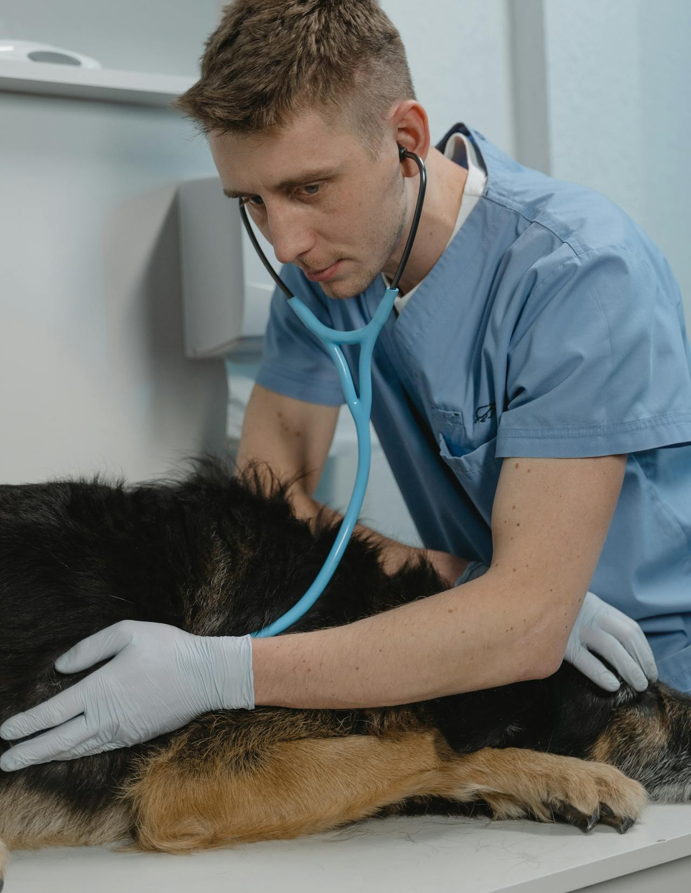

El perro es el mejor amigo del hombre: esto se dice a menudo cuando se trata de la relación entre amo y **mascota**. El gato es la mascota más popular en Alemania, por delante del perro, seguido de roedores, peces y reptiles. Una mascota da alegría, es un alma gemela o simplemente es bonita de ver. Sin embargo, **tener** un animal de compañía también implica trabajo, ya que te comprometes durante mucho tiempo y tienes que tener en cuenta las necesidades de tus mascotas.

Aquí encontrará información sobre cómo organizar una tenencia de animales de compañía adecuada a su especie y qué condiciones deben cumplir usted y su familia para poder ofrecer un buen hogar a un animal.

## ¿Encaja una mascota en su vida?

La primera pregunta es si hay sitio para un animal en tu vida cotidiana. Tienes que **responsabilizarte** de una mascota por tiempo indefinido. Debes preguntarte si puedes cumplir los requisitos individuales que tu mascota te impone.

Debes ser consciente de ello antes de adquirir un animal de compañía.

### ¿Cuándo se considera que un animal es un animal de compañía?

En la cría de animales se distingue entre animales de granja, animales de compañía y animales salvajes. Para ser considerado animal de compañía, un animal debe ser mantenido por humanos y vivir con ellos. Los **animales salvajes y** de granja también pueden convertirse en animales de compañía en determinadas circunstancias. Dependiendo de la normativa legal de su país, puede tener casi cualquier animal como mascota.

En Alemania, el término **animal** de compañía se refiere sobre todo a representantes típicos como perros, gatos y roedores. Sin embargo, cada vez se tienen más animales exóticos como mascotas.

### Animales exóticos

Desde el pez payaso _Nemo_ hasta el búho nival _Hedwig_, cada vez es más frecuente encontrar en los hogares animales populares que normalmente viven en zoológicos o en la naturaleza. Salvo algunas excepciones, en Alemania está permitido tener animales exóticos de todo tipo como mascotas.

Puede tener serpientes en condiciones legales, pero debe informar de los ejemplares peligrosos.

Los animales de especies especialmente raras o peligrosas pueden tener cierto atractivo, pero son muy difíciles de mantener. Esto se debe a que los animales exóticos necesitan una alimentación especial, están acostumbrados a un clima diferente y a menudo superan a sus dueños. Desaconsejamos encarecidamente comprar este tipo de animales por Internet, ya que suelen venderse ilegalmente y sacarse de su país de origen con este fin.

## Tener animales en el piso de alquiler

¿Piensa mudarse con un nuevo animal de compañía y no está seguro de si puede tener una mascota en su piso? Entonces es aconsejable echar un vistazo al **contrato de alquiler** o ponerse en contacto directamente con el **casero**. Porque no está permitido tener cualquier animal de compañía sin acuerdo previo.



El casero puede estipular en el contrato de alquiler ciertas restricciones a la tenencia de animales de compañía. Si no existe tal disposición en el contrato de alquiler, el casero no puede prohibirle tener animales de compañía, independientemente del animal de que se trate. La excepción es la tenencia de animales peligrosos.




Existe la llamada cláusula **de permiso**, que restringe la tenencia de animales grandes. Si esta cláusula está incluida en su contrato de alquiler, debe pedir permiso al propietario antes de mudarse con un animal. El casero puede prohibirle adquirir determinados animales en casos concretos, indicando el motivo.




Los **animales pequeños** como ratones, salamanquesas o peces ornamentales que no representen peligro, ruido o molestias por olores y se mantengan en jaulas cerradas, terrarios o acuarios no necesitan permiso.




Por supuesto, no hay nada malo en una breve visita de un amigo con su mascota. Sin embargo, debes obtener el consentimiento del propietario si cuidas de animales durante más tiempo o incluso a cambio de una remuneración.


## La cría de animales cuesta tiempo

Antes de tener una mascota, debes ser consciente del impacto que tendrá en tu **rutina diaria**. Porque los animales cuestan tiempo. Ya sea pasear al perro con regularidad, darle al gato los mimos que necesita o preparar comida fresca para el conejo. Incluso los animales pequeños que requieren poca atención pero tienen recintos difíciles de limpiar te quitan tiempo.

Por supuesto, en un hogar con varias personas, tiene sentido dividir **las tareas** de cuidado de tu mascota. Lo lógico es trazar un plan para que tu mascota nunca se sienta desatendida.

Si te ausentas durante un periodo prolongado, por ejemplo porque te vas de **vacaciones**, debes [ocuparte](https://www.lanuv.nrw.de/verbraucherschutz/tierschutz/tierhaltung/allgemeines/haustiere-in-der-urlaubszeit#:~:text=F%C3%BCr%20eine%20Reise%20ins%20Ausland,kann%20es%20ein%20Einreiseverbot%20geben.) de tu mascota con tiempo. En el caso de los roedores, suele bastar con pedir a amigos y familiares que se ocupen de ellos de vez en cuando y les den de comer. Esto no suele ser suficiente para los animales más grandes, ya que necesitan ejercicio activo y estar cerca de la gente.



Para vacaciones más largas, tiene la opción de llevar a su mascota a una **residencia can** ina. Si ha comprado el animal a un criador, puede preguntarle si ofrece cuidado en vacaciones. En cualquier caso, no debe dejar a su mascota sola en casa.

## Lo que necesita para una cría de animales adecuada a su especie

El entorno y los cuidados que necesita su mascota dependen del tamaño, tipo y carácter del animal. Los animales exóticos y raros suelen tener requisitos más exigentes que los aquí descritos.

### Equipamiento básico

- **Juguetes:** Para que tu mascota tenga algo que hacer mientras tú estás fuera u ocupado, debes comprarle juguetes adecuados que le duren mucho tiempo.
- **Acuarios/jaulas:** Para los aficionados a los animales pequeños, instalar un recinto y crear un entorno adecuado forma parte del proceso. Al comprar una jaula o un acuario, debes tener en cuenta cuánto espacio, luz y calor necesita tu mascota.
- **Zona para dormir**: Los animales que se mueven libremente por su casa primero tienen que acostumbrarse a su nuevo entorno. Ofrezca a su mascota un refugio que también pueda servirle como lugar para dormir.
- **Comederos:** Para que tu mascota tenga acceso constante a comida y bebida, debes instalar un comedero fijo. Así te resultará más fácil controlar su comportamiento alimentario.

En las tiendas de animales encontrará todo lo que su mascota necesita.

- **Caja de transporte:** Lo primero que verá su mascota es la caja de transporte. La necesitará cuando recoja a su mascota, para las visitas al veterinario o mientras se limpia la jaula.
- **Collar/arnés:** Para asegurarte de que no pierdes a tu mascota en los paseos, necesitas una correa y un collar, preferiblemente con la información más importante sobre tu mascota en caso de que se pierda.
- **Productos de limpieza:** su mascota sólo se sentirá a gusto en un hogar limpio. Por lo tanto, debes limpiar con regularidad todos los elementos utilizados para mantener a los animales.

### Nutrición

Tienes una gran responsabilidad a la hora de alimentar a tu mascota. Como en el caso de los humanos, las **comidas regulares** favorecen la digestión y el metabolismo. Preste especial atención a la **cantidad** que le da de comer. Debe depender de su **peso corporal**. Los perros y los gatos, en particular, a veces piden más y más comida, lo que puede provocarles malestar físico a largo plazo.

Los animales no siempre comen lo que se les pone delante. En este caso, conviene alternar comida seca, enlatada y fresca para abrir el apetito del animal. Si esto tampoco funciona, puedes utilizar golosinas durante un breve periodo de tiempo.

Muchos de los alimentos que comemos a diario son **tóxicos** para los animales. Los perros, por ejemplo, no toleran el chocolate y deben mantenerse alejados de muchos otros [alimentos](https://www.br.de/radio/bayern1/was-duerfen-hunde-nicht-fressen-100.html). Por tanto, asegúrese de mantener los alimentos fuera del alcance de sus mascotas.

Su mascota debe tener siempre acceso a **agua potable** fresca. Esto es especialmente importante para los roedores. Los roedores también necesitan forraje, como heno y paja, a todas horas para mantener en funcionamiento su sistema digestivo.

### Salud

Puede saber si su mascota está bien por su **comportamiento** y su **aspecto**. Los signos típicos de enfermedad son, por ejemplo, pérdida de apetito, pérdida de peso, vómitos, apatía o cambios en el pelaje. En estos casos, debe acudir al veterinario.

Los perros necesitan hacer suficiente ejercicio todos los días.

### Atención

En el mejor de los casos, el aseo de un animal se limita a **darle de comer** y **limpiarle el retrete**. Esto se debe a que la mayoría de los animales se limpian solos. Sin embargo, los animales mayores suelen necesitar el apoyo de sus dueños. Entre las posibles tareas se incluyen el cepillado, el corte de garras y el cuidado en caso de enfermedad.

Pero acicalar también puede significar que quiere mimar a su mascota. Para tales necesidades, existen, por ejemplo, **peluqueros** que pueden hacer un cambio de imagen a tu mascota.

## La cría de animales cuesta dinero

Si quieres tener un animal de compañía, tienes que poder permitírtelo. Al fin y al cabo, las mascotas son caras, sobre todo cuando se trata de costosas **visitas al veterinario**.

Los **costes de adquisición** varían mucho según se compre un animal a un refugio o a un criador. Además de la comida y los productos para el cuidado del animal, hay que pagar cada mes **la tasa canina** y el **seguro de animales de compañía**. Para hacerse una idea aproximada, aquí puede consultar los costes de los 3 principales animales de compañía en Alemania.

### Perros

- **Compra:** de 200 a 3500 euros
- **Equipamiento básico:** de 70 a 300 euros
- **Coste mensual:** 110 euros aprox.

### Gatos

- **Compra:** de 100 a 2000 euros
- **Equipamiento básico:** de 150 a 500 euros
- **Coste mensual:** aprox. 70 euros

### Animales pequeños

- **Compra:** de 50 a 200 euros
- **Equipamiento básico:** de 100 a 300 euros
- **Coste mensual:** aprox. 40 euros

## Cuándo debe acudir al veterinario

Al igual que nosotros, los animales a veces enferman, pero a menudo nos lo ocultan. Por eso es necesario consultar a un veterinario aunque haya pequeñas desviaciones del comportamiento normal de su mascota. Las **revisiones preventivas** periódicas pueden ayudar a prevenir enfermedades.

{{< warning headline="Seguro médico para su mascota" text="Un seguro médico puede merecer la pena para su mascota, sobre todo si conoce alguna enfermedad preexistente. Las primas de seguro empiezan en 200 euros al año para gatos y 280 euros para perros. El [seguro de cirugía](https://www.finanztip.de/tierkrankenversicherung/#:~:text=F%C3%BCr%20eine%20OP%2DVersicherung%20zahlst,pro%20Jahr%20\(f%C3%BCr%20Freig%C3%A4nger\).) también puede ser útil para animales mayores, ya que las operaciones pueden costar rápidamente sumas de cuatro cifras. Por lo demás, conviene reservar dinero suficiente para pagarlo en caso de urgencia." />}}

Cuando se acoge a un animal, hay que acudir al médico para un primer **chequeo sanitario**. También es necesario **vacunarlo** y **desparasitarlo** periódicamente.

La prevención es lo más importante para que su mascota tenga una larga vida.

## ¿De dónde procede su mascota?

Comprar un animal en un refugio, una tienda de animales o un criador es muy fácil. Sin embargo, según la opción, el bienestar del animal, el precio y lo exóticos que sean los animales pueden variar mucho.

### Refugio de animales

Al comprar un animal a una protectora, estás dando un nuevo hogar **a un animal abandonado** y apoyando la cría de animales adecuados a su especie. Antes de decidirte por un animal, puedes conocerlo intensamente. En el refugio de animales conocerás una gran variedad de especies y caracteres, algunos de los cuales han tenido malas experiencias en el pasado y necesitan una atención especial.

Para adoptar el animal de su elección, se realiza un control personal que garantiza que el animal será entregado a un dueño cariñoso y a un hogar adecuado. Una vez superado este obstáculo, sólo tiene que pagar la **tasa de colocación**. El hecho de que los animales estén siempre vacunados y desparasitados le ahorra gastos y desplazamientos al veterinario.

### Tienda de mascotas

Una visita a la tienda de animales favorece las **compras espontáneas**. Al fin y al cabo, los animales pequeños, la comida y los accesorios pueden comprarse de una sola vez. Sin embargo, comprar un animal en una tienda de animales a menudo contribuye a una cría deficiente. Los animales se consideran mercancías y suelen proceder de centros de cría. Además, las pequeñas jaulas en las que se exponen roedores y reptiles dan una falsa impresión de cuánto espacio se necesita para una cría adecuada a la especie.

### Criador

Un animal de un criador es sobre todo una cosa: **caro**. Si quieres un gato especial con pedigrí o un pez exótico, aquí lo encontrarás por el precio justo.

Antes de comprar un animal a un criador, debe comprobarlo. Porque no todos los criadores hacen su trabajo por pasión. Algunos actúan por afán de lucro, con lo que descuidan la cría adecuada a la especie y el bienestar de los animales. Los animales pueden sufrir de endogamia, sobregamia o cría de tortura, lo que no es evidente cuando los compra y puede causarle costosos problemas más adelante.

### Privado

En la compra privada hay grandes diferencias según se quiera comprar un animal en eBay o adoptar un cachorro del perro de un vecino. Se recomienda precaución, sobre todo al **comprar por internet**. Esto se debe a que no se puede juzgar si un animal está sano o se ha criado bien basándose sólo en fotos.

Mira las opiniones sobre el vendedor y pide más fotos e información sobre el animal. Tampoco deberías comprar el animal sin haberlo olfateado antes in situ. Esto le dirá rápidamente si el vendedor es de fiar. Asegúrese de que le entregan un contrato de compra al que pueda recurrir en caso necesario si el animal tiene enfermedades no detectadas.

## Una mascota para toda la familia

Para los niños, la pregunta de si quieren o no un animal de compañía es fácil de responder. A menudo son ellos quienes inician este deseo. Porque en su mente, una mascota es un compañero leal al que le encanta abrazarles y que les quiere incondicionalmente. Sólo los padres saben que no todos los animales cumplen estos requisitos y que tener una mascota implica mucho trabajo. Por lo tanto, debe hablar detalladamente con sus hijos sobre la compra de un animal de compañía.

Si el principal motivo para tener un animal de compañía son los niños, los padres suelen decantarse por un **animal pequeño y fácil de cuidar**. Sin embargo, los conejos, cobayas o hámsters difícilmente satisfacen el deseo de cercanía y mimos de los niños. Más bien al contrario: suelen ser tímidos y limpiar el suelo requiere mucho trabajo. Por eso, los roedores son especialmente adecuados para los niños que disfrutan observando y cuidando a los animales y son capaces de darles su espacio.

Es importante que los niños aprendan a respetar los límites del animal.

Cuidando animales, los niños pueden aprender a tratar a otros seres vivos con **respeto** y a asumir **responsabilidades**. A pesar del positivo efecto de aprendizaje, el interés por los animales suele decaer con el tiempo y el trabajo queda en manos de los padres. Por eso, la adquisición de un animal de compañía debe ir siempre unida a unas **condiciones**. Si su hijo ya no muestra ningún interés y usted apenas tiene tiempo para cuidarlo, la ansiada compra acabará en una rápida entrega a una protectora de animales. Así que asegúrate de antemano de que puedes hacer justicia al animal a largo plazo.

## Aplicación gratuita para la cría de animales

Cuando se adquiere una mascota, hay mucho que tener en cuenta a la hora de mantenerla. SeaTable le ofrece una solución sencilla, eficaz y gratuita que le permite recopilar y ver los datos más importantes sobre sus mascotas en un solo lugar.

Puede utilizar la plantilla para su cría de animales:

- Crear fichas informativas y anotar datos sanitarios
- Guarde las facturas del veterinario, tarjetas de identificación y documentos
- planificar quién cuidará del animal y cuándo
- documente lo que ha alimentado y cuándo
- Organizar el cuidado de sus vacaciones y ausencias
- Registro de gastos y cálculo de costes

Si desea utilizar SeaTable para su cría de animales, sólo tiene que [registrarse]() gratuitamente. [Aquí]() encontrará la plantilla correspondiente con ejemplos de entradas.
