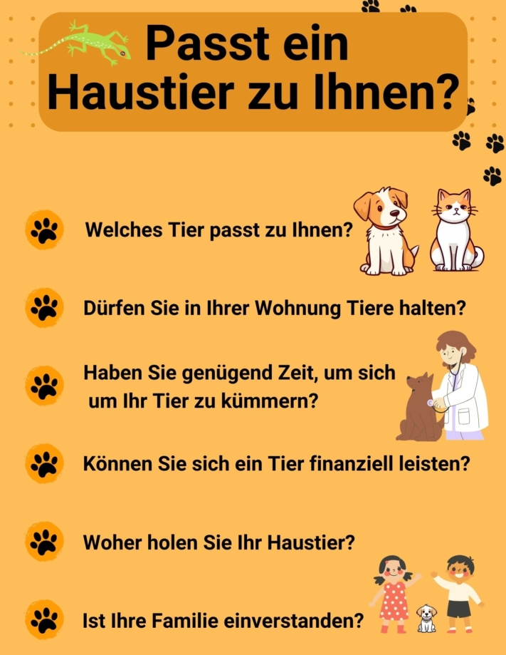
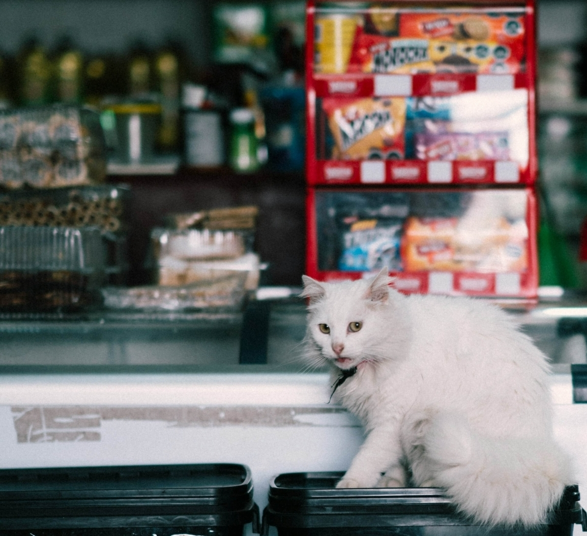

Собака - лучший друг человека - так часто говорят, когда речь заходит об отношениях между хозяином и **питомцем**. В Германии самым популярным домашним животным является кошка, за ней следуют грызуны, рыбы и рептилии. Домашнее животное приносит вам радость, является родственной душой или просто красивым на вид. Однако **содержание** домашнего животного - это еще и труд, ведь вы посвящаете ему себя надолго и должны учитывать потребности своих питомцев.

Здесь вы узнаете, как организовать содержание животных с учетом их вида и какие условия должны быть соблюдены вами и вашими домочадцами, чтобы вы могли предложить животному хороший дом.

## Вписывается ли домашнее животное в вашу жизнь?

Первый вопрос - есть ли место для животного в вашей повседневной жизни. Вам придется взять на **себя ответственность** за питомца на неопределенный срок. Вы должны спросить себя, сможете ли вы выполнить те индивидуальные требования, которые предъявляет к вам ваш питомец.

Вы должны знать об этом, прежде чем заводить питомца.

### Когда животное считается домашним?

В животноводстве различают сельскохозяйственных, домашних и диких животных. Чтобы считаться домашним животным, оно должно содержаться человеком и жить с ним. **Дикие и сельскохозяйственные животные** также могут стать домашними при определенных обстоятельствах. В зависимости от правовых норм, действующих в вашей стране, вы можете содержать практически любое животное в качестве домашнего.

В Германии понятие " **домашнее животное** " в основном характеризует типичных представителей, таких как собаки, кошки и грызуны. Однако все чаще в качестве домашних питомцев заводят и экзотических животных.

### Экзотические животные

От рыбки-клоуна _Немо_ до снежной совы _Хедвиг_\- популярные животные, которые обычно живут в зоопарках или в дикой природе, все чаще встречаются в частных домах. За некоторыми исключениями, в Германии разрешено держать в качестве домашних питомцев экзотических животных всех видов.

Вам разрешено содержать змей на законных основаниях, но вы должны сообщать об опасных экземплярах.

Животные особо редких или опасных видов могут иметь определенную привлекательность, но они очень требовательны к содержанию. Это связано с тем, что экзотические животные нуждаются в особом корме, привыкают к другому климату и часто перерастают своих хозяев. Мы настоятельно не рекомендуем покупать таких животных через Интернет, так как они обычно продаются нелегально и для этого их вывозят с родины.

## Содержание животных в арендованной квартире

Вы планируете переехать в квартиру с новым животным и не уверены, что вам вообще разрешено держать в ней питомца? Тогда рекомендуем заглянуть в **договор аренды** или обратиться непосредственно к **хозяину**. Ведь вам не разрешается держать любое домашнее животное без предварительного согласования.



Ваш арендодатель может предусмотреть в договоре аренды определенные ограничения на содержание домашних животных. Если такого положения в договоре нет, арендодатель не может запретить вам держать домашних животных, независимо от того, какое это животное. Исключением является содержание опасных животных.




Существует так называемая **оговорка о разрешении**, которая ограничивает содержание крупных животных. Если этот пункт включен в ваш договор аренды, вы должны спросить разрешения у арендодателя, прежде чем вселиться в квартиру с животным. В отдельных случаях домовладелец может запретить вам заводить определенных животных, указав причину.




**Мелкие животные**, такие как мыши, гекконы или декоративные рыбки, не представляющие опасности, не создающие шума или неприятного запаха и содержащиеся в закрытых клетках, террариумах или аквариумах, не требуют разрешения.




Конечно, нет ничего плохого в кратковременном визите друга со своим питомцем. Однако вы должны получить согласие арендодателя, если будете присматривать за животными в течение длительного времени или даже за плату.


## Животноводство требует времени

Прежде чем завести домашнее животное, вы должны осознать, как оно повлияет на ваш распорядок **дня**. Ведь животные требуют времени. Будь то регулярные прогулки с собакой, ласки с кошкой или приготовление свежего корма для кролика. Даже маленькие животные, которые не требуют особого внимания, но имеют вольеры, которые трудно чистить, отнимают ваше время.

Конечно, в семье, где живут несколько человек, имеет смысл **разделить обязанности** по уходу за питомцем. Имеет смысл составить план, чтобы ваш питомец никогда не чувствовал себя обделенным вниманием.

Если вы уезжаете надолго, например, в **отпуск**, [позаботьтесь](https://www.lanuv.nrw.de/verbraucherschutz/tierschutz/tierhaltung/allgemeines/haustiere-in-der-urlaubszeit#:~:text=F%C3%BCr%20eine%20Reise%20ins%20Ausland,kann%20es%20ein%20Einreiseverbot%20geben.) о своем питомце заблаговременно. В случае с грызунами часто бывает достаточно попросить друзей или родственников время от времени присматривать за ними и кормить их. Для крупных животных этого обычно недостаточно, ведь им нужны активные физические нагрузки и близость к людям.



Для более длительного отдыха вы можете взять животное в **питомник**. Если вы приобрели животное у заводчика, вы также можете узнать у него, предоставляют ли они услуги по уходу за питомцем на время отпуска. В любом случае не оставляйте животное одно дома.

## Что нужно для содержания животных с учетом их вида

Условия содержания и уход, необходимые вашему питомцу, зависят от размера, вида и характера животного. Экзотические и редкие животные обычно предъявляют более высокие требования, чем описанные здесь.

### Основное оборудование

- **Игрушки:** Чтобы вашему питомцу было чем заняться, пока вас нет дома или вы заняты, купите ему подходящие игрушки, которые прослужат долго.
- **Аквариумы/клетки:** Для любителей мелких животных обустройство вольера и создание подходящей обстановки - это часть процесса. Покупая клетку или аквариум, учитывайте, сколько места, света и тепла необходимо вашему питомцу.
- **Спальное место**: Животным, которые свободно перемещаются по дому, сначала нужно привыкнуть к новой обстановке. Предложите своему питомцу место для отдыха, которое также может служить местом для сна.
- **Станции кормления:** Чтобы обеспечить питомцу постоянный доступ к еде и питью, установите стационарную кормушку. Так вам будет проще следить за пищевым поведением питомца.

В зоомагазинах можно найти все, что нужно вашему питомцу.

- **Транспортная коробка:** Первое, что увидит ваш питомец, - это транспортировочная коробка. Она понадобится вам, когда вы будете забирать животное, для визитов к ветеринару или во время чистки клетки.
- **Ошейник/шлейка:** Чтобы не потерять питомца на прогулках, вам понадобится поводок и ошейник, желательно с самой важной информацией о нем на случай, если он потеряется.
- **Чистящие средства:** Ваш питомец будет чувствовать себя комфортно только в чистом доме. Поэтому необходимо регулярно чистить все предметы, используемые для содержания животных.

### Питание

На вас лежит большая ответственность, когда речь идет о кормлении вашего питомца. Как и у людей, **регулярное питание** способствует пищеварению и обмену веществ. Уделите особое внимание **количеству** корма, которое вы даете своему питомцу. Оно должно зависеть от **массы тела** животного. Собаки и кошки, в частности, могут иногда требовать все больше и больше еды, что в долгосрочной перспективе может привести к физическому дискомфорту.

Животные не всегда едят то, что вы перед ними положили. В этом случае стоит чередовать сухие, консервированные и свежие корма, чтобы привить питомцу вкус. Если и это не помогает, можно на короткое время использовать лакомства.

Многие продукты, которые мы едим каждый день, **токсичны** для животных. Собаки, например, не переносят шоколад, а также должны быть ограждены от многих других [продуктов](https://www.br.de/radio/bayern1/was-duerfen-hunde-nicht-fressen-100.html). Поэтому следите за тем, чтобы еда была недоступна для ваших питомцев.

У вашего питомца всегда должен быть доступ к свежей **питьевой воде**. Это особенно важно для грызунов. Грызуны также нуждаются в грубых кормах, таких как сено и солома, чтобы их пищеварительная система работала круглосуточно.

### Здоровье

Вы можете определить, здоров ли ваш питомец, по его **поведению** и **внешнему виду**. Типичными признаками болезни являются, например, потеря аппетита, снижение веса, рвота, апатия или изменение шерсти. В этих случаях следует обратиться к ветеринару.

Собаки нуждаются в ежедневных физических нагрузках.

### Уход

В лучшем случае уход за животным ограничивается **кормлением** и **чисткой туалета**. Это связано с тем, что большинство животных чистят себя сами. Тем не менее пожилые животные часто нуждаются в поддержке хозяев. Возможные задачи - расчесывание, стрижка когтей и уход за больным животным.

Но груминг также может означать, что вы хотите побаловать своего питомца. Для таких целей существуют, например, **грумеры**, которые могут сделать вашему питомцу макияж.

## Животноводство стоит денег

Если вы хотите завести домашнее животное, вы должны быть в состоянии себе это позволить. Ведь домашние животные стоят дорого, особенно если речь идет о дорогостоящих **визитах к ветеринару**.

**Стоимость покупки** сильно варьируется в зависимости от того, приобретаете ли вы животное в приюте или у заводчика. Помимо корма и средств по уходу, ежемесячно оплачивается **налог на собак** и **страхование домашних животных**. Для ориентира вы можете ознакомиться с расходами на 3 самых популярных домашних животных в Германии здесь.

### Собаки

- **Покупка:** от 200 до 3500 евро
- **Базовая комплектация:** от 70 до 300 евро
- **Ежемесячные расходы:** около 110 евро

### Кошки

- **Покупка:** от 100 до 2000 евро
- **Базовое оборудование:** от 150 до 500 евро
- **Ежемесячные расходы:** около 70 евро

### Мелкие животные

- **Покупка:** от 50 до 200 евро
- **Базовое оборудование:** от 100 до 300 евро
- **Ежемесячные расходы:** около 40 евро

## Когда вам следует посетить ветеринара

Как и мы, люди, животные иногда болеют, но часто скрывают это от нас. Поэтому необходимо обращаться к ветеринару даже при незначительных отклонениях от нормального поведения вашего питомца. Регулярные **профилактические осмотры** помогут предотвратить заболевание.

{{< warning headline="Медицинское страхование для вашего питомца" text="Медицинское страхование может оказаться полезным для вашего питомца, особенно если вы знаете о каких-либо предсуществующих заболеваниях. Страховые взносы начинаются от 200 евро в год для кошек и 280 евро для собак. [Страхование на случай хирургического вмеша](https://www.finanztip.de/tierkrankenversicherung/#:~:text=F%C3%BCr%20eine%20OP%2DVersicherung%20zahlst,pro%20Jahr%20\(f%C3%BCr%20Freig%C3%A4nger\).) тельства также может быть целесообразным для пожилых животных, поскольку операции могут быстро обойтись в четырехзначную сумму. В противном случае вам следует отложить достаточно денег, чтобы оплатить ее в экстренном случае." />}}

Когда вы берете в дом животное, вам следует обратиться к врачу для первоначальной **проверки его здоровья**. Также необходимо регулярно **проводить вакцинацию** и **глистогонку**.

Профилактика - это главное и основное средство для долгой жизни вашего питомца.

## Откуда родом ваш питомец?

Купить животное в приюте, зоомагазине или у заводчика очень просто. Однако в зависимости от варианта, условий содержания животных, цены и степени экзотичности животных они могут сильно различаться.

### Приют для животных

Приобретая животное в приюте для животных, вы дарите **брошенному животному** новый дом и поддерживаете видовое содержание животных. Прежде чем принять решение в пользу животного, вы можете познакомиться с ним поближе. В приюте для животных вы познакомитесь с самыми разными видами и характерами, некоторые из которых в прошлом имели неудачный опыт и требуют особого внимания.

Для того чтобы усыновить выбранное вами животное, проводится личная проверка, чтобы убедиться, что животное попадет к любящему хозяину и в подходящий дом. После того как это препятствие будет преодолено, вам останется только заплатить **за пристройство**. Благодаря тому, что животные всегда вакцинированы и дегельминтизированы, вам не придется тратить время на поход к ветеринару.

### Зоомагазин

Посещение зоомагазина способствует **спонтанным покупкам**. Ведь мелких животных, корм и аксессуары можно купить одним махом. Тем не менее, покупка животного там часто способствует плохому содержанию животных. Животные рассматриваются как товар и обычно поступают из питомников. Кроме того, маленькие клетки, в которых выставлены грызуны и рептилии, создают ложное впечатление о том, сколько места необходимо для содержания животных соответствующего вида.

### Заводчик

Животное от заводчика - это, прежде всего, **дорого**. Если вам нужна особенная породистая кошка или экзотическая рыбка, вы найдете их здесь по подходящей цене.

Прежде чем покупать животное у заводчика, необходимо проверить его. Ведь не все заводчики занимаются своим делом из страсти. Некоторые действуют из жадности к наживе, при этом пренебрегая видовым содержанием животных и их благополучием. Животные могут страдать от инбридинга, чрезмерного скрещивания или пыток, которые не видны при покупке и могут привести к дорогостоящим проблемам в дальнейшем.

### Частный

При частной покупке существуют большие различия в зависимости от того, хотите ли вы приобрести животное на eBay или взять щенка у соседа. Рекомендуется соблюдать осторожность, особенно при **покупке через Интернет**. Это связано с тем, что по одной только фотографии нельзя судить о том, здорово ли животное или хорошо ли его содержат.

Изучите отзывы о продавце и попросите предоставить вам больше фотографий и информации о животном. Также не стоит покупать животное, не понюхав его на месте. Это поможет вам быстро понять, заслуживает ли продавец доверия. Убедитесь, что вы получили договор купли-продажи, на который вы сможете опираться в случае необходимости, если у животного обнаружатся болезни.

## Питомец для всей семьи

Для детей вопрос о том, хотят ли они завести домашнее животное, не представляет сложности. Они часто являются инициаторами этого желания. Ведь в их понимании домашнее животное - это верный товарищ, который любит их обнимать и любит беззаветно. Только родители знают, что не все животные отвечают этим требованиям и что содержание домашнего питомца сопряжено с большим трудом. Поэтому вам следует подробно обсудить с детьми покупку домашнего животного.

Если главной причиной желания завести домашнее животное являются дети, родители часто делают выбор в пользу **небольшого животного, за которым легко ухаживать**. Однако кролики, морские свинки или хомячки вряд ли удовлетворят детскую потребность в близости и объятиях. Совсем наоборот: они обычно пугливы, а вылизывание требует много работы. Поэтому грызуны особенно подходят детям, которые любят наблюдать за животными и ухаживать за ними, а также могут предоставить им свое пространство.

Важно, чтобы дети научились уважать границы животного.

Ухаживая за животными, дети учатся **уважительно** относиться к другим живым существам и брать на **себя ответственность**. Несмотря на положительный обучающий эффект, интерес к животным со временем обычно ослабевает, и вся работа ложится на плечи родителей. Поэтому приобретение питомца всегда должно быть связано с **условиями**. Если ваш ребенок больше не проявляет интереса к животному, а у вас почти нет времени ухаживать за ним самостоятельно, то долгожданная покупка обернется скорой передачей в приют для животных. Поэтому заранее определите, сможете ли вы в долгосрочной перспективе заботиться о животном.

## Бесплатное приложение для вашего животноводства

Когда вы заводите домашнее животное, необходимо многое учесть при его содержании. SeaTable предлагает вам простое, эффективное и бесплатное решение, которое позволит вам собирать и просматривать самые важные данные о ваших питомцах в одном месте.

Вы можете использовать этот шаблон в своем животноводстве:

- Создавайте информационные бюллетени и записывайте данные о состоянии здоровья
- Храните счета от ветеринаров, удостоверения личности и документы.
- планируйте, кто и когда будет ухаживать за животным
- документируйте, чем и когда вы питались
- Организуйте уход на время отпуска и отсутствия
- Учет расходов и калькуляция затрат

Если вы хотите использовать SeaTable в своем животноводстве, просто [зарегистрируйтесь]() бесплатно. Соответствующий шаблон с примерами записей вы найдете [здесь]().
