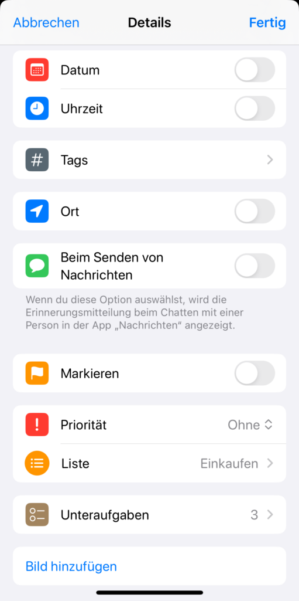

Eine online nutzbare To do Liste mit einer App zu erstellen und zu verwalten bringt viele Vorteile mit sich. Denn eine **To-do-Liste** unterstützt Sie sowohl im Privatleben als auch im beruflichen Tagesgeschäft dabei, Ihre Aufgaben effizient zu meistern und im stressigen Alltag nichts zu vergessen. Lesen Sie in diesem Artikel, warum Sie für Ihre To do Liste eine **Vorlage** einsetzen sollten und welche **App** sich für eine To do Liste anbietet.

## Wofür Sie eine To-do-Liste brauchen

Privat zuhause wie im professionellen [Projektmanagement]() gilt es, alle anstehenden Aufgaben im Blick zu behalten und diese nach und nach abzuarbeiten. In einer To-do-Liste erfassen Sie zuallererst Ihre konkreten **Aufgaben**. Daraufhin definieren Sie gegebenenfalls **Unteraufgaben** oder übergreifende **Kategorien**, legen **Zuständigkeiten** fest und setzen **Fristen**.

Mithilfe eines **Status** können Sie kennzeichnen, ob ein To-do in Bearbeitung oder erledigt ist. Auch ein Schwebezustand ist denkbar, wenn Sie auf Antwort oder Input warten. Zudem sollten Sie Ihre To-dos nach **Priorität** ordnen, um immer die wichtigsten Aufgaben zuerst anzugehen.

### So könnte Ihre To-do-Liste mit einer Vorlage aussehen:

Sie möchten direkt mit dieser kostenlosen Vorlage für Ihre To do Liste arbeiten? [Dann klicken Sie hier >>]()

## Warum Sie für Ihre To-do-Liste eine App nutzen sollten

Eine digitale To do Liste in einer App oder Cloud können Sie jederzeit von überall abrufen und nicht verlieren. Darum ist sie einer Liste auf Papier deutlich überlegen. Nachfolgend lesen Sie weitere Gründe, warum sich die Verwendung einer Online To-do-Liste sowohl privat als auch in der Arbeitswelt lohnt.

### Keine To-dos vergessen

Wenn Sie Ihre To do Liste in einer App notieren, dient dies als eine Art **Ablage aller Gedanken**. Sie können abends vorm Zubettgehen fünf Minuten investieren, um alle Einfälle und dringende Aufgaben aufzuschreiben. Tippen Sie diese per App in Ihre To do Liste ein, um die Befürchtung loszuwerden, etwas Wichtiges zu vergessen. Anschließend haben Sie den Kopf frei, können beruhigt einschlafen und morgens ohne Stress in den Tag starten.

### Struktur in die Arbeit bringen

Auf der Arbeit können Sie mit einer To-do-Liste **Ihren Tag planen**. Verschieben Sie neue Aufgaben in entsprechende Kategorien, vergeben Sie Fristen, Prioritäten und Verantwortliche. Egal, wann und wo Ihnen eine Aufgabe einfällt, Sie können diese schnell dokumentieren. Das gilt für Ihre eigenen Aufgaben genauso wie für die [Arbeit in Teamprojekten]().

### Zusammenhänge erkennen

Eine Vorlage für Ihre To do Liste hilft Ihnen außerdem dabei, Ihre Aufgaben zu **visualisieren**. Sie können auf einen Blick erkennen, wo terminliche Engpässe entstehen und welche Aufgaben dringender sind als andere. Außerdem wird klar, welche Aufgaben zusammengehören und wo die Verantwortlichkeiten liegen. Findet die Planung nicht mehr nur im Kopf, sondern in einer Online To-do-Liste statt, können Sie Ihre To-dos flexibel ordnen und passend priorisieren.

### Geistige Klarheit erlangen

Diese Struktur und die Gewissheit, dass online keine Gedanken oder To-dos verloren gehen, verhilft Ihnen zu **innerer Ruhe**. Ihnen ist immer klar, was Sie gerade zu erledigen haben. Sie können sich also voll und ganz auf die jeweiligen Aufgaben **konzentrieren** und alles andere ausblenden.

### Kommunikation im Team leichter managen

Auch für die Arbeit im Team bringt eine digitale To-do-Liste Vorteile mit sich. Sie haben die Möglichkeit, To-dos zu delegieren und zusammen an Projekten zu arbeiten. Hängt Ihre Aufgabe von der Vorarbeit eines Teammitglieds ab, weisen Sie diesem die entsprechenden To-dos zu. So profitiert jeder von einer übersichtlichen und effizienten Arbeitsumgebung.

Werfen Sie jetzt einen Blick auf die online verfügbaren Apps und Programme für Ihre To-do-Liste.

## Fünf Online To-do-Listen im Vergleich

Die Auswahl im Bereich der To-do-Listen Apps ist groß. Im Folgenden sehen Sie fünf Apps im Vergleich.

### Todoist: Umfangreiche Alternative zu Wunderlist

Eines der am weitesten verbreiteten Tools für Online To-do-Listen war Wunderlist. Nach Einstellung der App im Jahr 2020 mussten sich die Nutzer nach Alternativen umsehen. Eine solche bietet [Todoist](https://todoist.com/de).

Sie können Ihre Aufgaben schnell erfassen, Beschreibungen, Abschnitte und Unteraufgaben hinzufügen sowie wiederkehrende Termine und Erinnerungen einstellen. Weitere Features sind Prioritäten, Etiketten und Filter, mit denen Sie immer die Einträge hervorheben können, die Sie gerade brauchen.

Eine Verknüpfung mit Ihrem Kalender, einem Sprachassistenten auf dem Smartphone und anderen Tools ist ebenfalls möglich. Todoist können Sie auf allen Geräten synchronisieren, um vom Laptop über das Handy bis zur Smartwatch auf Ihre Listen zugreifen zu können.



### Microsoft To Do: Die vielseitige App für Ihre To-do-Liste

Mit [Microsoft To Do](https://todo.microsoft.com/tasks/de-de/) erhalten Sie sowohl einen Tagesplaner als auch ein Tool für Aufgaben- und [Einkaufslisten](). Sie können Aufgaben aus Outlook einbinden und von allen Endgeräten synchron an einer Liste arbeiten.

Die einzelnen To-dos können Sie sortieren, mit einer Frist versehen und abhaken. Erinnerungen und sich wiederholende Aufgaben sind ebenfalls möglich. Über den Listenmodus hinaus gibt es allerdings keine erweiterten Optionen zur Visualisierung, dafür benötigen Sie dann den Planner.



© sdx15 / Adobe Stock

### Projoodle: Eine an Doodle angelehnte To-do-Liste

[Projoodle](https://www.projoodle.com/de) möchte vor allem die Zusammenarbeit mit Freunden erleichtern. Ähnlich wie beim Versenden eines [Doodle]()\-Links für Termine soll auch die Aufgabenverwaltung ohne Log-in funktionieren. Mit diesem Ziel im Blick entstand das Projekt Projoodle.

Mit Projoodle erhalten Sie eine kostenlose App für To do Listen, die einfach zu erstellen, zu teilen und zu verwalten sind. Als weiteres Feature gibt es eine Kanban-Board-Ansicht, mit der Sie die Aufgaben übersichtlich nach Status gruppieren können. Die Möglichkeiten zum Sortieren und Terminieren der Aufgaben fallen allerdings spärlich aus.



### Erinnerungen: Die To-do-Listen-App für iOS

Als Apple Nutzer kennen Sie wahrscheinlich bereits die Erinnerungen-App. Hier können Sie neue Listen mit beliebig vielen Einträgen anlegen, die Sie mühelos – zum Beispiel beim Einkaufen – abhaken können. Darüber hinaus können Sie zu jedem To-do zahlreiche Details wie ein Datum, einen Ort, eine Priorität, Bilder und Unteraufgaben hinzufügen.

Die Erinnerungen lassen sich in jeder Liste übersichtlich sortieren und in Abschnitte einteilen. Zudem sind auf der Startseite einige Kategorien wie _heute_, _geplant_ oder _erledigt_ verfügbar, in denen listenübergreifend alle zutreffenden Einträge landen. Die Erinnerungen-App können Sie kostenlos für Ihre To-do-Listen verwenden und auf allen Apple Geräten synchronisieren.

## SeaTable: Der Allrounder für alle Arten von Listen

SeaTable ist eine Online-Datenbank, mit der Sie Aufgaben, Informationen, Prozesse und Ideen einfach und übersichtlich organisieren können. Sie profitieren von einer klassischen Listenansicht oder können alternative Darstellungsformen wie das [Kanban-Board](), den [Kalender]() oder ein [Gantt-Diagramm]() verwenden.

Interessant ist außerdem, dass Sie [Dateien]() und [Bilder]() hochladen und an Aufgaben anhängen können. Ebenso können Sie beliebig viele Informationen wie ein Datum, eine Priorität und Unteraufgaben in weiteren Spalten hinzufügen.

Im Vergleich aller betrachteten Apps hat SeaTable den mit Abstand **größten Funktionsumfang** und überzeugt mit jeder Menge **Flexibilität**. So erhalten Sie in einer App alles, was Sie für Ihre To do Liste brauchen. Dank der vielen **kollaborativen Funktionen** (Kommentare, gemeinsame Datensätze, synchrones Arbeiten in Echtzeit etc.) können Sie nicht nur an eigenen Listen, sondern auch erfolgreich im Team zusammenarbeiten.

Bei SeaTable können Sie mit der [kostenfreien Version]() und dem [interaktiven Template]() sofort beginnen. Weitere Features sind in der Plus-Version für 7 € pro User und Monat, der Enterprise-Version für 14 € pro User und Monat oder einer dedizierten Cloud-Lösung erhältlich.



Die Server der SeaTable Cloud befinden sich in Deutschland, sodass sich die Plattform auch für die DSGVO-konforme Arbeit mit sensiblen, personenbezogenen Daten eignet. Zudem haben Sie die Möglichkeit, [SeaTable On-Premises]() auf Ihren eigenen Servern zu installieren.



## Tipps für die erfolgreiche Umsetzung Ihrer To-do-Liste

Wenn die Wahl des Tools feststeht, geht es an die Erstellung Ihrer ersten To do Liste in der jeweiligen App. Beachten Sie bei der Umsetzung die folgenden Tipps:

- Schließen Sie den Tag mit der **Planung für den nächsten Tag** ab.
- Teilen Sie sich die Zeit realistisch ein und planen Sie einen **Puffer** ein, um Ungeplantes berücksichtigen zu können, ohne unter Druck zu geraten.
- Feiern Sie Ihre Erfolge. Wählen Sie ein Tool, mit dem Sie Aufgaben **abhaken oder als erledigt markieren** können. Das gibt Ihnen ein gutes Gefühl.
- Führen Sie im Alltag nicht nur eine, sondern **mindestens drei To-do-Listen** in der App. Diese können Sie thematisch zum Beispiel nach Hobbys, Haushaltstätigkeiten und Einkäufen unterscheiden. Oder Sie tragen in einem Backlog alle Aufgaben mit entsprechendem Datum ein, um mit verschiedenen Ansichten die Aufgaben in einer Monats-, Wochen- und Tagesliste darzustellen.

Starten Sie mit Ihrer eigenen To-do-Liste © Tarokmew / Adobe Stock

## Fazit

Eine digitale To-do-Liste ist ein wichtiges Instrument, um organisiert durch den Alltag zu kommen. Da Sie von überall Zugriff auf die Aufgabenliste haben, können Sie Ihre Gedanken sofort notieren und bekommen den Kopf frei. Sie haben die Möglichkeit, Ihre Arbeit besser zu strukturieren, To-dos nach bestimmten Kriterien zu ordnen und nichts mehr zu vergessen. Ebenso lässt sich die Arbeit und Kommunikation im Team leichter managen.
