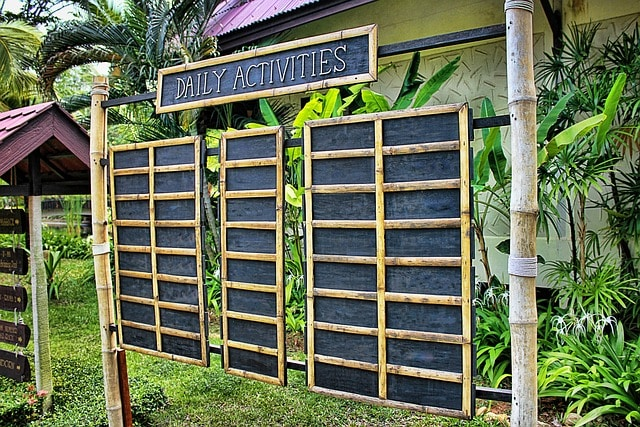
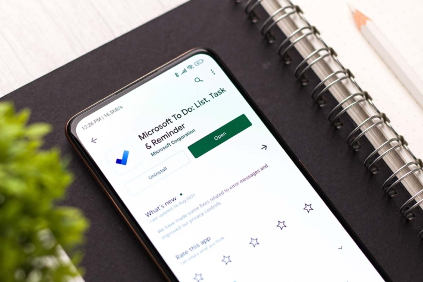
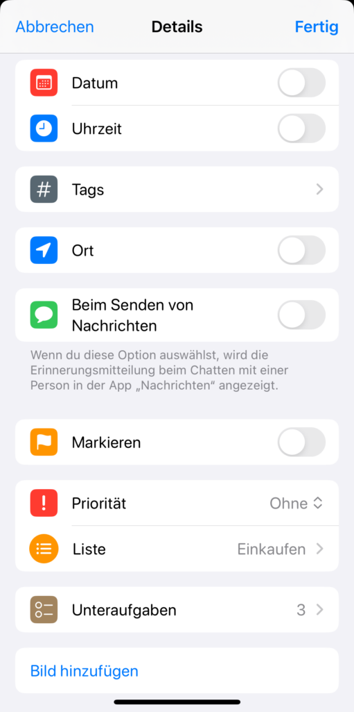

Creating and managing an online to-do list with an app has many advantages. This is because a **to-do list** helps you to manage your tasks efficiently both in your private life and in your day-to-day business and not forget anything in stressful everyday life. Read this article to find out why you should use a **template** for your to-do list and which **app** is best for a to-do list.

## What you need a to-do list for

Both at home and in professional [project management](), it is important to keep track of all upcoming tasks and work through them one by one. First of all, record your specific **tasks** in a to-do list. You then define any **subtasks** or overarching **categories**, determine **responsibilities** and set **deadlines**.

You can use a **status** to indicate whether a to-do is being processed or has been completed. A pending status is also conceivable if you are waiting for a response or input. You should also **prioritize** your to-dos so that you always tackle the most important tasks first.

### Your to-do list could look like this with a template:

Would you like to work directly with this free template for your to-do list? [Then click here >>]()

## Why you should use an app for your to-do list

You can call up a digital to-do list in an app or cloud at any time from anywhere and never lose it. That's why it is clearly superior to a list on paper. Below you can read more reasons why it is worth using an online to-do list both privately and at work.

### Don't forget any to-dos

If you write down your to-do list in an app, this serves as a kind of **repository for all your thoughts**. You can invest five minutes in the evening before going to bed to write down all your ideas and urgent tasks. Type them into your to-do list via the app to get rid of the fear of forgetting something important. You will then have a clear head, can fall asleep with peace of mind and start the day without stress in the morning.

### Bringing structure to your work

At work, you can **plan your day** with a to-do list. Move new tasks into the appropriate categories, assign deadlines, priorities and people responsible. No matter when and where you think of a task, you can document it quickly. This applies to your own tasks as well as to [work in team projects](https://seatable.io/en/perfekte-aufgabenverwaltung-im-projektmanagement/).

### Recognise connections

A template for your to-do list also helps you to **visualize** your tasks. You can see at a glance where time bottlenecks occur and which tasks are more urgent than others. It also makes it clear which tasks belong together and where responsibilities lie. If planning no longer just takes place in your head, but in an online to-do list, you can organize your to-dos flexibly and prioritize them appropriately.

### Achieve spiritual clarity

This structure and the certainty that no thoughts or to-dos are lost online helps you to achieve **inner peace**. You always know what you have to do at any given time. You can therefore **concentrate** fully on the tasks at hand and block out everything else.

### Managing communication in a team more easily

A digital to-do list also has advantages for teamwork. You have the option of delegating to-dos and working together on projects. If your task depends on the preparatory work of a team member, you can assign the relevant to-dos to them. This way, everyone benefits from a clear and efficient working environment.

Take a look now at the apps and programs available online for your to-do list.

## Five online to-do lists compared

There is a large selection of to-do list apps. Below you can see a comparison of five apps.

### Todoist: comprehensive alternative to Wunderlist

One of the most widely used tools for online to-do lists was Wunderlist. After the app was discontinued in 2020, users had to look for alternatives. One such alternative is [Todoist](https://todoist.com/de).

You can quickly enter your tasks, add descriptions, sections and subtasks and set recurring deadlines and reminders. Other features include priorities, labels and filters, with which you can always highlight the entries you need at the moment.

It can also be linked to your calendar, a voice assistant on your smartphone and other tools. You can synchronize Todoist on all devices so that you can access your lists from your laptop to your cell phone to your smartwatch.



### Microsoft To Do: The versatile app for your to-do list

With [Microsoft To Do](https://todo.microsoft.com/tasks/de-de/), you get both a daily planner and a tool for task and [shopping lists](). You can integrate tasks from Outlook and work on a list synchronously from all end devices.

You can sort the individual to-dos, set a deadline and tick them off. Reminders and recurring tasks are also possible. However, there are no advanced visualization options beyond the list mode, for which you will need the Planner.



© sdx15 / Adobe Stock

### Projoodle: A to-do list based on Doodle

[Projoodle](https://www.projoodle.com/de) 's main aim is to facilitate collaboration with friends. Similar to sending a [Doodle link](https://seatable.io/en/umfrage-erstellen/) for appointments, task management should also work without logging in. The Projoodle project was created with this goal in mind.

With Projoodle, you get a free app for to-do lists that are easy to create, share and manage. Another feature is the Kanban board view, which allows you to group tasks clearly by status. However, the options for sorting and scheduling tasks are sparse.



### Reminders: The to-do list app for iOS

As an Apple user, you are probably already familiar with the Reminders app. Here you can create new lists with as many entries as you like, which you can tick off effortlessly - for example when shopping. You can also add numerous details to each to-do, such as a date, location, priority, images and subtasks.

The reminders can be clearly sorted in each list and divided into sections. There are also several categories available on the start page, such as _Today_, _Planned_ or _Done_, in which all applicable entries can be found across all lists. You can use the Reminders app free of charge for your to-do lists and synchronize it on all Apple devices.

## SeaTable: The all-rounder for all types of lists

SeaTable is an online database that allows you to organize tasks, information, processes and ideas easily and clearly. You benefit from a classic list view or can use alternative display formats such as the [Kanban board](), the [calendar]() or a [Gantt chart]().

Another interesting feature is that you can upload [files]() and [images]() and attach them to tasks. You can also add as much information as you like, such as a date, a priority and subtasks in additional columns.

SeaTable has by far the **widest range of functions** of all the apps we looked at and impresses with a great deal of **flexibility**. You get everything you need for your to-do list in one app. Thanks to the many **collaborative functions** (comments, shared data records, synchronized work in real time, etc.), you can not only work on your own lists, but also collaborate successfully in a team.

With SeaTable, you can get started right away with the [free version]() and the [interactive template](). Additional features are available in the Plus version for €7 per user per month, the Enterprise version for €14 per user per month or a dedicated cloud solution.



The SeaTable Cloud servers are located in Germany, making the platform suitable for GDPR-compliant work with sensitive personal data. You also have the option of installing [SeaTable on-premises]() on your own servers.



## Tips for successfully implementing your to-do list

Once you have decided on the tool, it's time to create your first to-do list in the respective app. Please note the following tips for implementation:

- End the day by **planning for the next day**.
- Allocate your time realistically and plan a **buffer** to allow for unplanned events without getting under pressure.
- Celebrate your successes. Choose a tool that allows you to **tick off** tasks **or mark them as completed**. This will give you a good feeling.
- Keep not just one, but **at least three to-do lists** in the app in your everyday life. You can differentiate them thematically, for example, according to hobbies, household chores and shopping. Or you can enter all tasks in a backlog with the corresponding date in order to display the tasks in a monthly, weekly and daily list with different views.

Start with your own to-do list © Tarokmew / Adobe Stock

## Conclusion

A digital to-do list is an important tool for staying organized in everyday life. As you can access your to-do list from anywhere, you can jot down your thoughts immediately and clear your head. You have the opportunity to structure your work better, organize to-dos according to certain criteria and never forget anything again. It is also easier to manage work and communication within the team.
