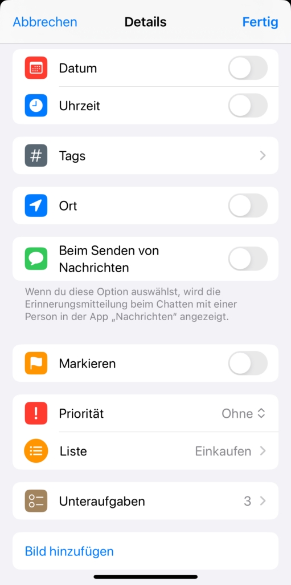

## Para qué necesita una lista de tareas

Tanto en casa como en la [gestión de proyectos]() profesionales, es importante llevar un registro de todas las tareas pendientes y trabajar en ellas una por una. El primer paso es anotar las **tareas** específicas en una lista de tareas pendientes. A continuación, defina las **subtareas** o **categorías** generales, determine **las responsabilidades** y fije **los plazos**.

Puede utilizar un **estado** para indicar si una tarea se está procesando o se ha completado. También se puede indicar un estado pendiente si se está esperando una respuesta o información. También debería **priorizar** sus tareas pendientes para que siempre se ocupe primero de las más importantes.

### Su lista de tareas podría tener este aspecto con una plantilla



¿Quiere trabajar directamente con esta plantilla gratuita para su lista de tareas? [Entonces haga clic aquí >>]()

## Por qué debería utilizar una aplicación para su lista de tareas pendientes

Puede consultar una lista de tareas digital en una aplicación o en la nube desde cualquier lugar y en cualquier momento, y no perderla nunca. Por eso es claramente superior a una lista en papel. A continuación puede leer más razones por las que merece la pena utilizar una lista de tareas online tanto en privado como en el trabajo.

### No olvide ninguna tarea pendiente

Si anota su lista de tareas en una aplicación, ésta le servirá como una especie de **repositorio de todos sus pensamientos**. Puede invertir cinco minutos por la noche, antes de acostarse, en anotar todas sus ideas y tareas urgentes. Escríbalas en su lista de tareas pendientes a través de la aplicación para librarse del miedo a olvidar algo importante. Así tendrá la cabeza despejada, podrá dormirse con tranquilidad y empezar el día sin estrés por la mañana.

### Estructurar el trabajo

En el trabajo, puede **planificar su jornada** con una lista de tareas. Mueva las nuevas tareas a las categorías adecuadas, asigne plazos, prioridades y responsables. No importa cuándo y dónde se le ocurra una tarea, puede documentarla rápidamente. Esto se aplica tanto a sus propias tareas como al [trabajo en proyectos de equipo]().

### Reconocer las conexiones

Una plantilla para su lista de tareas pendientes también le ayuda a **visualizar** sus tareas. De un vistazo puede reconocer dónde surgen cuellos de botella y qué tareas son más urgentes que otras. También deja claro qué tareas van juntas y dónde están las responsabilidades. Si la planificación ya no tiene lugar sólo en su cabeza, sino en una lista de tareas online, puede organizar sus tareas de forma flexible y priorizarlas adecuadamente.

### Alcanzar la claridad espiritual

Esta estructura y la certeza de que ningún pensamiento o tarea pendiente se pierde en línea le ayudan a encontrar la **paz interior**. Siempre sabe lo que tiene que hacer en cada momento. Así puede **concentrarse** plenamente en las tareas que tiene entre manos y bloquear todo lo demás.

### Gestionar más fácilmente la comunicación en un equipo

Una lista de tareas digital también tiene ventajas para el trabajo en equipo. Tiene la opción de delegar tareas y trabajar juntos en proyectos. Si su tarea depende del trabajo preparatorio de un miembro del equipo, puede asignarle las tareas pendientes pertinentes. De este modo, todos se benefician de un entorno de trabajo claro y eficaz.

Eche un vistazo ahora a las aplicaciones y programas disponibles en línea para su lista de tareas pendientes.

## Comparación de cinco listas de tareas en línea

Existe una gran variedad de aplicaciones de listas de tareas. A continuación puede ver una comparativa de cinco apps.

### Todoist: alternativa completa a Wunderlist

Una de las herramientas más utilizadas para hacer listas de tareas online era Wunderlist. Después de que la app dejara de funcionar en 2020, los usuarios tuvieron que buscar alternativas. [Todoist](https://www.todoist.com/de) ofrece una de esas alternativas.

Puede introducir rápidamente sus tareas, añadir descripciones, secciones y subtareas y establecer plazos y recordatorios recurrentes. Otras funciones son las prioridades, las etiquetas y los filtros, que le permiten destacar siempre las entradas que necesita en cada momento.

También puede vincularse a su calendario, a un asistente de voz de su smartphone y a otras herramientas. Puede sincronizar Todoist en todos los dispositivos para acceder a sus listas desde el portátil, el móvil o el smartwatch.



### Microsoft To Do: La versátil aplicación para su lista de tareas pendientes

Con [Microsoft To](https://to-do.office.com/tasks/de-de/) Do, dispondrá tanto de un planificador diario como de una herramienta para [listas de]() tareas y [compras](). Puede integrar tareas de Outlook y trabajar en una lista sincronizada desde todos los dispositivos finales.

Puede ordenar las tareas individuales, fijar una fecha límite y marcarlas. También es posible utilizar recordatorios y tareas recurrentes. Sin embargo, no hay opciones avanzadas de visualización más allá del modo lista; para ello necesitará el Planificador.



© sdx15 / Adobe Stock

### Projoodle: Una lista de tareas basada en Doodle

El principal objetivo de [Projoodle](https://www.projoodle.com/de) es facilitar la colaboración con amigos. De forma similar al envío de un [enlace Doodle]() para citas, la gestión de tareas también debería funcionar sin necesidad de iniciar sesión. El proyecto Projoodle se creó con este objetivo en mente.

Con Projoodle, dispone de una aplicación gratuita para listas de tareas fáciles de crear, compartir y gestionar. Otra característica es la vista de tablero Kanban, que permite agrupar las tareas claramente por estado. Sin embargo, las opciones para ordenar y programar tareas son escasas.



### Recordatorios: La aplicación de listas de tareas para iOS

Como usuario de Apple, probablemente ya esté familiarizado con la aplicación Recordatorios. Aquí puede crear nuevas listas con tantas entradas como quiera, que puede marcar sin esfuerzo, por ejemplo, cuando va de compras. También puede añadir numerosos detalles a cada tarea, como fecha, lugar, prioridad, imágenes y subtareas.

Los recordatorios pueden clasificarse claramente en cada lista y dividirse en secciones. También hay varias categorías disponibles en la página de inicio, como _hoy_, _planificado_ o _hecho_, en las que terminan todas las entradas aplicables en todas las listas. Puede utilizar la aplicación Recordatorios de forma gratuita para sus listas de tareas y sincronizarla en todos los dispositivos Apple.

## SeaTable: el todoterreno para todo tipo de listas

SeaTable es una base de datos en línea que le permite organizar tareas, información, procesos e ideas de forma fácil y clara. Se beneficia de una vista de lista clásica o puede utilizar formatos de visualización alternativos como el [tablero Kanban](), el [calendario]() o un [diagrama de Gantt]().

Otra función interesante es que puede subir [archivos]() e [imágenes]() y adjuntarlos a las tareas. También puede añadir toda la información que quiera, como una fecha, una prioridad y subtareas en columnas adicionales.

SeaTable es, con diferencia, la aplicación con más **funciones** de todas las que hemos analizado y destaca por su gran **flexibilidad**. Tiene todo lo que necesita para su lista de tareas en una sola aplicación. Gracias a las numerosas **funciones de colaboración** (comentarios, registros de datos compartidos, trabajo sincronizado en tiempo real, etc.), no sólo podrá trabajar en sus propias listas, sino también colaborar con éxito en equipo.

Con SeaTable, puede empezar de inmediato con la [versión gratuita]() y la [plantilla interactiva](). Las funciones adicionales están disponibles en la versión Plus por 7 € por usuario al mes, la versión Enterprise por 14 € por usuario al mes o una solución dedicada en la nube.





Los servidores de SeaTable Cloud se encuentran en Alemania, por lo que la plataforma es adecuada para trabajar con datos personales sensibles de conformidad con la GDPR. También tiene la opción de instalar [SeaTable in situ]() en sus propios servidores.



## Consejos para aplicar con éxito su lista de tareas pendientes

Una vez que se haya decidido por la herramienta, es hora de crear su primera lista de tareas en la aplicación correspondiente. Tenga en cuenta los siguientes consejos para su aplicación:

- Termine el día **planificando la jornada** siguiente.
- Asigne su tiempo de forma realista y prevea un **margen** que le permita hacer frente a imprevistos sin sentirse presionado.
- Celebre sus éxitos. Elija una herramienta que le permita **tachar** tareas **o marcarlas como completadas**. Así se sentirá bien.
- Mantenga en la aplicación no sólo una, sino **al menos tres listas de tareas** en su día a día. Puede clasificarlas por temas, por ejemplo, según aficiones, tareas domésticas y compras. O puede introducir todas las tareas pendientes con la fecha correspondiente para visualizarlas en una lista mensual, semanal y diaria con distintas vistas.

## Conclusión: Utilice una lista de tareas digital

Una lista de tareas digital es una herramienta importante para organizarse en la vida diaria. Como puede acceder a ella desde cualquier lugar, puede anotar sus ideas inmediatamente y despejarse. Tiene la oportunidad de estructurar mejor su trabajo, organizar las tareas pendientes según determinados criterios y no olvidarse nunca más de nada. También es más fácil gestionar el trabajo y la comunicación dentro del equipo.
