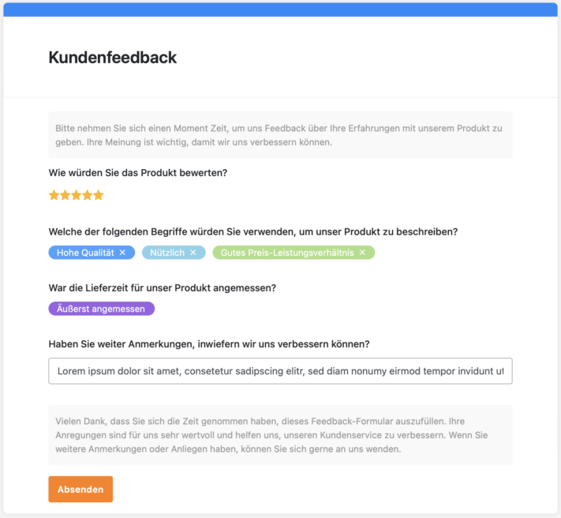

Möchten Sie herausfinden, was die Bedürfnisse Ihrer Zielgruppe sind oder wie Sie Ihr Produkt weiter optimieren können? Oder möchten Sie eine Umfrage erstellen, um die Zufriedenheit Ihrer Mitarbeiter abzufragen? **Online-Umfragen** erweisen sich als ein äußerst effizientes Werkzeug, um Daten zu erheben. Die zahlreichen Vorteile machen sie zu einer bevorzugten Methode für Unternehmen, Organisationen und Forscher auf der ganzen Welt.

Der nachfolgende Artikel beleuchtet die Vorzüge und wichtige Kriterien für das Erstellen von Online-Umfragen und führt einen Vergleich von sieben vielversprechenden Tools durch.

Zur Datenerhebung erweist sich die Online-Umfrage als ein äußerst effizientes Werkzeug.

## Vorteile einer Online-Umfrage

**Online** Umfragen zu erstellen bietet Ihnen einige Vorteile. Einer der größten Vorteile einer Online-Umfrage ist die **Zeitersparnis**. Anstatt mühsam Telefonate zu führen oder durch Fußgängerzonen zu gehen, um potenzielle Teilnehmer persönlich zu befragen, können Sie einfach digital eine Umfrage erstellen und den Link im Internet veröffentlichen. Dies ermöglicht es Ihnen, schnell eine große Anzahl an Antworten zu sammeln, ohne dabei wertvolle Zeit zu verschwenden.

Darüber hinaus sind die **Kosten** für Online-Umfragen im Vergleich zu traditionellen Methoden oft erheblich geringer. Einige Tools bieten ihre Dienste teilweise oder sogar vollständig kostenlos an. Dies macht es auch für kleinere Unternehmen oder Forschungsprojekte mit begrenztem Budget möglich, qualitativ hochwertige Umfragen durchzuführen.

Ein weiterer Pluspunkt ist die **globale Reichweite**, die Ihnen eine Online-Umfrage bietet. Da das Internet weltweit zugänglich ist, können Sie Ihre Umfrage problemlos an Nutzer auf der ganzen Welt freigeben. Dies eröffnet Ihnen die Möglichkeit, vielfältige und repräsentative Daten aus verschiedenen Regionen und Kulturen zu sammeln.

Ein entscheidender Vorteil davon, online Umfragen zu erstellen, ist die Möglichkeit, die Ergebnisse in **Echtzeit** zu verfolgen und zu analysieren. Moderne Umfrageplattformen bieten **Auswertungstools**, welche die gesammelten Daten sofort in aussagekräftige Statistiken und Grafiken umwandeln. Auf diese Weise können Sie schnell Einblicke gewinnen und fundierte Entscheidungen treffen, ohne auf die manuelle Auswertung von Fragebögen angewiesen zu sein.

## 10 Gebote der Frageformulierung nach Porst

Damit Sie gute Ergebnisse erzielen, ist es besonders wichtig, dass Sie Ihre Fragen sorgfältig formulieren, wenn Sie eine Umfrage erstellen. Schlecht formulierte Fragen können zu ungenauen oder verzerrten Antworten führen, was die **Gültigkeit** Ihrer Daten beeinträchtigen kann. Dies wäre bedauerlich, insbesondere wenn Sie viel Zeit und Mühe in die Umfrage investiert haben. Um solche Probleme zu vermeiden, hat Rolf Porst [zehn Grundsätze](https://www.gesis.org/fileadmin/upload/forschung/publikationen/gesis_reihen/howto/how-to2rp.pdf) formuliert, die Sie bei der Formulierung von Umfragen unbedingt berücksichtigen sollten.

Die 10 Gebote der Frageformulierung nach Rolf Porst.

## Worauf es bei Umfragen ankommt

Zusätzlich ist es wichtig, einige Aspekte zu berücksichtigen, um sicherzustellen, dass die Teilnehmer motiviert sind, Ihre Umfrage erfolgreich abzuschließen. Eine hohe Abbruchrate kann darauf hindeuten, dass die Teilnehmer unzufrieden sind, und das sollten Sie unbedingt vermeiden.

Eine **klare Strukturierung** der Umfrage ist entscheidend. Niemand hat Lust, eine chaotische Umfrage auszufüllen. Gliedern Sie Ihre Fragen so, dass sie logisch aufeinander aufbauen und leicht zu verstehen sind. Vermeiden Sie übermäßig lange Fragebeschreibungen und Antworten, da die meisten Teilnehmer eine **schnelle** und **unkomplizierte** Umfrage bevorzugen.

Sorgen Sie für **Abwechslung** in Ihrer Umfrage, um das Interesse Ihrer Teilnehmer beizubehalten. Eine lange Liste von Multiple-Choice-Fragen kann schnell ermüdend sein. Integrieren Sie daher verschiedene Fragetypen, um die Befragten zu motivieren und ihre Aufmerksamkeit aufrechtzuerhalten.

Auch nach Abschluss der Umfrage ist es wichtig, **Wertschätzung** zu zeigen. Die Teilnehmer haben ihre wertvolle Zeit investiert, um Ihnen zu helfen, und verdienen daher Anerkennung. Eine kurze Dankesnachricht am Ende der Umfrage kann dazu beitragen, dass sich die Teilnehmer geschätzt fühlen und bereit sind, in Zukunft erneut an Umfragen teilzunehmen.

Mit einer gut konzipierten Umfrage verhindern Sie eine hohe Abbruchrate.

## Umfragen erstellen: Tools im Vergleich

Im folgenden Test wurden Umfrage-Tools anhand mehrerer Kriterien getestet, darunter Benutzerfreundlichkeit, Anpassungsfähigkeit, Datenschutz, Analysefunktionen und Kosten. Diese Bewertung ermöglicht Ihnen die Auswahl der optimalen Plattform für Ihre Umfragebedürfnisse.

### Doodle

Wenn Sie eine unkomplizierte Möglichkeit suchen, Termine mit mehreren Teilnehmern zu planen, ist **Doodle** eine gute Wahl. Die Anwendung überzeugt durch ihr benutzerfreundliches und minimalistisches Design. Doodle konzentriert sich darauf, Umfragen zur Terminplanung anzubieten, und ermöglicht es Nutzern, diese auf einfache und intuitive Weise zu gestalten.

In puncto Datenschutz gibt es jedoch Bedenken, da Doodle personenbezogene Daten an ausländische Server sendet und Trackingtools einsetzt. Zudem ist es nur in der kostenpflichtigen Pro-Version möglich, die Teilnehmerliste von Umfragen zu verbergen. Für Einzelpersonen ist die Nutzung kostenlos, Berufstätige müssen jedoch 6,95€ pro Monat zahlen.

**Anwendungsbereich:** Terminplanung  
**Benutzerfreundlichkeit:** sehr gut  
**Anpassungsmöglichkeit:** gering  
**Datenschutz:** DSGVO und SSL-Verschlüsselung  
**Analysefunktion:** gut  
**Kosten:** teilweise kostenlos

### Google Forms

Dieses vielseitige Tool eignet sich nicht nur für Umfragen, sondern auch für Quizze und besticht durch seine übersichtliche Oberfläche. Die klare Struktur und die begrenzten Funktionen machen das Umfragen erstellen dabei besonders benutzerfreundlich. Neben verschiedenen Fragetypen wie Einfachauswahl, freiem Textfeld und Bewertung bietet diese Anwendung auch die Option, Bilder und Videos in die Fragen zu integrieren. Zudem können Sie Fragen in übersichtliche Abschnitte gliedern und sowohl zufällige Reihenfolgen als auch verzweigte Fragen problemlos umsetzen.

Ein weiterer Pluspunkt ist die Möglichkeit, Fragen direkt zu importieren, was den Erstellungsprozess noch effizienter gestaltet. Darüber hinaus entspricht **Google Forms** allen Anforderungen der DSGVO und anderer globaler Compliance-Richtlinien, was die Sicherheit Ihrer Daten gewährleistet. Zur Auswertung stehen einige Funktionen zur Verfügung, darunter eine Zusammenfassung aller Ergebnisse sowie die Möglichkeit, einzelne Fragen oder Ergebnisse von bestimmten Teilnehmern genauer zu betrachten.

**Anwendungsbereich:** Umfragen und Quizze  
**Benutzerfreundlichkeit:** sehr gut  
**Anpassungsmöglichkeit:** hoch  
**Datenschutz:** DSGVO und andere Compliance-Richtlinien  
**Analysefunktion:** in Ordnung  
**Kosten:** kostenlos

### Surveymonkey

Dieses Tool ist ebenfalls für Umfragen und Quizze geeignet. Im Vergleich zu anderen Programmen mag es etwas komplexer erscheinen, da es viele Optionen zur Individualisierung bietet. Dennoch führt es den Nutzer Schritt für Schritt durch den Prozess, was es einfach macht, eine Umfrage zu erstellen. Ein besonderes Highlight dieser Anwendung ist die umfangreiche Fragendatenbank, die als Inspirationsquelle und Vorlage dient.

Ob es um Design, Fragetypen oder verzweigte Fragen geht, dieses Tool bietet eine Vielzahl von Anpassungsmöglichkeiten, ohne dabei den Nutzer zu überfordern. In Bezug auf Datenschutz entspricht **Surveymonkey** den Anforderungen der DSGVO und des California Consumer Privacy Act (CCPA).

Für die Analyse stehen verschiedene Funktionen zur Verfügung, darunter eine Frageübersicht sowie Erkenntnisse über die Umfrage selbst und mögliche Trends. Die Grundfunktionen sind kostenlos nutzbar, während Erweiterungen ab 39€ pro Person und Monat starten.

**Anwendungsbereich:** Umfragen und Quizze  
**Benutzerfreundlichkeit:** in Ordnung  
**Anpassungsmöglichkeit:** hoch  
**Datenschutz:** DSGVO und CCPA  
**Analysefunktion:** in Ordnung  
**Kosten:** teuer, teilweise kostenlos

### Survio

**Survio** bietet eine benutzerfreundliche Plattform, um in verschiedenen Anwendungsbereichen Umfragen zu erstellen und durchzuführen. Mit Vorlagen und der Möglichkeit, die Umfrage nach Seiten zu gliedern, ist das Umfragen erstellen sehr einfach und übersichtlich. Die Anpassungsmöglichkeiten sind vielfältig, wobei verschiedene Fragetypen und Fragebeschreibungen zur Verfügung stehen. Allerdings erfordert die Logik, bestimmte Fragen basierend auf vorherigen Antworten zu verbergen oder anzuzeigen, eine kostenpflichtige Erweiterung.

In Bezug auf Datenschutz entspricht das Tool den Anforderungen der DSGVO und bietet zusätzliche Sicherheit durch Verschlüsselung mit einem SSL-Zertifikat. Survio bietet umfangreiche Analysefunktionen, darunter die Möglichkeit zur Ergebnisanalyse, die Betrachtung individueller Antworten und die Anzeige von Umfragestatistiken. Die Grundfunktionen sind kostenlos verfügbar, während eine Erweiterung für zusätzliche Funktionen monatlich 25€ kostet.

**Anwendungsbereich:** Umfragen  
**Benutzerfreundlichkeit:** sehr gut  
**Anpassungsmöglichkeit:** hoch  
**Datenschutz:** DSGVO und SSL-Zertifikat  
**Analysefunktion:** sehr gut  
**Kosten:** mäßig, teilweise kostenlos

### LamaPoll

Diese Anwendung eignet sich für alle Arten von Umfragen, insbesondere im wissenschaftlichen Bereich. Auf den ersten Blick mag sie aufgrund der Vielzahl ihrer Funktionen überwältigend wirken und erfordert daher etwas Zeit, um sich mit den verschiedenen Möglichkeiten vertraut zu machen. Dafür bietet sie zahlreiche Optionen für verschiedene Fragetypen, individuelle Antwortpfade und sogar die Möglichkeit zur Kodierung von Antworten.

**LamaPoll** ist DSGVO-konform und betreibt seine Server in Deutschland. Zudem stellt es transparente Datenschutzdokumente für Unternehmen bereit. Neben Ereignisanalysen und Stichproben bietet sie Zugriff auf verschiedene Statistiken.

Die Grundfunktionen dieser Anwendung sind kostenlos, jedoch können dabei nur 50 Personen an einer Umfrage teilnehmen. Das Basic-Upgrade ist mit 58,31€ pro Monat zwar teuer, bietet jedoch erweiterte Funktionen und mehr Möglichkeiten zur Durchführung von Umfragen.

**Anwendungsbereich:** Umfragen  
**Benutzerfreundlichkeit:** in Ordnung  
**Anpassungsmöglichkeit:** hoch  
**Datenschutz:** DSGVO und deutsche Server  
**Analysefunktion:** gut  
**Kosten:** teuer, teilweise kostenlos

### Hotjar

**Hotjar** eignet sich besonders für Umfragen zur Website-Nutzung. Das Umfragen erstellen kann anfangs etwas unübersichtlich wirken, da es nicht beim ersten Punkt beginnt, sondern direkt zu den Fragen nach unten scrollt. Dennoch erleichtert das Programm den Erstellungsprozess, indem es den Nutzer Schritt für Schritt hindurchführt.

Ein besonderes Merkmal dieses Tools ist die Möglichkeit, die Fragen beispielsweise als sogenanntes “Pop-over” direkt auf der Website an der entsprechenden Stelle anzuzeigen. Zur Analyse stellt das Programm Stichproben, Ergebnisse und Daten zur Performance der Umfrage zur Verfügung. Die Basic-Version ist kostenlos, jedoch ist das Upgrade mit 82,50€ vergleichsweise teuer.

**Anwendungsbereich:** Umfragen zur Website-Nutzung  
**Benutzerfreundlichkeit:** gut  
**Anpassungsmöglichkeit:** hoch  
**Datenschutz:** DSGVO und CCPA  
**Analysefunktion**: gut  
**Kosten:** sehr teuer, teilweise kostenlos

### SeaTable

Die [Webformulare](https://seatable.io/docs/webformulare/webformulare/) von **SeaTable** ermöglichen Umfragen, bei denen die erhobenen Daten automatisch in einer Tabelle mit Datenbank-Backend gespeichert werden. Dadurch lassen sich die Daten hervorragend miteinander in Beziehung setzen. Für die Analyse und Aufbereitung der Umfrageergebnisse stehen verschiedene [Statistiken](https://seatable.io/docs/plugins/anleitung-zum-statistik-plugin/) zur Verfügung, alle Daten können übersichtlich gefiltert, sortiert und gruppiert sowie mit grafischen [Plugins](https://seatable.io/docs/plugins/alle-plugins-in-der-uebersicht/) dargestellt werden. Darüber hinaus erlaubt SeaTable den Export der Daten für weitere Analysen oder Berichte.

Obwohl es beim Umfragen erstellen nicht den gleichen Umfang an Funktionen wie beispielsweise Surveymonkey hat, bietet es dank seiner individuellen Anpassungsmöglichkeiten und der intuitiven Bedienung viele praktische Anwendungen. Die Möglichkeit, verschiedene Datentypen zu erheben und die Ergebnisse [kollaborativ im Team](https://seatable.io/docs/seatable-nutzen/zusammenarbeit/) auszuwerten, macht SeaTable zu einem flexiblen Werkzeug für Umfragen und andere Projekte.

In Bezug auf den Datenschutz erfüllt SeaTable alle Anforderungen der DSGVO und bietet zusätzliche Sicherheit, da die Daten ausschließlich in deutschen Rechenzentren gespeichert werden. Neben der Cloud-Version gibt es sogar die Option, [SeaTable auf dem eigenen Server zu installieren](https://seatable.io/on-premises/), um die volle Datenhoheit zu behalten.

**Anwendungsbereich:** Umfragen  
**Benutzerfreundlichkeit:** sehr gut  
**Anpassungsmöglichkeit:** hoch  
**Datenschutz:** DSGVO und deutsche Rechenzentren  
**Analysefunktion:** sehr gut  
**Kosten:** kostenlos

Die Webformular-Funktion von SeaTable können Sie in vollem Umfang kostenlos nutzen. Lediglich die Anpassung des Designs erfordert ein Enterprise Abo für 14€ pro Monat.

Beispiel einer Umfrage zum Kundenfeedback in SeaTable

## Fazit

Bei der Auswahl eines Umfrage-Tools ist es wichtig, dass Sie Ihre individuellen Anforderungen kennen. Google Forms, Surveymonkey, LamaPoll und SeaTable sind nur einige Beispiele, die Sie verwenden können. Es gibt kein universell perfektes Tool; jedes hat ein anderes Preis-Leistungs-Verhältnis sowie eigene Vor- und Nachteile.

Insgesamt bieten Online-Umfragen eine flexible und leistungsstarke Methode zur Datenerhebung und -analyse. Durch die Auswahl des richtigen Tools und die Anwendung statistischer Methoden können Sie effektiv Einblicke gewinnen, Entscheidungen treffen und Ihre Ziele erreichen.
