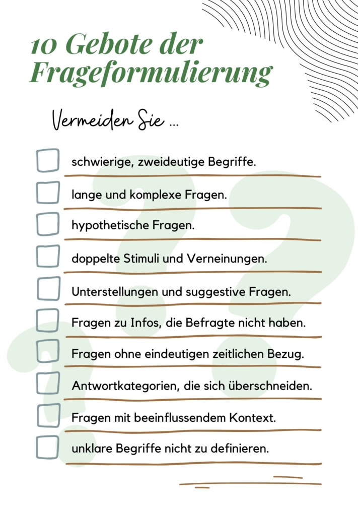
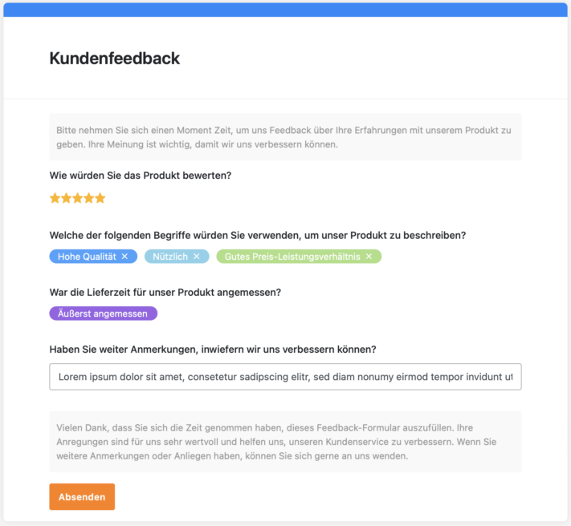

Would you like to find out what the needs of your target group are or how you can further optimize your product? Or would you like to create a survey to find out how satisfied your employees are? **Online surveys** prove to be an extremely efficient tool for collecting data. The numerous advantages make them a preferred method for companies, organizations and researchers all over the world.

The following article highlights the advantages and important criteria for creating online surveys and compares seven promising tools.

The online survey proves to be an extremely efficient tool for data collection.

## Advantages of an online survey

Creating surveys **online** offers you a number of advantages. One of the biggest advantages of an online survey is the **time saved**. Instead of making tedious phone calls or walking through pedestrian zones to interview potential participants in person, you can simply create a survey digitally and publish the link online. This allows you to quickly collect a large number of responses without wasting valuable time.

In addition, the **costs** for online surveys are often considerably lower compared to traditional methods. Some tools offer their services partially or even completely free of charge. This makes it possible for smaller companies or research projects with a limited budget to conduct high-quality surveys.

Another plus point is the **global reach** that an online survey offers you. As the internet is accessible worldwide, you can easily share your survey with users all over the world. This gives you the opportunity to collect diverse and representative data from different regions and cultures.

A key advantage of creating surveys online is the ability to track and analyze the results in **real time**. Modern survey platforms offer **evaluation tools** that immediately convert the collected data into meaningful statistics and graphics. In this way, you can quickly gain insights and make informed decisions without having to rely on manual evaluation of questionnaires.

## 10 commandments of question formulation according to Porst

In order to achieve good results, it is particularly important that you formulate your questions carefully when creating a survey. Poorly worded questions can lead to inaccurate or biased responses, which can affect the **validity of** your data. This would be unfortunate, especially if you have invested a lot of time and effort into the survey. To avoid such problems, Rolf Porst has formulated [ten principles](https://www.gesis.org/fileadmin/upload/forschung/publikationen/gesis_reihen/howto/how-to2rp.pdf) that you should keep in mind when formulating surveys.

The 10 commandments of question formulation according to Rolf Porst.

## What is important in surveys

In addition, it is important to consider some aspects to ensure that participants are motivated to complete your survey successfully. A high dropout rate can indicate that participants are dissatisfied, and you should avoid this at all costs.

A **clear structure** of the survey is crucial. Nobody wants to fill out a chaotic survey. Structure your questions so that they build on each other logically and are easy to understand. Avoid excessively long question descriptions and answers, as most participants prefer a **quick** and **uncomplicated** survey.

Provide **variety** in your survey to keep your participants interested. A long list of multiple-choice questions can quickly become tiring. Therefore, integrate different types of questions to motivate respondents and keep their attention.

Even after the survey is completed, it is important to show **appreciation**. Participants have invested their valuable time to help you and therefore deserve recognition. A short thank you message at the end of the survey can help participants feel appreciated and willing to participate in surveys again in the future.

With a well-designed survey, you can prevent a high drop-out rate.

## Create surveys: Tools in comparison

In the following test, survey tools were tested based on several criteria, including ease of use, adaptability, data protection, analysis functions and costs. This evaluation allows you to select the optimal platform for your survey needs.

### Doodle

If you are looking for an uncomplicated way to plan appointments with several participants, **Doodle** is a good choice. The application impresses with its user-friendly and minimalist design. Doodle focuses on offering scheduling polls and allows users to create them in a simple and intuitive way.

However, there are concerns when it comes to data protection, as Doodle sends personal data to foreign servers and uses tracking tools. In addition, it is only possible to hide the list of survey participants in the paid Pro version. It is free to use for individuals, but professionals have to pay €6.95 per month.

**Area of application:** Scheduling  
**Ease of use:** very good  
**Customization options:** low  
**Data protection:** GDPR and SSL encryption  
**Analysis function:** good  
**costs:** partly free of charge

### Google Forms

This versatile tool is not only suitable for surveys, but also for quizzes and impresses with its clear interface. The clear structure and limited functions make creating surveys particularly user-friendly. In addition to various question types such as simple selection, free text field and rating, this application also offers the option of integrating images and videos into the questions. You can also divide questions into clear sections and easily implement both random sequences and branched questions.

Another plus point is the ability to import questions directly, which makes the creation process even more efficient. In addition, **Google Forms** complies with all GDPR requirements and other global compliance guidelines, ensuring the security of your data. A number of functions are available for evaluation, including a summary of all results and the option to take a closer look at individual questions or results from specific participants.

**Area of application:** Surveys and quizzes  
**Ease of use:** very good  
**Customization options:** high  
**Data protection:** GDPR and other compliance guidelines  
**Analysis function:** in order  
**Costs:** free of charge

### Surveymonkey

This tool is also suitable for surveys and quizzes. Compared to other programs, it may seem a bit more complex as it offers many options for customization. Nevertheless, it guides the user step by step through the process, making it easy to create a survey. A particular highlight of this application is the extensive question database, which serves as a source of inspiration and a template.

Whether it's design, question types or branched questions, this tool offers a wide range of customization options without overwhelming the user. In terms of data protection, **Surveymonkey** complies with the requirements of the GDPR and the California Consumer Privacy Act (CCPA).

Various functions are available for analysis, including a question overview as well as insights into the survey itself and possible trends. The basic functions can be used free of charge, while extensions start at €39 per person per month.

**Area of application:** Surveys and quizzes  
**Ease of use:** OK  
**Customization option:** high  
**Data protection:** GDPR and CCPA  
**Analysis function:** in order  
**Costs:** expensive, partly free of charge

### Survio

**Survio** offers a user-friendly platform for creating and conducting surveys in various application areas. With templates and the option to organize the survey by page, creating surveys is very simple and clear. The customization options are varied, with different question types and question descriptions available. However, the logic to hide or show certain questions based on previous answers requires a paid extension.

In terms of data protection, the tool meets the requirements of the GDPR and offers additional security through encryption with an SSL certificate. Survio offers extensive analysis functions, including the ability to analyze results, view individual responses and display survey statistics. The basic functions are available free of charge, while an extension for additional functions costs €25 per month.

**Scope of application:** Surveys  
**Ease of use:** very good  
**Customization option:** high  
**Data protection:** GDPR and SSL certificate  
**Analysis function:** very good  
**Costs:** moderate, partly free of charge

### LamaPoll

This application is suitable for all types of surveys, especially in the scientific field. At first glance, it may seem overwhelming due to its multitude of functions and therefore requires some time to familiarize yourself with the various options. However, it offers numerous options for different question types, individual answer paths and even the possibility to code answers.

**LamaPoll** is GDPR-compliant and operates its servers in Germany. It also provides transparent data protection documents for companies. In addition to event analyses and spot checks, it offers access to various statistics.

The basic functions of this application are free of charge, but only 50 people can take part in a survey. Although the basic upgrade is expensive at €58.31 per month, it offers extended functions and more options for conducting surveys.

**Scope of application:** Surveys  
**Ease of use:** OK  
**Customization option:** high  
**Data protection:** DSGVO and German servers  
**Analysis function:** good  
**costs:** expensive, partly free of charge

### Hotjar

**Hotjar** is particularly suitable for website usage surveys. Creating surveys can seem a little confusing at first, as it does not start at the first point, but scrolls directly down to the questions. Nevertheless, the program makes the creation process easier by guiding the user through it step by step.

A special feature of this tool is the ability to display the questions directly on the website in the appropriate place, for example as a so-called "pop-over". For analysis purposes, the program provides samples, results and data on the performance of the survey. The basic version is free, but the upgrade is comparatively expensive at €82.50.

**Area of application:** Surveys on website usage  
**User friendliness:** Good  
**Customization option:** high  
**Data protection:** GDPR and CCPA  
**Analysis function**: good  
**Costs:** Very expensive, partly free of charge

### SeaTable

**SeaTable** 's [web forms](https://seatable.io/en/docs/webformulare/webformulare/) enable surveys in which the data collected is automatically stored in a table with a database backend. This makes it easy to correlate the data. Various [statistics](https://seatable.io/en/docs/plugins/anleitung-zum-statistik-plugin/) are available for analyzing and processing the survey results, and all data can be clearly filtered, sorted and grouped and displayed using graphical [plug-ins](https://seatable.io/en/docs/plugins/alle-plugins-in-der-uebersicht/). SeaTable also allows data to be exported for further analysis or reports.

Although it does not have the same range of functions for creating surveys as Surveymonkey, for example, it offers many practical applications thanks to its individual customization options and intuitive operation. The ability to collect different types of data and evaluate the results [collaboratively in a team](https://seatable.io/en/docs/seatable-nutzen/zusammenarbeit/) makes SeaTable a flexible tool for surveys and other projects.

In terms of data protection, SeaTable meets all GDPR requirements and offers additional security as the data is stored exclusively in German data centers. In addition to the cloud version, there is even the option to install SeaTable [on your own server](https://seatable.io/en/on-premises/) to retain full data sovereignty.

**Scope of application:** Surveys  
**Ease of use:** very good  
**Customization option:** high  
**Data protection:** GDPR and German data centers  
**Analysis function:** Very good  
**Costs:** free of charge

You can use the full scope of SeaTable's web form function free of charge. Only the customization of the design requires an Enterprise subscription for 14€ per month.

Example of a customer feedback survey in SeaTable

## Conclusion

When choosing a survey tool, it is important that you know your individual requirements. Google Forms, Surveymonkey, LamaPoll and SeaTable are just a few examples that you can use. There is no universally perfect tool; each has a different price-performance ratio as well as its own advantages and disadvantages.

Overall, online surveys offer a flexible and powerful method for collecting and analyzing data. By choosing the right tool and applying statistical methods, you can effectively gain insights, make decisions and achieve your goals.
