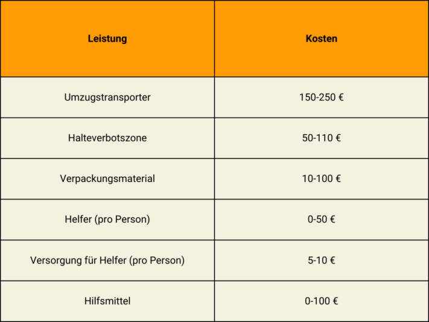

Finally, the time has come! You've found the perfect apartment for you and can't wait to move into your new home. The only thing that now separates you from your dream apartment is the move. What most people find a lot of stress and time-consuming, you can make easy for yourself with a structured **moving plan**. Find out here how you can plan your move as stress-free as possible and bring it to a successful conclusion.

## Create a checklist

Start your move planning by brainstorming. What tasks do I need to complete? Who can help me with them? How much budget can I spend? After that, draw up a cost overview to estimate your expenses. You can define and work through initial tasks in a checklist.

A checklist can help keep track of all the tasks.

You can also find a checklist for your move in our [template]().

## Before the move

The new lease is signed and the move out of your old apartment is sealed. Now it's time to terminate your old lease. The **notice of termination** must be given in due time and in writing; usually a notice period of three months applies. However, if you want to leave the tenancy earlier than agreed in the contract, you should talk to your landlord beforehand. This is because you may be responsible for finding the next tenant yourself in this case.

Shortly after your move, you should schedule the appointment to **hand over the apartment and keys**. For this, you must leave the apartment as agreed in the lease. This usually includes cosmetic repairs and cleaning the apartment broom clean.

With the handover of the keys you conclude with your old apartment.

After the handover, you will receive your deposit back and can fully concentrate on furnishing your new home.

## Special leave for your move

With careful planning of the transfers, the first step of your move is done. But the subsequent unpacking and packing of the apartments takes a lot of energy and time. Therefore, it may be wise to take a day or two off for a major move. If you would like to have **time off** from work for this purpose, first ask yourself the following questions:

### Entitlement to special leave



First the bad news: In Germany, according to the Federal Leave Act and the Civil Code, there is **no legal entitlement to leave** when you move.




Although there is no general entitlement to special leave, your employer can of course still grant it. To make sure, take a look at your employment contract or ask the works council or a superior whether you are entitled to special leave.




In this case, you have a good chance of being granted paid time off, even if this is not listed in your employment contract. A distinction is made between whether you are changing employers or merely changing the place of work. In the case of the former, you must hope for the goodwill of your new employer. If, on the other hand, you are moving within the same employer, it is possible to apply for paid time off.


### Professional reasons for the move



In addition to the reasons already mentioned - _change of job or employer_ - there are other ways to claim your move as work-related. These are starting your first job, moving out of or into an official residence, returning from abroad to start a new job in Germany, and shortening your commute by at least half an hour a day.




Yes, because as a civil servant or employee in the public sector, you are entitled to one day of paid leave for a move for work-related reasons in accordance with Section 29 of the Collective Bargaining Ordinance. If you have already had to move once in the past five years for business reasons, you are even entitled to three days off.


## Organize the move

Once the day of the move is set, the next step is planning. There are basically two options for you: a move with a moving company or a move on your own. Which of the two options suits you depends on your budget, the size of your household and your stress resistance.

### The complete package: hire moving company

With a **moving company** you save yourself a lot of time and nerves. Because everything that you would otherwise have to organize yourself, is taken over here. Especially if you are moving with several people or are under time pressure, the move is done quickly and comfortably. However, it is also clear that if you want to keep your own costs as low as possible, you will have to dig deep into your pockets. How much exactly you have to calculate is individual and should be discussed in detail with the moving company. Roughly, however, it can be said that the costs are related to the distance of the move and the size of the apartment. This average calculation serves as an orientation for you:

The cost of your move depends on the household size and distance of the apartments.

But for your money you then get a **Complete service**. This also includes that the company is liable for any damage to your property, the apartment or the staircase during your move. The law stipulates that 620 euros per cubic meter of transported goods will be assessed for the case of damage. If you want to have particularly valuable goods transported, you can agree on a higher liability sum with the moving company. But be careful: if you pack your furniture and possessions yourself, the professionals will not assume any liability for damage caused during transport.

Moving companies take much of the work out of your hands.

### Services

How much support you want from a company is up to you. Usually, you have several models to choose from:

- **Standard removal**: loading and transport
- **Complete move**: packing and unpacking boxes, dismantling and assembling furniture, loading and transportation.
- **Additional services:** Setting up a no-stopping zone or temporary storage of furniture

### For smart spenders: organize the move yourself

If you want to save costs, **moving on your own** is exactly the right thing to do. However, the organizational effort will also be higher. Because everything that is included with the moving company now falls into your own hands. But with good planning, nothing stands in the way of this project. A [moving plan]() will help you with all the steps on your way.

These are the expenses you will incur if you move on your own.

### Tasks

Organize everything yourself? No problem! The following tasks will come your way:

- **Transportation**: Ask friends or relatives if they can provide their vehicles, or rent a van. With the latter, there are costs for fuel and mileage in addition to the rental costs.
- **Apply for a parking ban**: Especially in a big city, it is difficult to find parking spaces near your apartment. So that you don't have to carry your boxes and furniture so far, and so that moving in and out is quicker, you can apply for a parking ban at the road traffic office. There you can borrow the signs that mark the parking ban. You should submit the application three to four weeks before the move.
- **Packing materials**: Cardboard boxes are best for transporting your items. The rule of thumb is: number of square meters = number of moving boxes needed. First, ask your acquaintances if anyone has moving boxes, then you can save buying new ones. Furthermore, you need tape and filling material such as kitchen paper or bubble wrap for fragile items.
- **Find moving helpers**: The first point of contact should be your relatives and friends, as they will certainly be happy to help you without payment. If too few of your acquaintances have time, you can look for additional helpers, but you will have to pay them. To do this, you can ask in your neighborhood or start a call in your social media. Also remember to provide enough food and drink for your helpers on moving day.
- **Tools**: To make the work easier for your helpers and yourself, we recommend tools such as work gloves, tension straps and a hand truck to transport heavy objects. If there are no professionals at work, injuries can occur more frequently. So prepare for the worst and have a first aid kit on site.

Organize sturdy packing materials so your belongings don't get broken.

## Who you should inform about your move

The move is imminent and you want to tell everyone about your new address. Think not only of **friends and relatives**, but first of all of **authorities** and **companies** with which you have concluded contracts. Probably the most important place to contact after your move is the **Residents' Registration Office**. Within 14 days after your move you have to re-register there. You can also re-register your car there. Remember to book an appointment in good time, as they are usually booked up well in advance.

### Where you should still indicate your new address:

- Insurance (e.g. health, liability, household, legal protection)
- Banks
- Electricity, gas and water suppliers
- Telephone and Internet provider
- Broadcasting fee (will be sent to you)
- Subscriptions (e.g. magazines)
- Memberships (e.g. gym, clubs)
- Online stores and parcel services



## Job-related move tax deductible

You can deduct part of your moving costs from your taxes in Germany as **income-related expenses**. These are separated into **general and other costs** and make up a large part of the tax-deductible costs. Attention: If your employer takes over part or all of your moving costs, you cannot claim the costs taken over again in your tax return.



### General costs

There are some **general costs**which you can declare in full in your tax return. **Very important**: Keep invoices and receipts to substantiate your expenses. General expenses include, for example, transportation costs for household goods, double rent during the moving period or the broker's commission.

Keep all invoices and receipts to claim your expenses for tax purposes.

### Other costs

You may deduct other costs as a lump sum. It is therefore not necessary to keep every receipt. The **flat-rate moving allowance** is particularly worthwhile if you are moving on your own. It covers many smaller expenses. These include, among other things, the catering of the removal helpers, the kitchen installation, the change of the identity card and the car re-registration.

The flat rate has been 886 euros since April 1, 2023; you can declare an additional 590 euros for each additional person. If you did not have your own household prior to your move, the flat rate is only 177 euros.

Of course, it is not a must to use the flat rate. If the expenses exceed the costs covered by the lump sum, you can use receipts to make the tax claim, just as with general expenses.

Renovation of the old apartment, e.g. contractually agreed cosmetic repairs, is also covered.

## Private move tax deductible

If you move privately, you cannot deduct moving expenses for tax purposes. Nevertheless, you are not completely without options. You can declare **labor and travel costs** for a forwarding agent. However, you must keep in mind that a maximum of 20,000 euros per year may be declared for service provider costs, and that no more than 4,000 euros of this amount will result in a tax advantage. If you are considering this, enter the costs as **household-related expenses**.

A move for medical reasons counts as an extraordinary burden. You can also claim this in your tax return, but only with detailed evidence of your health situation.

## Online planner for your move

To make your next move as stress-free as possible, the SeaTable team has created a template for your moving plan. You can adapt this to your needs as you wish.

If you want to use SeaTable for your relocation planning, just [register]() for free. You can find the corresponding template [here]().
