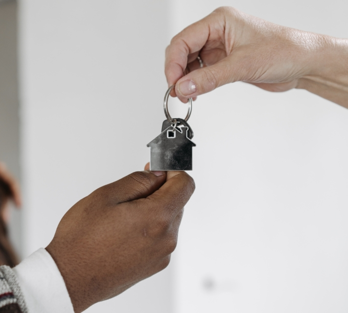

¡Por fin ha llegado el momento! Ha encontrado el piso perfecto para usted y está deseando mudarse a su nuevo hogar. Lo único que ahora le separa del piso de sus sueños es la mudanza. Lo que a la mayoría de la gente le supone mucho estrés y tiempo, tú puedes hacérselo fácil con un **plan de mudanza** estructurado. Descubra aquí cómo planificar su mudanza sin estrés y llevarla a buen puerto.

## Crear una lista de control

Empiece a planificar su mudanza con una sesión de brainstorming. ¿Qué tareas tengo que hacer? ¿Quién puede ayudarme? ¿Cuánto presupuesto puedo gastar? A continuación, elabore un resumen de costes para calcular sus gastos. Puede definir y trabajar las primeras tareas en una lista de control.

Una lista de control puede ayudar a controlar todas las tareas.

También puede encontrar una lista de comprobación para su mudanza en nuestra [plantilla](https://seatable.io/es/umzug/#Online-Planer_fuer_Ihren_Umzug).

## Antes de la mudanza

Ya ha firmado el nuevo contrato de alquiler y ha sellado la salida de su antiguo piso. Ha llegado el momento de rescindir el contrato. La **rescisión** debe **notificarse** a su debido tiempo y por escrito; normalmente se aplica un plazo de tres meses. No obstante, si quieres dejar el alquiler antes de lo acordado en el contrato, debes hablarlo antes con el casero. En este caso, es posible que tenga que buscar usted mismo un nuevo inquilino.

Poco después de la mudanza, debe concertar una cita para **entregar el piso y las llaves**. Debes dejar el piso tal y como se acordó en el contrato de alquiler. Esto suele incluir reparaciones cosméticas y la limpieza del piso.

Cuando entregas las llaves, cierras el trato con tu antiguo piso.

Tras la entrega, le devolveremos la fianza y podrá concentrarse plenamente en amueblar su nuevo hogar.

## Permiso especial para su mudanza

Con una planificación cuidadosa de los traspasos, el primer paso de su mudanza está hecho. Pero el posterior desembalaje y embalaje de los pisos requiere mucha energía y tiempo. Por eso, puede tener sentido tomarse uno o dos días libres para una mudanza importante. Si desea **ausentarse del** trabajo con este fin, hágase primero las siguientes preguntas:

### Derecho a una excedencia especial



Primero las malas noticias: en Alemania, según la Ley Federal de Vacaciones y el Código Civil, **no hay derecho legal a vacaciones** cuando se cambia de domicilio.




Aunque no existe un derecho general a la excedencia especial, su empresario puede, por supuesto, concedérsela. Para asegurarte, consulta tu contrato de trabajo o pregunta al comité de empresa o a un superior si tienes derecho a una excedencia especial.




En este caso, tiene muchas posibilidades de que le concedan tiempo libre retribuido, aunque no figure en su contrato de trabajo. Hay que distinguir si cambia de empresario o sólo de lugar de trabajo. En el primer caso, debe confiar en la buena voluntad de su nuevo empresario. Si, por el contrario, se traslada con el mismo empresario, es posible solicitar tiempo libre retribuido.


### Motivos profesionales del traslado



Además de las razones ya mencionadas _\-cambio de trabajo o de empresa-_, hay otras formas de considerar que su traslado está relacionado con el trabajo. Por ejemplo, al aceptar tu primer trabajo, al mudarte a un piso de la empresa, al volver del extranjero para trabajar en Alemania o al acortar los desplazamientos al menos media hora al día.




Sí, porque como funcionario o empleado del sector público tienes derecho a un día de permiso retribuido por traslado por motivos laborales, según el artículo 29 de la Ordenanza de Negociación Colectiva. Si ya has tenido que trasladarte una vez en los últimos cinco años por motivos laborales, tienes derecho incluso a tres días de permiso.


## Organizar la mudanza

Una vez fijado el día de la mudanza, el siguiente paso es la planificación. Básicamente tiene dos opciones: una mudanza con una empresa de mudanzas o una mudanza por su cuenta. Cuál de las dos opciones le conviene depende de su presupuesto, del tamaño de su hogar y de su resistencia al estrés.

### El paquete completo: contratar una empresa de mudanzas

Con una **empresa de mudanzas** se ahorrará mucho tiempo y nervios. Porque aquí se encargan de todo lo que de otro modo tendría que organizar usted mismo. Especialmente si se muda con varias personas o está bajo presión de tiempo, la mudanza puede realizarse rápida y cómodamente. Sin embargo, también está claro que si quiere mantener sus propios costes lo más bajos posible, tendrá que rebuscar en sus bolsillos. El presupuesto exacto depende de cada persona y debe discutirse en detalle con la empresa de mudanzas. Sin embargo, se puede decir a grandes rasgos que los costes están relacionados con la distancia de la mudanza y el tamaño del piso. Este cálculo medio sirve de orientación:

El coste de su mudanza depende del tamaño del hogar y de la distancia de los pisos.

Pero por tu dinero obtienes un **Servicio completo**. Esto incluye también que la empresa es responsable de cualquier daño que sufran sus bienes, el piso o la escalera durante la mudanza. La ley estipula que se tasarán 620 euros por metro cúbico de mercancía transportada en caso de daños. Si desea transportar bienes especialmente valiosos, puede acordar con la empresa de mudanzas un importe de responsabilidad civil más elevado. Pero cuidado: si embala usted mismo sus muebles y enseres, los profesionales no se harán responsables de los daños causados durante el transporte.

Las empresas de mudanzas le quitan mucho trabajo de encima.

### Servicios

El grado de apoyo que quieras recibir de una empresa depende de ti. Normalmente, tienes varios modelos entre los que elegir:

- **Traslado estándar**: carga y transporte
- **Mudanza completa**: embalaje y desembalaje de cajas, desmontaje y montaje de muebles, carga y transporte.
- **Servicios adicionales**: Creación de una zona sin paradas o almacenamiento temporal de muebles.

### Para los que quieren ahorrar: organice usted mismo la mudanza

Si quiere ahorrar costes, **mudarse** por su cuenta es exactamente lo que debe hacer. Sin embargo, el esfuerzo organizativo también será mayor. Porque todo lo que incluye la empresa de mudanzas recae ahora en sus propias manos. Pero con una buena planificación, nada puede interponerse en este plan. Un [plan de mudanzas](https://seatable.io/es/umzug/#Online-Planer_fuer_Ihren_Umzug) le ayudará con todos los pasos del camino.

Estos son los gastos en los que incurrirá si se traslada por su cuenta.

### Tareas

¿Lo organiza todo usted mismo? No hay problema. Las siguientes tareas son suyas:

- **Transporte**: pregunta a amigos o familiares si pueden facilitarte sus vehículos, o alquila una furgoneta. En este último caso, además de los gastos de alquiler, hay que pagar el combustible y el kilometraje.
- Solicita **una** prohibición de aparcamiento: sobre todo en una gran ciudad, es difícil encontrar plazas de aparcamiento cerca de tu piso. Para que no tengas que cargar con tus cajas y muebles tan lejos y para que entrar y salir sea más rápido, puedes solicitar una prohibición de aparcamiento en la oficina de tráfico. Allí le prestarán las señales que indican la prohibición de aparcar. Debes presentar la solicitud tres o cuatro semanas antes de la mudanza.
- **Material de embalaje**: las cajas de cartón son las mejores para transportar sus objetos. La regla empírica es: número de metros cuadrados = número de cajas de mudanza necesarias. Primero pregunte a sus conocidos si tienen cajas de mudanza, así se ahorrará comprar otras nuevas. También necesitarás cinta adhesiva y material de relleno, como papel de cocina o plástico de burbujas, para los objetos frágiles.
- **Busque ayudantes para la mudanza**: Lo primero a lo que debe acudir es a sus familiares y amigos, ya que seguro que estarán encantados de ayudarle sin tener que pagarle. Si tus amigos tienen poco tiempo, puedes buscar otros ayudantes, pero tendrás que pagarles. Para ello, puedes preguntar en tu barrio o hacer un llamamiento en tus redes sociales. Acuérdate también de proporcionar suficiente comida y bebida a tus ayudantes el día de la mudanza.
- **Herramientas**: Para facilitar el trabajo a tus ayudantes y a ti mismo, te recomendamos herramientas como guantes de trabajo, correas tensoras y una carretilla de mano para transportar objetos pesados. Si no hay profesionales en el trabajo, pueden producirse lesiones con más frecuencia. Así que prepárate para lo peor y ten a mano un botiquín de primeros auxilios.

Organice un material de embalaje resistente para que sus pertenencias no se rompan.

## A quién debe informar de su traslado

La mudanza es inminente y quiere informar a todo el mundo de su nueva dirección. No piense solo en **amigos y parientes**, sino ante todo en las **autoridades** y **empresas** con las que ha celebrado contratos. Probablemente, el lugar más importante al que debe acudir después de mudarse es la **Oficina de Empadronamiento (Einwohnermeldeamt**). Allí debe volver a empadronarse en los 14 días siguientes a la mudanza. También puede volver a matricular allí su coche. No olvide pedir cita con tiempo, ya que suelen estar llenas con bastante antelación.

### Donde deberá indicar su nueva dirección:

- Seguros (por ejemplo, salud, responsabilidad civil, hogar, protección jurídica)
- Bancos
- Suministradores de electricidad, gas y agua
- Proveedor de telefonía e internet
- Tasa de radiodifusión (se le enviará)
- Suscripciones (por ejemplo, a revistas)
- Afiliaciones (gimnasio, clubes, etc.)
- Tiendas en línea y servicios de paquetería



## Deducir de impuestos un traslado relacionado con el trabajo

En Alemania puede deducir parte de los gastos de mudanza de sus impuestos como **gastos relacionados con los ingresos**. Se dividen en **gastos generales y otros gastos** y constituyen una gran parte de los gastos deducibles. Atención: si su empresa paga una parte o la totalidad de sus gastos de mudanza, no podrá volver a reclamar los gastos pagados en su declaración de la renta.



### Gastos generales

Hay algunos **gastos generales**que puede declarar íntegramente en su declaración de la renta. **Muy importante**Gastos generales: Conserve facturas y recibos para poder demostrar sus gastos. Los gastos generales incluyen, por ejemplo, los gastos de transporte de enseres, el doble alquiler durante la fase de mudanza o la comisión del agente inmobiliario.

Conserve todas las facturas y recibos para declarar sus gastos a efectos fiscales.

### Otros gastos

Puede deducir otros gastos como importe global. Por tanto, no es necesario conservar todos los recibos. La **compensación a tanto alzado por gastos de mudanza** es especialmente útil si se va a mudar solo. Cubre muchos gastos menores. Entre otros, el catering de los ayudantes de mudanza, la instalación de la cocina, el cambio del carné de identidad y la nueva matriculación del coche.

La cuantía a tanto alzado es de 886 euros desde el 1 de abril de 2023; por cada persona adicional puede declarar otros 590 euros. Si no tenías hogar propio antes de la mudanza, la cuantía a tanto alzado es de solo 177 euros.

Por supuesto, no es obligatorio utilizar la tarifa plana. Si los gastos superan los costes cubiertos por la tarifa plana, puede reclamar la devolución de impuestos con recibos, como en el caso de los gastos generales.

También está cubierta la renovación del piso antiguo, por ejemplo, las reparaciones estéticas acordadas contractualmente.

## Deducción fiscal de la mudanza privada

Si se traslada de forma privada, no puede deducir fiscalmente los gastos de mudanza. No obstante, no está totalmente desprovisto de opciones. Puede declarar los gastos de **mano de obra y desplazamiento** de un transportista. Sin embargo, debe tener en cuenta que puede declarar un máximo de 20.000 euros al año en concepto de gastos de proveedor de servicios y que un máximo de 4.000 euros de estos le reportan una ventaja fiscal. Si está considerando esta posibilidad, declare los costes como **gastos relacionados con el hogar**.

Un traslado por motivos médicos cuenta como carga extraordinaria. También puedes reclamarlo en tu declaración de la renta, pero solo con pruebas detalladas de tu estado de salud.

## Planificador en línea de su mudanza

Para que su próxima mudanza sea lo menos estresante posible, el equipo de SeaTable ha creado una plantilla para su plan de mudanza. Puede adaptarla a sus necesidades como desee.

Si desea utilizar SeaTable para planificar su traslado, sólo tiene que [registrarse]() gratuitamente. [Aquí]() encontrará la plantilla correspondiente.
