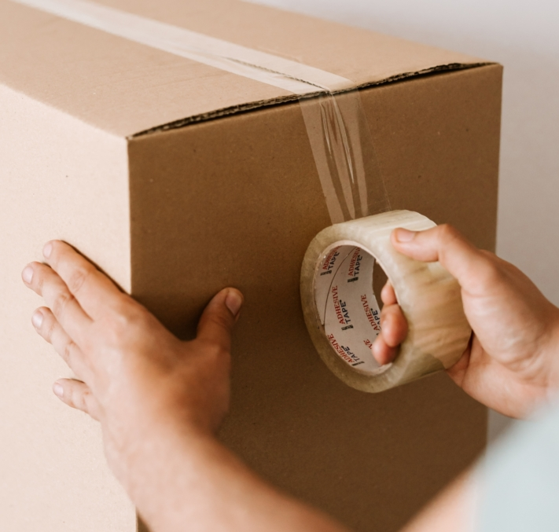
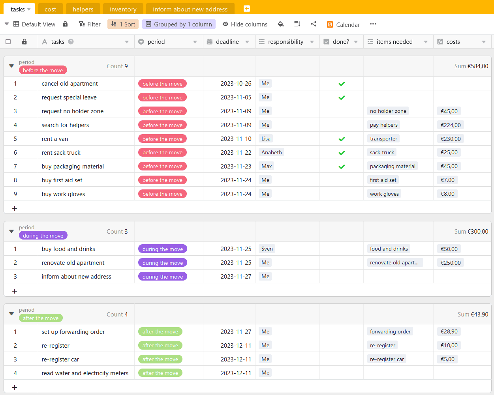

Finalmente, chegou o momento! Encontrou o apartamento perfeito para si e mal pode esperar para se mudar para a sua nova casa. A única coisa que agora o separa do seu apartamento de sonho é a mudança. O que para a maioria das pessoas é muito stressante e consome muito tempo, pode ser facilitado com um **plano de mudança** estruturado. Descubra aqui como planear a sua mudança sem stress e como levá-la a bom porto.

## Criar uma lista de controlo

Comece o planeamento da sua mudança com uma sessão de brainstorming. Que tarefas preciso de fazer? Quem me pode ajudar? Qual é o orçamento que posso gastar? Em seguida, elabore um resumo dos custos para estimar as suas despesas. Pode definir e trabalhar as primeiras tarefas numa lista de verificação.

Uma lista de controlo pode ajudar a manter um registo de todas as tarefas.

Pode também encontrar uma lista de verificação para a sua mudança no nosso [modelo]().

## Antes da mudança

O novo contrato de arrendamento foi assinado e a saída do seu antigo apartamento foi selada. Chegou o momento de rescindir o antigo contrato de arrendamento. O **aviso de rescisão** deve ser apresentado atempadamente e por escrito; normalmente, aplica-se um período de três meses. No entanto, se pretender rescindir o contrato de arrendamento mais cedo do que o acordado no contrato, deve falar previamente com o seu senhorio. Neste caso, poderá ser responsável por encontrar um novo inquilino.

Pouco tempo depois da sua mudança, deve marcar a data de **entrega do apartamento e das chaves**. Deve deixar o apartamento como acordado no contrato de arrendamento. Isto inclui normalmente reparações estéticas e a limpeza do apartamento.

Ao entregar as chaves, está a fechar o negócio com o seu antigo apartamento.

Após a entrega, receberá o seu depósito de volta e poderá concentrar-se totalmente no mobiliário da sua nova casa.

## Licença especial para a sua mudança

Com um planeamento cuidadoso das entregas, a primeira etapa da sua mudança está concluída. Mas a subsequente desembalagem e embalagem dos apartamentos exige muita energia e tempo. Por isso, pode fazer sentido tirar um ou dois dias de férias para uma mudança importante. Se quiser tirar **um** dia de férias para este efeito, comece por colocar a si próprio as seguintes questões:

### Direito a uma licença especial



Em primeiro lugar, as más notícias: na Alemanha, de acordo com a Lei Federal das Férias e o Código Civil, **não existe qualquer direito legal a férias** quando se muda de casa.




Embora não exista um direito geral a uma licença especial, a entidade patronal pode, naturalmente, concedê-la. Para ter a certeza, consulte o seu contrato de trabalho ou pergunte ao conselho de empresa ou a um superior se tem direito a uma licença especial.




Neste caso, tem boas hipóteses de beneficiar de férias pagas, mesmo que tal não esteja previsto no seu contrato de trabalho. É feita uma distinção entre mudar de entidade patronal ou apenas de local de trabalho. No primeiro caso, é necessário contar com a boa vontade da nova entidade patronal. Se, pelo contrário, se mudar com a mesma entidade patronal, é possível requerer uma licença remunerada.


### Razões profissionais para a mudança



Para além das razões já mencionadas - _mudança de emprego ou de entidade patronal_ - há outras formas de declarar a sua mudança como relacionada com o trabalho. Trata-se, por exemplo, de começar a trabalhar pela primeira vez, mudar de casa ou de apartamento, regressar do estrangeiro para aceitar um novo emprego na Alemanha e encurtar o trajeto diário em pelo menos meia hora.




Sim, porque, enquanto funcionário ou empregado do sector público, tem direito a um dia de licença remunerada para uma mudança de residência por motivos profissionais, de acordo com o artigo 29º do regulamento relativo às convenções colectivas de trabalho. Se já teve de se deslocar uma vez nos últimos cinco anos por motivos profissionais, tem mesmo direito a três dias de licença.


## Organizar a mudança

Uma vez marcado o dia da mudança, o passo seguinte é o planeamento. Existem basicamente duas opções: uma mudança com uma empresa de mudanças ou uma mudança por conta própria. A opção que mais lhe convém depende do seu orçamento, da dimensão da sua casa e da sua resistência ao stress.

### O pacote completo: Contratação de uma empresa de mudanças

Com uma **empresa de mudanças**, poupa-se muito tempo e nervos. Porque tudo o que, de outra forma, teria de organizar sozinho, é tratado aqui. Especialmente se estiver a mudar-se com várias pessoas ou se estiver sob pressão de tempo, a mudança pode ser concluída de forma rápida e confortável. No entanto, também é claro que, se quiser manter os seus próprios custos tão baixos quanto possível, terá de ir fundo nos seus bolsos. O montante exato do orçamento depende de cada um e deve ser discutido em pormenor com a empresa de mudanças. No entanto, pode dizer-se, grosso modo, que os custos estão relacionados com a distância da mudança e a dimensão do apartamento. Este cálculo médio serve de orientação:

O custo da sua mudança depende da dimensão do agregado familiar e da distância dos apartamentos.

Mas, pelo seu dinheiro, recebe um **Serviço completo**. Isto também inclui a responsabilidade da empresa por quaisquer danos causados aos seus bens, ao apartamento ou às escadas durante a mudança. A lei estipula que, em caso de danos, será cobrada uma indemnização de 620 euros por metro cúbico de bens transportados. Se pretender transportar bens particularmente valiosos, pode acordar com a empresa de mudanças um montante de responsabilidade mais elevado. Mas atenção: se for você a embalar os seus móveis e objectos, os profissionais não serão responsáveis por quaisquer danos causados durante o transporte.

As empresas de mudanças tiram-lhe grande parte do trabalho.

### Serviços

A quantidade de apoio que pretende obter de uma empresa depende de si. Normalmente, existem vários modelos à escolha:

- **Mudança standard**: carregamento e transporte
- **Mudança completa**: embalagem e desembalagem de caixas, desmontagem e montagem de móveis, carregamento e transporte
- **Serviços complementares**: Criação de uma zona de não paragem ou armazenamento temporário de mobiliário

### Para quem quer poupar dinheiro: organizar a mudança sozinho

Se quiser poupar custos, **mudar-se por conta** própria é exatamente a coisa certa a fazer. No entanto, o esforço de organização também será maior. Porque tudo o que está incluído na empresa de mudanças passa a estar nas suas mãos. Mas, com um bom planeamento, nada pode impedir este plano. Um [plano]() de mudanças ajudá-lo-á em todas as etapas do processo.

Estas são as despesas em que incorrerá se se mudar sozinho.

### Tarefas

Organizar tudo sozinho? Não há problema! As tarefas seguintes são suas:

- **Transporte**: Pergunte a amigos ou familiares se podem disponibilizar os seus veículos, ou alugue uma carrinha. Neste último caso, para além dos custos de aluguer, há custos de combustível e de quilometragem.
- **Pedir uma proibição de estacionamento**: sobretudo numa grande cidade, é difícil encontrar lugares de estacionamento perto do seu apartamento. Para que não tenha de transportar as suas caixas e móveis para tão longe e para que a entrada e saída seja mais rápida, pode pedir uma proibição de estacionamento no serviço de trânsito. Aí, pode pedir emprestados os sinais que indicam a proibição de estacionamento. O pedido deve ser apresentado três a quatro semanas antes da mudança.
- **Material de embalagem**: As caixas de cartão são as melhores para transportar os seus objectos. A regra geral é: número de metros quadrados = número de caixas de mudança necessárias. Pergunte primeiro aos seus conhecidos se têm caixas de mudança, assim pode poupar na compra de caixas novas. Também precisará de fita adesiva e de material de enchimento, como papel de cozinha ou plástico-bolha, para os objectos frágeis.
- **Encontrar ajudantes de mudanças**: O seu primeiro ponto de contacto deve ser os seus familiares e amigos, que certamente terão todo o gosto em ajudá-lo sem qualquer pagamento. Se poucos dos seus amigos tiverem tempo, pode procurar outros ajudantes, mas terá de os pagar. Para o fazer, pode pedir ajuda na sua vizinhança ou lançar um apelo nas suas redes sociais. Lembre-se também de providenciar comida e bebida suficientes para os seus ajudantes no dia da mudança.
- **Ferramentas**: Para facilitar o trabalho dos seus ajudantes e o seu, recomendamos ferramentas como luvas de trabalho, cintas de tensão e um carrinho de mão para transportar objectos pesados. Se não houver profissionais no local de trabalho, as lesões podem ocorrer com mais frequência. Por isso, prepare-se para o pior e tenha um kit de primeiros socorros no local.

Organize material de embalagem resistente para que os seus pertences não se partam.

## Quem deve informar sobre a sua mudança

A mudança está iminente e quer informar toda a gente da sua nova morada. Pense não só nos **amigos e nos familiares**, mas também nas **autoridades** e nas **empresas** com as quais celebrou contratos. Provavelmente, o local mais importante a que se deve dirigir após a mudança é o **Serviço de Registo de Residentes (Einwohnermeldeamt**). Deve registar-se aí no prazo de 14 dias após a mudança. Também pode voltar a registar o seu automóvel nesse local. Não se esqueça de marcar a sua entrevista com antecedência, pois normalmente estão cheios com muita antecedência.

### Onde deve ainda indicar o seu novo endereço:

- Seguros (por exemplo, de saúde, de responsabilidade civil, domésticos, de proteção jurídica)
- Bancos
- Fornecedores de eletricidade, gás e água
- Fornecedor de telefone e Internet
- Taxa de difusão (ser-lhe-á enviada)
- Assinaturas (por exemplo, de revistas)
- Assinaturas (por exemplo, ginásio, clubes)
- Lojas em linha e serviços de encomendas



## Deduzir do imposto uma mudança relacionada com o trabalho

Na Alemanha, uma parte das despesas de mudança pode ser deduzida do imposto sobre o **rendimento** como **despesas relacionadas com o rendimento**. Estas despesas estão divididas em **despesas gerais e outras** e constituem uma grande parte das despesas dedutíveis nos impostos. Atenção: Se a sua entidade patronal pagar uma parte ou a totalidade das despesas de mudança, não pode voltar a deduzir as despesas pagas na sua declaração de impostos.



### Custos gerais

Existem alguns **custos gerais**que pode declarar na íntegra na sua declaração de impostos. **Muito importante**: Guarde as facturas e os recibos para poder comprovar as suas despesas. As despesas gerais incluem, por exemplo, os custos de transporte dos bens domésticos, o dobro da renda durante o período de mudança ou a comissão do agente imobiliário.

Guarde todas as facturas e recibos para poder declarar as suas despesas para efeitos fiscais.

### Outros custos

As outras despesas podem ser deduzidas de uma só vez. Por conseguinte, não é necessário guardar todos os recibos. O **subsídio fixo de mudança** é particularmente vantajoso quando se muda sozinho. Cobre muitas despesas mais pequenas. Estas incluem, entre outras, a alimentação dos ajudantes de mudança, a instalação da cozinha, a mudança do bilhete de identidade e o novo registo do automóvel.

O montante fixo é de 886 euros desde 1 de abril de 2023; por cada pessoa suplementar, pode declarar mais 590 euros. Se não tinha o seu próprio agregado familiar antes da mudança, o montante fixo é de apenas 177 euros.

É claro que não é obrigatório utilizar a taxa fixa. Se as despesas excederem os custos cobertos pela taxa fixa, é possível apresentar o pedido de reembolso do imposto com recibos, tal como acontece com as despesas gerais.

A renovação do antigo apartamento, por exemplo, reparações estéticas acordadas contratualmente, também está coberta.

## Deduzir a mudança privada do imposto

Se efetuar uma mudança privada, não pode deduzir as despesas de mudança para efeitos fiscais. No entanto, não está completamente desprovido de opções. Pode declarar **as despesas de mão de obra e de deslocação** de um transitário. No entanto, deve ter em conta que, no máximo, 20.000 euros por ano podem ser declarados para despesas de prestação de serviços e que, no máximo, 4.000 euros destes custos trazem uma vantagem fiscal. Se está a considerar esta possibilidade, declare as despesas como **despesas relacionadas com o agregado familiar**.

Uma mudança por razões médicas é considerada um encargo extraordinário. Também pode apresentar este pedido na sua declaração de impostos, mas apenas com provas pormenorizadas da sua situação de saúde.

## Planificador online para a sua mudança

Para que a sua próxima mudança seja o menos stressante possível, a equipa SeaTable criou um modelo para o seu plano de mudança. Pode adaptá-lo às suas necessidades como desejar.

Se pretender utilizar o SeaTable para o planeamento da sua mudança, basta [registar-se]() gratuitamente. Pode encontrar o modelo correspondente [aqui]().
