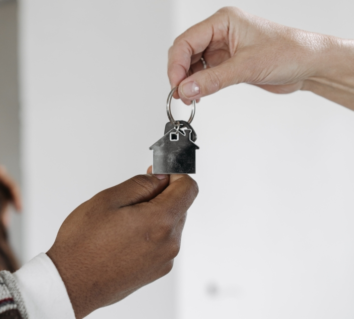
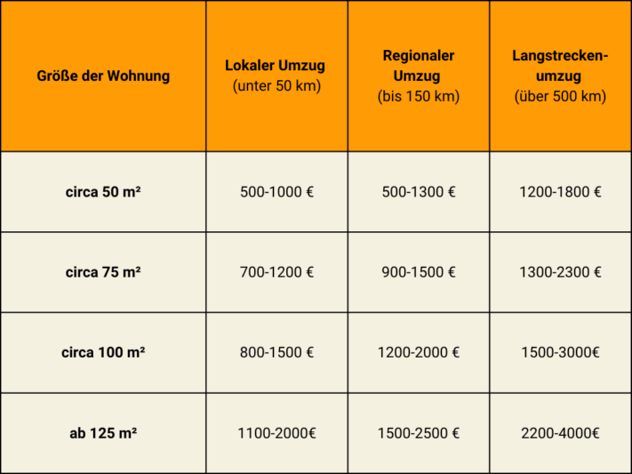
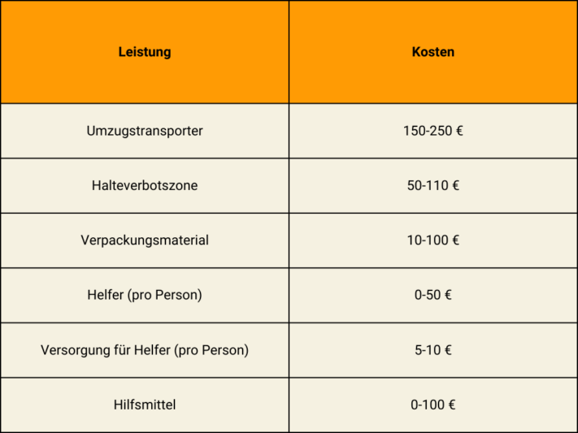
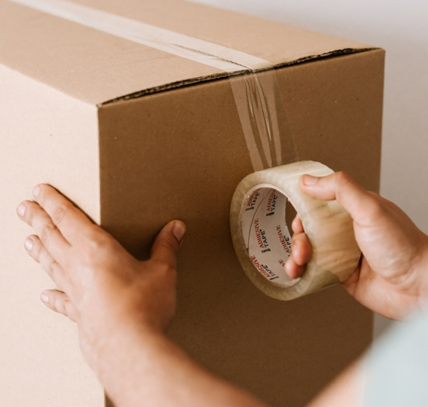
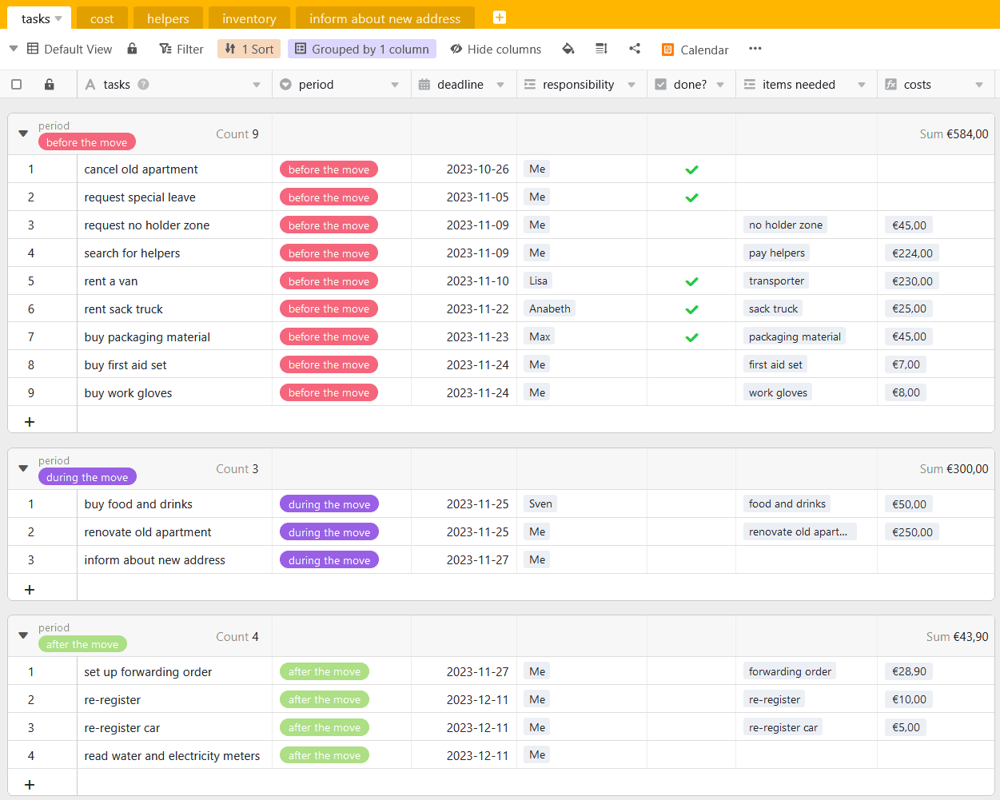

Наконец-то этот момент настал! Вы нашли идеальную квартиру и не можете дождаться, когда переедете в новый дом. Единственное, что теперь отделяет вас от квартиры мечты, — это сам переезд. То, что для большинства людей связано со стрессом и большими затратами времени, можно значительно упростить с помощью структурированного **плана переезда**. Как спланировать переезд максимально без стресса и успешно его провести, вы узнаете здесь.

## Составьте чек-лист

Начните планирование переезда с мозгового штурма. Какие задачи нужно выполнить? Кто может мне помочь? Какой бюджет я могу выделить? Затем составьте обзор расходов, чтобы оценить свои траты. В чек-листе вы можете определить и поэтапно выполнять первые задачи.

Чек-лист поможет держать все задачи под контролем.

Чек-лист для вашего переезда вы найдете также в нашем [шаблоне]().

## До переезда

Новый договор аренды подписан, и вы уже решили съехать из старой квартиры. Теперь пора расторгнуть старый договор. **Расторжение** должно быть своевременным и письменным; обычно действует срок уведомления в три месяца. Если вы хотите съехать раньше, чем предусмотрено договором, обсудите это с арендодателем — возможно, вам придется самостоятельно искать нового жильца.

Вскоре после переезда назначьте дату **передачи квартиры и ключей**. Для этого квартиру нужно оставить в состоянии, оговоренном в договоре: обычно это косметический ремонт и уборка «под метлу».

Передача ключей — финальный шаг со старой квартирой.

После передачи вы получаете обратно залог и можете полностью сосредоточиться на обустройстве нового жилья.

## Отпуск для переезда

С тщательным планированием передач первый этап переезда завершён. Но последующая разборка и сборка вещей требует много сил и времени. Поэтому для крупного переезда имеет смысл взять один-два дня отпуска. Если вы хотите получить **освобождение от работы** по такому поводу, сначала ответьте себе на следующие вопросы:

### Право на дополнительный отпуск



Плохая новость: в Германии согласно Федеральному закону об отпусках и Гражданскому кодексу **нет законного права на отпуск** при переезде.




Хотя общего права на дополнительный отпуск нет, работодатель может его предоставить. Проверьте свой трудовой договор или спросите в профсоюзе или у начальства, положен ли вам такой отпуск.




В таком случае у вас есть хорошие шансы получить оплачиваемый отпуск, даже если это не указано в договоре. Различают смену работодателя и смену места работы. В первом случае всё зависит от лояльности нового работодателя. Если вы переезжаете внутри одной компании, можно подать заявку на оплачиваемое освобождение.


### Причины для служебного переезда



Помимо уже упомянутых _смены работы или работодателя_, к служебным причинам относятся: первая работа, переезд из служебной или в служебную квартиру, возвращение из-за границы для новой работы в Германии и сокращение пути на работу минимум на полчаса в день.




Да, для государственных служащих и работников по тарифу предусмотрен один оплачиваемый день отпуска при служебном переезде (параграф 29 тарифного соглашения). Если за последние пять лет вы уже переезжали по служебным причинам, вам положено три дня.


## Организация переезда

Когда дата переезда определена, наступает этап планирования. Есть два варианта: переезд с помощью компании или самостоятельно. Что выбрать — зависит от бюджета, объёма вещей и вашей стрессоустойчивости.

### Полный сервис: нанять компанию

С **переездной компанией** вы экономите много времени и нервов. Всё, что пришлось бы организовывать самому, здесь делают за вас. Особенно если переезжаете с семьёй или в сжатые сроки, это быстро и удобно. Но за минимальные собственные усилия придётся заплатить больше. Стоимость зависит от расстояния и размера квартиры, детали лучше обсудить с компанией. В среднем расходы рассчитываются так:

Стоимость зависит от объёма вещей и расстояния между квартирами.

Зато вы получаете **полный сервис**. Компания несёт ответственность за возможные повреждения вашего имущества, квартиры или подъезда. По закону сумма ответственности составляет 620 евро за кубометр перевозимого имущества. Для особо ценных вещей можно согласовать большую сумму. Но будьте внимательны: если вы сами упаковываете мебель и вещи, компания не несёт ответственности за повреждения при транспортировке.

Переездные компании берут на себя большую часть задач.

### Услуги

Вы сами решаете, сколько помощи получить от компании. Обычно есть несколько вариантов:

- **Стандартный переезд**: погрузка и транспортировка
- **Полный переезд**: упаковка и распаковка коробок, сборка и разборка мебели, погрузка и транспортировка
- **Дополнительные услуги**: установка знаков запрета парковки, временное хранение мебели

### Для экономных: переезд своими силами

Хотите сэкономить? Тогда **самостоятельный переезд** — ваш вариант. Но и организационных хлопот будет больше. Всё, что входит в услуги компании, теперь ложится на ваши плечи. Но с хорошим планом и это не проблема. Поможет вам [план переезда](), который поддержит на каждом этапе.

Вот какие расходы вас ждут при самостоятельном переезде.

### Задачи

Всё организовать самому? Нет проблем! Вот что вам предстоит:

- **Транспорт**: попросите друзей или родственников предоставить транспорт или арендуйте грузовик. В последнем случае учтите расходы на топливо и километраж.
- **Запрет на парковку**: особенно в больших городах сложно найти парковку рядом с домом. Чтобы не носить коробки далеко, оформите временный запрет на парковку в дорожной службе. Там же берут в аренду соответствующие знаки. Подайте заявку за 3-4 недели до переезда.
- **Упаковочные материалы**: для перевозки вещей лучше всего подойдут коробки. Правило: количество кв. метров = количество коробок. Сначала спросите у знакомых, возможно, коробки есть у них. Также понадобятся скотч и наполнитель (бумага, пузырчатая плёнка) для хрупких вещей.
- **Поиск помощников**: в первую очередь обратитесь к друзьям и родственникам — они наверняка помогут бесплатно. Если мало желающих, ищите платных помощников: спросите у соседей или разместите объявление в соцсетях. Не забудьте подготовить для всех еду и напитки на день переезда.
- **Инструменты**: чтобы облегчить работу себе и помощникам, используйте перчатки, ремни, тележку для перевозки тяжёлых предметов. Если работают не профессионалы, травмы случаются чаще. Позаботьтесь о наборе первой помощи.

Организуйте прочные упаковочные материалы, чтобы ваши вещи не пострадали.

## Кого нужно уведомить о переезде

Переезд уже на носу, и вы хотите сообщить новый адрес. Не забудьте не только про **друзей и родственников**, но и прежде всего про **органы** и **компании**, с которыми у вас заключены договоры. Самое важное после переезда — **паспортный стол**. В течение 14 дней после переезда вы должны зарегистрироваться по новому месту жительства. Там же можно перерегистрировать автомобиль. Запишитесь заранее, так как очереди бывают большими.

### Кому ещё сообщить новый адрес:

- Страховые (медицинская, ответственности, имущества, правовая и др.)
- Банки
- Поставщики электроэнергии, газа, воды
- Провайдеры телефонии и интернета
- Радио- и ТВ-налог (вам пришлют уведомление)
- Подписки (журналы и др.)
- Членства (спортклубы, объединения)
- Интернет-магазины и службы доставки



## Служебный переезд и налоговый вычет

Часть расходов на переезд в Германии можно учесть как **расходы, связанные с работой**. Они делятся на **общие и прочие расходы** и составляют основную часть того, что можно вычесть из налогов. Важно: если работодатель полностью или частично покрывает расходы на переезд, вы не можете заявить эти суммы в декларации повторно.



### Общие расходы

Есть ряд **общих расходов**, которые можно полностью указать в налоговой декларации. **Очень важно**: сохраняйте счета и квитанции для подтверждения расходов. К общим расходам относятся, например, транспортировка имущества, двойная аренда в период переезда, услуги риэлтора.

Сохраняйте все счета и чеки для налоговых вычетов.

### Прочие расходы

Прочие расходы можно списывать по фиксированной ставке, не обязательно хранить каждый чек. **Плоская ставка на переезд** особенно выгодна при самостоятельном переезде — она покрывает множество мелких трат: питание помощников, установка кухни, смена паспорта, перерегистрация авто и др.

С 1 апреля 2023 года ставка составляет 886 евро; за каждого дополнительного человека — ещё 590 евро. Если до переезда не было собственного хозяйства, ставка — всего 177 евро.

Использовать фиксированную ставку не обязательно. Если ваши расходы превышают покрываемые ставкой, вы можете, как и с общими расходами, подтвердить их чеками и получить налоговый вычет.

Также частично учитываются расходы на ремонт старой квартиры, например, косметический ремонт по договору.

## Частный переезд и налоги

Если вы переезжаете по личным причинам, расходы на переезд не вычитаются из налогов. Но всё же есть варианты: можно указать **расходы на работу и транспорт** для переездной компании. Но учтите: максимум 20 000 евро в год на услуги, из которых только 4 000 евро дают налоговую выгоду. В этом случае указывайте расходы как **расходы на домашнее хозяйство**.

Переезд по медицинским показаниям считается исключительным случаем и также может быть учтён в декларации, но только при наличии подробных медицинских справок.

## Онлайн-планировщик вашего переезда

Чтобы следующий переезд прошёл максимально без стресса, команда SeaTable подготовила шаблон плана переезда. Вы можете адаптировать его под свои нужды.

Если вы хотите использовать SeaTable для планирования переезда, [зарегистрируйтесь]() бесплатно. Соответствующий шаблон вы найдёте [здесь]().
