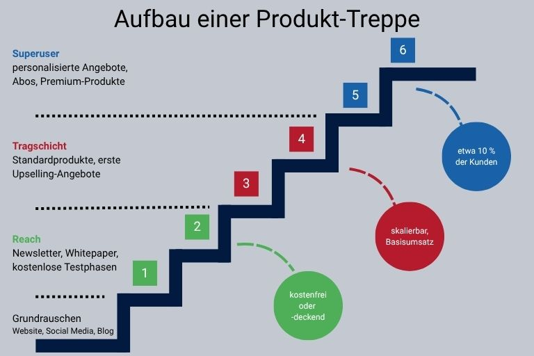

## Warum Sie eine Vertriebsstrategie brauchen

Ohne eine klare Vertriebsstrategie fehlt es Ihrem Vertrieb (und bedingt auch dem [Marketing]()) an Orientierung. Maßnahmen laufen ins Leere oder zahlen nicht auf das Unternehmensziel ein. Erst mit einer ausformulierten, dokumentierten und kommunizierten Strategie kann Ihr Sales [Kunden]() gezielt ansprechen und sich **mühelos an wechselnde Marktbedingungen** anpassen.

Die schwerwiegendsten Nachteile einer fehlenden Vertriebsstrategie sind:

* Ihr Team arbeitet nicht effizient: Unklar formulierte Unternehmensziele oder Vertriebszielvorgaben erhöhen am Ende den Aufwand Ihrer Mitarbeiter, um Einzelmaßnahmen zu bewerten und abzustimmen – auf Kosten der Effizienz und der Zufriedenheit im Team. Eine umfassende Vertriebsstrategie hingegen hilft Ihrem Vertriebsteam dabei, Aufgaben und Maßnahmen zu koordinieren und effizient umzusetzen.

* Sie werden unflexibel: Märkte und Kundenbedürfnisse verändern sich – und Ihr Vertrieb muss darauf eigenständig reagieren können. Ohne eine klare Strategie und einen klaren Fokus werden sich ändernde Marktbedingungen zu spät erkannt. Eine Vertriebsstrategie hilft Ihnen dabei, **schnell und agil** zu reagieren.

* Sie können nicht planen: Planungssicherheit ist keine Einbahnstraße. Indem das Management oder die Vertriebsleitung klare Vorgaben macht, weiß das Team, was von ihm erwartet wird, und kann Maßnahmen, Vertriebswege und Vertriebskanäle entsprechend planen. Umgekehrt kann anhand dieser Maßnahmen auch das Management eine belastbare **Absatz- und Umsatzprognose** erstellen und Ressourcen entsprechend einsetzen. Fehlt es indes an einer Strategie und eindeutig kommunizierten Zielen, mangelt es auf allen Ebenen an Planungssicherheit.

* Sie verfehlen Ihre Zielgruppe: Wer seine Zielgruppe nicht kennt, kann seine Vertriebsmaßnahmen auch nicht gezielt ausrichten. Erst mit einer strategischen Planung Ihres Vertriebs schaffen Sie die Voraussetzung dafür, **Ihre Kunden bestmöglich anzusprechen** – egal ob B2B oder B2C.

* Ihr Marketing kann keine Maßnahmen ableiten: Ihr Unternehmen kann nur dann optimale Ergebnisse erzielen, wenn Vertrieb und Marketing Hand in Hand arbeiten. Kennt Ihre Marketingabteilung jedoch die Vertriebsziele nicht, weil Ihr Vertrieb sie selbst nicht kennt, kann es diese in der [Marketingstrategie]() auch nicht berücksichtigen und keine geeigneten Maßnahmen ableiten.

## Was ist eine Vertriebsstrategie?

Ihr Sales-Team ist zuständig für den Verkauf von Produkten oder Diensteistungen. Damit das Team erfolgreich und effizient arbeiten kann, bildet die Strategie das unverzichtbare Grundgerüst für die operative Vertriebsarbeit. Sie dient dazu, den Umsatz des Unternehmens zu fördern und die langfristigen Unternehmensziele zu erreichen. Eine Vertriebsstrategie ist langfristig angelegt und definiert Zielvorgaben, legt die Zielgruppe und passende **Vertriebskanäle** fest und definiert konkrete Vertriebsmaßnahmen. Vertriebs- und Produktstrategie hängen eng zusammen und sollten als Einheit angesehen werden. Ein wesentlicher Punkt, der bereits in der Vertriebsstrategie mit bedacht werden muss, ist zudem das **Vertriebscontrolling**.

### Vertriebskonzept, Vertriebsstrategie, Vertriebsplan

Konzept, Strategie und Plan bilden eine Einheit und bleiben losgelöst voneinander erfolglos.

Bevor Sie eine Vertriebsstrategie erstellen können, müssen Sie ein Vertriebskonzept entwickeln. Das Konzept gibt allgemeine Richtungsentscheidungen vor, fasst relevante Marktinformationen zusammen und definiert den Aufbau der Vertriebsorganisation. Die Vertriebsstrategie baut auf dem Konzept auf und geht noch einen Schritt weiter. Sie ist langfristig ausgerichtet und konkretisiert, wie die Ziele operativ erreicht werden sollen. **Der Vertriebsplan schließlich überträgt die langfristige Strategie in kurzfristige, operative Maßnahmen**.

## Worin unterscheiden sich Vertriebsstrategien B2B und B2C?

Bevor wir konkret darauf eingehen, worauf Sie bei der Erstellung Ihrer Vertriebsstrategie achten müssen, lassen Sie uns noch einmal zwischen einer Vertriebsstrategie B2B und der Vertriebsstrategie B2C unterscheiden. Denn wenngleich es viele Gemeinsamkeiten gibt, so müssen beide Strategiebereiche auf verschiedene Zielgruppen, Verkaufsumgebungen und Marktvoraussetzungen abgestimmt sein. Eine Entscheidung für B2B-, B2C- oder B2X-Vertrieb sollte idealerweise bereits getroffen sein, wenn Sie Ihr Vertriebskonzept erstellen.

### Vertriebsstrategien B2C

* Private Kunden kaufen aus eigenem Antrieb, um persönliche Bedürfnisse zu erfüllen. Der Verkauf funktioniert in erster Linie über Emotionen. Daten, Zahlen, Fakten: Die nackten wirtschaftlichen Vorteile, die im B2B entscheidend sind, wirken hier bestenfalls unterstützend, womöglich sogar störend.

* Im höher- und hochpreisigen Segment sind persönliche Kundenkontakte durchaus üblich, bei preiswerten Alltagsprodukten jedoch nicht zwingend erforderlich.

* Die Customer Journey vom ersten Touchpoint bis zum Kaufabschluss ist vergleichsweise kurz, oft gibt es sogar nur einen Touchpoint.

* Klassische Vertriebskanäle spielen im B2C meistens nur noch eine Nebenrolle.

### Vertriebsstrategie B2B

* Die Einkäufer beschaffen Waren und Dienstleistungen im Auftrag und auf Rechnung des Unternehmens und sind rechenschaftspflichtig. Der Informationsbedarf auf Kundenseite ist hoch; Kaufentscheidungen werden abwägender und langsamer getroffen als im B2C.

* Neben dem Branding spielen Referenzen und Sales-Netzwerke eine große Rolle.

* Eine emotionale Ansprache ist auch im B2B Bereich wichtig – Einkäufer sind auch Menschen – Professionalität, Zuverlässigkeit und wirtschaftliche Argumente jedoch die entscheidenden Faktoren. Der Kundennutzen wird über Produktmerkmale, Konditionen und Preis vermittelt.

* Je nach Branche und Produkt ist ein persönlicher Sales Account Manager üblich und wird auch erwartet.

* Von der Leadgewinnung bis zum Verkauf können Wochen, Monate oder sogar Jahre vergehen.

## Häufige Fehler beim Aufbau einer Vertriebsstrategie

Wenn Sie eine Vertriebsstrategie erstellen, ist es wichtig, diese wirklich auf Ihr Unternemen anzupassen. Eine Vertriebsstrategie Vorlage kann als Orientierung dienen, ebenso Vertriebsstrategien anderer Unternehmen. Am Ende müssen die Inhalte präzise zu Ihrer Firma und Ihren Zielen passen. Wenn Sie das verinnerlicht haben, sollten Sie diese häufigen Fehler leicht vermeiden können:

* **Unklare Zielgruppe:** Ist Ihre Zielgruppe nicht oder nur ungenau definiert, können Ihre Maßnahmen nicht den gewünschten Effekt erzielen.

* **Unklarer Nutzen:** Nur wenn der Mehrwert Ihres Angebots klar ist, können Sie es verkaufen. Der Kundennutzen ist in Vertriebsstrategien B2B besonders wichtig, sollte jedoch auch im B2C-Bereich klar benannt werden können.

* **Kein Alleinstellungsmerkmal:** Wenn Sie nicht gerade Monopolist sind, müssen Sie potentielle Kunden von den Vorteilen Ihres Produkts überzeugen. Ohne echte USP ist Ihr Produkt am Markt gegenüber der Konkurrenz im Nachteil.

* **Unflexible Zielvorstellungen:** Ihre Strategie gibt den Rahmen für das operative Tagesgeschäft vor. Doch sie sollte nicht als in Stein gemeißelt verstanden werden. Achten und reagieren Sie auch auf die Nachfrage und agieren Sie flexibel. So können sich positive Entwicklungen ergeben, die nicht geplant waren.

* **Keine Berücksichtigung der Produktstrategie:** Nur wenn Sie Produktstrategie und Vertriebsstrategie aufeinander abstimmen, vermeiden Sie Reibungsverluste.

* **Falscher Fokus:** Stellen Sie nicht Ihr Produkt in den Mittelpunkt, sondern die Bedürfnisse des Kunden.

## Vertriebsstrategien entwickeln: 8 Tipps

Sie wissen nun, wie zentral eine Strategie für den Erfolg Ihres Vertriebs ist und welche Fehler beim Aufbau einer Vertriebsstrategie passieren können. Doch lassen Sie sich davon nicht einschüchtern. Mit unserer **8-Schritt-Anleitung** erstellen Sie eine solide, sinnvolle Strategie.

1. **Nehmen Sie sich Zeit:** Eine Vertriebsstrategie entwickeln Sie nicht über Nacht – und nicht allein. Planen Sie die erforderliche Zeit lieber großzügig und binden Sie Ihr Team und ggf. weitere Abteilungen ein.

2. **Definieren Sie realistische Ziele:** Erst durch formulierte Ziele entsteht Klarheit bei allen Beteiligten. Legen Sie messbare Ziele fest, die durch Daten und Zahlen überprüft werden können, z. B. 10 % mehr Umsatz oder Absatz. Sie können auch qualitative Ziele festlegen, z. B. die [Kundenzufriedenheit]() zu steigern. Da sich solche Ziele schlecht quantifizieren lassen, müssen Sie dann **spezifische Erfolgskriterien** definieren. Ziele können Top-down durch die Geschäftsleitung, Bottom-up durch den Sales oder hybrid festgelegt werden. Wichtig ist, dass Sie immer mit erreichbaren Zielen arbeiten, um die Motivation im Team hoch zu halten.

3. **Zielgruppe definieren:** Wer seine Zielgruppe genau kennt, ist seiner Konkurrenz voraus und positioniert das eigene Produkt erfolgreich am Markt. Erstellen Sie wenn möglich Buyer Personas. Auf jeden Fall sollten Sie diese Fragen beantworten können: Für wen ist Ihr Produkt geeignet? Wer braucht es und warum? Wer kann es sich leisten? Je nachdem, ob Sie eine Vertriebsstrategie B2B erstellen oder B2C, können noch weitere Fragen relevant werden.

4. **Marktanalyse:** Machen Sie sich mit Ihrer Konkurrenz und dem Marktumfeld vertraut. Ist der Markt bereits gesättigt oder gibt es noch Wachstumspotential? Wie sehen Ihre Entwicklungsmöglichkeiten aus? Welche Produkte bieten Ihre Konkurrenten an? Welche Vertriebskanal Strategie verfolgen Sie? Erstellen Sie eine [SWOT Analyse](), um Ihre Wettbewerber zu bewerten, und nutzen Sie die Ergebnisse, um sich mit Ihrem Alleinstellungsmerkmal abzuheben.

5. **Alleinstellungsmerkmal festlegen:** Wir sind oben bereits darauf eingegangen: Wenn Sie nicht begründen können, warum die Kunden Ihr Produkt oder Ihre Dienstleistung einkaufen sollen, dann werden diese es vermutlich auch nicht tun.

6. **Kommunikationsstrategie entwickeln:** Sie kennen Ihre Zielgruppe, den Markt und Ihr Produkt. Nun müssen Ihre Kunden bloß noch von dem Produkt erfahren. Treffen Sie eine Entscheidung, wie, mit welchem Content und über welche Kanäle Sie Ihre Zielgruppe ansprechen möchten. Wenn Sie eine **Vertriebsstrategie B2B** erstellen, müssen Sie sich bewusst sein, dass Sie mit Ihren Inhalten auch Personen erreichen, die selbst gar keine Kaufentscheidung treffen – diese in ihrem Unternehmen aber beeinflussen oder anstoßen können. Berücksichtigen Sie diese Gruppe in Ihrer Kommunikation und nutzen Sie sie als Multiplikatoren.

7. **Vertriebskanäle festlegen:** Je nach Produkt und Zielgruppe können unterschiedliche Vertriebswege und Vertriebskanäle besser oder schlechter geeignet sein. Grundsätzlich müssen Sie entscheiden, ob Ihr Produkt direkt oder indirekt vermarktet werden soll und ob Sie **klassische und/oder digitale Vertriebskanäle** bedienen. Wenn Sie beim Aufbau einer Vertriebsstrategie eine sorgfältige Zielgruppenanalyse vornehmen, sollte Ihnen die Wahl des passenden Kanals leichtfallen. Die Wahl des passenden Vertriebsweges hingegen hängt stärker von der generellen Ausrichtung Ihres Unternehmens und Ihren Kapazitäten ab. Beim direkten Vertrieb sprechen Sie Ihre Endkunden direkt an, ohne wie beim indirekten Vertrieb Ihre Produkte über einen Händler in den Markt zu bringen. Auch eine Kombination aus beiden Wegen ist denkbar und unter Umständen sinnvoll. Sie sollten sich aber darüber klar sein, dass je nach Vertriebsweg, Kunden und Produkt andere Qualifikationen in Ihrem Vertrieb benötigt werden. Daher ist es wichtig, bereits, wenn Sie ein Vertriebskonzept entwickeln, zu entscheiden, welche Vertriebswege Sie grundsätzlich bedienen möchten.

8. **Vertriebscontrolling:** Aussagekräftige Daten sind auch im Vertrieb der beste Freund Ihrer Mitarbeiter. Denn nur so erkennen Sie, was tatsächlich gut funktioniert, wo Sie nachsteuern müssen und auf welche Trends Sie reagieren sollten. Legen Sie daher bereits beim Aufbau einer Vertriebsstrategie Evaluierungsintervalle fest und definieren Sie Metriken zur Erfolgsmessung. Sensibilisieren Sie Ihre Mitarbeiter für die Bedeutung von Datenpflege und [Datenmanagement]().

### Für Selbstständige: Vertriebsstrategie mithilfe einer Produkt-Treppe erstellen

Insbesondere Selbstständigen und Start-ups fällt der Aufbau einer Vertriebsstrategie schwer, die sich auf das Wesentliche reduziert. Gerade online bieten sich viele und immer wieder neue Möglichkeiten, sodass die begrenzten Ressourcen schnell an ein Limit kommen. Hier hilft die **Produkt-Treppe**. Diese von Brigitte und Ehrenfried Conta Gromberg entwickelte Methode bietet ein einfaches Raster, um alle Produkte hierarchisch zu ordnen. Die Treppe besteht aus drei Kategorien zu jeweils zwei Stufen. Auf den Stufen werden verschiedene Produkte oder Dienstleistungen angesiedelt, teure Produkte stehen oben, günstige unten. Diese Struktur hilft Ihnen dabei, unterschiedliche Angebote nach der Bedeutung für Ihren Gesamtumsatz zu kategorisieren. So erhalten Sie ein klares Bild darüber, womit Sie tatsächlich Ihr Geld verdienen und können Ressourcen besser einteilen. 

## Die Bedeutung von Digitalisierung in der Vertriebsstrategie

Moderne digitale Lösungen werden auch im Vertrieb immer wichtiger für Controlling, Daten- und Pipelinemanagement, Lead Scoring oder das Erkennen erfolgversprechender Cross-Selling-Möglichkeiten. Automatisierte Prozesse erhöhen die Produktivität der Mitarbeiter und reduzieren fehleranfällige manuelle Dateneingaben. Ein echter Game-Changer sind **flexible und skalierbare No-Code Cloud-Systeme** wie SeaTable, mit denen die Arbeit verschiedener Abteilungen verzahnt wird. Ihre Mitarbeiter können in Echtzeit zusammenarbeiten und von überall auf relevante Daten zugreifen. Dashboards erlauben einfache Reportings und Auswertungen. Mit einem No-Code Universal [App Builder]() erstellen Ihre Teams in wenigen Minuten Benutzeroberflächen für Auftragseingänge, Terminbuchungen oder Kundenfeedbackformulare.

Für Sales-Teams bedeutet dies: Wenn Sie eine Vertriebsstrategie entwickeln, können Sie jederzeit nicht nur auf Ihre eigenen Daten zugreifen, sondern auch Marketing- oder Customer-Service-Daten berücksichtigen. So gewinnen Sie ein ganzheitliches Bild von den Bedürfnissen Ihrer Kunden. Da Daten in Echtzeit synchronisiert werden, sind Ihre **Reportings jederzeit aktuell** und erlauben so schnellere Entscheidungen. Zeitaufwendige Recherchen nach den relevanten Informationen und Daten-Silos gehören der Vergangenheit an.



## Eine Vertriebsstrategie erstellen – das Fundament Ihres Erfolgs legen

Mit einer gut durchdachten und dokumentierten Vertriebsstrategie erreichen Sie Ihre Ziele leichter und effizienter. Nur wenn Sie Ihr Produkt, Ihre Zielgruppe und den Markt kennen, lassen sich maßgeschneiderte Maßnahmen ableiten und erfolgreich umsetzen. Meißeln Sie Ihre Strategie nicht in Stein, sondern hinterfragen Sie Ihre Annahmen und Maßnahmen regelmäßig anhand belastbarer Daten. Moderne Vertriebsteams sind flexibel und passen sich veränderten Bedingungen flexibel an – bis hin zu einer vollständigen Revision der Strategie. Mit einem guten **integrierten System** behalten Sie stets den Überblick über Ihren gesamten Vertriebsprozess und alle relevanten Daten.

## FAQ Vertriebsstrategie


Eine Vertriebsstrategie bietet den Rahmen für die operative Arbeit im Sales. Sie dient dazu den Absatz des Unternehmens zu fördern und legt die zukünftige Ausrichtung des Vertriebs fest, um die geplanten Unternehmensziele zu erreichen. Wenn Sie eine Vertriebsstrategie entwickeln, sind die wesentlichen Fragen immer gleich – egal, ob Sie eine digitale Vertriebsstrategie oder eine klassische Vertriebsstrategie erarbeiten.


Vertriebswege sind alle Kanäle, über die ein Unternehmen seine Produkte oder Dienstleistungen vertreibt. Es wird zwischen direkten und indirekten Vertriebswegen unterschieden. Vermarktet ein Unternehmen zielgerichtet an seine Endverbraucher spricht man von direkten Vertriebswegen. Wenn die Produkte oder Dienstleistungen über einen Zwischenhändler angeboten werden, handelt es sich um indirekte Vertriebswege. Die Wahl der passenden Vertriebskanäle ist auch Bestandteil der [Distributionspolitik]().


Wichtige Beispiele für Vertriebsstrategien sind: Produktstrategie und Preisstrategie, bei denen bestimmte Produktmerkmale im Vordergrund stehen; die Distributionsstrategie, bei der vor allem die Vertriebskanäle entscheidend sind; die Kommunikationsstrategie, bei der es darum geht, zum richtigen Zeitpunkt die richtigen Informationen zu vermitteln. Wenn Sie eine Vertriebsstrategie entwickeln, werden Sie in der Regel verschiedene Strategien kombinieren.


Klassische Vertriebskanäle umfassen z. B. den stationären Handel, Großhandel, Messen, den Katalogverkauf und Tele-Sales. Digitale Vertriebskanäle hingegen finden online statt: z. B. E-Commerce, Social Commerce, virtuelle Showrooms oder digitale Marktplätze.
