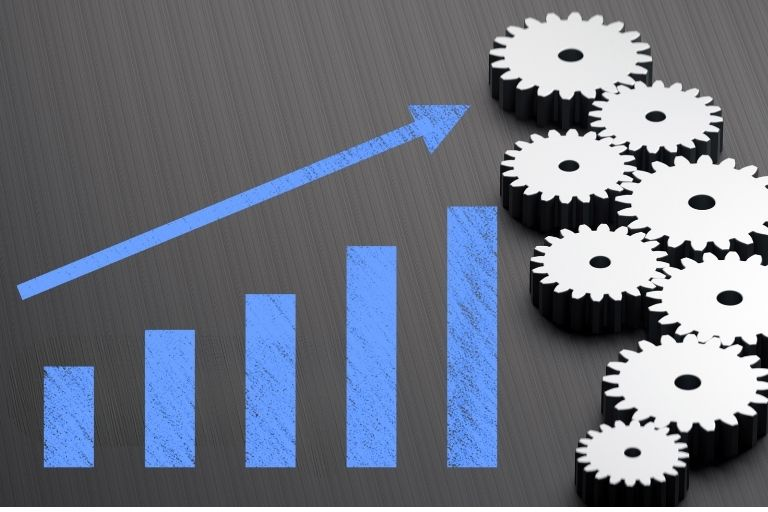
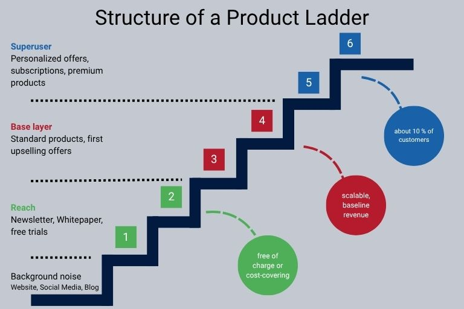

## Why you need a sales strategy

Without a clear sales strategy, your sales department (and to a certain extent your [marketing department]()) will lack direction. Measures come to nothing or do not contribute to the corporate objective. Only with a formulated, documented and communicated strategy can your sales department target [customers]() and adapt to changing market conditions with ease.

The most serious disadvantages of a missing sales strategy are:

* Your team does not work efficiently: vaguely formulated company goals or sales targets end up increasing the amount of time your employees spend evaluating and coordinating individual measures – at the expense of efficiency and satisfaction within the team. A comprehensive sales strategy, on the other hand, helps your sales team to coordinate tasks and measures and implement them efficiently.

* You become inflexible: Markets and customer needs change – and your sales team must be able to react to this independently. Without a clear strategy and a clear focus, changing market conditions are recognized too late. A sales strategy helps you to respond **quickly and agilely**.

* You cannot plan: Planning reliability is not a one-way street. If the management or sales management provides clear guidelines, the team knows what is expected of it and can plan measures, sales channels and distribution channels accordingly. Conversely, management can also use these measures to create a reliable **sales and turnover forecast** and deploy resources accordingly. However, if there is no strategy and clearly communicated goals, there is a lack of planning certainty at all levels.

* You miss your target group: If you don't know your target group, you can't target your sales measures. Only by strategically planning your sales do you create the conditions for **addressing your customers** - whether B2B or B2C – in the best possible way.

* Your marketing cannot derive any measures: Your company can only achieve optimal results if sales and marketing work hand in hand. However, if your marketing department does not know the sales targets because your sales department does not know them itself, it cannot take them into account in the [marketing strategy]() and cannot derive suitable measures.

## What is a sales strategy?

Your sales team is responsible for selling products or services. In order for the team to work successfully and efficiently, the strategy forms the indispensable basic framework for operational sales work. It serves to promote the company's turnover and achieve the long-term corporate goals. A sales strategy is designed for the long term and defines targets, specifies the target group and suitable **sales channels** and defines specific sales measures. Sales and product strategy are closely linked and should be viewed as a unit. **Sales controlling** is also a key point that must be considered in the sales strategy.

### Sales concept, sales strategy, sales plan

Concept, strategy and plan form a unit and remain unsuccessful without each other.

Before you can create a sales strategy, you need to develop a sales concept. The concept provides general directional decisions, summarizes relevant market information and defines the structure of the sales organization. The sales strategy builds on the concept and goes one step further. It is geared towards the long term and specifies how the objectives are to be achieved operationally. Finally, the **sales plan translates the long-term strategy into short-term, operational measures**.

## What is the difference between B2B and B2C sales strategies?

Before we go into detail about what you need to pay attention to when creating your sales strategy, let's differentiate once again between a B2B sales strategy and a B2C sales strategy. Although there are many similarities, both strategy areas must be tailored to different target groups, sales environments and market conditions. Ideally, a decision for B2B, B2C or B2X sales should already be made when you create your sales concept.

### B2C sales strategies

* Private customers buy on their own initiative to fulfill personal needs. Sales work primarily through emotions. Data, figures, facts: The bare economic benefits, which are decisive in B2B, are at best supportive here, possibly even disruptive.

* Personal customer contacts are quite common in the higher and high-price segment, but are not absolutely necessary for inexpensive everyday products.

* The customer journey from the first touchpoint to the conclusion of the purchase is comparatively short, and there is often only one touchpoint.

* Traditional sales channels usually only play a minor role in B2C.

### B2B sales strategy

* Buyers procure goods and services on behalf of and for the account of the company and are accountable. The need for information on the customer side is high; purchasing decisions are made more deliberately and more slowly than in B2C.

* In addition to branding, references and sales networks play a major role.

* An emotional approach is also important in the B2B sector - buyers are people too - but professionalism, reliability and economic arguments are the decisive factors. The customer benefit is communicated via product features, conditions and price.

* Depending on the industry and product, a personal sales account manager is common and expected.

* It can take weeks, months or even years from lead generation to the sale.

## Common mistakes when setting up a sales strategy

When creating a sales strategy, it is important to really customize it to your company. A sales strategy template can serve as a guide, as can sales strategies from other companies. In the end, the content must fit your company and your goals precisely. Once you have internalized this, you should be able to easily avoid these common mistakes:

* **Unclear target group:** If your target group is not defined or only vaguely defined, your measures may not have the desired effect.

* **Unclear benefit:** Only if the added value of your offer is clear can you sell it. The customer benefit is particularly important in B2B sales strategies, but should also be clearly stated in the B2C sector.

* **No unique selling proposition:** Unless you are a monopolist, you need to convince potential customers of the benefits of your product. Without a real USP, your product is at a disadvantage on the market compared to the competition.

* **Inflexible objectives:** Your strategy provides the framework for day-to-day operations. But it should not be seen as set in stone. Pay attention to and react to demand and act flexibly. This can result in positive developments that were not planned.

* **No consideration of the product strategy:** Only if you coordinate your product strategy and sales strategy can you avoid friction losses.

* **Wrong focus:** Don't focus on your product, but on the customer's needs.

## Developing sales strategies: 8 tips

You now know how central a strategy is to the success of your sales and what mistakes can be made when developing a sales strategy. But don't let this intimidate you. Our **8-step guide** will help you create a solid, sensible strategy.

1. **Take your time:** You don't develop a sales strategy overnight – and not on your own. Plan the necessary time generously and involve your team and, if necessary, other departments.

2. **Define realistic goals:** Only formulated goals create clarity for everyone involved. Set measurable targets that can be verified by data and figures, e.g. 10 % more turnover or sales. You can also set qualitative targets, e.g. to increase customer satisfaction. However, as such targets are difficult to quantify, you must then define **specific success criteria**. Targets can be set top-down by the management, bottom-up by Sales or hybrid. It is important that you always work with achievable targets in order to keep motivation in the team high.

3. **Define target group:** Those who know their target group precisely are ahead of the competition and can position their own product successfully on the market. If possible, create buyer personas. In any case, you should be able to answer these questions: Who is your product suitable for? Who needs it and why? Who can afford it? Depending on whether you are creating a B2B or B2C sales strategy, other questions may also be relevant.

4. **Market analysis:** Familiarize yourself with your competition and the market environment. Is the market already saturated or is there still potential for growth? What are your development opportunities? What products do your competitors offer? What sales channel strategy are you pursuing? Create a [SWOT analysis]() to evaluate your competitors and use the results to differentiate yourself with your unique selling proposition.

5. **Define your unique selling proposition:** We've already covered this above: If you can't justify why customers should buy your product or service, they probably won't.

6. **Develop a communication strategy:** You know your target group, the market and your product. Now all your customers need to know about the product. Decide how, with which content and via which channels you want to address your target group. When you create a B2B sales strategy, you must be aware that your content will also reach people who do not make a purchase decision themselves – but who can influence or initiate this in their company. Take this group into account in your communication and use them as multipliers.

7. **Determine sales channels:** Depending on the product and target group, different sales channels may be more or less suitable. Basically, you need to decide whether your product should be marketed directly or indirectly and whether you use **classical and/or digital sales channels**. If you carry out a careful target group analysis when developing a sales strategy, it should be easy for you to choose the right channel. The choice of the right sales channel, on the other hand, depends more on the general orientation of your company and your capacities. With direct sales, you address your end customers directly without bringing your products to the market via a dealer, as is the case with indirect sales. A combination of both methods is also conceivable and may make sense under certain circumstances. However, you should be aware that different qualifications are required in your sales department depending on the sales channel, customer and product. It is therefore important to decide which sales channels you want to use when you are developing a sales concept.

8. **Sales controlling:** Meaningful data is also your employees' best friend in sales. This is the only way to recognize what is actually working well, where you need to make adjustments and which trends you should react to. Therefore, set evaluation intervals and define metrics for measuring success as early as the development of a sales strategy. Make your employees aware of the importance of data maintenance and [data management]().

### For the self-employed: Create a sales strategy using a product ladder

Self-employed people and start-ups in particular find it difficult to develop a sales strategy that focuses on the essentials. Especially online, there are many and constantly new opportunities, so that defined resources quickly reach their limits. This is where the **product ladder** can help. This method, developed by Brigitte and Ehrenfried Conta Gromberg, offers a simple grid to organize all products hierarchically. The ladder consists of three categories, each with two steps. Different products or services are placed on the steps, with expensive products at the top and inexpensive products at the bottom. This structure helps you to categorize different offers according to their importance for your overall turnover. This gives you a clear picture of how you actually earn your money and allows you to better allocate resources.

## The importance of digitalization in the sales strategy

Modern digital solutions are also becoming increasingly important in sales for controlling, data and pipeline management, lead scoring or the identification of promising cross-selling opportunities. Automated processes increase employee productivity and reduce error-prone manual data entry. A real game changer are **flexible and scalable no-code cloud systems** such as SeaTable, which integrate the work of different departments. Your employees can collaborate in real time and access relevant data from anywhere. Dashboards enable simple reporting and analysis. With a no-code universal [app builder](), your teams can create user interfaces for incoming orders, appointment bookings or customer feedback forms in just a few minutes.

For sales teams, this means when developing a sales strategy, you can not only access your own data at any time, but also take marketing or customer service data into account. This gives you a holistic picture of your customers' needs. As data is synchronized in real time, your **reporting is always up to date**, allowing you to make decisions more quickly. Time-consuming searches for the relevant information and data silos are a thing of the past.



## Create a sales strategy – lay the foundation for your success

With a well thought-out and documented sales strategy, you can achieve your goals more easily and efficiently. Only if you know your product, your target group and the market can you derive customized measures and implement them successfully. Don't set your strategy in stone, but regularly question your assumptions and measures based on reliable data. Modern sales teams are flexible and adapt agilely to changing conditions – up to and including a complete revision of the strategy. With a good **integrated system**, you always have an overview of your entire sales process and all relevant data.

## FAQ Sales strategy


A sales strategy provides the framework for operational work in sales. It serves to promote the company's sales and defines the future direction of sales in order to achieve the planned corporate goals. When you develop a sales strategy, the key questions are always the same – regardless of whether you are developing a digital sales strategy or a classic sales strategy.


Sales channels are all channels through which a company sells its products or services. A distinction is made between direct and indirect sales channels. If a company markets specifically to its end consumers, this is referred to as a direct distribution channel. If the products or services are offered via an intermediary, these are indirect distribution channels. The choice of suitable distribution channels is also part of the [distribution policy]().


Important examples of distribution strategies are product strategy and pricing strategy, which focus on specific product features; distribution strategy, where the distribution channels are particularly crucial; communication strategy, which is about communicating the right information at the right time. When you develop a sales strategy, you will usually combine different strategies.


Classic sales channels include stationary retail, wholesale, trade fairs, catalog sales and telesales. Digital sales channels, on the other hand, take place online: e.g. e-commerce, social commerce, virtual showrooms or digital marketplaces.

