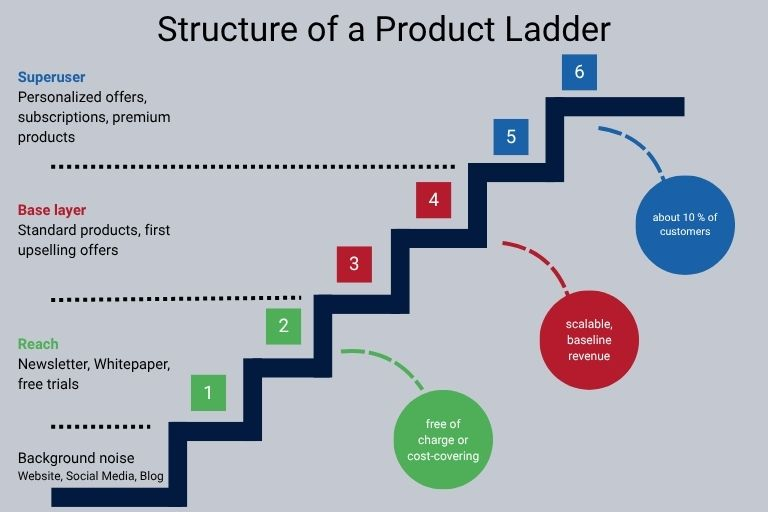

## Por qué necesita una estrategia de ventas

Sin una estrategia de ventas clara, su departamento de ventas (y en cierta medida su departamento de [marketing]()) carecerá de dirección. Las medidas quedan en nada o no contribuyen al objetivo corporativo. Sólo con una estrategia formulada, documentada y comunicada puede su departamento de ventas dirigirse a los [clientes]() y adaptarse a las condiciones cambiantes del mercado con facilidad.

Las desventajas más graves de la falta de una estrategia de ventas son:

* Su equipo no trabaja con eficacia: unos objetivos de empresa u objetivos de ventas formulados vagamente acaban aumentando el tiempo que sus empleados dedican a evaluar y coordinar las medidas individuales, en detrimento de la eficacia y la satisfacción del equipo. Una estrategia de ventas completa, por el contrario, ayuda a su equipo de ventas a coordinar tareas y medidas y a aplicarlas con eficacia.

* Se vuelve inflexible: Los mercados y las necesidades de los clientes cambian – y su equipo de ventas debe ser capaz de reaccionar a ello de forma independiente. Sin una estrategia y un enfoque claros, las condiciones cambiantes del mercado se reconocen demasiado tarde. Una estrategia de ventas le ayuda a responder **rápida y ágilmente**.

* No se puede planificar: La fiabilidad de la planificación no es una calle de sentido único. Si la dirección o la gestión de ventas proporciona directrices claras, el equipo sabe lo que se espera de él y puede planificar las medidas, los canales de venta y los canales de distribución en consecuencia. A la inversa, la dirección también puede utilizar estas medidas para crear una **previsión fiable de ventas y facturación** y desplegar los recursos en consecuencia. Sin embargo, si no existe una estrategia y unos objetivos claramente comunicados, hay una falta de seguridad en la planificación a todos los niveles.

* No acierta con su grupo objetivo: Si no conoce a su grupo objetivo, no puede orientar sus medidas de ventas. Sólo planificando estratégicamente sus ventas creará las condiciones para **dirigirse a sus clientes** – ya sean B2B o B2C – de la mejor manera posible.

* Su marketing no puede derivar ninguna medida: Su empresa sólo puede lograr resultados óptimos si las ventas y el marketing trabajan mano a mano. Sin embargo, si su departamento de marketing no conoce los objetivos de ventas porque su departamento de ventas tampoco los conoce, no podrá tenerlos en cuenta en la [estrategia de marketing]() y no podrá derivar medidas adecuadas.

## ¿Qué es una estrategia de ventas?

Su equipo de ventas se encarga de vender productos o servicios. Para que el equipo trabaje con éxito y eficacia, la estrategia constituye el marco básico indispensable para el trabajo operativo de ventas. Sirve para promover el volumen de negocio de la empresa y alcanzar los objetivos corporativos a largo plazo. Una estrategia de ventas se diseña a largo plazo y define objetivos, especifica el grupo destinatario y los **canales de venta** adecuados y define medidas de venta específicas. La estrategia de ventas y la de producto están estrechamente vinculadas y deben considerarse como una unidad. El **control de ventas** es también un punto clave que debe tenerse en cuenta en la estrategia de ventas.

### Concepto de ventas, estrategia de ventas, plan de ventas

Concepto, estrategia y plan forman una unidad y no tienen éxito el uno sin el otro.

Antes de poder crear una estrategia de ventas, necesita desarrollar un concepto de ventas. El concepto proporciona decisiones direccionales generales, resume la información relevante del mercado y define la estructura de la organización de ventas. La estrategia de ventas se basa en el concepto y va un paso más allá. Se orienta a largo plazo y especifica cómo se van a alcanzar los objetivos desde el punto de vista operativo. Por último, **el plan de ventas traduce la estrategia a largo plazo en medidas operativas a corto plazo**.

## ¿Cuál es la diferencia entre las estrategias de ventas B2B y B2C?

Antes de entrar en detalles sobre a qué debe prestar atención al crear su estrategia de ventas, diferenciemos una vez más entre una estrategia de ventas B2B y una estrategia de ventas B2C. Aunque existen muchas similitudes, ambas estrategias deben adaptarse a grupos objetivo, entornos de ventas y condiciones de mercado diferentes. Lo ideal es que la decisión sobre las ventas B2B, B2C o B2X ya esté tomada cuando cree su concepto de ventas.

### Estrategias de ventas B2C

* Los clientes particulares compran por iniciativa propia para satisfacer necesidades personales. Las ventas funcionan principalmente a través de las emociones. Datos, cifras, hechos: Los meros beneficios económicos, que son decisivos en B2B, aquí son, en el mejor de los casos, de apoyo, posiblemente incluso perturbadores.

* Los contactos personales con los clientes son bastante habituales en el segmento de precios altos y elevados, pero no son absolutamente necesarios para los productos cotidianos baratos.

* El recorrido del cliente desde el primer punto de contacto hasta la conclusión de la compra es comparativamente corto, y a menudo sólo hay un punto de contacto.

* Los canales de venta tradicionales suelen desempeñar un papel menor en el B2C.

### Estrategia de ventas B2B

* Los compradores adquieren bienes y servicios en nombre y por cuenta de la empresa y son responsables. La necesidad de información por parte del cliente es elevada; las decisiones de compra se toman de forma más deliberada y lenta que en el B2C.

* Además de la marca, las referencias y las redes de ventas desempeñan un papel importante.

* Un enfoque emocional también es importante en el sector B2B -los compradores también son personas-, pero la profesionalidad, la fiabilidad y los argumentos económicos son los factores decisivos. El beneficio para el cliente se comunica a través de las características del producto, las condiciones y el precio.

* Dependiendo del sector y del producto, es habitual y esperado un gestor personal de cuentas de ventas.

* Desde la generación de contactos hasta la venta pueden pasar semanas, meses o incluso años.

## Errores comunes al establecer una estrategia de ventas

Al crear una estrategia de ventas, es importante adaptarla realmente a su empresa. Una plantilla de estrategia de ventas puede servir de guía, al igual que las estrategias de ventas de otras empresas. Al final, el contenido debe ajustarse con precisión a su empresa y a sus objetivos. Una vez que haya interiorizado esto, debería poder evitar fácilmente estos errores comunes:

* **Un grupo objetivo poco claro:** Si su grupo objetivo no está definido o sólo lo está vagamente, es posible que sus medidas no tengan el efecto deseado.

* **Beneficio poco claro:** Sólo si el valor añadido de su oferta está claro podrá venderla. El beneficio para el cliente es especialmente importante en las estrategias de venta B2B, pero también debe exponerse claramente en el sector B2C.

* **No tiene una propuesta de venta única:** A menos que sea un monopolista, necesita convencer a los clientes potenciales de las ventajas de su producto. Sin una verdadera proposición única de venta, su producto estará en desventaja en el mercado frente a la competencia.

* **Objetivos inflexibles:** Su estrategia proporciona el marco para las operaciones diarias. Pero no debe considerarse inamovible. Preste atención a la demanda, reaccione ante ella y actúe con flexibilidad. Esto puede dar lugar a desarrollos positivos que no estaban previstos.

* **Sin tener en cuenta la estrategia de producto:** Sólo si coordina su estrategia de producto y su estrategia de ventas podrá evitar pérdidas por fricción.

* **Enfoque equivocado:** No se centre en su producto, sino en las necesidades del cliente.

## Desarrollo de estrategias de ventas: 8 consejos

Ahora ya sabe lo importante que es una estrategia para el éxito de sus ventas y los errores que se pueden cometer al desarrollar una estrategia de ventas. Pero no deje que esto le intimide. Nuestra **guía de 8 pasos** le ayudará a crear una estrategia sólida y sensata.

1. **Tómese su tiempo:** No se desarrolla una estrategia de ventas de la noche a la mañana, ni tampoco por su cuenta. Planifique generosamente el tiempo necesario e implique a su equipo y, si es necesario, a otros departamentos.

2. **Defina objetivos realistas:** Sólo los objetivos formulados crean claridad para todos los implicados. Fije objetivos mensurables que puedan verificarse con datos y cifras, por ejemplo, un 10 % más de facturación o de ventas. También puede fijar objetivos cualitativos, por ejemplo, aumentar la satisfacción de los clientes. Sin embargo, como estos objetivos son difíciles de cuantificar, debe definir entonces **criterios específicos de éxito**. Los objetivos pueden ser fijados de arriba abajo por la dirección, de abajo arriba por Ventas o híbridos. Es importante que trabaje siempre con objetivos alcanzables para mantener alta la motivación del equipo.

3. **Defina el grupo objetivo:** Los que conocen con precisión su grupo objetivo están por delante de la competencia y pueden posicionar su propio producto con éxito en el mercado. Si es posible, cree buyer personas. En cualquier caso, debería ser capaz de responder a estas preguntas: ¿Para quién es adecuado su producto? ¿Quién lo necesita y por qué? ¿Quién puede permitírselo? Dependiendo de si está creando una estrategia de ventas B2B o B2C, otras preguntas también pueden ser relevantes.

4. **Análisis del mercado:** Familiarícese con su competencia y el entorno del mercado. ¿El mercado está ya saturado o aún hay potencial de crecimiento? ¿Cuáles son sus oportunidades de desarrollo? ¿Qué productos ofrecen sus competidores? ¿Qué estrategia de canal de ventas está siguiendo? Cree un [análisis DAFO]() para evaluar a sus competidores y utilice los resultados para diferenciarse con su propuesta única de venta.

5. **Defina su propuesta única de venta:** Ya hemos hablado de esto más arriba: Si no puede justificar por qué los clientes deberían comprar su producto o servicio, probablemente no lo harán.

6. **Desarrolle una estrategia de comunicación:** Ya conoce a su grupo objetivo, el mercado y su producto. Ahora sus clientes necesitan conocer el producto. Decida cómo, con qué contenidos y a través de qué canales quiere dirigirse a su grupo objetivo. Cuando cree una estrategia de ventas B2B, debe ser consciente de que sus contenidos también llegarán a personas que no toman ellas mismas una decisión de compra, pero que pueden influir en ella o iniciarla en su empresa. Tenga en cuenta a este grupo en su comunicación y utilícelo como multiplicador.

7. **Determine los canales de venta:** Dependiendo del producto y del grupo destinatario, los diferentes canales de venta pueden ser más o menos adecuados. Básicamente, debe decidir si su producto debe comercializarse de forma directa o indirecta y si utiliza **canales de venta clásicos y/o digitales**. Si lleva a cabo un cuidadoso análisis del grupo objetivo al desarrollar una estrategia de ventas, debería resultarle fácil elegir el canal adecuado. En cambio, la elección del canal de ventas adecuado depende más de la orientación general de su empresa y de sus capacidades. Con la venta directa, usted se dirige directamente a sus clientes finales sin introducir sus productos en el mercado a través de un distribuidor, como ocurre con la venta indirecta. Una combinación de ambos métodos también es concebible y puede tener sentido en determinadas circunstancias. Sin embargo, debe ser consciente de que se requieren diferentes cualificaciones en su departamento de ventas en función del canal de venta, el cliente y el producto. Por lo tanto, es importante decidir qué canales de venta desea utilizar cuando desarrolle un concepto de ventas.

8. **Control de ventas:** Los datos significativos son también el mejor amigo de sus empleados en las ventas. Es la única forma de reconocer lo que realmente funciona bien, dónde necesita hacer ajustes y ante qué tendencias debe reaccionar. Por lo tanto, establezca intervalos de evaluación y defina métricas para medir el éxito ya desde el desarrollo de una estrategia de ventas. Conciencie a sus empleados de la importancia del mantenimiento y la [gestión de datos]().

### Para los autónomos: Crear una estrategia de ventas utilizando una escalera de productos

A los autónomos y a las empresas de nueva creación en particular les resulta difícil desarrollar una estrategia de ventas que se centre en lo esencial. Especialmente en Internet, hay muchas y constantemente nuevas oportunidades, por lo que los recursos definidos alcanzan rápidamente sus límites. Aquí es donde la **escalera de productos** puede ayudar. Este método, desarrollado por Brigitte y Ehrenfried Conta Gromberg, ofrece una sencilla cuadrícula para organizar jerárquicamente todos los productos. La escalera consta de tres categorías, cada una con dos peldaños. Los distintos productos o servicios se colocan en los peldaños, con los productos caros en la parte superior y los baratos en la inferior. Esta estructura le ayuda a clasificar las diferentes ofertas en función de su importancia para su volumen de negocio global. Esto le da una idea clara de cómo gana dinero realmente y le permite asignar mejor los recursos.

## La importancia de la digitalización en la estrategia de ventas

Las soluciones digitales modernas también son cada vez más importantes en las ventas para el control, la gestión de datos y canalizaciones, la puntuación de clientes potenciales o la identificación de oportunidades prometedoras de venta cruzada. Los procesos automatizados aumentan la productividad de los empleados y reducen la introducción manual de datos, propensa a errores. Un verdadero cambio de juego son los **sistemas en la nube sin código**, flexibles y escalables, como SeaTable, que integran el trabajo de diferentes departamentos. Sus empleados pueden colaborar en tiempo real y acceder a los datos relevantes desde cualquier lugar. Los cuadros de mando permiten elaborar informes y análisis sencillos. Con un [creador de aplicaciones] universal sin código (), sus equipos pueden crear interfaces de usuario para la recepción de pedidos, la reserva de citas o los formularios de opinión de los clientes en sólo unos minutos.

Para los equipos de ventas, esto significa que, a la hora de desarrollar una estrategia de ventas, no sólo pueden acceder a sus propios datos en cualquier momento, sino que también pueden tener en cuenta los datos de marketing o de atención al cliente. Esto le proporciona una visión holística de las necesidades de sus clientes. Como los datos se sincronizan en tiempo real, sus **informes están siempre actualizados**, lo que le permite tomar decisiones con mayor rapidez. Las largas búsquedas de la información relevante y los silos de datos son cosa del pasado.



## Cree una estrategia de ventas: siente las bases de su éxito

Con una estrategia de ventas bien pensada y documentada, podrá alcanzar sus objetivos con mayor facilidad y eficacia. Sólo si conoce su producto, su grupo objetivo y el mercado podrá derivar medidas a medida y aplicarlas con éxito. No fije su estrategia en piedra, sino que cuestione regularmente sus supuestos y medidas basándose en datos fiables. Los equipos de ventas modernos son flexibles y se adaptan con agilidad a las condiciones cambiantes, incluso a una revisión completa de la estrategia. Con un buen **sistema integrado**, siempre tendrá una visión general de todo su proceso de ventas y de todos los datos relevantes.

## FAQ Estrategia de ventas


Una estrategia de ventas proporciona el marco para el trabajo operativo en ventas. Sirve para promover las ventas de la empresa y define la dirección futura de las ventas para alcanzar los objetivos corporativos previstos. A la hora de desarrollar una estrategia de ventas, las preguntas clave son siempre las mismas, independientemente de si está desarrollando una estrategia de ventas digital o una estrategia de ventas clásica.


Los canales de venta son todos los canales a través de los cuales una empresa vende sus productos o servicios. Se distingue entre canales de venta directos e indirectos. Si una empresa comercializa específicamente a sus consumidores finales, se habla de un canal de distribución directo. Si los productos o servicios se ofrecen a través de un intermediario, se trata de canales de distribución indirectos. La elección de los canales de distribución adecuados también forma parte de la [política de distribución]().


Ejemplos importantes de estrategias de distribución son la estrategia de producto y la estrategia de precios, que se centran en características específicas del producto; la estrategia de distribución, en la que los canales de distribución son especialmente cruciales; la estrategia de comunicación, que consiste en comunicar la información adecuada en el momento adecuado. Cuando desarrolle una estrategia de ventas, normalmente combinará diferentes estrategias.


Los canales de venta clásicos son el comercio minorista fijo, el comercio mayorista, las ferias, la venta por catálogo y la televenta. Los canales de venta digitales, por su parte, tienen lugar en línea: por ejemplo, el comercio electrónico, el comercio social, las salas de exposición virtuales o los mercados digitales.

