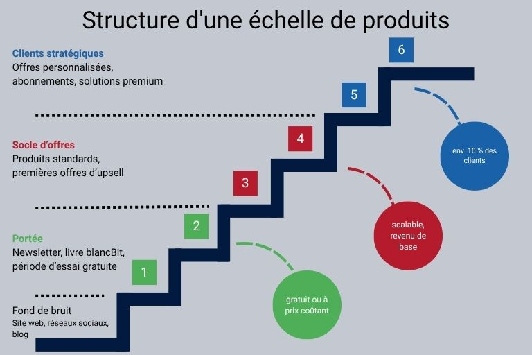

## Pourquoi vous avez besoin d'une stratégie de vente

Sans une stratégie de vente claire, votre service commercial (et dans une certaine mesure votre service [marketing]()) manquera de direction. Les mesures n'aboutissent à rien ou ne contribuent pas à l'objectif de l'entreprise. Seule une stratégie formulée, documentée et communiquée permet à votre service commercial de cibler les [clients]() et de s'adapter facilement aux conditions changeantes du marché.

Les inconvénients les plus graves de l'absence de stratégie de vente sont les suivants :

* Votre équipe ne travaille pas efficacement : des objectifs d'entreprise ou des objectifs de vente vaguement formulés finissent par augmenter le temps que vos employés consacrent à l'évaluation et à la coordination des mesures individuelles - au détriment de l'efficacité et de la satisfaction au sein de l'équipe. Une stratégie de vente complète, d'autre part, aide votre équipe de vente à coordonner les tâches et les mesures et à les mettre en œuvre de manière efficace.

* Vous devenez inflexible : les marchés et les besoins des clients évoluent - et votre équipe de vente doit être en mesure de réagir de manière indépendante. Sans une stratégie claire et un objectif précis, les conditions changeantes du marché sont reconnues trop tard. Une stratégie de vente vous aide à réagir **rapidement et avec agilité**.

* Vous ne pouvez pas planifier : La fiabilité de la planification n'est pas une voie à sens unique. Si la direction ou la direction des ventes fournit des directives claires, l'équipe sait ce que l'on attend d'elle et peut planifier les mesures, les canaux de vente et de distribution en conséquence. Parallèlement, la direction peut également utiliser ces mesures pour créer une **prévision des ventes et de la rotation** fiable et déployer les ressources en conséquence. Cependant, s'il n'y a pas de stratégie et d'objectifs clairement communiqués, il y a un manque de certitude dans la planification à tous les niveaux.

* Vous ne connaissez pas votre groupe cible : si vous ne connaissez pas votre groupe cible, vous ne pouvez pas cibler vos mesures de vente. Ce n'est qu'en planifiant stratégiquement vos ventes que vous créez les conditions pour **adresser vos clients** - qu'il s'agisse de B2B ou de B2C - de la meilleure façon possible.

* Votre marketing ne peut pas dériver de mesures : Votre entreprise ne peut obtenir des résultats optimaux que si les ventes et le marketing travaillent main dans la main. Cependant, si votre service marketing ne connaît pas les objectifs de vente parce que votre service commercial ne les connaît pas lui-même, il ne peut pas les prendre en compte dans la [stratégie marketing]() et ne peut pas dériver des mesures appropriées.

## Qu'est-ce qu'une stratégie de vente ?

Votre équipe de vente est responsable de la vente de produits ou de services. Afin que l'équipe puisse travailler avec succès et efficacité, la stratégie constitue le cadre de base indispensable au travail de vente opérationnel. Elle sert à promouvoir le turnover de l'entreprise et à atteindre les objectifs à long terme de l'entreprise. Une stratégie de vente est conçue pour le long terme et définit des objectifs, spécifie le groupe cible et les **canaux de vente appropriés** et définit des mesures de vente spécifiques. La stratégie de vente et la stratégie produit sont étroitement liées et doivent être considérées comme une seule unité. **Le contrôle des ventes** est également un point clé qui doit être pris en compte dans la stratégie de vente.

### Concept de vente, stratégie de vente, plan de vente

Le concept, la stratégie et le plan forment un tout et restent inefficaces l'un sans l'autre.

Avant de pouvoir créer une stratégie de vente, vous devez développer un concept de vente. Le concept fournit des décisions directionnelles générales, résume les informations pertinentes sur le marché et définit la structure de l'organisation de vente. La stratégie de vente s'appuie sur le concept et va un peu plus loin. Elle est axée sur le long terme et précise comment les objectifs doivent être atteints de manière opérationnelle. Enfin, **le plan de vente traduit la stratégie à long terme en mesures opérationnelles à court terme**.

## Quelle est la différence entre les stratégies de vente B2B et B2C ?

Avant d'entrer dans le détail de ce à quoi vous devez faire attention lors de la création de votre stratégie de vente, faisons une fois de plus la différence entre une stratégie de vente B2B et une stratégie de vente B2C. Bien qu'il y ait de nombreuses similitudes, les deux domaines de stratégie doivent être adaptés à des groupes cibles, des environnements de vente et des conditions de marché différents. Idéalement, une décision pour les ventes B2B, B2C ou B2X devrait déjà être prise lorsque vous créez votre concept de vente.

### Stratégies de vente B2C

* Les particuliers achètent de leur propre initiative pour répondre à leurs besoins personnels. Les ventes se font principalement par le biais des émotions. Des données, des chiffres, des faits : Les avantages économiques bruts, qui sont décisifs dans le B2B, sont ici au mieux soutenus, éventuellement même disruptifs.

* Les contacts personnels avec les clients sont assez courants dans le segment haut de gamme et haut de gamme, mais ils ne sont pas absolument nécessaires pour les produits quotidiens peu coûteux.

* Le parcours du client depuis le premier point de contact jusqu'à la conclusion de l'achat est relativement court, et il n'y a souvent qu'un seul point de contact.

* Les canaux de vente traditionnels ne jouent généralement qu'un rôle mineur dans le B2C.

### Stratégie de vente B2B

* Les acheteurs achètent des biens et des services au nom et pour le compte de l'entreprise et sont responsables. Le besoin d'informations du côté du client est élevé ; les décisions d'achat sont prises de manière plus réfléchie et plus lente qu'en B2C.

* En plus de l'image de marque, les références et les réseaux de vente jouent un rôle important.

* Une approche émotionnelle est également importante dans le secteur B2B - les acheteurs sont aussi des personnes - mais le professionnalisme, la fiabilité et les arguments économiques sont les facteurs décisifs. Les avantages pour le client sont communiqués via les caractéristiques du produit, les conditions et le prix.

* Selon le secteur et le produit, un responsable de compte personnel est courant et attendu.

* Il peut s'écouler des semaines, des mois, voire des années, entre la génération de pistes et la vente.

## Erreurs communes lors de la mise en place d'une stratégie de vente

Lors de la création d'une stratégie de vente, il est important de vraiment la personnaliser pour votre entreprise. Un modèle de stratégie de vente peut servir de guide, tout comme les stratégies de vente d'autres entreprises. En fin de compte, le contenu doit correspondre exactement à votre entreprise et à vos objectifs. Une fois que vous avez internalisé cela, vous devriez être en mesure d'éviter facilement ces erreurs courantes :

* **Groupe cible non défini:** Si votre groupe cible n'est pas défini ou s'il est défini de manière vague, vos mesures risquent de ne pas avoir l'effet escompté.

* **Avantage incertain :** Vous ne pouvez vendre que si la valeur ajoutée de votre offre est claire. Le bénéfice client est particulièrement important dans les stratégies de vente B2B, mais il doit également être clairement expliqué dans le secteur B2C.

* **Pas de proposition de vente unique :** A moins que vous ne soyez en situation de monopole, vous devez convaincre les clients potentiels des avantages de votre produit. Sans une réelle USP, votre produit est en désavantage sur le marché par rapport à la concurrence.

* **Objectifs inflexibles:** Votre stratégie fournit le cadre des opérations quotidiennes. Mais elle ne doit pas être considérée comme figée dans la pierre. Soyez attentif et réactif à la demande et agissez de manière flexible. Cela peut aboutir à des développements positifs qui n'étaient pas prévus.

* **Non prise en compte de la stratégie produit:** Ce n'est que si vous coordonnez votre stratégie produit et votre stratégie de vente que vous pourrez éviter les pertes de friction.

* **Mauvaise focalisation :** Ne vous concentrez pas sur votre produit, mais sur les besoins du client.

## Développer des stratégies de vente : 8 conseils

Vous savez maintenant à quel point une stratégie est essentielle à la réussite de vos ventes et quelles erreurs peuvent être commises lors du développement d'une stratégie de vente. Mais ne laissez pas cela vous intimider. Notre **guide en 8 étapes** vous aidera à créer une stratégie solide et sensible.

1. **Prenez votre temps :** Vous ne développez pas une stratégie de vente du jour au lendemain - et pas de votre propre chef. Planifiez généreusement le temps nécessaire et faites participer votre équipe et, si nécessaire, d'autres services.

2. **Définissez des objectifs réalistes:** Seuls des objectifs formulés créent de la clarté pour tous ceux qui sont impliqués. Fixez des objectifs mesurables qui peuvent être vérifiés par des données et des chiffres, par exemple 10 % de chiffre d'affaires ou de ventes en plus. Vous pouvez également définir des objectifs qualitatifs, par exemple pour augmenter [la satisfaction des clients](). Cependant, comme ces objectifs sont difficiles à quantifier, vous devez ensuite définir des **critères de réussite spécifiques**. Les objectifs peuvent être fixés du haut vers le bas par la direction, du bas vers le haut par les ventes ou de manière hybride. Il est important de toujours travailler avec des objectifs réalisables afin de maintenir un haut niveau de motivation au sein de l'équipe.

3. **Définir le groupe cible:** Ceux qui connaissent précisément leur groupe cible sont en avance sur la concurrence et peuvent positionner leur propre produit avec succès sur le marché. Si possible, créez des personas d'acheteurs. Dans tous les cas, vous devez être en mesure de répondre à ces questions : Pour qui votre produit est-il adapté ? Qui en a besoin et pourquoi ? Qui peut l'acheter ? Selon que vous créez une stratégie de vente B2B ou B2C, d'autres questions peuvent également être pertinentes.

4. **Analyse du marché:** Familiarisez-vous avec vos concurrents et l'environnement du marché. Le marché est-il déjà saturé ou y a-t-il encore un potentiel de croissance ? Quelles sont vos opportunités de développement ? Quels sont les produits proposés par vos concurrents ? Quelle stratégie de canal de vente poursuivez-vous ? Créez une [analyse SWOT]() pour évaluer vos concurrents et utilisez les résultats pour vous différencier avec votre proposition de vente unique.

5. **Définissez votre proposition de vente unique:** Nous avons déjà abordé ce point ci-dessus : Si vous ne pouvez pas justifier pourquoi les clients devraient acheter votre produit ou service, ils ne le feront probablement pas.

6. **Développez une stratégie de communication:** Vous connaissez votre groupe cible, le marché et votre produit. Maintenant, tous vos clients ont besoin de savoir à propos du produit. Décidez comment, avec quel contenu et via quels canaux vous voulez vous adresser à votre groupe cible. Lorsque vous créez une stratégie de vente B2B, vous devez être conscient que votre contenu touchera également des personnes qui ne prennent pas de décision d'achat elles-mêmes - mais qui peuvent influencer ou initier cette décision dans leur entreprise. Prenez en compte ce groupe dans votre communication et utilisez-le comme multiplicateur.

7. **Déterminer les canaux de vente:** En fonction du produit et du groupe cible, différents canaux de vente peuvent être plus ou moins appropriés. En règle générale, vous devez déterminer si votre produit doit être commercialisé directement ou indirectement et si vous devez utiliser des canaux de vente **classiques et/ou numériques**. Si vous effectuez une analyse minutieuse du groupe cible lors de l'élaboration d'une stratégie de vente, il devrait être facile pour vous de choisir le bon canal. Le choix du bon canal de vente, d'autre part, dépend davantage de l'orientation générale de votre entreprise et de vos capacités. Avec la vente directe, vous vous adressez directement à vos clients finaux sans mettre vos produits sur le marché via un distributeur, comme c'est le cas avec la vente indirecte. Une combinaison des deux méthodes est également envisageable et peut avoir du sens dans certaines circonstances. Cependant, vous devez être conscient que les qualifications requises dans votre département de vente sont différentes selon le canal de vente, le client et le produit. Il est donc important de déterminer les canaux de vente que vous souhaitez utiliser lorsque vous développez un concept de vente.

8. **Contrôle des ventes:** Des données pertinentes sont également les meilleures amies de vos employés dans la vente. C'est le seul moyen de savoir ce qui fonctionne vraiment bien, où vous devez faire des ajustements et quelles sont les tendances auxquelles vous devez réagir. Par conséquent, fixez des intervalles d'évaluation et définissez des indicateurs pour mesurer le succès dès le développement d'une stratégie de vente. Faites prendre conscience à vos employés de l'importance de la maintenance des données et de la [gestion des données]().

### Pour les indépendants : créer une stratégie de vente en utilisant une échelle de produits

Les travailleurs indépendants et les start-ups en particulier trouvent difficile de développer une stratégie de vente qui se concentre sur l'essentiel. Surtout en ligne, les opportunités sont nombreuses et sans cesse renouvelées, de sorte que les ressources définies atteignent rapidement leurs limites. C'est là que la **échelle des produits** peut aider. Cette méthode, développée par Brigitte et Ehrenfried Conta Gromberg, offre une grille simple pour organiser tous les produits de manière hiérarchique. L'échelle se compose de trois catégories, chacune avec deux étapes. Différents produits ou services sont placés sur les niveaux, avec les produits chers en haut et les produits bon marché en bas. Cette structure vous aide à classer les différentes offres en fonction de leur importance pour votre chiffre d'affaires total. Cela vous donne une image claire de la façon dont vous gagnez réellement de l'argent et vous permet de mieux allouer vos ressources.

## L'importance de la numérisation dans la stratégie de vente

Les solutions numériques modernes sont également de plus en plus importantes dans la vente pour le contrôle, la gestion des données et des pipelines, le scoring des pistes ou l'identification d'opportunités de vente croisée prometteuses. Les processus automatisés augmentent la productivité des employés et réduisent la saisie manuelle de données, source d'erreurs. Les systèmes cloud sans code **flexibles et évolutifs tels que SeaTable, qui intègrent le travail de différents services, changent réellement la donne. Vos employés peuvent collaborer en temps réel et accéder aux données pertinentes où qu'ils soient. Les tableaux de bord facilitent le reporting et l'analyse. Grâce à un [constructeur d'applications universel]() sans code , vos équipes peuvent créer des interfaces utilisateur pour les commandes entrantes, les réservations de rendez-vous ou les formulaires de commentaires des clients en quelques minutes seulement.

Pour les équipes de vente, cela signifie que lorsque vous élaborez une stratégie de vente, vous pouvez non seulement accéder à vos propres données à tout moment, mais aussi prendre en compte les données marketing ou de service client. Cela vous donne une vue d'ensemble des besoins de vos clients. Comme les données sont synchronisées en temps réel, vos **rapports sont toujours à jour**, ce qui vous permet de prendre des décisions plus rapidement. Les recherches chronophages d'informations pertinentes et les silos de données appartiennent au passé.



## Créez une stratégie de vente - posez les fondations de votre succès

Avec une stratégie de vente bien pensée et documentée, vous pouvez atteindre vos objectifs plus facilement et plus efficacement. Ce n'est que si vous connaissez votre produit, votre groupe cible et le marché que vous pouvez élaborer des mesures personnalisées et les mettre en œuvre avec succès. Ne fixez pas votre stratégie dans la pierre, mais remettez régulièrement en question vos hypothèses et vos mesures sur la base de données fiables. Les équipes de vente modernes sont flexibles et s'adaptent avec agilité aux conditions changeantes - jusqu'à et y compris une révision complète de la stratégie. Avec un bon **système intégré**, vous avez toujours une vue d'ensemble de l'ensemble de votre processus de vente et de toutes les données pertinentes.

## FAQ Stratégie de vente


Une stratégie de vente fournit un cadre pour le travail opérationnel dans la vente. Elle sert à promouvoir les ventes de l'entreprise et définit la direction future des ventes afin d'atteindre les objectifs d'entreprise prévus. Lorsque vous développez une stratégie de vente, les questions clés sont toujours les mêmes, que vous développiez une stratégie de vente numérique ou une stratégie de vente classique.


Les canaux de vente sont tous les canaux par lesquels une entreprise vend ses produits ou services. Une distinction est faite entre les canaux de vente directe et indirecte. Si une entreprise commercialise spécifiquement à ses consommateurs finaux, il s'agit d'un canal de distribution direct. Si les produits ou services sont offerts via un intermédiaire, il s'agit de canaux de distribution indirects. Le choix des canaux de distribution appropriés fait également partie de la [politique de distribution]().


Des exemples importants de stratégies de distribution sont la stratégie de produit et la stratégie de prix, qui se concentrent sur des caractéristiques spécifiques du produit ; la stratégie de distribution, où les canaux de distribution sont particulièrement importants ; la stratégie de communication, qui consiste à communiquer la bonne information au bon moment. Lorsque vous développez une stratégie de vente, vous combinez généralement différentes stratégies.


Les canaux de vente classiques comprennent la vente au détail fixe, la vente en gros, les foires commerciales, les ventes par catalogue et les téléventes. Les canaux de vente numériques, d'autre part, se déroulent en ligne : par exemple, le commerce électronique, le commerce social, les salles d'exposition virtuelles ou les places de marché numériques.

