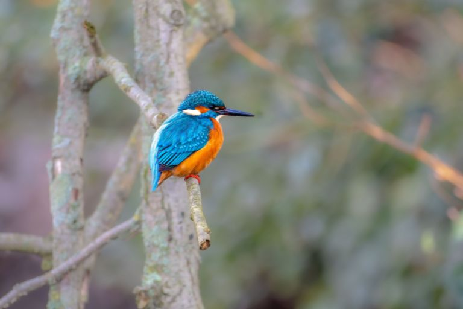
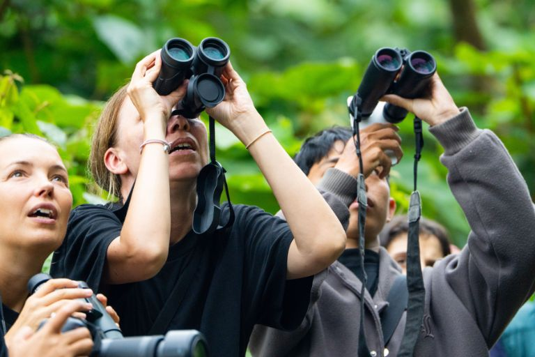
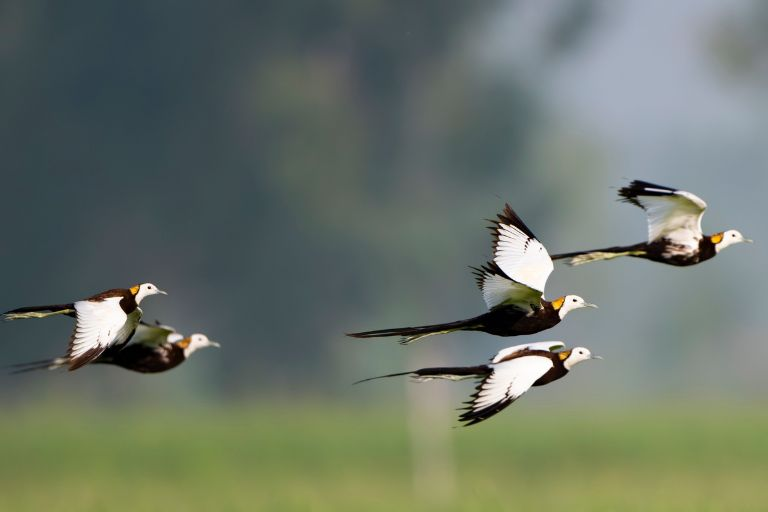
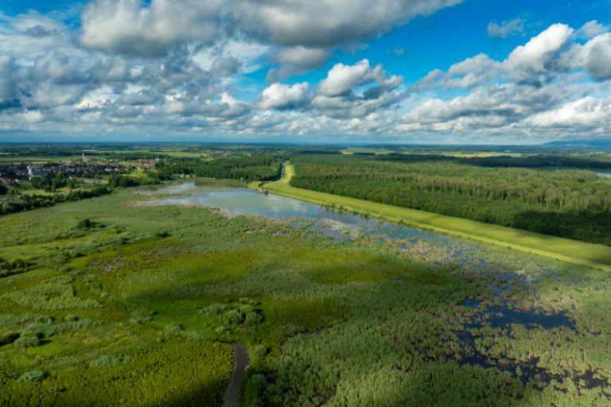
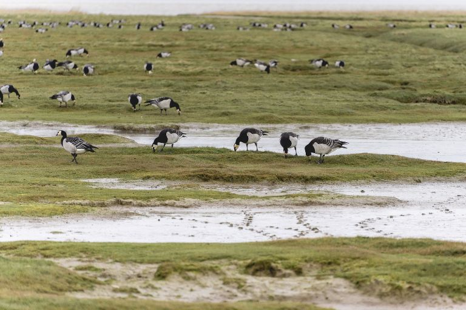
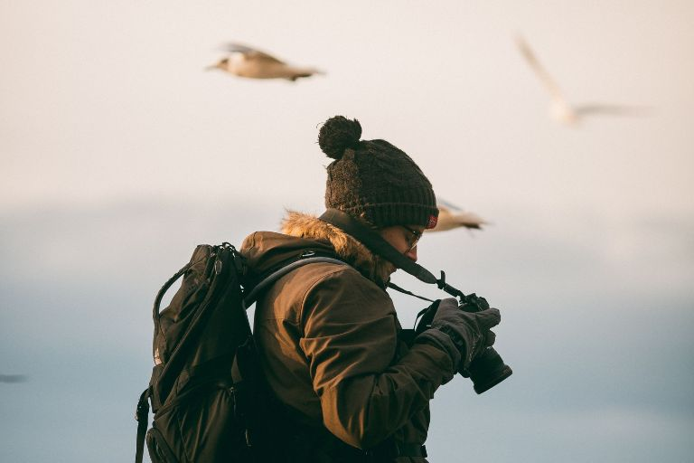

Um par de binóculos, uma manhã tranquila na floresta e o canto de um pássaro desconhecido. O que antes era considerado um passatempo antiquado dos reformados está agora a viver um renascimento surpreendente. A observação de aves está em alta, e não apenas entre o público mais velho. Cada vez mais jovens estão a descobrir **a observação de espécies de aves nativas e exóticas como uma pausa consciente da rotina digital**. 

Neste artigo, irá descobrir por que razão a observação de aves é tão popular neste momento, como dar os primeiros passos, se vale a pena participar em excursões de observação de aves e por que razão a documentação digital das suas observações compensa.

## Por que é que a observação de aves é hoje tão popular

A observação de aves já não é, há muito, algo reservado apenas a pessoas com décadas de experiência e equipamento dispendioso. Nos últimos anos, a tendência tem-se tornado significativamente mais jovem. Isto deve-se às seguintes razões:

1.	**As redes sociais como porta de entrada:** Paradoxalmente, um dos principais motores desta tendência é precisamente o meio do qual muitas pessoas procuram fugir para se dedicarem a este passatempo: as redes sociais. Sob a hashtag #BirdTok, os utilizadores partilham vídeos curtos de avistamentos raros, rituais de acasalamento impressionantes ou simplesmente da casinha de pássaros no seu próprio jardim. A comunidade de observação de aves está a crescer rapidamente nestas plataformas, o que confere à observação de aves moderna uma imagem significativamente mais jovem e urbana do que há dez anos.

2.  **Experiência na natureza em vez de ecrãs:** Ao mesmo tempo, muitas pessoas anseiam por um contraponto consciente ao tempo constante passado em frente aos ecrãs. A observação de aves exige atenção ao ambiente real, aos sons, aos movimentos e aos detalhes que, de outra forma, se perdem no ritmo frenético do dia a dia. Se já tentou localizar um carriça num matagal denso, sabe o quanto este passatempo aguça a visão e desobstrui a mente.

3.  **Alívio do stress, atenção plena e exercício físico:** A observação de aves combina exercício físico leve ao ar livre com uma forma de atenção plena que, de outra forma, muitas vezes teria de aprender com esforço. Quando se concentra na procura de aves, pensa automaticamente menos nas listas de tarefas ou nas mensagens por ler. Esta combinação de aprendizagem e relaxamento constitui uma grande parte do fascínio desta atividade.

4.  **Introdução à ornitologia:** Para muitos, a paixão pela observação de aves começa como um passatempo descontraído e, com o tempo, transforma-se num interesse mais sério pela ornitologia. Começam a distinguir espécies pelo canto, a acompanhar padrões migratórios ou a aprofundar-se nos habitats. A transição da observação ocasional para a observação sistemática de aves é, na maioria das vezes, gradual.



Ao praticar a observação de aves, aguça a sua atenção aos detalhes e, assim, treina a sua perceção. Sempre que descobre ou identifica uma nova espécie de ave, vive um pequeno momento de sucesso que lhe traz alegria e motivação. Ao mesmo tempo, passa tempo na natureza e percebe as suas mudanças ao longo das estações de forma muito mais consciente.

 

## Como dar os primeiros passos na observação de aves

Começar a observar aves é mais fácil do que muitos pensam. Não precisa de um orçamento elevado nem de conhecimentos prévios para dar os primeiros passos nesta atividade.

### O equipamento certo para a observação de aves

Um bom **par de binóculos para a observação de aves é a aquisição mais importante**. Para começar, basta um modelo com ampliação de oito a dez vezes e o mais leve possível, para que mesmo as sessões de observação mais longas não se tornem um fardo. Uma **telescópio só vale a pena se pretender cobrir regularmente distâncias maiores**, por exemplo, ao observar aves aquáticas em margens abertas ou aves de rapina a grande distância. No início, porém, um telescópio é geralmente demasiado grande e desnecessariamente caro. 

Para além dos binóculos para observação de aves, **o vestuário resistente às intempéries faz parte do equipamento básico**. Como muitas vezes fica parado ou sentado durante longos períodos, o corpo arrefece mais rapidamente do que quando está em movimento, razão pela qual se recomenda um look em camadas. Um **bloco de notas ou, em alternativa, o smartphone** completa o equipamento e ajuda a registar os avistamentos diretamente no local.

### Como identificar espécies mais facilmente

No início, vale a pena aprender a identificar as aves nativas antes de se aventurar com espécies mais raras ou exóticas. O melro, o chapim-preto ou o pisco-de-peito-vermelho constituem uma boa introdução à observação de aves, pois são comuns e relativamente fáceis de distinguir. 

Se prefere recorrer a um livro de identificação clássico ou a uma aplicação, é, em última análise, uma questão de gosto. Os livros de identificação oferecem frequentemente **ilustrações mais detalhadas e funcionam independentemente da cobertura do telemóvel**, enquanto as aplicações, na maioria das vezes, **também podem reproduzir cantos de aves e facilitam a pesquisa através de funções de filtragem**. Muitos observadores de aves experientes utilizam agora ambos em paralelo.

Para identificar uma espécie com segurança, há cinco características essenciais que ajudam:

- **Tamanho** em comparação com aves de referência conhecidas, como o pardal ou a pomba
- **Plumagem** e padrões de cor marcantes
- **Chamada** ou canto
- **Comportamento**, como o tipo de locomoção ou a procura de alimento
- **Habitat** onde a observação tem lugar
  
### Os melhores locais para observar e fotografar aves

Florestas, lagos, parques, costas e reservas naturais oferecem, cada um, uma diversidade de espécies diferente, uma vez que as diferentes espécies de aves estão adaptadas a habitats distintos. As **áreas de observação durante a época de migração, na primavera e no outono**, são particularmente promissoras, quando as aves migratórias fazem uma paragem no seu caminho para os locais de invernada ou de verão. Quem se encontrar num local de paragem conhecido durante este período pode descobrir, em poucas horas, muito mais espécies do que num fim de semana normal.

## Excursões de observação de aves: os destinos mais bonitos para a observação de aves

Quem quiser ir além da sua própria região encontrará nas excursões de observação de aves uma boa oportunidade para conhecer novos habitats e espécies. Enquanto a observação de aves no próprio ambiente se limita, na maioria das vezes, a espécies conhecidas, as viagens a locais selecionados proporcionam uma perspetiva totalmente diferente sobre a diversidade do mundo das aves. Quem, por exemplo, nunca viu uma águia-marinha em voo ou uma colónia inteira de aves marinhas a nidificar, compreenderá rapidamente, numa excursão bem planeada, porque é que muitos observadores de aves viajam regularmente. 

Estas excursões oferecem ainda a oportunidade de aprender com guias experientes e de aprofundar técnicas de observação de aves que são difíceis de adquirir sozinho. Por isso, especialmente para quem deseja tornar a sua paixão pela observação de aves uma parte integrante do seu ano, vale a pena olhar para além da própria região.

### O que caracteriza uma boa excursão de observação de aves

Os grupos pequenos são particularmente importantes nas excursões guiadas de observação de aves, uma vez que os grupos grandes perturbam desnecessariamente os animais e dificultam a observação. Um **guia experiente, com um conhecimento profundo das espécies, faz muitas vezes a diferença decisiva**, pois consegue identificar os chamamentos e reconhecer espécies raras com base em indícios mínimos que escapam facilmente aos leigos. Além disso, os operadores de excursões de observação de aves estão cada vez mais atentos à sustentabilidade, por exemplo, através de grupos de tamanho limitado, percursos fixos e da colaboração com organizações locais de proteção da natureza. Esta forma de ecoturismo beneficia tanto os animais como as populações locais.

### Destinos populares

Dependendo do tempo disponível e da biodiversidade pretendida, há destinos muito diferentes que podem ser considerados para um passeio de observação de aves, desde viagens longas até passeios à porta de casa.



A Islândia é famosa pelas suas impressionantes colónias de aves marinhas, que se instalam aos milhares nas falésias íngremes da costa. Quem visitar a ilha poderá observar, em particular, as seguintes aves:

- Papagaios-do-mar, sobretudo nos meses de verão, ao longo da costa 
- Alcatrazes em grandes colónias de nidificação 
- Petreles-das-neves, que muitas vezes sobrevoam em círculos nas imediações das falésias íngremes.





Nos parques nacionais ricos em biodiversidade de ambos os países, concentra-se, num espaço muito reduzido, uma extraordinária variedade de espécies de aves, o que torna esta região um dos destinos mais fascinantes do mundo para a observação de aves. Entre os destaques contam-se, entre outros:

- O quetzal, uma das espécies mais coloridas e mais procuradas nas florestas nubladas 
- Tucanos, com o seu bico grande e característico
- Beija-flores, com uma diversidade de espécies extraordinariamente elevada
- Araras, frequentemente com cores vivas e bem visíveis nas copas das árvores





O Delta do Danúbio é uma das zonas húmidas com maior biodiversidade da Europa e, com as suas extensas áreas de juncos e cursos de água, oferece condições ideais para inúmeras espécies raras. Merecem especial destaque, por exemplo:

- Os pelicanos-de-cabeça-enrugada, cujas colónias estão entre as maiores da Europa 
- As águias-marinhas, que muitas vezes sobrevoam em círculos sobre os juncos e as extensões de água 
- As garças-púrpura, escondidas entre a vegetação densa





O Algarve cativa pela diversidade da sua paisagem costeira e das zonas húmidas, que abrigam uma densidade de espécies notavelmente elevada. Os amantes da natureza podem aqui observar, sobretudo, as seguintes aves:

- o abelharuco, com a sua plumagem vistosa e colorida 
- a colhereira, facilmente reconhecível pelo seu bico em forma de colher 
- as cegonhas-brancas, que na região também nidificam frequentemente fora dos ninhos tradicionais





O Mar de Wadden é um dos locais de paragem mais importantes para as aves migratórias em toda a Europa e, durante os períodos de migração, é palco de impressionantes bandos de aves. Aqui é possível observar, em particular:

- Gansos-de-pescoço-preto, que fazem uma paragem em grandes bandos durante a migração 
- Ostraceiros, com o seu característico bico laranja 
- Pilritos-dos-Alpes, frequentemente observados em bandos densos que voam de forma coordenada



## As regras de conduta mais importantes na observação de aves

Por mais fascinante que seja este passatempo, ele também implica responsabilidades. Quem observa aves deve sempre **manter a distância dos animais** e, em caso algum, tentar aproximar-se desnecessariamente. Especialmente **durante a época de nidificação, a consideração é fundamental**, pois perturbações podem levar os pais a abandonarem os seus ninhos. Em princípio, os ninhos não devem ser procurados ativamente, por maior que seja a curiosidade. **Um comportamento calmo e pausado, sem movimentos bruscos**, garante ainda que os animais não se sintam perturbados e permaneçam observáveis por mais tempo.

## Por que deve documentar as suas observações de aves

Muitos observadores de aves experientes defendem veementemente a documentação consistente dos seus avistamentos — e por boas razões. Uma lista pessoal de espécies torna visível **quão diversificadas já são as suas próprias observações** e, ao mesmo tempo, funciona como motivação para futuras excursões. Com o tempo, é também possível acompanhar a evolução dos seus conhecimentos sobre as espécies, por exemplo, quando espécies que antes eram difíceis de identificar passam a ser reconhecidas à primeira vista. 
Além disso, as comparações anuais revelam **padrões sazonais, como, por exemplo, quando certas aves migratórias costumam chegar à sua região**. Por último, mas não menos importante, **as observações documentadas servem como recordação de viagens** e proporcionam uma retrospetiva pessoal de experiências especiais. Quem documenta os seus progressos torna visíveis os sucessos pessoais e mantém-se motivado a longo prazo.



- Aproveite a luz suave do início da manhã ou do final da tarde 
- A paciência é mais importante do que equipamento caro 
- O modo de disparo contínuo aumenta as hipóteses de obter uma fotografia nítida em movimento 
- Fotografe o comportamento da ave, não apenas a perfeição técnica da imagem

 

## Documentação digital com o SeaTable

Quem gosta de observar e fotografar aves regularmente tem muito a ganhar ao reunir os avistamentos e as fotografias num único local, em vez de os dispersar por várias pastas e aplicações. É precisamente aqui que entra a [plataforma sem código baseada em IA]() SeaTable. Com o SeaTable, é possível **criar a sua própria base de dados de observações, na qual cada avistamento é registado com a data, o local, a espécie e outros detalhes**. As fotografias podem ser associadas diretamente ao respetivo avistamento e guardadas, para que a imagem e a informação não existam separadamente. 



Através de uma [visualização do mapa]() é possível visualizar todos os locais de observação, o que é particularmente prático para identificar padrões na sua própria região de observação. Filtros práticos por espécie de ave facilitam a análise, caso pretenda, por exemplo, verificar quantas vezes já avistou uma determinada espécie. Através do [formulário web]() pode registar facilmente novos avistamentos, mesmo quando estiver em viagem. Além disso, uma base de dados bem mantida ajuda na preparação para a próxima excursão de observação de aves, uma vez que permite consultar a qualquer momento observações anteriores e «listas de desejos» pendentes.

## Conclusão

A observação de aves combina a experiência na natureza, o relaxamento e a aprendizagem de uma forma que se tornou rara no quotidiano digital. Começar é fácil e económico, pois um bom par de binóculos e um pouco de paciência já são suficientes para os primeiros resultados. Quem quiser aprofundar-se nesta atividade encontrará nas excursões de observação de aves uma oportunidade de viver experiências naturais únicas em novos locais. E quem documentar digitalmente as suas observações garante que as memórias, as listas de espécies e as fotografias sejam preservadas de forma duradoura, em vez de se perderem em cadernos ou em aplicações dispersas.

## Perguntas frequentes



O «birding» é frequentemente associado a uma abordagem mais ativa e orientada para a comunidade, em que a deteção específica do maior número possível de espécies e a partilha em comunidades como o #BirdTok assumem um papel central. A forma clássica de observar aves, por outro lado, é frequentemente mais tranquila e não tem necessariamente de se centrar na descoberta de novas espécies.





Um par de binóculos com ampliação de oito a dez vezes, roupa resistente às intempéries e um bloco de notas ou smartphone para documentação são mais do que suficientes para começar. Uma luneta só se torna relevante em observações mais avançadas.





Sim, as excursões guiadas com guias experientes facilitam consideravelmente o início, especialmente para principiantes, uma vez que os chamamentos e as espécies podem ser identificados corretamente mais rapidamente. Quem preferir sair sozinho pode, naturalmente, começar por conta própria com um livro de identificação ou uma aplicação.





Ao documentar as aves que avista, torna visível a sua própria evolução, permite fazer comparações anuais e guarda memórias de observações e viagens especiais. Com uma solução digital como o SeaTable, estas informações podem ainda ser geridas de forma estruturada e duradoura.


