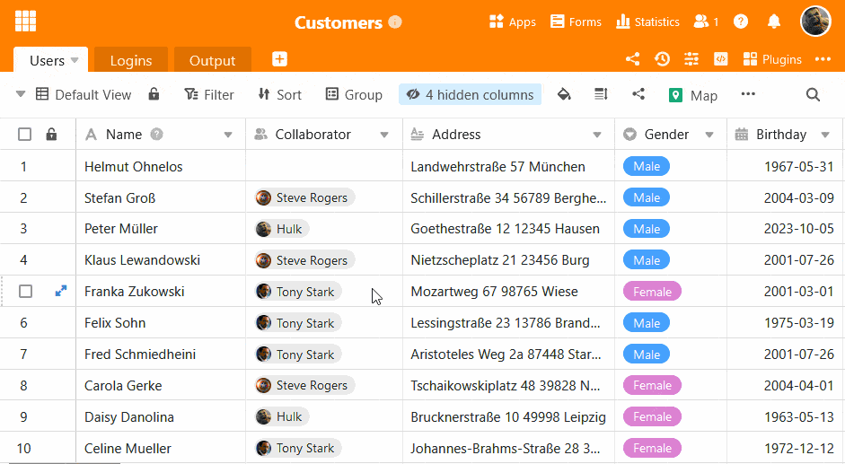

La mayoría de la gente tiene que tratar a diario con datos que deben gestionarse eficazmente. El dueño de un supermercado tiene que controlar las existencias, un director editorial tiene que vigilar todas las publicaciones y un peluquero tiene que gestionar las citas de sus clientes. Los datos desempeñan un papel en casi todas las profesiones. La mejor forma de gestionar grandes cantidades de información es mediante **bases de datos**. Pero, ¿qué es una base de datos, cuáles son sus ventajas y por qué una simple tabla no es suficiente en la mayoría de los casos?

## Bases de datos

### ¿Qué es una base de datos?

Básicamente, una base de datos no es más que una colección lógica de datos. **Lógica** porque, en general, una base de datos intenta poner orden en la multitud de estos datos. Cuando hablamos de datos, nos referimos a todo tipo de **información**. Ya sean direcciones de correo electrónico, imágenes, textos, números o cualquier otro tipo de dato imaginable.

### Tipos de bases de datos

Hay muchas formas de estructurar las bases de datos. A continuación explicamos brevemente los 5 tipos:

1. **Base de datos jerárquica:** La base de datos jerárquica utiliza un orden de clasificación para estructurar los datos.
2. **Base de datos en red:** La base de datos en red es similar a la base de datos jerárquica, pero permite que el registro de datos subordinado establezca una conexión con varios registros de datos supraordenados, de modo que las relaciones son posibles en ambas direcciones.
3. **Base de datos orientada a objetos:** la información se almacena aquí en forma de objetos.
4. **Base de datos relacional:** está orientada a tablas, por lo que cada registro de datos está vinculado a todos los demás.
5. **Base de datos no relacional** (o base de datos NoSQL): Una base de datos No-SQL utiliza diversos formatos, como documentos, diagramas, etc., que ofrecen una gran flexibilidad al diseño de una base de datos.

Los enlaces son la gran ventaja de las bases de datos relacionales.

## Ventajas de las bases de datos

Ahora que ya sabe qué son las bases de datos, probablemente aún se pregunte: ¿Por qué debería utilizar una base de datos? ¿Qué hace que una base de datos sea mucho mejor que una lista de información?

- Las bases de datos pueden gestionar fácilmente múltiples usuarios.
- Las bases de datos son muy fiables porque almacenan la información con precisión.
- Las bases de datos evitan la información redundante.
- Las bases de datos procesan la información de forma potente e inteligente.
- Las bases de datos son escalables.
- Las bases de datos pueden procesar enormes cantidades de información.

Aunque (todavía) no necesite procesar grandes cantidades de información, las ventajas de las bases de datos son notables incluso con cantidades más pequeñas de datos. La capacidad de procesar cantidades casi ilimitadas de datos significa que una base de datos bien diseñada y pensada puede servirle durante muchos años, ya que prácticamente crece con usted.

## Donde las tablas alcanzan sus límites en contraste con las bases de datos

### 1\. falta de capacidad de almacenamiento

Imagine que ha fundado una empresa. Además de su tienda física, ha decidido vender sus productos en Internet. Al principio, recibe de 2 a 4 pedidos al día. Por tanto, es bastante fácil registrar la información de los pedidos en una **hoja de cálculo**. Empieza a anunciarse en Internet y, de repente, su negocio se dispara. El volumen de pedidos aumenta y decide añadir más productos a su gama.

La enorme cantidad de información que tienes que procesar cada día puede saturar una hoja de cálculo como Excel. La hoja de cálculo se vuelve lenta o se bloquea porque su **capacidad de almacenamiento** es demasiado pequeña. En cambio, una de las ventajas de las bases de datos, como ya se ha dicho, es que tienen una capacidad de almacenamiento mucho mayor y pueden crecer fácilmente con la empresa. Por tanto, son mucho más **escalables** que las simples tablas.

### 2\. tratar con varios usuarios al mismo tiempo

A medida que aumenta el volumen de pedidos, también lo hace el número de empleados que necesita. En los primeros meses, contratas directamente a 5 nuevos empleados. A diferencia de la mayoría de las hojas de cálculo, las bases de datos están diseñadas para que varios usuarios puedan **trabajar juntos al mismo** tiempo. Es posible realizar consultas, búsquedas y ediciones simultáneas de la base de datos sin problemas y sin que los cambios realizados por distintas personas choquen entre sí. Esto lo garantizan los mecanismos integrados en los sistemas de gestión de bases de datos.

También puedes asignar **derechos de acceso y edición** en función de la experiencia o responsabilidad del empleado correspondiente. Aunque las hojas de cálculo más recientes basadas en la nube pueden resolver algunos de los problemas, suelen carecer del control de acceso granular que ofrece una base de datos.

### 3\. fiabilidad y prevención de errores humanos de introducción de datos

Todos somos humanos, y es sabido que los humanos cometemos errores. La falta de esquemas en una simple hoja de cálculo la hace **más susceptible** a los errores humanos. En una base de datos, en cambio, hay ciertas **reglas** que deben seguirse cuando los usuarios introducen nuevos datos o modifican los existentes. Por ejemplo, la longitud de los caracteres de un código numérico puede predefinirse, lo que garantiza que los usuarios no olviden ningún dígito al introducir números de cuenta.

La protección contra el borrado accidental de datos también está integrada. Las bases de datos pueden mostrar **historiales de cambios** y deshacer el **borrado** de datos con sólo unos clics.

### 4\. datos redundantes

Puedes aprovechar las bases de datos para que la información sea fácilmente accesible para su uso futuro. Para garantizar esta simplicidad, debes asegurarte de que **cada unidad de datos sólo** existe en **un lugar**. Si los mismos datos existen en distintos lugares, se trata de datos redundantes. Si una base de datos tiene datos redundantes, esto indica un mal diseño de la base de datos.

La **falta de redundancia** no sólo garantiza claridad y sencillez, sino que también es útil si se produce un cambio en los datos. Por ejemplo, la dirección de uno de sus clientes puede cambiar. No tiene que cambiarla para cada pedido, basta con cambiarla una vez de **forma centralizada** en la base de datos de clientes. Como los pedidos tienen asignado un número de cliente único, todos ellos **hacen** referencia al registro de datos de cliente correspondiente con la nueva dirección.

En algunos casos, sin embargo, las redundancias también tienen sentido. Especialmente en las bases de datos relacionales, como los [almacenes de datos](https://de.wikipedia.org/wiki/Data_Warehouse) o el [sector de la inteligencia empresarial](https://de.wikipedia.org/wiki/Business_Intelligence), las redundancias se incorporan deliberadamente para mejorar las consultas SQL, que consumen mucho tiempo.

### 5\. rendimiento

Dado que las bases de datos están ahí para facilitar la **recuperación de datos**, también permiten procesar estos datos de una forma muy potente. Se pueden crear consultas en la base de datos y filtrar registros para obtener respuestas a preguntas muy concretas. Por ejemplo:

- ¿De qué región proceden los clientes que compran el producto XY?
- ¿Con qué frecuencia se vendió el producto XY en diciembre?
- ¿Cómo llegan los clientes a mi sitio web?

Puedes guardar los resultados de estas consultas como una **vista** que represente un subconjunto de la base de datos. Estas vistas especiales ayudan a determinados grupos de personas que trabajan con la base de datos a encontrar más fácilmente los datos relevantes para ellos.

## Las bases de datos son cada vez más fáciles de usar

Mientras que antes había que aprender determinados lenguajes informáticos para realizar las consultas de datos mencionadas, hoy en día hay muchos sistemas de bases de datos como SeaTable que están equipados con una interfaz gráfica de usuario intuitiva. Gracias a ellos, incluso los principiantes pueden utilizar inmediatamente las bases de datos para mejorar su flujo de trabajo.

A diferencia de las bases de datos tradicionales, SeaTable tiene una interfaz gráfica de usuario.

## Cómo crear fácilmente su propia base de datos

¿Cree que las ventajas de las bases de datos son evidentes, pero la idea de crear su propia base de datos le echa para atrás? Buenas noticias: Ya no necesita conocimientos especiales para hacerlo. Con SeaTable, puede construir fácilmente su propia base de datos sin conocimientos de programación.

Eche un vistazo a muchos ejemplos de cómo utilizar SeaTable en nuestra [biblioteca de plantillas](). Aquí encontrará ejemplos de los campos de marketing, ventas, gestión de proyectos, desarrollo de software, recursos humanos y muchos más. Incluso hemos preparado una [introducción al producto de 7 partes](https://www.youtube.com/watch?v=srUQ2fD1FM0&t=32s) para usted en nuestro canal de YouTube, en la que le guiamos a través de todo el proceso de creación de una Base SeaTable.

¡Aproveche las ventajas de una base de datos y diga adiós a las tablas confusas hoy mismo! [Haga clic aquí]() para registrarse gratis
