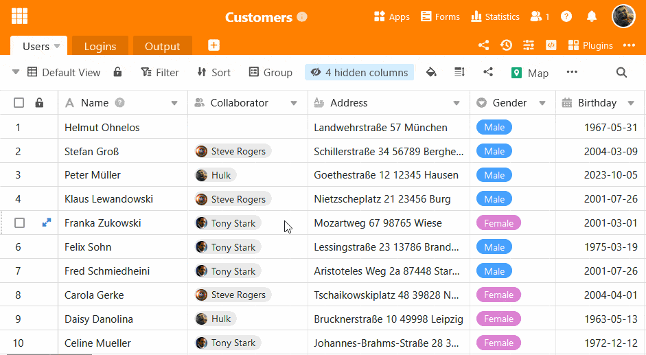

Большинство людей ежедневно имеют дело с данными, которыми необходимо эффективно управлять. Владелец супермаркета должен следить за уровнем запасов, редакторский менеджер - за всеми публикациями, а парикмахер - за приемом клиентов. Данные играют роль практически во всех профессиях. Лучший способ управлять большими объемами информации - это **базы данных**. Но что такое база данных, каковы ее преимущества и почему в большинстве случаев простой таблицы недостаточно?

## Основы баз данных

### Что такое база данных?

По сути, база данных - это не что иное, как логическая коллекция данных. **Логическая** потому, что база данных, как правило, пытается навести порядок во множестве этих данных. Когда мы говорим о данных, мы подразумеваем все виды **информации**. Будь то адреса электронной почты, изображения, тексты, числа или любые другие мыслимые типы данных.

### Типы баз данных

Существует множество способов структурирования баз данных. Ниже мы кратко расскажем о 5 типах:

1. **Иерархическая база данных:** иерархическая база данных использует порядок ранжирования для структурирования данных.
2. **Сетевая база данных:** сетевая база данных похожа на иерархическую, но позволяет подчиненной записи данных устанавливать связь с различными подчиненными записями данных, так что связи возможны в обоих направлениях.
3. **Объектно-ориентированная база данных:** информация хранится здесь в виде объектов.
4. **Реляционная база данных:** ориентирована на работу с таблицами, в которой каждая запись данных связана с каждой другой записью данных.
5. **Нереляционная база данных** (или база данных NoSQL): База данных No-SQL использует различные форматы, такие как документы, диаграммы и т. д., которые обеспечивают большую гибкость при проектировании базы данных.

Связи - большое преимущество реляционных баз данных.

## Преимущества баз данных

Теперь, когда вы поняли, что такое базы данных, вы, вероятно, все еще задаетесь вопросом: почему я должен использовать базу данных? Что делает базу данных намного лучше, чем просто список информации?

- Базы данных могут легко работать с несколькими пользователями.
- Базы данных очень надежны, потому что хранят информацию с высокой точностью.
- Базы данных позволяют избежать избыточной информации.
- Базы данных обрабатывают информацию мощным и интеллектуальным способом.
- Базы данных являются масштабируемыми.
- Базы данных могут обрабатывать огромные объемы информации.

Даже если вам пока не нужно обрабатывать огромные объемы информации, преимущества баз данных заметны даже при работе с небольшими объемами данных. Возможность обработки практически неограниченного количества данных означает, что хорошо спроектированная и продуманная база данных может служить вам долгие годы, поскольку она практически растет вместе с вами.

## Где таблицы достигают своего предела в отличие от баз данных

### 1\. нехватка складских мощностей

Представьте, что вы основали компанию. В дополнение к своему магазину вы решили продавать свои товары через Интернет. Поначалу вы получаете от 2 до 4 заказов в день. Поэтому довольно просто записывать информацию о заказах в **электронную таблицу**. Вы начинаете размещать рекламу в Интернете, и ваш бизнес внезапно процветает. Объем заказов увеличивается, и вы решаете добавить еще больше товаров в свой ассортимент.

Огромное количество информации, которую вам приходится обрабатывать каждый день, может перегрузить электронную таблицу, такую как Excel. Электронная таблица становится медлительной или зависает, потому что **объем памяти** просто слишком мал. С другой стороны, одним из преимуществ баз данных, как уже говорилось выше, является то, что они имеют гораздо больший объем памяти и могут легко расти вместе с вашей компанией. Поэтому они гораздо более **масштабируемы**, чем простые таблицы.

### 2\. одновременная работа с несколькими пользователями

По мере увеличения объема заказов растет и количество необходимых вам сотрудников. В первые несколько месяцев вы непосредственно нанимаете 5 новых сотрудников. В отличие от большинства электронных таблиц, базы данных разработаны таким образом, чтобы несколько пользователей могли **работать одновременно**. Одновременные запросы, поиск и редактирование базы данных возможны без каких-либо проблем и без столкновения изменений, внесенных разными людьми. Это обеспечивается механизмами, встроенными в системы управления базами данных.

Вы также можете назначить **права доступа и редактирования** в зависимости от опыта или ответственности соответствующего сотрудника. Хотя новые облачные электронные таблицы могут решить некоторые из этих проблем, они, как правило, не обладают таким детальным контролем доступа, как база данных.

### 3\. надежность и исключение ошибок человеческого ввода

Все мы люди, а людям, как известно, свойственно ошибаться. Отсутствие схем в простой электронной таблице делает ее **более восприимчивой** к ошибкам, вызванным человеческим фактором. В базе данных, напротив, существуют определенные **правила**, которые необходимо соблюдать, когда пользователи вводят новые данные или вносят изменения в существующие. Например, длина символа цифрового кода может быть предопределена, что гарантирует, что пользователи не забудут ни одной цифры при вводе номеров счетов.

Также встроена защита от случайного удаления данных. Базы данных могут отображать **историю изменений** и отменять **удаление данных** всего несколькими щелчками мыши.

### 4\. избыточные данные

Вы можете воспользоваться преимуществами баз данных, чтобы сделать информацию легкодоступной для дальнейшего использования. Чтобы гарантировать эту простоту, вы должны убедиться, что **каждая единица данных** существует **только в одном месте**. Если одни и те же данные находятся в разных местах, это избыточные данные. Если в базе данных есть избыточные данные, это говорит о плохом проектировании базы данных.

**Отсутствие избыточности** не только гарантирует ясность и простоту, но и пригодится, если вы внесете изменения в данные. Например, адрес одного из ваших клиентов может измениться. Вам не нужно менять его для каждого заказа, достаточно изменить его один раз **централизованно** в базе данных клиентов. Поскольку заказам присваивается уникальный номер клиента, все они **ссылаются** на соответствующую запись данных клиента с новым адресом.

Однако в некоторых случаях избыточность имеет смысл. Особенно в реляционных базах данных, например в [хранилищах данных](https://de.wikipedia.org/wiki/Data_Warehouse) или в [сфере бизнес-аналитики](https://de.wikipedia.org/wiki/Business_Intelligence), избыточность намеренно встраивается для улучшения трудоемких SQL-запросов.

### 5\. производительность

Поскольку базы данных предназначены для облегчения **поиска данных**, они также позволяют обрабатывать эти данные очень мощным способом. Вы можете создавать запросы к базе данных и фильтровать записи, чтобы получить ответы на очень конкретные вопросы. Например:

- Из какого региона приезжают клиенты, покупающие продукт XY?
- Как часто продавался продукт XY в декабре?
- Как клиенты попадают на мой сайт?

Результаты таких запросов можно сохранить в виде **представления**, которое представляет собой подмножество базы данных. Эти специальные представления помогают определенным группам людей, которые работают с базой данных, легче находить нужные им данные.

## Базы данных становятся все более удобными для пользователей

Если раньше для выполнения вышеупомянутых запросов к данным нужно было изучать определенные компьютерные языки, то сегодня существует множество систем баз данных, таких как SeaTable, которые оснащены интуитивно понятным графическим интерфейсом пользователя. Они позволяют даже новичкам сразу же использовать базы данных для улучшения своего рабочего процесса.

В отличие от классических баз данных, SeaTable имеет графический пользовательский интерфейс.

## Как легко создать собственную базу данных

Вы знаете о преимуществах баз данных, но идея создания собственной базы данных все еще отталкивает вас? Хорошие новости: Для этого вам больше не нужны специальные знания. С помощью SeaTable вы можете легко собрать строительные блоки собственной базы данных без каких-либо знаний в области программирования.

Посмотрите множество примеров использования SeaTable в нашей [библиотеке шаблонов](). Здесь вы найдете примеры из области маркетинга, продаж, управления проектами, разработки программного обеспечения, управления персоналом и многих других. Мы даже подготовили для вас [7-серийное введение в продукт](https://www.youtube.com/watch?v=srUQ2fD1FM0&t=32s) на нашем канале YouTube, в котором мы проводим вас через весь процесс создания базы SeaTable.

Используйте преимущества базы данных и попрощайтесь с запутанными таблицами уже сегодня! [Нажмите здесь](), чтобы зарегистрироваться бесплатно!
