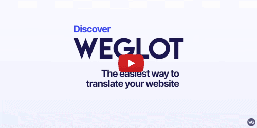
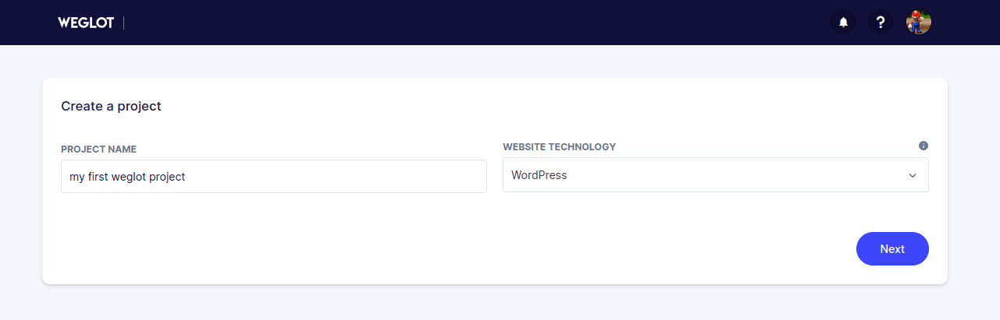
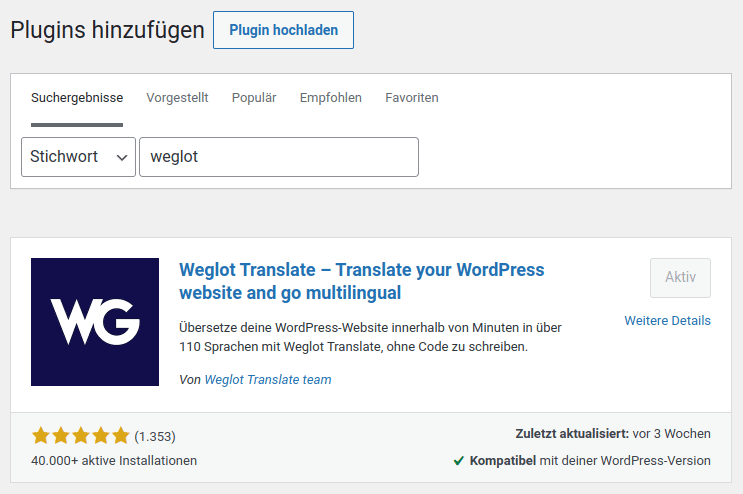
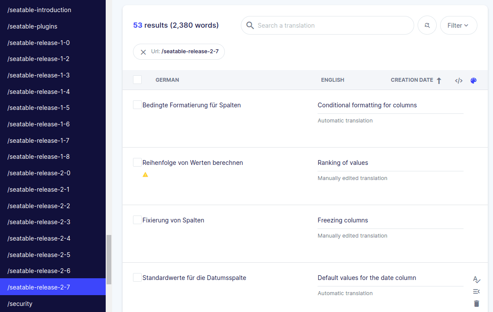
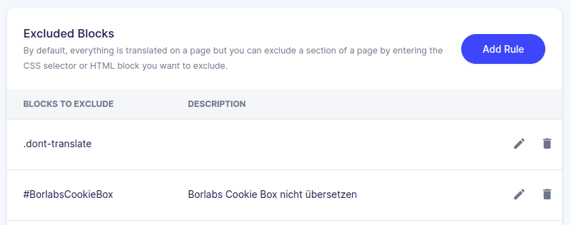
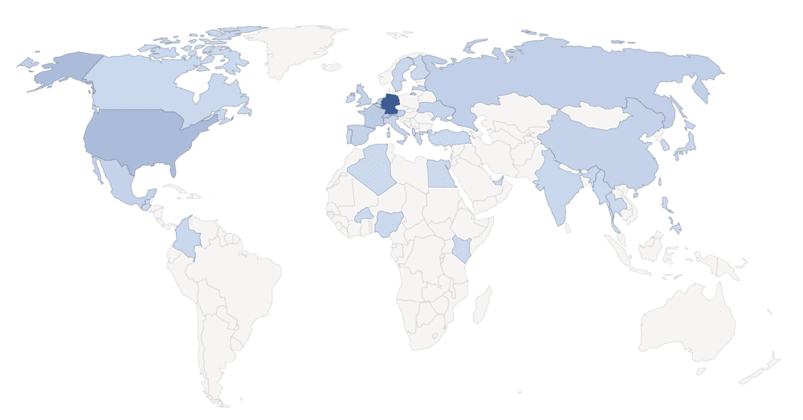
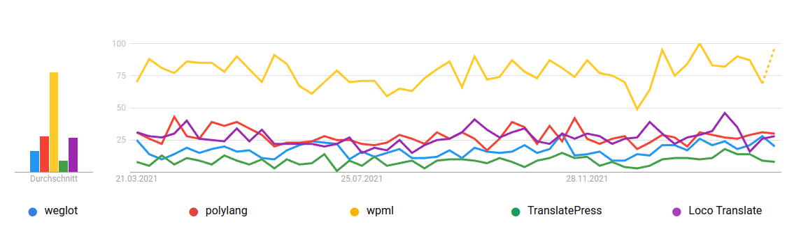
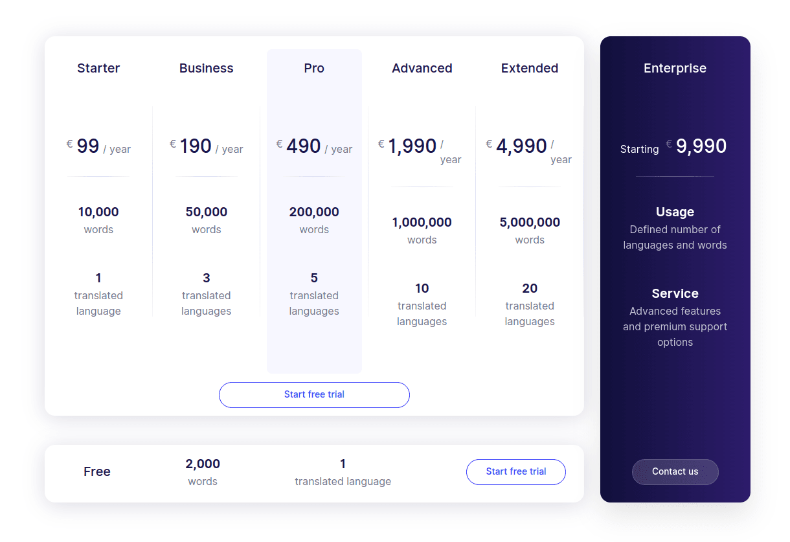
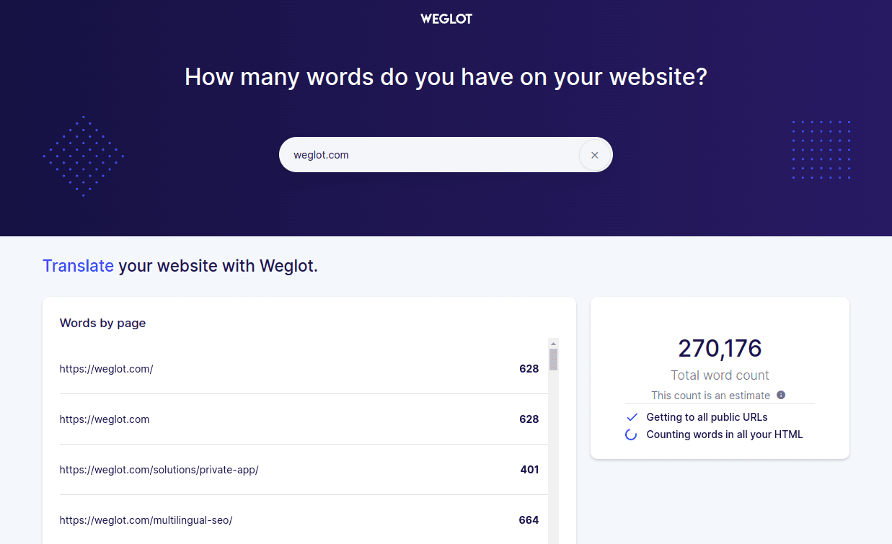

Weglot es un plugin de WordPress para traducir automáticamente su propio sitio web. La idea es sencilla y se explica rápidamente. Usted escribe todos los textos de su propio sitio web en su lengua materna, como de costumbre, y deja que Weglot traduzca todo el contenido a uno o varios idiomas más. El visitante del sitio web es redirigido automáticamente a la versión del idioma que le convenga y [Weglot](https://weglot.com/?fp_ref=loved_by_seatable) se encarga de todo el trabajo necesario para el SEO internacional. 

Traducción automática del sitio web con Weglot

Con Weglot, el deseo de un sitio web multilingüe se hace realidad. Puede conseguir un mayor precio para el cliente con un esfuerzo mínimo y los textos adicionales hacen que el sitio web sea más relevante a los ojos de Google y el ranking mejore automáticamente. 

Este artículo es mi informe de experiencia personal después de 1,5 años de uso activo de [Weglot](https://weglot.com/?fp_ref=loved_by_seatable). Si aún no conoces Weglot, después de este texto te harás una idea de por qué en SeaTable decidimos usar Weglot. Por supuesto, también hubo problemas, todos ellos solucionables, pero que conviene mencionar aquí.

En Medium he publicado otro artículo en el que se describen nuestros guiones individuales, las soluciones a los problemas y las personalizaciones. Este artículo está dirigido a aquellos que ya se han decidido a utilizar Weglot y que ahora quieren saber más sobre la [tecnología que hay detrás de Weglot](https://christophdb.medium.com/common-pitfalls-and-challenges-with-the-translation-plugin-weglot-on-the-way-to-more-traffic-and-1f51e8c607f4). 

## Con Weglot, el SEO internacional se convierte en un juego de niños

El software SeaTable se utiliza en todo el mundo y está disponible en varios idiomas. Por consiguiente, nuestro sitio web también debe ser multilingüe. Como puede ver, actualmente puede leer el sitio web en alemán, inglés, francés, español y ruso. Al principio pensé que tendría que traducir yo mismo todos los textos del sitio web a los demás idiomas, pero entonces di con Weglot por casualidad.  
La perspectiva de que Weglot hiciera todo el trabajo de traducción por mí sonaba tentadora al principio, pero al mismo tiempo era escéptico sobre si una traducción automática sería lo suficientemente buena. Mientras tanto, hemos estado utilizando Weglot desde finales de 2020 y nos hemos convertido en fans absolutos. Sin embargo, quiero contarles todas las experiencias positivas y negativas.

Pero, basta de palabras. Si aún no conoces Weglot, deberías echar un vistazo al siguiente vídeo de Weglot, que describe breve y sucintamente su funcionamiento.

Weglot lo explicó en 64 segundos.

## Con Weglot obtendrá un sitio web multilingüe en segundos

Permítanme describir brevemente cómo empezar con Weglot. En primer lugar, hay que registrarse en el sitio web weglot.com para obtener el _Free_\-versión. No te preocupes: Weglot escribe algo sobre una prueba de 10 días, pero Weglot es permanentemente gratuito para otro idioma y un máximo de 2.000 palabras.

Cree el primer proyecto en Weglot.

Tras confirmar tu dirección de correo electrónico, creas tu primer proyecto y eliges tu tecnología web. Además de WordPress, Weglot es compatible con muchas otras tecnologías web como Wix, Shopify, Magento, Webflow o Squarespace. Sin embargo, es probable que elija WordPress y luego reciba su primera clave API de Weglot. Trate esta clave como una contraseña y no revele este valor a nadie.

Así que copie la clave API mostrada en su portapapeles y vaya al área de administración de su sitio web WordPress. Busca el plugin de WordPress "Weglot" e instálalo. En la configuración del plugin, tienes que introducir la clave API guardada previamente y ya puedes empezar a traducir tu sitio web.

Instale el plugin de WordPress Weglot.

Seleccione el idioma que utiliza actualmente en su sitio web y elija el idioma que desea añadir ahora por Weglot. 

### Su sitio web está ahora disponible en varios idiomas.

Lo que sigue ahora parece casi mágico. A partir de ahora, todas las páginas de su sitio web estarán disponibles para los visitantes en dos idiomas. Además de la página web original, ahora hay una nueva URL para cada nueva lengua en la que se ha insertado la abreviatura del idioma.

> **https://seatable.io/blog/** - nuestro idioma original alemán  
> **https://seatable.io/en/blog/** - Sitio web en inglés traducido por Weglot  
> **https://seatable.io/fr/blog/** - Sitio web en francés traducido por Weglot

Cada vez que un usuario llama a una página, Weglot comprueba si esa página ya ha sido traducida o si ha cambiado algo y realiza la traducción correspondiente. Weglot combina varias técnicas de traducción, como [Google Translate](https://translate.google.com/) y [Deepl](https://www.deepl.com/translator), y genera una traducción muy adecuada a partir de las distintas traducciones en la mayoría de los casos. Si una página tiene que ser traducida primero, puede tardar un momento antes de que la página se cargue realmente. Sin embargo, este retraso sólo se produce la primera vez que se llama a la página. Todos los visitantes posteriores verán la página inmediatamente.

Además de la traducción automática, Weglot muestra ahora un menú desplegable en todas las páginas para cambiar el idioma. Sin embargo, la mayoría de los usuarios no necesitarán esto en absoluto, ya que Weglot intenta dirigir al usuario automáticamente a la página correcta en función del idioma establecido en el navegador.

### Más de 100 idiomas posibles para su negocio internacional

Weglot permite actualmente la traducción a [más de 100 idiomas diferentes](https://weglot.com/documentation/available-languages). Probablemente no necesitará tantas, porque vale la pena empezar concentrándose en las lenguas más habladas en el mundo. Una buena visión general puede encontrarse en la [lista de las lenguas más habladas en Wikipedia](https://de.wikipedia.org/wiki/Liste_der_meistgesprochenen_Sprachen).

Pero Weglot no sólo traduce su sitio web, sino que también se asegura de que Google y otros motores de búsqueda encuentren este nuevo contenido y de que todo el contenido se indexe correctamente. Para ello, los respectivos _hreflang_\-etiquetas en el texto fuente, para que los motores de búsqueda puedan encontrar fácilmente los textos correspondientes.

### Corrección manual o traducción profesional para un WordPress multilingüe perfecto

Por supuesto, también puede ocurrir que una traducción no sea del todo perfecta. En este caso, Weglot le permite corregir fácilmente la traducción incorrecta a través de su cuenta de Weglot. Para ello, se selecciona el idioma y la URL correspondientes y, a continuación, se muestran todas las traducciones en una tabla de traducción.

Weglot permite corregir fácilmente cualquier traducción.

En cuanto se ajusta una traducción, este cambio se aplica inmediatamente a su sitio web y siempre se mostrará así en el futuro.

Si no quiere corregir las traducciones usted mismo, también puede contratar a traductores profesionales a través de Weglot. Se pagan por palabra traducida, algo que no hemos utilizado en SeaTable hasta ahora. 

Otra función importante de Weglot es que puede definir los términos que no deben traducirse y ciertos elementos pueden excluirse de la traducción. SeaTable, por ejemplo, es una palabra que Weglot nunca debería traducir. Además, hemos definido que todos los elementos con la clase HTML _dont-translate_ no se traduce. 

Con las clases css o los ids puedes decirle a Weglot que no traduzca algo.

## Cómo construimos nuestra estrategia internacional de SEO en seatable.io con Weglot

En SeaTable, creemos firmemente que sólo el tráfico orgánico funciona realmente a largo plazo. Esto significa que desde el principio nos fijamos el objetivo de generar muchos y buenos contenidos para nuestro sitio web, que luego deberían ofrecerse en diferentes idiomas. Weglot prometió hacer exactamente eso posible. Al mismo tiempo, era importante para mí que pudiera trazar técnicamente todo lo que tenía en mente y que tanto los costes directos como los indirectos, como el mantenimiento, estuvieran en buena proporción con el beneficio real.

Producir el buen contenido fue un problema menor. Pero no tenemos un hablante nativo en el equipo para cada uno de los idiomas elegidos. Por eso, desde el principio decidimos que sólo revisaríamos la traducción al inglés de nuestros textos en alemán y los corregiríamos si fuera necesario. Todos los textos en español, francés y ruso son completamente inéditos. Por supuesto, esto conlleva el riesgo de asustar a algunos usuarios con traducciones incorrectas, pero consideramos que las traducciones son suficientemente buenas y asumimos este riesgo calculado.

A través de los idiomas alemán, inglés, francés, español y ruso, cubrimos una gran parte de la población mundial. El seguimiento de nuestro sitio web muestra que el 50 % de nuestro tráfico proviene de Alemania, aunque hasta ahora sólo hemos recibido artículos de prensa y atención de los medios de comunicación en ese país. Así que yo diría que le debemos a Weglot alrededor del 50% del tráfico actual de nuestro sitio web. 

Más tráfico de visitantes internacionales gracias a Weglot

Además, no realizamos ningún otro esfuerzo para nuestro SEO internacional. Weglot se encarga de que los motores de búsqueda encuentren el contenido traducido y de que éste aparezca en los motores de búsqueda de los respectivos países.

## Weglot comparado con otros plugins de traducción como WTFD, TranslatePress, Polylang, Loco Translate y ConveyThis.

Antes de decidirnos a utilizar Weglot con SeaTable, también buscamos otros plugins de WordPress para traducir el sitio web.  
El plugin más conocido para un WordPress multilingüe es, con párrafo, el plugin [WPML](https://wpml.org/). Sin embargo, a diferencia de Weglot, WPML no traduce automáticamente el contenido, sino que _sólo_ proporciona la plataforma para sus propias traducciones. Los otros plugins [TranslatePress](https://translatepress.com/?ref=174), [Polylang](https://polylang.pro/) y [Loco Translate](https://de.wordpress.org/plugins/loco-translate/) funcionan de la misma manera. 

WPML es, con mucho, el plugin de traducción más popular para WordPress.

Sin duda, todos estos son buenos plugins, pero realmente queríamos una traducción automática del contenido de nuestro sitio web para ahorrarnos esta tediosa tarea.  
Para que te hagas una idea: en el sitio web seatable.io puedes encontrar actualmente más de [90 artículos de blog](https://seatable.io/es/blog/) y más de 50 páginas. En total, el sitio web tiene algo menos de un millón de palabras. Desde luego, no es exagerado suponer que la traducción de una página o un artículo a otras cuatro lenguas lleva al menos una hora cada una. Eso supondría al menos 140 horas o casi 18 días laborables. Weglot nos ha salvado todo este tiempo. 

### Hay otro plugin de WordPress que ofrece traducciones automáticas

En el curso de nuestra evaluación de Weglot, también nos encontramos con el plugin [ConveyThis](https://www.conveythis.com/). A primera vista, este plugin parece ser una copia bastante similar y funcionalmente casi equivalente a Weglot. Durante nuestras pruebas, sin embargo, tuvimos que concluir que definitivamente deberías mantener tus manos alejadas de ConveyThis. Las traducciones no son tan buenas y se carece de una documentación y un soporte tan buenos como los de Weglot. En nuestra opinión, el plugin supuestamente más barato no merece la pena, ya que las traducciones son de una calidad mucho más pobre y o bien tienes que mejorarlas más o la calidad de tu propia página web no es tan alta.

## Precio de Weglot

A estas alturas debería haber comprendido la importancia de Weglot para el éxito de nuestro sitio web. Con Weglot, podemos crear un sitio web multilingüe con un esfuerzo mínimo y así distribuir nuestro software en casi todo el mundo. Esto también justifica el [precio de Weglot](https://weglot.com/pricing?fp_ref=loved_by_seatable), que es inusualmente alto para un plugin de WordPress. Pero al mismo tiempo quiero subrayar que, desde nuestro punto de vista, Weglot vale cada euro. 

Los precios del plugin de WordPress Weglot.

Actualmente utilizamos el _Advanced_\-Suscripción a Weglot, que permite hasta 10 idiomas y hasta 1 millón de palabras. Pagamos 1.990 euros por ello, pero, como ya hemos dicho, nos ha ahorrado al menos 18 días de trabajo en los dos años. El tiempo que se ahorra es probablemente muchas veces mayor. Los abonos pueden actualizarse en cualquier momento durante el periodo de vigencia y el valor residual del abono actual se abona en su totalidad al precio del abono de mayor valor. 

En un futuro próximo veremos la *Extended Plan wechseln, um weitere Blogartikel übersetzen lassen zu können und zu diesem Zeitpunkt werden wir dann auch voraussichtlich noch eine weitere Sprache auf seatable.io aktivieren. Dieser Schritt wird mich nur zwei Mausklicks kosten.* 

### Con la herramienta de recuento de palabras puede determinar sus propias necesidades

Si no está seguro de la suscripción que necesita, la [herramienta de recuento de palabras de Weglot](https://wordcount.weglot.com/) le ayudará. Con él, sabrá inmediatamente qué plan necesita y qué costes debe esperar cada año. 

El contador de palabras de Weglot le da una idea de la suscripción que necesita.

## Problemas que tuvimos que superar con Weglot

Un informe de campo sobre Weglot no estaría completo sin hablar de los retos y escollos que tuvimos que superar a lo largo de dos años. Sin embargo, pudimos resolver todos los siguientes problemas con la buena documentación y el excelente soporte. 

**1) Redirección automática y caché**  
Weglot intenta redirigir a cada visitante a la traducción adecuada en función del idioma de su navegador. Lamentablemente, este mecanismo no es compatible con el almacenamiento en caché del sitio web de WordPress. En cuanto se activa la caché, todos los usuarios son redirigidos al idioma del primer visitante. Por lo tanto, hemos desactivado la redirección automática y hemos escrito nuestro propio Javascript.

**2) los enlaces especiales de nuestro tema no son compatibles**

En SeaTable.io utilizamos el tema Enfold y, además de los enlaces en el cuerpo del texto, también utilizamos cuadros de enlace, por ejemplo en nuestro [Página de ayuda](https://seatable.io/es/docs/)donde toda la caja sirve de enlace. Lamentablemente, este cuadro de enlace no es reconocido como un enlace por Weglot y los usuarios siempre son redirigidos al idioma original. Hemos podido cambiar este comportamiento añadiendo un _Action in der functions.php beheben._

Weglot ha tenido problemas con las cajas de enlace de nuestra sección de ayuda.

**3) Optimización SEO cuando el idioma original no es el idioma de reserva.**

El idioma original de seatable.io es el alemán y Weglot traduce los textos alemanes a todos los demás idiomas. No obstante, dado que el inglés es el idioma mundial, nos gustaría que Google lo presentara a todos los usuarios en caso de que no podamos ofrecerles un idioma adecuado. También pudimos hacerlo con unas pocas líneas de código en el _functions.php_ alcanzar.

**4) Los enlaces ancla no se traducen**

Otro problema surgió en seatable.io al enlazar con los textos de anclaje de los titulares. Desgraciadamente, al hacer clic en un enlace de este tipo, Weglot devolvía al visitante al idioma original, aunque en este caso no se deseaba en absoluto, porque el texto de anclaje también estaba traducido. Después de entender el mecanismo, pudimos crear un enlace sin ninguna codificación simplemente añadiendo _id-tags_ Simplemente, arreglar el problema.

Si quieres saber más sobre estos problemas, te recomiendo que eches un vistazo a mi [artículo en Medium](https://christophdb.medium.com/common-pitfalls-and-challenges-with-the-translation-plugin-weglot-on-the-way-to-more-traffic-and-1f51e8c607f4). En él, describo con detalle nuestras adaptaciones y codificaciones. 

## Las ventajas del plugin de traducción Weglot resumidas

Reconozco abiertamente que soy un gran fan de Weglot. Para algunas cosas, simplemente vale la pena pagar dinero si se consigue un gran trabajo por ello. Weglot es definitivamente un caso así. Generamos nuevos contenidos en nuestra lengua materna, el alemán, y Weglot genera las demás traducciones por nosotros.  
Para mí, los argumentos más importantes para utilizar Weglot son los siguientes:

- Weglot conduce a más contenido, a una mejor clasificación en Google y, al final, a más tráfico y a un mayor alcance.
- Weglot es fácil de instalar. En menos de un minuto tendrá un sitio web multilingüe.
- Weglot promete compatibilidad con prácticamente todos los temas de WordPress y muchos plugins, como WooCommerce, Yoast y Elementor. Tampoco hemos tenido nunca ningún conflicto con los plugins o con nuestro tema.
- Weglot está optimizado para el SEO multilingüe. Añade automáticamente _hreflang-Tag-Attribute hinzu, erstellt vollständig dedizierte URLs für jede Sprache und indexiert Ihre übersetzten Seiten._
- La calidad de la traducción es realmente buena. La reelaboración manual rara vez es necesaria y puede hacerse fácilmente a través del sitio web de Weglot.
- Weglot cuenta con un equipo de apoyo dedicado de más de diez personas con gran experiencia técnica en la traducción de aplicaciones web.

## Mi conclusión después de usar Weglot durante más de un año

[Weglot](https://weglot.com/?fp_ref=loved_by_seatable) no sólo promete mucho, sino que también cumple con creces. Con Weglot, puede convertir cualquier sitio de WordPress en un sitio web multilingüe en muy poco tiempo. Aunque tuvimos algunos obstáculos técnicos, pudimos superarlos todos y aplicar exactamente lo que queríamos.  
El precio de Weglot parece alto a primera vista cuando se compara con otros plugins populares de WordPress. Al mismo tiempo, el precio de la traducción de su propio sitio web está más que justificado. Volvería a elegir Weglot en cualquier momento y espero que este testimonio le haya ayudado. Si quieres saber más sobre nuestras personalizaciones, te recomiendo mi [artículo de Medium](https://christophdb.medium.com/common-pitfalls-and-challenges-with-the-translation-plugin-weglot-on-the-way-to-more-traffic-and-1f51e8c607f4).
