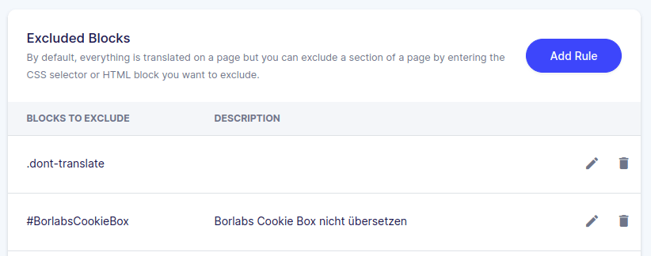
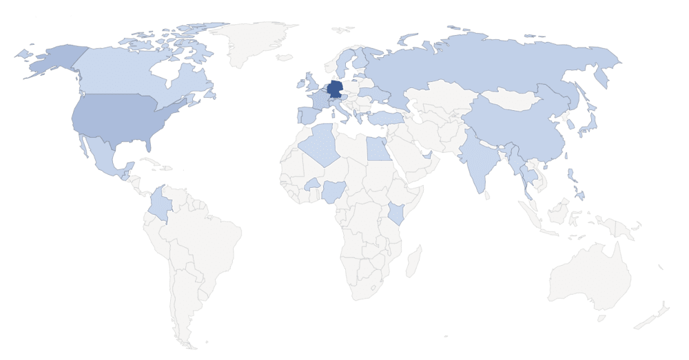

Weglot é um plugin WordPress para traduzir automaticamente o seu próprio website. A ideia é simples e rapidamente explicada. Escreve todos os textos no seu próprio website na sua língua materna como habitualmente e deixa a Weglot traduzir todo o conteúdo para uma ou mais outras línguas. O visitante do website é automaticamente redireccionado para a versão linguística que lhe convém e a [Weglot](https://weglot.com/?fp_ref=loved_by_seatable) encarrega-se de todo o trabalho necessário para SEO internacional. 

Tradução automática do website com Weglot

Com Weglot, o desejo de um website multilingue torna-se realidade. É possível conseguir um preço mais elevado para o cliente com um esforço mínimo e os textos adicionais tornam o website mais relevante aos olhos do Google e a classificação melhora automaticamente. 

Este artigo é o meu relatório de experiência pessoal após 1,5 anos de uso activo do [Weglot](https://weglot.com/?fp_ref=loved_by_seatable). Se ainda não conhece o Weglot, terá uma ideia depois deste texto porque é que nós no SeaTable decidimos usar o Weglot. Claro que também houve problemas, que puderam ser todos resolvidos, mas que ainda devem ser aqui mencionados.

Em Medium publiquei outro artigo descrevendo os nossos guiões individuais, soluções de problemas e personalizações. Este artigo destina-se àqueles que já decidiram utilizar Weglot e que agora [querem saber](https://christophdb.medium.com/common-pitfalls-and-challenges-with-the-translation-plugin-weglot-on-the-way-to-more-traffic-and-1f51e8c607f4) mais sobre a [tecnologia por detrás do Weglot](https://christophdb.medium.com/common-pitfalls-and-challenges-with-the-translation-plugin-weglot-on-the-way-to-more-traffic-and-1f51e8c607f4). 

## Com Weglot, o SEO internacional torna-se uma brincadeira de criança

O software SeaTable é utilizado em todo o mundo e está disponível em muitas línguas diferentes. Consequentemente, o nosso sítio web deve também ser multilingue. Como pode ver, pode actualmente ler o website em alemão, inglês, francês, espanhol e russo. No início pensei que teria de ser eu a traduzir todos os textos do website para as outras línguas e depois deparei-me com o Weglot por acaso.  
A perspectiva de Weglot fazer todo o trabalho de tradução para mim pareceu-me tentadora no início, mas ao mesmo tempo estava céptico sobre se uma tradução automática seria suficientemente boa. Entretanto, temos vindo a utilizar o Weglot desde o final de 2020 e tornámo-nos fãs absolutos. No entanto, quero falar-vos de todas as experiências positivas e negativas.

Mas, já chega de palavras. Se ainda não conhece Weglot, deve dar uma vista de olhos ao seguinte vídeo de Weglot, que descreve de forma breve e sucinta o seu funcionamento.

Weglot explicou em 64 segundos.

## Com Weglot obtém um website multilingue em segundos

Deixem-me descrever brevemente como começar com Weglot. Primeiro, registe-se no website weglot.com de graça _Free_\-versão. Não se preocupe: Weglot escreve algo sobre um teste de 10 dias, mas Weglot está permanentemente livre para outra língua e um máximo de 2.000 palavras.

Criar o primeiro projecto em Weglot.

Após confirmar o seu endereço de correio electrónico, cria o seu primeiro projecto e escolhe a sua tecnologia web. Além do WordPress, Weglot suporta muitas outras tecnologias web tais como Wix, Shopify, Magento, Webflow ou Squarespace. No entanto, provavelmente escolherá WordPress e depois receberá a sua primeira chave API da Weglot. Trate esta chave como uma senha e não revele este valor a ninguém.

Por isso, copie a chave API apresentada para a sua área de transferência e vá para a área de administração do seu sítio Web WordPress. Procure o plugin WordPress "Weglot" e instale-o. Nas definições do plugin, tem de introduzir a chave API guardada anteriormente e pode agora começar a traduzir o seu sítio Web.

Instalar o plugin WordPress Weglot.

Seleccione a língua actualmente utilizada no seu sítio web e escolha a língua que pretende adicionar agora por Weglot. 

### O seu website está agora disponível em várias línguas.

O que se segue parece agora quase como magia. A partir de agora, todas as páginas do seu sítio web estão disponíveis aos visitantes em duas línguas. Para além da página web original, existe agora um novo URL para cada nova língua na qual a abreviatura da língua foi inserida.

> **https://seatable.com/blog/** - a nossa língua original alemão  
> **https://seatable.com/en/blog/** - website inglês traduzido por Weglot  
> **https://seatable.com/fr/blog/** - Sítio web francês traduzido por Weglot

Cada vez que uma página é chamada por um utilizador, Weglot verifica se esta página já foi traduzida ou se algo mudou e depois efectua a tradução correspondente. Weglot combina várias técnicas de tradução tais como [Google Translate](https://translate.google.com/) e [Deepl](https://www.deepl.com/translator) e gera uma tradução extremamente adequada a partir das várias traduções na maioria dos casos. Se uma página tiver de ser traduzida primeiro, pode demorar um breve momento até que a página seja efectivamente carregada. Contudo, este atraso ocorre apenas na primeira vez que a página é chamada. Cada visitante subsequente verá a página imediatamente.

Para além da tradução automática, Weglot apresenta agora também um menu pendente em todas as páginas para alterar a língua. No entanto, a maioria dos utilizadores não precisará disto em absoluto, uma vez que Weglot tenta direccionar automaticamente o utilizador para a página correcta com base na língua definida no navegador.

### Mais de 100 línguas possíveis para o seu negócio internacional

O Weglot permite actualmente a tradução para [mais de 100 línguas diferentes](https://weglot.com/documentation/available-languages). Provavelmente não vai precisar de tantos, porque vale a pena começar por se concentrar nas línguas que são mais faladas em todo o mundo. Uma boa visão geral pode ser encontrada na [lista das línguas mais faladas na Wikipédia](https://de.wikipedia.org/wiki/Liste_der_meistgesprochenen_Sprachen).

Mas Weglot não só traduz o seu website, como também assegura que o Google e outros motores de busca encontrem este novo conteúdo e que todo o conteúdo seja indexado correctamente. Para este efeito, os respectivos _hreflang_\-tags no texto fonte, para que os motores de busca possam facilmente encontrar os textos correspondentes.

### Correcção manual ou tradução profissional para o seu WordPress multilingue perfeito

É claro que também pode acontecer que uma tradução não seja bem perfeita. Neste caso, o Weglot permite-lhe corrigir facilmente a tradução incorrecta através da sua conta Weglot. Para o fazer, selecciona a língua e URL relevantes e todas as traduções são então apresentadas numa tabela de tradução.

Weglot permite a fácil correcção de qualquer tradução.

Assim que ajustar uma tradução, esta alteração é imediatamente aplicada ao seu website e será sempre exibida desta forma no futuro.

Se não quiser corrigir as traduções você mesmo, pode também reservar tradutores profissionais através da Weglot. Estes são pagos por palavra traduzida, que até agora não utilizámos no SeaTable. 

Outra função importante do Weglot é que se pode definir termos que não devem ser traduzidos e certos elementos podem ser excluídos da tradução. SeaTable, por exemplo, é uma palavra que Weglot nunca deveria traduzir. Além disso, definimos que todos os elementos com a classe HTML _dont-translate_ não ser traduzido. 

Com as classes css ou ids pode dizer à Weglot para não traduzir algo.

## Como construímos a nossa estratégia internacional de SEO em Seatable.io com Weglot

Na SeaTable, acreditamos firmemente que só o tráfego orgânico funciona realmente a longo prazo. Isto significa que desde o início nos propusemos o objectivo de gerar muito bom conteúdo para o nosso website, o qual deverá então ser oferecido em diferentes línguas. Weglot prometeu tornar exactamente isso possível. Ao mesmo tempo, era importante para mim que pudesse mapear tecnicamente tudo o que tinha em mente e que os custos directos, bem como os custos indirectos, tais como a manutenção, fossem em boa proporção ao benefício real.

Produzir o bom conteúdo era um problema menor. Mas não temos um falante nativo na equipa para cada uma das nossas línguas escolhidas. Por conseguinte, decidimos desde logo que só verificaríamos a tradução inglesa dos nossos textos alemães e os corrigiríamos se necessário. Todos os textos em espanhol, francês e russo são totalmente inéditos. É claro que isto comporta o risco de afugentar alguns utilizadores com traduções incorrectas, mas consideramos que as traduções são suficientemente boas e assumimos este risco calculado.

Através das línguas alemão, inglês, francês, espanhol e russo, cobrimos uma grande parte da população mundial. Um olhar sobre a monitorização do nosso website mostra que 50% do tráfego do nosso website vem da Alemanha, embora até agora só tenhamos recebido artigos de imprensa e atenção dos meios de comunicação social nesse país. Por isso, diria que devemos cerca de 50% do tráfego actual do nosso website à Weglot. 

Mais tráfego de visitantes internacionais graças à Weglot

Além disso, não fazemos quaisquer outros esforços para a nossa SEO internacional. Weglot assegura que os motores de busca encontram o conteúdo traduzido e que este aparece nos motores de busca dos respectivos países.

## Weglot comparado com outros plugins de tradução tais como WTFD, TranslatePress, Polylang, Loco Translate e ConveyThis.

Antes de decidirmos utilizar o Weglot com SeaTable, analisámos também outros plugins WordPress para traduzir o website.  
O plugin mais conhecido para um WordPress multilingue é, com parágrafo, o plugin [WPML](https://wpml.org/). Ao contrário da Weglot, contudo, a WPML não traduz automaticamente o conteúdo, mas _apenas_ fornece a plataforma para as suas próprias traduções. Os outros plugins [TranslatePress](https://translatepress.com/?ref=174), [Polylang](https://polylang.pro/) e [Loco Translate](https://de.wordpress.org/plugins/loco-translate/) funcionam da mesma forma. 

O WPML é de longe o plugin de tradução mais popular para WordPress.

Com certeza, todos estes são bons plugins, mas queríamos realmente uma tradução automática do conteúdo do nosso sítio web para salvar esta tediosa tarefa.  
Só para lhe dar uma sensação: no website seatable.io pode actualmente encontrar mais de [90 artigos de blogues]() e mais de 50 páginas. No total, o website tem pouco menos de um milhão de palavras. Não é certamente um exagero assumir que a tradução de uma página ou de um artigo em quatro outras línguas leva pelo menos 1 hora cada. Isso seria pelo menos 140 horas ou quase 18 dias úteis. Weglot salvou-nos a todos este tempo. 

### Existe outro plugin WordPress que oferece traduções automáticas

No decurso da nossa avaliação do Weglot, também nos deparámos com o Plugin [ConveyThis](https://www.conveythis.com/). À primeira vista, este plugin parece ser uma cópia bastante semelhante e funcionalmente quase equivalente ao Weglot. Durante os nossos testes, no entanto, tivemos de concluir que deveria definitivamente manter as suas mãos longe da ConveyThis. As traduções não são tão boas e falta documentação e apoio de qualidade semelhante à encontrada em Weglot. Na nossa opinião, o plugin supostamente mais barato não vale o dinheiro, uma vez que as traduções são de muito pior qualidade e é preciso fazer mais correcções ou a qualidade do seu próprio website não é tão elevada.

## Preço a partir de Weglot

Até agora, já deveria ter compreendido a importância de Weglot para o sucesso do nosso website. Com Weglot, podemos criar um website multilingue com um esforço mínimo e assim distribuir o nosso software em quase todas as partes do mundo. Isto também justifica o [preço do Weglot](https://weglot.com/pricing?fp_ref=loved_by_seatable), que é invulgarmente elevado para um plugin WordPress. Ao mesmo tempo, porém, quero salientar que, do nosso ponto de vista, o Weglot vale cada euro. 

Os preços do plugin WordPress Weglot.

Actualmente utilizamos o _Advanced_\-Assinatura Weglot, que permite até 10 línguas e até 1 milhão de palavras. Pagamos 1.990 euros por isto, mas, como mencionado anteriormente, poupou-nos pelo menos 18 dias úteis ao longo dos dois anos. O tempo poupado é provavelmente muitas vezes mais. As subscrições podem ser actualizadas em qualquer altura durante o prazo e o valor residual da subscrição actual é creditado na totalidade ao preço da subscrição de valor mais elevado. 

Em breve mudaremos para o _Extended Plan_ para podermos traduzir mais artigos do blogue e, nessa altura, provavelmente também activaremos outra língua no seatable.io. Este passo só me vai custar dois cliques no rato.

### Com a ferramenta de contagem de palavras pode determinar as suas próprias necessidades

Se não tiver a certeza de qual a subscrição de que necessita, a [ferramenta de contagem de palavras da Weglot](https://wordcount.weglot.com/) ajudá-lo-á. Com ele, sabe imediatamente qual o plano de que necessita e quais os custos que deve esperar em cada ano. 

O contador de palavras Weglot dá-lhe uma sensação de qual a subscrição de que necessita.

## Problemas que tivemos de ultrapassar com Weglot

Um relatório de campo sobre Weglot não estaria completo sem falar sobre os desafios e armadilhas que tivemos de ultrapassar ao longo de dois anos. No entanto, conseguimos resolver todos os seguintes problemas com a boa documentação e o excelente apoio. 

**1) Reencaminhamento automático e cache**  
Weglot tenta redireccionar cada visitante para a tradução apropriada com base na língua do seu navegador. Infelizmente, este mecanismo não é compatível com o caching do sítio web WordPress. Assim que se activa o cache, todos os utilizadores são redireccionados para a língua do primeiro visitante. Desactivámos assim o redireccionamento automático e escrevemos o nosso próprio Javascript.

**2) as ligações especiais do nosso tema não são suportadas**

No SeaTable.io utilizamos o tema Enfold e, para além dos links no corpo do texto, também utilizamos caixas de links - por exemplo no nosso [Página de ajuda]()onde a caixa inteira serve de ligação. Infelizmente, esta caixa de ligação não é reconhecida como uma ligação por Weglot e os utilizadores são sempre redireccionados de volta à língua original. Conseguimos alterar este comportamento adicionando um _Action in der functions.php beheben._

Weglot teve problemas com as caixas de ligação da nossa secção de ajuda.

**3) Optimização SEO quando a língua original não é a língua de recurso.**

A língua original de seatable.io é o alemão e Weglot traduz os textos alemães para todas as outras línguas. No entanto, uma vez que o inglês é a língua mundial, gostaríamos que o Google o apresentasse a todos os utilizadores no caso de não lhes podermos oferecer uma língua adequada. Conseguimos também fazer isto com algumas linhas de código no _functions.php_ alcance.

**4) As ligações de âncora não estão traduzidas**

Outro problema surgiu no seatable.io ao fazer a ligação a textos de manchetes. Infelizmente, clicar em tal link levou sempre a Weglot a devolver o visitante à língua original, embora isto não fosse de todo desejado neste caso, porque o texto de âncora também foi traduzido. Depois de termos compreendido o mecanismo, pudemos criar uma ligação sem qualquer codificação simplesmente acrescentando _id-tags_ simplesmente resolver o problema.

Se quiser saber mais sobre estes problemas, recomendo-lhe que dê uma vista de olhos ao meu [artigo sobre Média](https://christophdb.medium.com/common-pitfalls-and-challenges-with-the-translation-plugin-weglot-on-the-way-to-more-traffic-and-1f51e8c607f4). Nele, descrevo em pormenor as nossas adaptações e codificações. 

## As vantagens do plugin de tradução Weglot resumidas

Admito abertamente que sou um grande fã do Weglot. Para algumas coisas, vale simplesmente a pena pagar dinheiro se se conseguir fazer muito trabalho para isso. Weglot é definitivamente um desses casos. Geramos novos conteúdos na nossa língua materna, o alemão, e o Weglot gera as outras traduções para nós.  
Para mim, os argumentos mais importantes para a utilização do Weglot são os seguintes:

- Weglot leva a mais conteúdo, classificações adicionais e melhores no Google e, no final, mais tráfego e um alcance mais alargado.
- O Weglot é fácil de instalar. Em menos de um minuto tem um website multilingue.
- Weglot promete compatibilidade com praticamente todos os temas do WordPress e muitos plugins, incluindo WooCommerce, Yoast e Elementor. Também nunca tivemos quaisquer conflitos com plugins ou com o nosso tema.
- O Weglot está optimizado para SEO multilingue. Adiciona automaticamente atributos de etiqueta `hreflang`, cria URLs totalmente dedicados para cada língua e indexa as suas páginas traduzidas.
- A qualidade da tradução é realmente boa. Raramente é necessária uma reformulação manual e pode então ser feita facilmente através do website Weglot.
- A Weglot tem uma equipa de apoio dedicada de mais de dez pessoas com fortes conhecimentos técnicos na tradução de aplicações web.

## A minha conclusão após a utilização do Weglot durante mais de um ano

[Weglot](https://weglot.com/?fp_ref=loved_by_seatable) não só promete muito, como também entrega extremamente. Com Weglot, pode transformar qualquer site WordPress num site multilingue num instante. Apesar de termos alguns obstáculos técnicos, conseguimos ultrapassar todos eles e implementar exactamente o que queríamos implementar.  
O preço do Weglot parece elevado à primeira vista quando o compara com outros plugins populares do WordPress. Ao mesmo tempo, o preço da tradução do seu próprio website é mais do que justificado. Eu escolheria novamente Weglot em qualquer altura e espero que este testemunho o tenha ajudado. Se quiser saber mais sobre as nossas personalizações, recomendo o meu [artigo Medium](https://christophdb.medium.com/common-pitfalls-and-challenges-with-the-translation-plugin-weglot-on-the-way-to-more-traffic-and-1f51e8c607f4).
