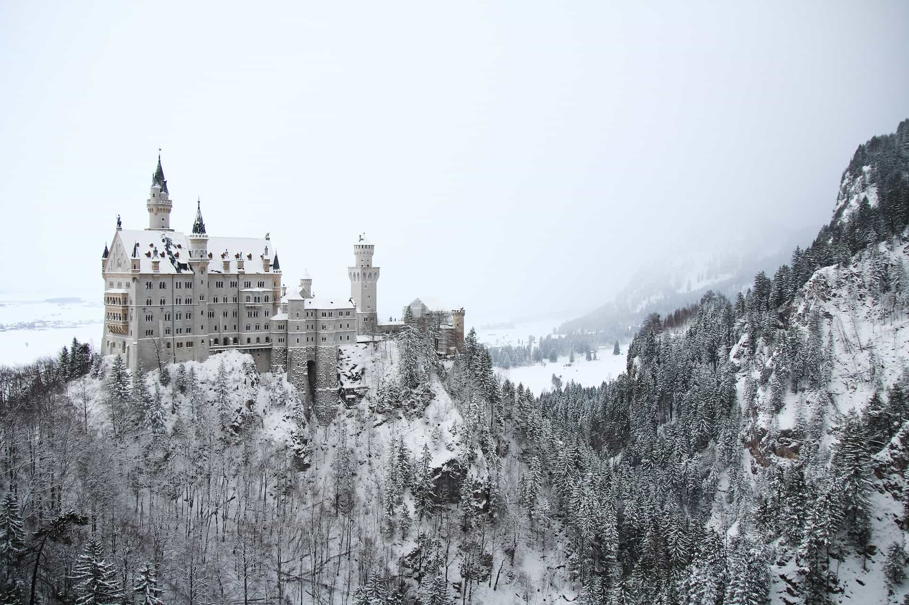
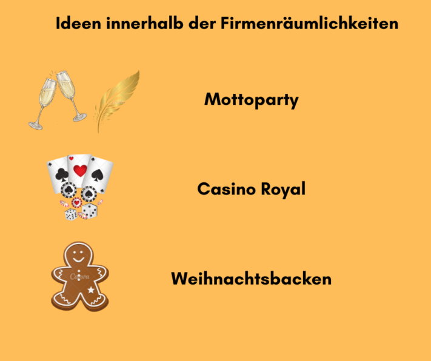
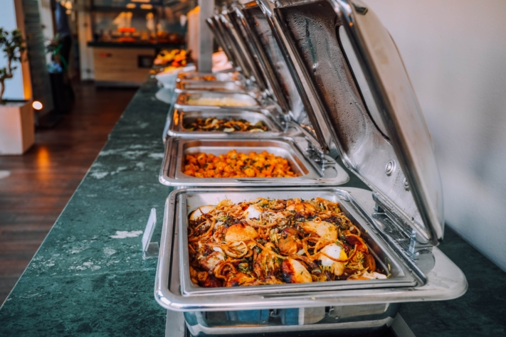

It will soon be that time again! While some people are still mourning the past summer, the first gingerbread and cookies on the supermarket shelves are already reminding us of the coming Christmas season. But even if you're not yet in the Christmas spirit: The next company Christmas party is already waiting for you. To make your 2024 Christmas party unforgettable, you can't start planning early enough!

Do you drink mulled wine with your colleagues at the Christmas market every year or go out to eat in a restaurant? Are you wondering how you can organize a unique company event with your team in 2024? Then our varied ideas for your upcoming Christmas party are just the thing!

## Ideas for a Christmas party outside the company premises

Your employees already see the office and the company building every week. So how about somewhere your colleagues don't know yet? A Christmas party outside the company always brings a special flair and offers the perfect opportunity to leave the daily work routine behind. Depending on the budget you have available for your party, there are plenty of options, but you should plan far enough in advance.

### Christmas Thriller

A stylish mystery dinner guarantees a Christmas party of a special kind. You and your team dress according to the mystery theme and try to get behind the secrets of the other guests to solve a murder case. Meanwhile, you will enjoy a unique atmosphere and delicious food and drinks. If you wish, the actors can also playfully involve selected employees or even the boss in the plot.

The interactive Christmas thriller definitely ensures an unforgettable evening, lots of fun and a laugh or two! To keep the planning effort as low as possible, you can book the Christmas whodunit with various providers and experience the spectacle in specially designed locations near you. Alternatively, the mystery dinner can also take place at your own company premises.

### Escape Rooms

If you don't want to miss out on tricky puzzles even at your Christmas party, you'll definitely get your money's worth in the Escape Room. Work together with your team, solve the tricky tasks and escape together from different rooms. This not only offers excitement and fun, but also promotes team building at the same time due to its interactive character. Which team will manage to master its challenge the fastest?

Let the Christmas party end with a cozy get-together with delicious food and drinks. Escape rooms are now available in every major city. However, this idea can also be implemented with mobile Escape Games, which you can distribute on the tables at your Christmas party. Simply have the utensils for the puzzles delivered to your event location and instruct the guests themselves in the playful adventure.

A stylish mystery dinner or Christmas Escape Rooms can make for an exciting corporate event.

### Mulled wine hike

For those who don't want to do without mulled wine at your Christmas party, a mulled wine hike could be just the thing. Enjoy a wide variety of mulled wine with your team while you walk together through wintry landscapes. With this idea, you combine a relaxed team atmosphere with exercise in nature.

After successfully completed hike, you can still end the celebration with a delicious and fortifying dinner. You can book mulled wine hikes conveniently online in a wide variety of locations and with several organizers. With a higher planning effort, it can certainly be organized yourself.

### Hüttengaudi

Cheese fondue and Kaiserschmarrn, plus fruit brandy and other classics - all in a cozy hut flair. Sounds unique? It is! A Hüttengaudi is definitely one of our favorites when it comes to a company Christmas party. Rent a location in the Alps or other picturesque mountains for your team and implement the Hüttengaudi with matching decorations and music.

A cozy hut surrounded by a snowy landscape: the perfect location for a hut party as a Christmas party.

A colorful and interactive social program, peppered with fun activities such as curling, a Christmas quiz or an après-ski party, rounds off your Christmas party and ensures unforgettable hours with your team. With this idea, you should plan for an overnight stay and relatively high costs due to the longer journey to and from the event.

### Winter Olympics

A particularly sporty idea for your Christmas party is the Winter Olympics. Compete against your colleagues in various disciplines and prove your dexterity and team spirit. You can look forward to disciplines such as curling, snowball throwing, competitive nailing or fir tree throwing. So that you don't run out of steam with all this sporting activity, you can recharge your batteries in a heated igloo with mulled wine and cookies.

Once all disciplines have been completed and the winners have been crowned, the company event can of course be rounded off with a joint dinner. You can book this winter Olympics at various locations such as an ice stadium. If you don't want to travel to the location and have a large open space (e.g. a parking lot), the ice rink can also be easily set up on the company premises.

## More ideas for Christmas party locations

Want to party away, but our top 5 haven't convinced you yet? Here are some more ideas:

- **Christmas party, ahoy!** Rent a ship including crew, get your employees on board and celebrate a lively party on a river or lake in your area.
- **Soirée in the castle:** Invite your employees to a feast in a nearby castle or manor house. The year can hardly end on a more noble note!
- **Chivalrous round table:** You can celebrate a Christmas party with food and drink like in the Middle Ages at castles, in vaulted cellars or rustic inns.

How about a fairytale castle or a medieval castle for your Christmas party?

## Ideas for Christmas party at the company premises

If you don't want to hold your Christmas party in an external location, but prefer to comfortably use your company premises, this by no means means means that your party can't be extraordinary. There are also plenty of ideas for this, which will make your on-site Christmas party a special corporate event.

### Theme party

A popular event that requires comparatively little effort is a theme party. Decide on an unusual theme, for example a Great Gatsby party in the look of the 1920s, dress up accordingly together with your team and experience a stylish and festive evening. Make sure that both the decoration and the music are coordinated with the motto. From a champagne reception to a three-course menu to a cocktail bar: Culinary catering in keeping with the theme should not be missing at such a party. If necessary, get external support for the organization of your theme party.

### Casino Royale

Turning your location into a casino is an extraordinary as well as amusing idea for your Christmas party. Get the glamorous feeling from Las Vegas directly into your company! Professional croupiers are waiting for your guests to play games like blackjack, poker or roulette. Doesn't sound at all Christmassy? Oh yes it does! With a Christmas menu and the right decorations, you can easily achieve a Christmas atmosphere.

Of course, the focus of a Christmas party is not on gambling for real money, but on the mood and fun of your employees. Nevertheless, you can offer prizes for the employees who collect the most chips over the course of the evening. External providers support you in organizing the evening, arrange croupiers and deliver the casino equipment to your location.

### Christmas baking

One idea for your company Christmas party that can be implemented quickly and without much preparation is a joint Christmas baking event. The prerequisites for this are that you have a well-equipped company kitchen with an oven and that your team or department consists of a manageable number of colleagues. Relive childhood memories and spend cozy hours together preparing a wide variety of Christmas cookies. The resulting baking creations such as vanilla crescents, cinnamon stars and the like can then be packaged together and, of course, eaten.

A joint Christmas baking with your colleagues: a simple idea for a successful company Christmas party.

As long as the cookies are baking and cooling, you can still cook a delicious Christmas menu and end your Christmas party in a cozy gathering with food and drinks.

## Plan the cornerstones of your Christmas party

Depending on the size of your company, the time and effort required to plan your Christmas party can vary greatly. A team with 10 employees can probably clarify the key points for a company event in a single meeting. Beyond this number of participants, however, the preparation of a Christmas party requires a professional approach.

### Set budget

First of all, you should set a budget for your Christmas party. A good starting point for this could be the German tax allowance: As with any company event, expenses for your Christmas party are tax-free up to 110 euros per participant. This amount is realistic if you take care of food and drinks for your employees, but do not include major costs for a location or a supporting program.

### Find ideas

Then you can think about how you want to celebrate with your employees and which ideas are feasible with your budget. The upper part of this article already provides you with a variety of ideas for your Christmas party. Research online for possible vendors for your planned program. Make a list with the estimated cost per person and narrow down the choices based on your budget.

### Determine dates and locations

Look for suitable dates and locations. If you have the possibility to host the Christmas party at your own location, this is probably the most favorable option. In addition, you can then freely choose the date - with Fridays in December being particularly suitable. If, for example, you decide on a mystery dinner or a hut party, the choice of dates and locations is already predetermined by the providers. It is advisable to start as early as possible with the booking requests.

### Invite and interview guests

You probably already have a rough idea of how many people will potentially attend your Christmas party. Before you start planning the details, however, you should check the availability of your guests. To do this, you can embed the link to an online survey in your invitation, for example. In addition to the date preference, you can have your employees indicate directly, for example, whether they will be attending with a partner, need overnight accommodations, and have a preference for vegan, vegetarian, or gluten-free food.

## Plan the details of your Christmas party

Once you know when, where and how you'll be celebrating with your employees, you should finalize the details of your Christmas party.

### Food and drinks for your Christmas party

Probably the most important point of your Christmas party is the catering of your guests. Selected drinks and a delicious menu are often already half the battle and ensure a good mood and satisfaction for your guests. Even for a relatively low budget, there are a few options available to you here. Visit a restaurant together, hire a caterer for a buffet or book a food truck to provide your colleagues with delicious food on site. Depending on the size of your team and the equipment of your location, it may also be a good idea to prepare a joint Christmas dinner yourself.

Whether it's a visit to a restaurant, a catering service or cooking together: Catering for your guests lays the foundation for a successful Christmas party.

**Food and drinks - ideas for the Christmas party:**

- Warm appetizers like cream of pumpkin or potato soup
- The classics: stuffed Christmas goose and hearty venison goulash with dumplings and red cabbage
- Tasting of alcoholic beverages (e.g. wine, whiskey or cocktail tasting)
- Christmas desserts like apple strudel, christmas stollen or gingerbread

### Entertainment program for your Christmas party

If you have decided on one of the above ideas, a large part of the program for your Christmas party is already set. In this case, coordinate with the organizer of your booked event and clarify what you may still have to organize yourself. If you are planning the Christmas party completely on your own, you should consider how to arrange the evening program. Below we have three ideas for you:

1. If you want to add a musical crown to your Christmas party, you can hire a live band or DJ to get your guests dancing later in the evening.
2. Or would you rather laugh a lot together? For example, invite a stand-up comedian who will give a funny talk and interact with your guests.
3. Guessing together also lightens the mood and certainly provides a laugh or two. A Christmas quiz with a professional moderator would be just right for this.

You have only a limited budget, but still want to spend a fun evening with your employees? No problem! Even then you can give your colleagues a company event that they will remember for a long time. After all, you can take over certain program points completely yourself: For example, create a playlist with suitable music for your Christmas party or prepare various quiz games yourself.

## Conclusion

The annual Christmas party is the biggest highlight for many companies at the end of the year. Accordingly, your employees have high expectations for this corporate event. To ensure that you have an all-round harmonious Christmas party, it is essential to start planning several months in advance. Depending on your budget, you have different [options](https://www.lebegeil.de/weihnachtsfeier-ideen-firma/). Whether it's a Christmas thriller, a theme party or Christmas baking - be creative and come up with something original. Because one thing is certain: the umpteenth visit to the Christmas market or to the Italian restaurant around the corner is more likely to give your employees a hangover than a Christmas spirit.

### Software tip for organizing your Christmas party

To keep track of everything when planning and implementing your Christmas party, you can organize all the important things with the free table and database solution SeaTable. For example, you can use a [web form]() to register your guests. Easily compare the prices and offers of different event locations and organizers or calculate the costs for food and drinks. Various functions for visualizing your data (e.g. timeline, calendar, map, Kanban board or statistics) offer you the opportunity to prepare your upcoming company Christmas party perfectly.

Simply try out the SeaTable [template]() by registering [here]() free of charge. Of course you can fill the tables with your own data and adapt them to your needs.
